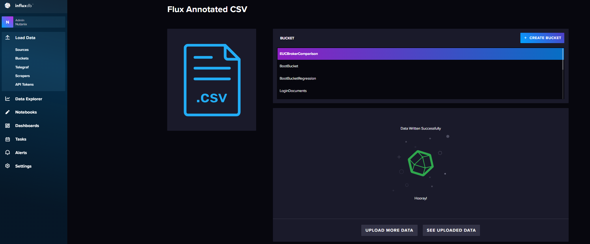
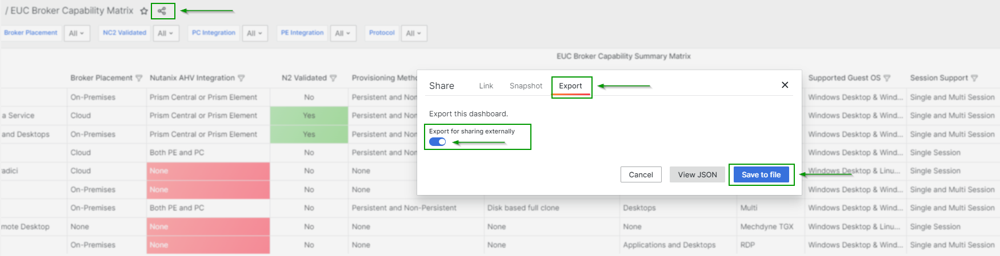

# EUC Broker Comparison Dashboards

We maintain an EUC Broker Comparison Dashboard based on a CSV import to InfluxDB, with a Grafana frontend.

The [Broker Comparison Dashboard](http://10.57.64.119:3000/d/hoSkrdJSz/euc-broker-capability-matrix?orgId=1)

## Updating the dashboard content

As changes are required, or additional information is added, the source csv must be updated and imported into Influx DB.

The process is as follows:

-  Backup the source csv file [euc_influx_format_advanced](euc_influx_format_advanced.csv).
-  Add the required data or changes to the csv file.
-  Clear the current data set from the Influx database.
-  Import the updated data into the database.

### Clear the database

You will use the influx.exe command to clear the existing content from the Influx DB

First set up a connection to Influx. You will need:

-  A `config name`. Call this whatever you like.
-  The `host url` which is the Influx instance URL. For example `http://10.57.64.119:8086/`
-  The `org` which is `Nutanix` or equivalent.
-  A unique token with permissions to the data bucket `EUCBrokerComparison`

`./influx.exe config create --config-name Kindon --host-url http://10.57.64.119:8086/ --org Nutanix --token <TOKEN_GOES_HERE> --active`

Once the connection has been set up and is active, you can delete the data:

`./influx delete -b EUCBrokerComparison --start 1970-01-01T00:00:00Z  --stop 2025-01-01T00:00:00Z`

### Upload the new data to the database

Use the following method to upload the data:

Via the Influx Admin Portal, Select `Load Data` -> `Sources` -> `Flux Annoted CSV`. Select the `EUCBrokerComparison` Bucket and Upload the `euc_influx_format_advanced.csv` file

## Updating the Grafana Dashboard

The dashboard panels are linked with the following logic to allow for filtering to flow:

-  The `Main EUC Broker Capability Summary Matrix` Panel queries Influx directly for the dataset.
-  The additional `Guest OS by Solution`, `Nutanix Integration by Solution`, `Provisioning and Publishing By Solution` and `Broker, Protocol, Access and Notes by Solution` Panels use the `Main EUC Broker Capability Summary Matrix` Panel as their data source
   -  The `Main EUC Broker Capability Summary Matrix` Panel Transforms are **NOT** mirrored specifically.
   -  If `new` data fields are implemented via the CSV, each panel must be `transformed` accordingly. This allows for more flexibility in data displays across panels

## Backup the Dashboard after changes

After making changes in Grafana, to back up the dashboard, you can select the `Export` option and `save to file`. Ensure to tick `export for sharing externally`.

Change the file extension of the backup file to `.txt`.

You can store the dashboard backups in the [dashboard_config](/dashboard_config/) directory.

### Variables for Filtering

The dashboard currently supports filtering by 6 individual variables:

-  **`Solution`**
-  **`Broker Placement`**
-  **`NC2 Validated`**
-  **`PC Integration`**
-  **`PE Integration`**
-  **`Protocol`**

These variable filters are maintained across all panels. Sub-filtering can be actioned per panel to fine-grain results as required