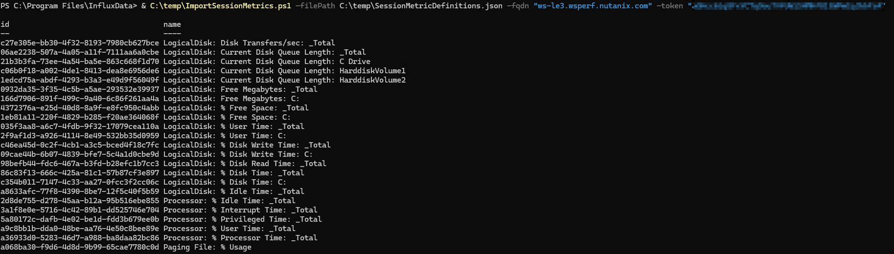
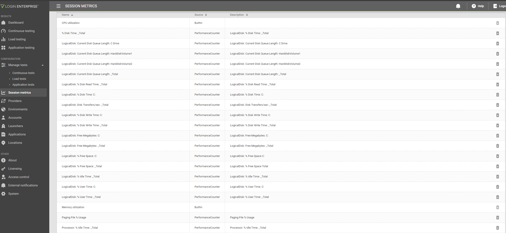
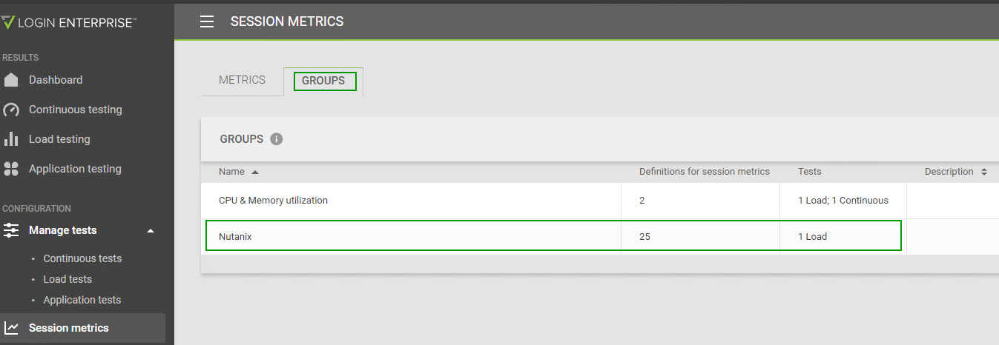

# Login Enterprise Session Metrics (In-Guest Performance Counters)

Login Enterprise allows for in-guest performance metric gathering during test runs. This data can be pulled via the v7 LE API and then ingested into Influx for reporting with Grafana.

To learn more about Session Metrics, read the [Login Enterprise Guidance](https://support.loginvsi.com/hc/en-us/articles/9776492249884-Session-Metrics).

Session Metrics can be configured via the API. `ImportSessionMetrics.ps1` is a PowerShell script provided by Login Enterprise to bulk create Session Metrics from a JSON File. We take no responsibility for code quality in this script.

You must provide an appropriately formatted JSON file, the FQDN of the LE appliance, and an appropriate API token.

`& C:\temp\ImportSessionMetrics.ps1 -filePath C:\temp\SessionMetricDefinitions.json -fqdn "<LE_APPLIANCE>.wsperf.nutanix.com" -token "<TOKEN_GOES_HERE>"`

An example `SessionMetricDefinitions.json` file is included in this repository. Some notes on its use:

-  Each `Name` must be unique.
-  Each `Description` should be unique for easy tracking in LE.
-  Each `DisplayName` should be unique for easy tracking in LE.
-  You must specify the exact `instance` you want to collect data for.
   -  `*` instance definitions **do not** work
   -  `_total` works.
   -  `C:` works.
   -  `HarddiskVolume1` does **not** appear to work.

Once imported, a metric must be added to the `Nutanix` Metric Group. Our automation will use this group if Session Metric collection is configured.

