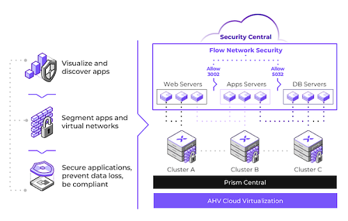

# Flow Network Security Overview

Flow Network Security delivers advanced networking and security services for AHV VMs, providing visibility into the virtual network, application-centric protection from network threats, and automation of common networking operations.

Fully integrated into AHV virtualization and the Nutanix Cloud Platform, Flow Network Security allows organizations to deploy software-defined virtual networking without installing additional products that have separate management and independent software maintenance requirements.

Flow Network Security provides application-centric policies that enable complete visibility and traffic control. This policy model allows administrators to implement fine-grained rules regarding traffic sources and destinations, or microsegmentation. These same policies make it possible to visualize traffic flowing within and between VMs. This granular level of control is an important part of a defense-in-depth strategy against modern datacenter threats.

Flow Network Security protects against new threats designed to spread laterally from one system to another in the same datacenter. Because perimeter-based firewalls traditionally only protect the environment from external threats, it can be difficult to repurpose them to protect internal traffic. Flow Network Security applies security rules between all applications and VMs in the datacenter, adding internal protection behind your perimeter firewall.

To learn more about how Flow Network Security works, see the [product documentation](https://portal.nutanix.com/page/documents/details?targetId=Nutanix-Flow-Guide:Nutanix-Flow-Guide).
