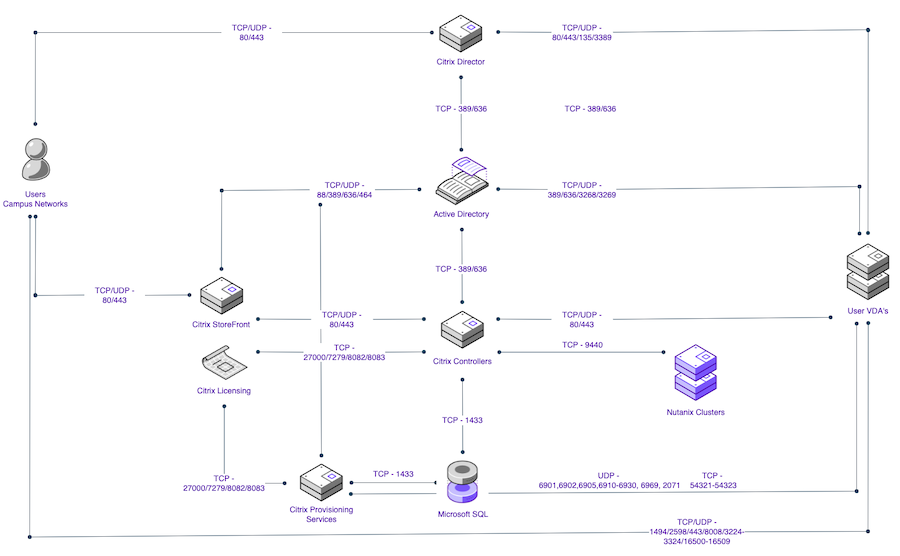
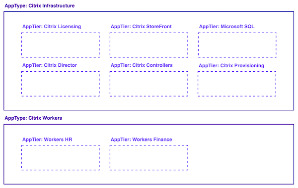
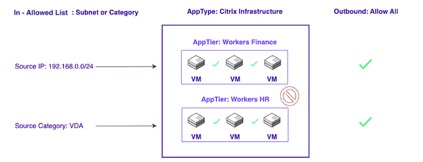

# Design Concepts for Flow Network Security

In a typical Citrix Virtual Apps and Desktops environment, you can protect two distinct types of entities with Flow Network Security: 

- User Virtual Delivery Agents (worker VMs)
- Infrastructure VMs, including components such as the Citrix License Server, Delivery Controllers, and StoreFront
  
In addition, you can use Flow Network Security categories to secure the other applications accessed by worker VMs if those applications run on AHV. You can control outbound access to applications not running on AHV using outbound IP address–based policies.

Before you start to detail the specifics of your implementation, be sure to define your goal. The following example scenario outlines several key services and how they communicate. With a clear idea of what you need, you can quickly start mapping and implementing the required components. 

The following steps summarize the suggested implementation process: 

- Assign [categories](https://www.nutanixbible.com/12a-book-of-network-services-flow-network-security.html#categories) to different VMs. Nutanix recommends designing the simplest possible set of categories and policies to meet your security and connectivity requirements. Creating fewer categories and policies is preferred over creating a unique category for every VM. Categorize VMs into several groups based on their intended use, looking for natural boundaries between groups of VMs.
- Use these categories to build effective security policies in monitor mode with application and isolation policies. 
- Move the security policies to enforce mode after evaluating the flows detected in monitor mode. 
- Once you've applied the policies, modify them as required to permit the desired traffic.

In this example scenario, we used two default categories to configure the security policies.

_Table. Flow Network Security Default Categories_

| **Category** | **Description** | 
| --- | --- |
| AppType | Establishes two definitions: Citrix Infrastructure and Citrix Workers. The value set in this category effectively divides an application into logical segments to use with a security policy. |
| AppTier | Establishes several definitions, such as Citrix StoreFront and Citrix Licensing. VMs are associated with the appropriate AppTier category. |

Two main definition types describe access methods. Network address space connections establish traffic direction (from and to) as well as the services that allow or block traffic. We go into more detail regarding the address space and services later in this document.

_Table. Flow Network Security Default Definitions_

| **Definition** | **Description** | 
| --- | --- |
| Service | Types of network traffic that a policy allows or blocks. You can list services individually (for example, HTTP (TCP 80)), or group them (for example, Citrix_Worker (TCP 1494, UDP 1494, TCP 2598, or UDP 2598)). Use the appropriate logic to define services for simplicity and security. |
| Address | Network ranges that a policy allows or blocks, such as 192.168.0.0/24. As with services, you can define addresses individually or in a group. | 

## Category Design

The following list presents some typical components in a Citrix Virtual Apps and Desktops deployment and how you could categorize them. This list is not complete, but it provides a starting point for building appropriate Flow Network Security policies.

- AppType: Citrix Infrastructure
  - AppTier: Citrix Licensing
  - AppTier: Citrix StoreFront
  - AppTier: Microsoft SQL Server
  - AppTier: Citrix Director
  - AppTier: Citrix Controllers
  - AppTier: Citrix Provisioning Services
- AppType: Citrix Workers
  - AppTier: Workers HR
  - AppTier: Workers Finance

This design splits the categories into two main AppTypes and their associated AppTiers.

## Service Design 

Service design includes mapping out all the ports and protocols that the categories of VMs require to communicate with each other.

Citrix provides an [exhaustive list of ports and protocols](https://docs.citrix.com/en-us/tech-zone/build/tech-papers/citrix-communication-ports.html) associated with all Citrix Virtual Apps and Desktops components. Citrix updates this document regularly to reflect component changes. 

A properly designed environment blocks by default and allows only the required traffic for the appropriate components. Understanding exactly how services communicate with each other is critical.

Once you've divided the AppTiers into logical groups, define the ports and protocols required to make each AppTier function correctly.

_Table. Example AppTier Port and Protocol Definitions_

| **AppTier** | **Service** | **Port** | **Protocol** |
| --- | --- | :---: | --- |
| Citrix StoreFront | HTTP | 80 | TCP |
| Citrix StoreFront | HTTP | 80 | UDP |
| Citrix StoreFront | HTTPS | 443 | TCP |
| Citrix StoreFront | HTTPS | 443 | UDP |
| Citrix Director | HTTP | 80 | TCP |
| Citrix Director | HTTP | 80 | UDP |
| Citrix Director | HTTPS | 443 | TCP |
| Citrix Director | HTTPS | 443 | UDP |
| Citrix Director | Remote desktop | 3389 | UDP |
| Citrix Director | Remote desktop | 3389 | TCP |
| Citrix Director | Remote procedure call (RPC) endpoint mapper | 135 | TCP |
| Citrix Licensing | Initial point of contact for license requests | 27000 | TCP |
| Citrix Licensing | Check-in and check-out of Citrix licenses | 7279 | TCP |
| Citrix Licensing | Web-based administration console (Lmadmin.exe) | 8082 | TCP |
| Citrix Licensing | Simple license service port (required for Citrix Virtual Apps and Desktops) | 8083 | TCP |
| Citrix Licensing | Licensing configuration PowerShell snap-in service | 80 | TCP |
| Citrix Controllers | HTTP | 80 | TCP |
| Citrix Controllers | HTTP | 80 | UDP |
| Citrix Controllers | HTTPS | 443 | TCP |
| Citrix Controllers | HTTPS | 443 | UDP |
| Citrix Provisioning Services | Target device to Citrix Provisioning communication | 6901 | UDP |
| Citrix Provisioning Services | Target device to Citrix Provisioning communication | 6902 | UDP |
| Citrix Provisioning Services | Target device to Citrix Provisioning communication | 6905 | UDP |
| Citrix Provisioning Services | Virtual disk Streaming (Streaming Service) | 6910-6930 | UDP |
| Citrix Provisioning Services | Only BDM: Two Stage Boot (BDM). Used in boot from ISO or USB scenarios only | 6969 | UDP |
| Citrix Provisioning Services | Only BDM: Two Stage Boot (BDM). Used in boot from ISO or USB scenarios only | 2071 | UDP |
| Citrix Provisioning Services | SOAP Service | 54321-54323 | TCP |
| Citrix Workers | ICA | 1494 | TCP |
| Citrix Workers | ICA | 1494 | UDP |
| Citrix Workers | Session reliability | 2598 | TCP |
| Citrix Workers | Session reliability | 2598 | UDP |
| Citrix Workers | HTTP | 80 | TCP |
| Citrix Workers | HTTP | 80 | UDP |
| Citrix Workers | HTTPS | 443 | TCP |
| Citrix Workers | HTTPS | 443 | UDP |
| Citrix Workers | HTTP | 8008 | TCP |
| Citrix Workers | ICA audio | 16500–16509 | UDP |
| Citrix Workers | RPC endpoint mapper | 135 | TCP |
| Citrix Workers | Remote desktop | 3389 | UDP |
| Citrix Workers | Remote desktop | 3389 | TCP |
| Citrix Workers | Remote assistance | 49152–65525 | UDP |
| Citrix Workers | Remote assistance | 49152–65525 | TCP |
| Citrix Workers | HDX video | 9001 | TCP |
| Citrix Workers | Wake on LAN | 9 | TCP |

<note>
The preceding table is an example scenario and only includes inbound rule configurations. Define all required components at a similar level of detail.
</note>

## Address Design

Designing for addresses in policies requires an understanding of both the traffic source and the traffic destination. You can define sources and destinations in Classless Inter-Domain Routing (CIDR) network ranges that can then block or allow traffic flows in and out of the defined application. In this example scenario, we defined the addresses according to the following table.

_Table. Example Addresses_

| **Network** | **Purpose** | 
| --- | --- | 
| 10.0.0.0/16 | Campus subnet (main office network for users) | 
| 192.168.0.0/24 | Citrix infrastructure subnet | 
| 192.168.1.0/24 | Microsoft SQL subnet | 
| 172.24.0.0/22 | Citrix worker subnet | 

Once you've defined the service and address information, you can implement security policies.

## Security Policy Design

When creating a security policy in Flow Network Security, you have four choices, which we detail in the following sections. 

### Secure Applications 

Secure application policies create a configurable border around a specific application, called the target group, defined by AppType and AppTier. You can insulate this target group from all other sources and destinations, then use safe lists to create exceptions to the default deny behavior of the policy, allowing traffic from and to external sources and destinations. You can define these sources and destinations either by category or by network IP address.

The default setting for an application policy restricts inbound access to the subnet or category and allows everything outbound. You can prevent the VMs within the AppTier from talking to each other if you need to.

The following example shows an inbound access control based on either source IP or category and an outbound access control of **Allow All**.

In most cases, start with application policies, using **Allowed List Only** for inbound traffic and **Allow All** for outbound traffic. 

You can configure application policy behavior on both the inbound and outbound sides. Using the allowed list setting on both sides provides more traffic control but also requires more configuration.

The following example shows an inbound access control based on either source IP or category and an outbound access control of **destination IP** for Citrix Licensing and **category** for Citrix StoreFront.

In both of the preceding examples, the Citrix Licensing VMs in the Citrix Licensing AppTier can't talk to each other. However, the Citrix StoreFront VMs can talk to each other, as this communication is required for them to function correctly.

### Isolate Environments

Use isolation policies only when you need to block two groups from communicating without any exceptions. Flow Network Security evaluates isolation policies before application policies, so you can combine these two policy types. You can also use isolation policies to create a boundary that no application policy can bypass. 

For example, using one application policy for Finance worker VMs and another application policy for HR worker VMs can allow Finance and HR to communicate with each other. However, if you combine these application policies with an isolation policy that separates Finance from HR, these VMs can no longer communicate, regardless of any application-specific rules.

The following example outlines an inbound access control based on either source IP or category and an outbound access control of **Allow All**. Finance workers can communicate with each other within their AppTier, as can the HR workers. However, we also defined an isolation policy that prevents any Finance workers from communicating with any HR workers, ensuring isolation between the discreet workload types.

### Secure VDI Groups

The VDI policy uses Active Directory group membership to categorize VDI VMs by identity. Configuring VDI policy involves using an Active Directory domain for the ID firewall (the ID Based Security category) and configuring a service account for the domain.

The ID Firewall feature is a Flow Network Security extension that allows you to write security policies based on users and groups in an Active Directory domain that includes your VDI VMs. When using ID Firewall, you can import groups from Active Directory into Prism Central as categories (in the category key `ADGroup`), then write policies around these categories as you would for any other category. With a VDI policy enabled, Prism Central automatically places VDI VMs in the appropriate categories when it detects a user signing on to a VM hosted on Nutanix infrastructure associated with that Prism Central instance, thus enforcing Flow Network Security policies based on user and group identity. 

Note the following points about the VDI policy:

- Nutanix recommends disabling credential caching on VDI VMs when using the Flow Network Security ID Firewall feature. ID Firewall checks domain controller events for access attempts. If credential caching is enabled but the VM connection to the domain controller isn't available, a user can sign on, but the system doesn't generate an event on the domain controller, so ID Firewall can't detect the access attempt.
- To disable credential caching, see [Microsoft documentation](https://learn.microsoft.com/en-us/windows/security/threat-protection/security-policy-settings/interactive-logon-number-of-previous-logons-to-cache-in-case-domain-controller-is-not-available).
- VDI policies assume that each desktop VM has only one user signed on at a time. As a result, if multiple users sign on to a single desktop VM at once, the security posture of the VM might change in unpredictable ways. For predictable behavior, ensure that only one user is signed on to each desktop VM at a time.

<note>
This guide doesn't cover using the VDI policy, as the example scenario uses one-to-many pooled VDI logic that isn't currently suitable for the VDI policy engine.
</note>

### Establish Quarantine Rules 

If you need complete lockdown for a VM, with configurable exceptions, you can use a quarantine policy. Quarantine policies have two modes of operation: strict and forensic. Use strict quarantine to block all inbound and outbound traffic for a quarantined VM. Use forensic quarantine to allow security tools or VMs that should have access to the quarantined VM and block all other traffic. Define the list of allowed inbound and outbound sources, destinations, and ports for any VM in forensic quarantine by updating the policy. Refer to the Quarantining Virtual Machines section for a diagram of an example quaranting policy.

Work with your security team to determine what actions you need to take before, during, and after a VM quarantine operation. Consider using VM and storage snapshots along with Flow Network Security quarantine to enable a successful response to any suspicious activity. 

## Identify Policy Boundaries 

Application policies use the AppType and optional AppTier categories exclusively to define a target group protected by the policy. 

- You must assign different AppType categories to VMs from different applications. 
- You can assign VMs from different AppTiers in the same application of the same AppType, but they should have different AppTier values. This categorization allows the VMs assigned to these categories to exist as different tiers inside the same application policy. 
- If you don't specify an AppTier, Flow Network Security only uses the AppType. 

There are many ways to define the boundaries between these applications, including the following options:

- Who manages the VMs 
- Which vendor provides the applications
- Whether the VMs perform the same function 
 
You can define application boundaries based on the communication required between VMs. A set of tightly integrated VMs that all communicate with each other on many ports is a good candidate for definition as a single application.

Isolation policy boundaries are easier to identify. If one VM group shouldn't talk to another VM group, these two groups of VMs should have different categories. One example is environment isolation, where Environment: Finance should never communicate with Environment: HR. You can create isolation policies based on any two categories, but you must base application policies on the AppType category.
