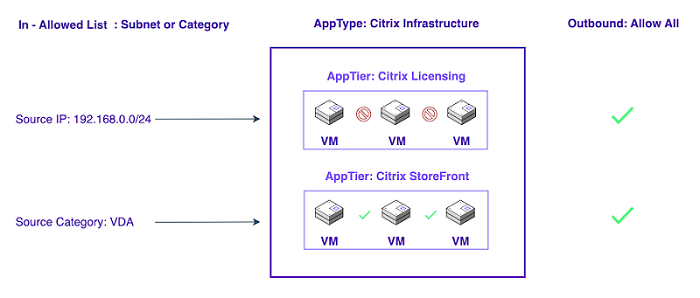

# Design Concepts for Nutanix Flow Network Security

Nutanix Flow Network Security is an application-centric security offering for enterprise applications running on Nutanix AHV, such as Citrix Virtual Apps and Desktops. In a typical CVAD environment, you can protect two distinct types of entities with Flow: 

- User Virtual Desktop Agents (Workers)
- Infrastructure Virtual Machines, which includes License Server, Studio, Delivery Controllers, and more.
  
In addition, you can use Nutanix Flow Network Security categories to secure the other applications accessed by Worker VMs if those applications run on AHV. You can control outbound access to applications not running on AHV using outbound IP address–based policies.

To start securing the platform, assign categories to the different VMs in the Nutanix environment. Nutanix recommends designing the simplest possible set of categories and policies to meet your security and connectivity requirements. Creating fewer categories and policies is preferred over creating a unique category for every VM. Categorize VMs into several groups based on their intended use, looking for natural boundaries between groups of VMs. Use these categories to build effective security policies in **Monitor** mode with application and isolation policies. Move the security policies to **Enforce** mode after evaluating the output of monitor mode detected flows in the created policies. Once you’ve applied the policies, modify them as required to permit the desired traffic.

For the purpose of this document we will be using 2 built in categories to configure the security policies.

| **Category** | **Description** | 
| --- | --- |
| AppType | Add values for the application types in your environment (such as "Citrix Infrastructure", and "Citrix Workers") to this category and use the values to divide the application into logical types when configuring a security policy. |
| AppTier | Associate the VMs in your AppType category with the appropriate built-in AppTier's such as "Citrix StoreFront", and "Citrix Licensing". | 

We will also be using 2 main types of definition to describe the network address spaces we will connect from and to as well as the services we want to allow or disallow.

| **Definition** | **Description** | 
| --- | --- |
| Service | Services are the types of network traffic you want to allow or disallow via the policy. These can be individually listed such as HTTP (TCP/80) or grouped such as Citrix_VDA (TCP/UDP/1494/2598), use the appropriate logic to define these for simplicity and security. |
| Address | Addresses are network ranges that you want to allow or disallow via policy such as 192.168.0.0/24. As with Services these can also be defined individually or in a group, again design for simplicity and security here. | 

## Category Design

Let's look at some typical components you may use in a CVAD deployment and how we might categorize that for a typical CVAD environment. This is not an exhaustive list of **ALL** the CVAD components but should provide you with a great starting place to build out your Nutanix Flow Network Security policies. In this document we will cover the following.

- Citrix Licensing
- Citrix StoreFront
- Citrix Director
- Citrix Controllers
- Microsoft SQL Server
- Citrix Workers (Virtual Desktop Agents)

Below shows how we could categorize the above components with regard to Nutanix Flow Network Security categories.

As you can see we have broken the categories down into 2 main AppType's

- Citrix Infrastructure
- Citrix Workers

Then we have further grouped the VMs using AppTier's into their relevant function such as "Citrix StoreFront" or "Citrix Licensing" for example.

## Service Design

This is where you will spend quite some time as you will be mapping out all the ports and protocols that your categories of VMs will require in order to communicate securely with each other.

First, let's take a look at the overall goal we are trying to achieve.

Citrix has a great document on the ports and protocols you will need in order to secure your environment, it can be found [here](https://docs.citrix.com/en-us/tech-zone/build/tech-papers/citrix-communication-ports.html), this will become your best friend when building out your Nutanix Flow Network Security services as you will need to know exactly what your AppTier's will need in order to function correctly, remember we are going to be blocking by default and only allowing what's required for the tier to work correctly, so this part is very important.

Looking at the above diagram match your AppTier's into logical groups, then define the ports and protocols required to make that AppTier function correctly.

We can break the AppTier's into the following logical groups.

- Citrix StoreFront
- Citrix Director
- Citrix Licensing
- Citrix Controllers
- Citrix Workers
- Active Directory
- Microsoft SQL
- Nutanix Prism

Then we can further detail the ports and protocols required to make each of those AppTier's function correctly.

### Citrix StoreFront

| **Service** | **Port** | **Protocol** |
| --- | --- | ---|
| HTTP | 80 | TCP |
| HTTP | 80 | UDP |
| HTTPS | 443 | TCP |
| HTTPS | 443 | UDP |

### Citrix Director

| **Service** | **Port** | **Protocol** |
| --- | --- | ---|
| HTTP | 80 | TCP |
| HTTP | 80 | UDP |
| HTTPS | 443 | TCP |
| HTTPS | 443 | UDP |
| Remote Desktop | 3389 | UDP |
| Remote Desktop | 3389 | TCP |
| Remote Procedure Call (RPC) Endpoint Mapper | 135 | TCP |

### Citrix Licensing

| **Service** | **Port** | **Protocol** |
| --- | --- | ---|
| Handles initial point of contact for license requests | 27000 | TCP |
| Check-in/check-out of Citrix licenses | 7279 | TCP |
| Web-based administration console (Lmadmin.exe) | 8082 | TCP |
| Simple License Service port (required for CVAD) | 8083 | TCP |
| Licensing Config PowerShell Snap-in Service | 80 | TCP |

### Citrix Controllers

| **Service** | **Port** | **Protocol** |
| --- | --- | ---|
| HTTP | 80 | TCP |
| HTTP | 80 | UDP |
| HTTPS | 443 | TCP |
| HTTPS | 443 | UDP |

### Citrix Workers

| **Service** | **Port** | **Protocol** |
| --- | --- | ---|
| ICA | 1494 | TCP |
| ICA | 1494 | UDP |
| Session Reliability | 2598 | TCP |
| Session Reliability | 2598 | UDP |
| HTTP | 80 | TCP |
| HTTP | 80 | UDP |
| HTTPS | 443 | TCP |
| HTTPS | 443 | UDP |
| HTTP 8008 | 8008 | TCP |
| ICA Audio | 16500-16509 | UDP |
| Remote Procedure Call (RPC) Endpoint Mapper | 135 | TCP |
| Remote Desktop | 3389 | UDP |
| Remote Desktop | 3389 | TCP |
| Remote Assistance | 49152-65525 | UDP |
| Remote Assistance | 49152-65525 | TCP |
| HDX Video | 9001 | TCP |
| Wake on LAN | 9 | TCP |

### Active Directory

| **Service** | **Port** | **Protocol** |
| --- | --- | ---|
| LDAP | 389 | TCP |
| LDAPS | 636 | TCP |
| Kerberos Authentication | 88 | UDP |
| Kerberos Password Change | 464 | TCP |
| Kerberos Password Change | 464 | UDP |
| Global Catalog | 3268 | TCP |
| Global Catalog | 3269 | TCP |
| DNS | 53 | TCP |
| DNS | 53 | UDP |

### Microsoft SQL

| **Service** | **Port** | **Protocol** |
| --- | --- | ---|
| SQL | 1433 | TCP |

### Nutanix Prism

| **Service** | **Port** | **Protocol** |
| --- | --- | ---|
| Prism Service | 9440 | TCP |

## Address Design

Before you start to build your policies its also required to understand where your traffic will be coming from and going to from a network range perspective, this is so that you can restrict the flow of the traffic in and out of your application. Looking at the above diagram we would define the following (remember these will differ in your environment).

| **Network** | **Purpose** | 
| --- | --- | 
| 10.0.0.0/16 | Campus subnet (main office network for users) | 
| 192.168.0.0/24 | Citrix Infrastructure subnet | 
| 192.168.1.0/24 | Microsoft SQL subnet | 
| 192.168.2.0/24 | Nutanix Prism subnet | 
| 172.24.0.0/22 | Citrix Worker subnet | 

With all the service and address information to hand lets move onto Security Policies and the concepts surrounding these.

## Security Policy Design

When creating a security policy in Nutanix Flow Network Security you will be offered 3 choices (listed below). 

| **Policy Type** | **Purpose** | 
| --- | --- | 
| Application Policy | An Application Policy segments an AppType into AppTier's allowing you to control access to specific sets of VMs in the application. | 
| Quarantine Policy | An Quarantine Policy allows you to isolate a set of VMs from one another. This prevents any communication between them. | 
| VDI Policy | AD Groups have to be referenced from User Groups at an AD Server to create VDI Policies. | 

### Application Policy

Application policies create a configurable border around a specific application, called the target group, defined by AppType and AppTier. You can insulate this target group from all other sources and destinations, then use safe lists to create exceptions to the default deny behavior of the policy, allowing traffic from and to external sources and destinations. These sources and destinations are defined by category if they’re an existing VM on AHV or by network IP address if they’re external to the Nutanix cluster.
The application policy creates a secure bubble around the application at the center of the policy, which you can use to protect one application from all other applications in a single rule.

In most cases, start with application policies, using Whitelist Only on the inbound and Allow All on the outbound. Use isolation policies only when you need to block two groups from communicating without any exceptions. Isolation policies are evaluated before application policies, so you can combine these two policy types, and you can also use isolation policies to create a boundary that no application policy can bypass. 

For example, create an application policy for production VMs and another application policy for development VMs. At this point, you could configure production and development to talk to each other. However, if you combine these application policies with an isolation policy that separates production from development, these applications are totally isolated regardless of any application-specific rules.

The examples in this document exclusively use application policies. It’s acceptable to protect an app using only application policies. 

<note>
Use isolation policies only where you need complete restriction between two zones.
</note>

Application policy behavior is configurable on both the inbound and outbound sides. The default inbound policy is **Whitelist Only**, and the default outbound is **Allow All**. Using the allowlist setting on both sides provides more traffic control but requires more configuration.

### Quarantine Policy

If you need total lockdown for a VM, with configurable exceptions, you can use a Quarantine policy. The Quarantine policy has two modes of operation: strict and forensic. Use strict quarantine to block all inbound and outbound traffic for a quarantined VM. Use forensic quarantine to allow security tools or VMs that should have access to the quarantined VM and block all other traffic. Define the list of allowed inbound and outbound sources, destination, and ports for any VM in forensic quarantine by updating the policy. 

Work with the security team to determine what actions you need to take before, during, and after a VM quarantine operation. Consider using VM and storage snapshots along with Flow Network Security quarantine to enable a successful response to any suspicious activity.

### VDI Policy

The VDI Policy is based on identity-based categorization of the VDI VMs using Active Directory group membership. Configuring VDI policy includes adding an Active Directory domain that is used for the ID firewall (ID Based Security) and configuring a service account for the domain.

ID firewall is an extension to Flow Network Security that allows you to write security policies based on users and groups in an Active Directory domain in which your VDI VMs are attached. When using ID firewall, you can import groups from Active Directory into Prism Central as categories (in the category key ADGroup), and then write policies around these categories, just as you would for any other category. A new type of policy has been added for this purpose - the VDI Policy. ID firewall takes care of automatically placing VDI VMs in the appropriate categories on detecting user logons into the VM hosted on Nutanix infrastructure associated with Prism Central, thus allowing user and group based enforcement of Flow policies.

Some points worth noting about the VDI policy are.

- It is recommended to disable credential caching on VDI VMs for Flow ID Firewall. The Flow ID Firewall checks the domain controller events for logon attempts. If the VM connection to the domain controller is not available, a user is able to log on (if credential caching enabled) but no event is generated on the domain controller inhibiting the ID Firewall to detect the logon.
- To disable credential caching, see Interactive logon: Number of previous logons to cache (in case domain controller is not available) on Microsoft documentation website.
- A basic assumption of VDI Policies is that a single end-user is logged on to each desktop VM at a point in time. As a result, if multiple users log into a single desktop VM at once, the security posture of the VM may change in unpredictable ways. Please ensure that for predictable behavior, only one user is logged into desktop VMs at a time.

As noted earlier in this document we will be covering application policies only in this guide and therefore will not be covering the VDI Policy configuration. Reasons behind this in this case is that our Citrix Workers will include not only 1 to 1 User to VM mappings but many to 1 server based workloads. This configuration is currently not suitable for the VDI Policy engine.

## Identify Policy Boundaries

Application policies use the AppType and optional AppTier categories exclusively to define a target group protected by the policy. You must assign different AppType categories to VMs from different applications. You can assign VMs from different AppTier's in the same application the same AppType, but they should have different AppTier values. This categorization allows the VMs assigned to these categories to exist as different tiers inside the same application policy. If you don’t specify an AppTier, Flow only uses the AppType.

There are many ways to define the boundaries between these applications. You can base them on who manages these VMs, which vendor provides them, or whether they perform the same function. You can also define application boundaries based on the communication required between VMs. A set of tightly integrated VMs that all communicate with each other on many ports is a good candidate for definition as a single application.

Isolation policy boundaries are easier to identify. If one VM group shouldn’t talk to another VM group, that’s an obvious boundary and these two groups of VMs should have different categories. One example is environment isolation, where Environment: Development should never communicate with Environment: Production. You can create isolation policies based on any two categories, but application policies must be based on the AppType category.