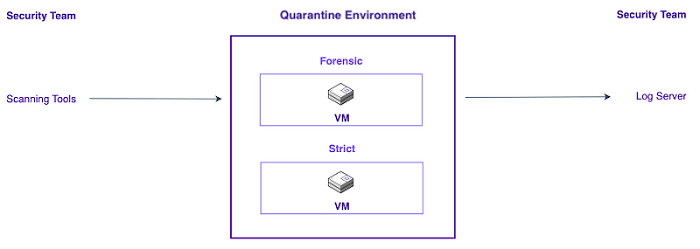

# Design Concepts for Nutanix Flow Network Security

In a typical CVAD environment, you can protect two distinct types of entities with Nutanix Flow: 

- User Virtual Desktop Agents (Workers). 
- Infrastructure Virtual Machines, which includes components such as the Citrix License Server, Delivery Controllers, and StoreFront amongst others.
  
In addition, you can use Nutanix Flow Network Security categories to secure the other applications accessed by Worker VMs if those applications run on AHV. You can control outbound access to applications not running on AHV using outbound IP address–based policies.

Before you start to detail the specifics of what you are implementing, it is important to define what your goal is. Below is an example scenario which outlines a number of key services and how they communicate. With a clear visual of what is needed, it is simple to start mapping and implementing the required components. <!--JK: @david-brett I altered this slightly for context - see what you think -->

<!--
To start, assign [categories](https://www.nutanixbible.com/12a-book-of-network-services-flow-network-security.html#categories) to different VMs. Nutanix recommends designing the simplest possible set of categories and policies to meet your security and connectivity requirements. Creating fewer categories and policies is preferred over creating a unique category for every VM. Categorize VMs into several groups based on their intended use, looking for natural boundaries between groups of VMs. Use these categories to build effective security policies in **Monitor** mode with application and isolation policies. Move the security policies to **Enforce** mode after evaluating the output of monitor mode detected flows in the created policies. Once you’ve applied the policies, modify them as required to permit the desired traffic.
-->
The following process outlines the overall suggested implementation pattern: <!--JK: @david-brett moved the above to a list - see what you think-->

- Assign [categories](https://www.nutanixbible.com/12a-book-of-network-services-flow-network-security.html#categories) to different VMs. Nutanix recommends designing the simplest possible set of categories and policies to meet your security and connectivity requirements. Creating fewer categories and policies is preferred over creating a unique category for every VM. Categorize VMs into several groups based on their intended use, looking for natural boundaries between groups of VMs.
-  Use these categories to build effective security policies in **Monitor** mode with application and isolation policies.
-  Move the security policies to **Enforce** mode after evaluating the output of monitor mode detected flows in the created policies.
-  Once applied, modify policies as required to permit the desired traffic.

For the purpose of this document, 2 built-in categories are used to configure the security policies.

| **Category** | **Description** | 
| --- | --- |
| AppType | Two definitions are created in this **category**: "**Citrix Infrastructure**" and "**Citrix Workers**". Using the value of this category, the application is effectively divided into logical segments to use with a **Security Policy**. |
| AppTier | Several definitions in this **category** such as "**Citrix StoreFront**" and "**Citrix Licensing**" are created. VMs are associated with the appropriate AppTier **category** |

2 main definition types are used to describe the access methods. Network address spaces connections establish **from** and **to** as well as the services to **allow** or **disallow**. Additional details regarding the address space and service details are outlined later in the document.

| **Definition** | **Description** | 
| --- | --- |
| Service | Services are the types of network traffic to allow or disallow via a policy. These can be individually listed such as HTTP (TCP/80) or grouped such as Citrix_Worker (TCP/UDP/1494/2598). Use the appropriate logic to define these for simplicity and security. |
| Address | Addresses are network ranges to allow or disallow via policy such as 192.168.0.0/24. As with Services these can be defined individually or in a group. | 

## Category Design

Listed below are some typical components in a CVAD deployment and how they could be categorized. This is not an exhaustive list provides a starting point to build appropriate Nutanix Flow Network Security policies:

- AppType: Citrix Infrastructure
  - AppTier: Citrix Licensing
  - AppTier: Citrix StoreFront
  - AppTier: Microsoft SQL Server
  - AppTier: Citrix Director
  - AppTier: Citrix Controllers
- AppType: Citrix Workers
  - AppTier: Workers HR
  - AppTier: Workers Finance

The diagram below shows a visual representation of the above list.

The categories are split into 2 main **AppType's** and their associated **AppTier's**.

## Service Design 

Service design includes mapping out all the port and protocols that the **categories** of VMs will require in order to communicate with each other.

Citrix provides an [exhaustive list of ports and protocols](https://docs.citrix.com/en-us/tech-zone/build/tech-papers/citrix-communication-ports.html) associated with all CVAD components. This document is regularly updated as component changes are implemented and is a good reference guide. 

A properly designed environment will block by default, and allow only the required traffic for the appropriate components. Understanding exactly how services communicate with each other is critical.

Once the **AppTier's** are divided into logical groups, define the ports and protocols required to make that **AppTier** function correctly.

| **AppTier** | **Service** | **Port** | **Protocol** |
| --- | --- | --- | --- |
| Citrix StoreFront | HTTP | 80 | TCP |
| Citrix StoreFront | HTTP | 80 | UDP |
| Citrix StoreFront | HTTPS | 443 | TCP |
| Citrix StoreFront | HTTPS | 443 | UDP |
| Citrix Director | HTTP | 80 | TCP |
| Citrix Director | HTTP | 80 | UDP |
| Citrix Director | HTTPS | 443 | TCP |
| Citrix Director | HTTPS | 443 | UDP |
| Citrix Director | Remote Desktop | 3389 | UDP |
| Citrix Director | Remote Desktop | 3389 | TCP |
| Citrix Director | Remote Procedure Call (RPC) Endpoint Mapper | 135 | TCP |
| Citrix Licensing | Handles initial point of contact for license requests | 27000 | TCP |
| Citrix Licensing | Check-in/check-out of Citrix licenses | 7279 | TCP |
| Citrix Licensing | Web-based administration console (Lmadmin.exe) | 8082 | TCP |
| Citrix Licensing | Simple License Service port (required for CVAD) | 8083 | TCP |
| Citrix Licensing | Licensing Config PowerShell Snap-in Service | 80 | TCP |
| Citrix Controllers | HTTP | 80 | TCP |
| Citrix Controllers | HTTP | 80 | UDP |
| Citrix Controllers | HTTPS | 443 | TCP |
| Citrix Controllers | HTTPS | 443 | UDP |
| Citrix Workers | ICA | 1494 | TCP |
| Citrix Workers | ICA | 1494 | UDP |
| Citrix Workers | Session Reliability | 2598 | TCP |
| Citrix Workers | Session Reliability | 2598 | UDP |
| Citrix Workers | HTTP | 80 | TCP |
| Citrix Workers | HTTP | 80 | UDP |
| Citrix Workers | HTTPS | 443 | TCP |
| Citrix Workers | HTTPS | 443 | UDP |
| Citrix Workers | HTTP 8008 | 8008 | TCP |
| Citrix Workers | ICA Audio | 16500-16509 | UDP |
| Citrix Workers | Remote Procedure Call (RPC) Endpoint Mapper | 135 | TCP |
| Citrix Workers | Remote Desktop | 3389 | UDP |
| Citrix Workers | Remote Desktop | 3389 | TCP |
| Citrix Workers | Remote Assistance | 49152-65525 | UDP |
| Citrix Workers | Remote Assistance | 49152-65525 | TCP |
| Citrix Workers | HDX Video | 9001 | TCP |
| Citrix Workers | Wake on LAN | 9 | TCP |
<!--JK: @david-brett missing some SQL stuff stuff? Also adding a quick note below to capture this is an example - make sure i capture it OK?-->

<note>
  The above list is a working example only and includes only inbound rule configurations. You should define all required components in a similar fashion to the above list.
</note>

## Address Design

Designing for addresses in policies requires an understanding of where the traffic is both sourced **from**, and destined **to**. This can be defined in CIDR network ranges which are then used to restrict or allow traffic flows in and out of the defined application. Based on the working example, the following addresses are defined:

| **Network** | **Purpose** | 
| --- | --- | 
| 10.0.0.0/16 | Campus subnet (main office network for users) | 
| 192.168.0.0/24 | Citrix Infrastructure subnet | 
| 192.168.1.0/24 | Microsoft SQL subnet | 
| 172.24.0.0/22 | Citrix Worker subnet | 

With the Service and Address information defined, Security Policies can be implemented.

## Security Policy Design

When creating a security policy in Nutanix Flow Network Security there are 4 choices (detailed below). 

### Secure Applications (App Policy)

Secure Application policies create a configurable border around a specific application, called the target group, defined by **AppType** and **AppTier**. You can insulate this target group from all other sources and destinations, then use safe lists to create exceptions to the default deny behavior of the policy, allowing traffic from and to external sources and destinations. These sources and destinations are defined by a category or by network IP address.

The default setting for an App Policy will restrict the inbound access to subnet or category and allow everything outbound. You are able to restrict the VMs within the **AppTier** from talking to each other should this be required.

The below example shows an inbound access control based on either **Source IP** or **category** and an outbound access control of **allow all**.

In most cases, start with application policies, using **Whitelist Only** on the **inbound** and **Allow All** on the **outbound**. 

Application policy behavior is configurable on both the **inbound** and **outbound** sides. Using the allowlist setting on both sides provides more traffic control, but requires more configuration.

The below example shows an inbound access control based on either **Source IP** or **category** and an outbound access control of **destination IP** for *Citrix Licensing* and **category** for *Citrix StoreFront*.

For both examples above, the ***Citrix Licensing*** VMs within the ***Citrix Licencing* AppTier** are unable to talk to each other, however the ***Citrix StoreFront*** VMs are able to communicate with each other as this is required for them to function correctly.

### Isolate Environments (Isolation Policy)

Use isolation policies only when you need to block two groups from communicating without any exceptions. Isolation policies are evaluated before application policies, so you can combine these two policy types, and you can also use isolation policies to create a boundary that no application policy can bypass. 

For example, using an application policy for **Finance worker** VMs and another application policy for **HR worker** VMs would allow a configuration to ensure Finance and HR can communicate with each other. However, if you combine these application policies with an isolated environment policy that separates Finance from HR, these VMs are totally isolated *regardless* of any application-specific rules.

The below example outlines an inbound access control based on either **Source IP** or **category** and an outbound access control of **allow all**. **Finance workers** can communicate with each other within the **AppTier**, likewise for the **HR workers**. However, an isolation policy has been defined which prevents any **Finance workers** communicating with the **HR workers** ensuring isolation between discreet workload types.

### Secure VDI Groups (VDI Policy)

The VDI Policy is based on identity-based categorization of the VDI VMs using Active Directory group membership. Configuring VDI policy includes adding an Active Directory domain that is used for the ID firewall (ID Based Security) and configuring a service account for the domain.

ID firewall is an extension to Flow Network Security that allows you to write security policies based on users and groups in an Active Directory domain in which your VDI VMs are attached. When using ID firewall, you can import groups from Active Directory into Prism Central as categories (in the category key ADGroup), and then write policies around these categories, just as you would for any other category. A new type of policy has been added for this purpose - the VDI Policy. ID firewall takes care of automatically placing VDI VMs in the appropriate categories on detecting user logons into the VM hosted on Nutanix infrastructure associated with Prism Central, thus allowing user and group based enforcement of Flow policies.

Some points worth noting about the VDI policy are.

- It is recommended to disable credential caching on VDI VMs for Flow ID Firewall. The Flow ID Firewall checks the domain controller events for logon attempts. If the VM connection to the domain controller is not available, a user is able to log on (if credential caching enabled) but no event is generated on the domain controller inhibiting the ID Firewall to detect the logon.
- To disable credential caching, see Interactive logon: Number of previous logons to cache (in case domain controller is not available) on Microsoft documentation website.
- A basic assumption of VDI Policies is that a single end-user is logged on to each desktop VM at a point in time. As a result, if multiple users log into a single desktop VM at once, the security posture of the VM may change in unpredictable ways. Please ensure that for predictable behavior, only one user is logged into desktop VMs at a time.

This guide does not cover using the VDI Policy as the example scenario uses a 1:Many pooled VDI logic which is currently not suitable for the VDI Policy engine.

### Quarantine Policy

If you need complete lockdown for a VM, with configurable exceptions, you can use a Quarantine policy. The Quarantine policy has two modes of operation: strict and forensic. Use strict quarantine to block all inbound and outbound traffic for a quarantined VM. Use forensic quarantine to allow security tools or VMs that should have access to the quarantined VM and block all other traffic. Define the list of allowed inbound and outbound sources, destinations, and ports for any VM in forensic quarantine by updating the policy. 

Work with the security team to determine what actions you need to take before, during, and after a VM quarantine operation. Consider using VM and storage snapshots along with Flow Network Security quarantine to enable a successful response to any suspicious activity.

## Identify Policy Boundaries <!--JK: @david-brett I tried to simplify the wording a touch below - see what you think-->

Application policies use the **AppType** and optional **AppTier** categories exclusively to define a target group protected by the policy. 

- You must assign different **AppType** categories to VMs from different applications. 
- You can assign VMs from different **AppTier's** in the same application of the same **AppType**, but they should have different **AppTier** values. This categorization allows the VMs assigned to these categories to exist as different tiers inside the same application policy. 
- If you don’t specify an **AppTier**, Flow only uses the **AppType**. <!--JK: @david-brett i moved this to a list - see what you think -->

There are many ways to define the boundaries between these applications. These could be:

- Based on who manages these VMs. 
- Which vendor provides them.
- Whether the VMs perform the same function. 
 
Application boundaries can be defined based on the communication required between VMs. A set of tightly integrated VMs that all communicate with each other on many ports is a good candidate for a definition as a single application.

Isolation policy boundaries are easier to identify. If one VM group should not talk to another VM group, that’s an obvious boundary and these two groups of VMs should have different **categories**. One example is environment isolation, where **Environment: Finance** should never communicate with **Environment: HR**. You can create isolation policies based on any two **categories**, but application policies must be based on the **AppType category**.
