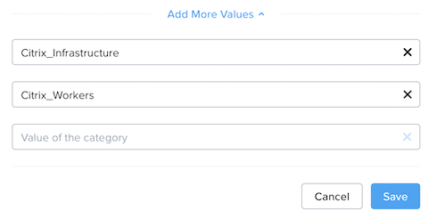
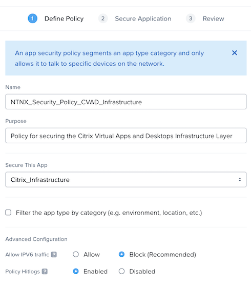
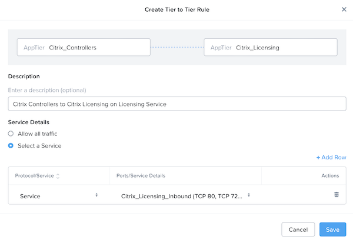
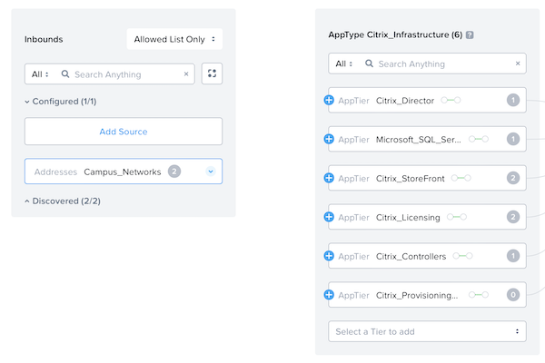
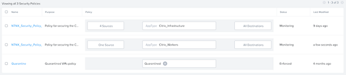
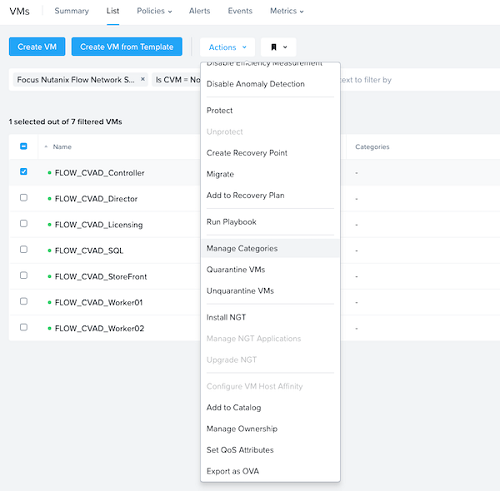

# Implementing Flow Network Security

Before you create policies and categories, it's important to understand the applications and organization you're protecting. 

For the example in this document, we deployed Citrix Virtual Apps and Desktops for an organization that runs AHV and requires additional security between the Citrix infrastructure servers and the VMs (workers) that users access. 

The full deployment scenario consists of the following steps:

1. Enable Flow Network Security.
2. Create categories.
3. Define services.
4. Define addresses.
5. Create a VM view.
6. Create security policies in monitor mode. 
7. Assign categories to VMs.
8. Validate communication.
9. Enforce security policies.
10. Configure auditing.

## Enable Nutanix Flow Network Security

To enable Flow Network Security, review [Flow Network Security documentation](https://portal.nutanix.com/page/documents/details?targetId=Nutanix-Flow-Guide:mul-microseg-enable-t.html).

When Prism shows that Nutanix Flow Network Security is enabled on the clusters, you can proceed.

## Create Categories

The existing AppType and AppTier categories in Prism Central are system categories. Update these categories to add AppType and AppTier values for all the applications the Citrix Virtual Apps and Desktops deployment uses. 

- In the Prism Central menu, select **Administration** and click **Categories**. 
- Select **AppType**, navigate to the **Actions** dropdown menu, and click **Update**.
- Use the **Add More Values** option to add the AppTypes defined earlier.

- Click **Save**, then repeat the preceding process for the system-defined category AppTier, adding the relevant values defined earlier.

- Click **Save**.

## Define Services

To define the services described earlier in this guide, review [Flow Network Security documentation](https://portal.nutanix.com/page/documents/details?targetId=Nutanix-Flow-Guide:mul-service-configure-flow-pc-t.html).

Create a service group that includes all the ports and protocols defined in the planning phase for each service.

## Define Addresses

To define the addresses or networks required for your security policies, review [Flow Network Security documentation](https://portal.nutanix.com/page/documents/details?targetId=Nutanix-Flow-Guide:mul-address-flow-pc-c.html).

Create an address group for each network address space defined in the planning phase.

## Create Virtual Machine View

At this point in the process, you've defined the required AppTypes, AppTiers, service groups, and address spaces. Now you can create a custom view to assist in simplifying category assignment. By default, Flow Network Security doesn't display the category when showing VMs. 

- In the Prism Central menu, select **Compute and Storage** and click **VMs**. 
- Select **View by** from the top-level menu on the right side of the screen and click **Add Custom**.

- Enter a name for the new view and populate all the required fields. Be sure to include **Categories** as a column here to simplify assigning security policies to VMs based on category.

- Click **Save** to commit the new view, which should now appear in Prism Central. 

## Create Security Policies in Monitor Mode

To secure the environment, create security policies. The example in this document uses two examples:

- CVAD_Policy_Infrastructure
- CVAD_Policy_Workers

### Citrix Virtual Apps and Desktops Policy: Infrastructure

To configure the application security policy for Citrix Virtual Apps and Desktops infrastructure, review the [Flow Network Security documentation](https://portal.nutanix.com/page/documents/details?targetId=Nutanix-Flow-Guide:mul-security-policy-configuration-c.html).

When entering values for the **Name** and **Purpose** for this policy, be as descriptive as possible to simplify troubleshooting the policies later. Select the AppType to secure (in this case, **Citrix_Infrastructure**) and select the **Enabled** option for **Policy Hitlogs**.

- In the blank policy you just created, click **Set rules on AppTiers, instead** to define rules based on AppTier instead of AppType.

- Select the **Select a Tier to add** dropdown menu and add the AppTiers defined earlier. Don't include **Citrix_Workers**, as the next policy defines this tier. 

- Next, define how the different **AppTiers** can communicate with each other. Select the **Set rules within the app** option and click the first **AppTier** box in the list (in this case, **Citrix Controllers**).

- Once you've selected **Citrix Controllers**, a blue plus sign appears to the right of the other AppTier boxes in the list. 
  - The following example shows that the Citrix Controllers require a connection to the Citrix Licensing Servers on the ports defined in the Citrix Licensing Service.

<note>
When entering a description for a connection, be as clear as possible to simplify troubleshooting the policies later. 
</note>

- Click the blue plus sign and define rules for each AppTier until all communication requirements are in place. 

- To define connection policies in and out of the policy, click **Set Rules to & from the App**.
- Click **Add Source** for the inbound connection and select **Addresses** for the **add source by** option. Select the address space that requires inbound communication to the Citrix infrastructure and click **Add**. <!--KG right? --> <!--DB - Yes, perfect -->

- A blue plus sign appears to the left of each AppTier. You can click this plus sign to define specific rules that allow traffic into the Citrix infrastructure. 
  - Referring back to the Overall Goal figure in the Design Concepts for Flow Network Security section, users only need access to the Citrix Storefront and Citrix Director services from the campus networks. 
- Click the blue plus sign to the left of **Citrix StoreFront AppTier** and create the inbound rule to allow the specific service from campus networks to connect to Citrix StoreFront.

- Repeat the preceding steps for **Citrix Director** to allow the same access. The inbound rules are now defined.

<note>
For the example in this document, we set the outbound access option to **Allow All**. You can apply changes to the outbound rules here if you need to.
</note>

- Click **Next** and leave the policy mode set to **monitor**. Click **Save and Monitor**.

- Prism Central now displays the new security policy.

- Click the new security policy to see a visual representation of the rules you defined.

### Citrix Virtual Apps and Desktops Policy: Workers

To configure the application security policy for Citrix Virtual Apps and Desktops workers, review the [Flow Network Security documentation](https://portal.nutanix.com/page/documents/details?targetId=Nutanix-Flow-Guide:mul-security-policy-configuration-c.html).

When entering values for the **Name** and **Purpose** for this policy, be as descriptive as possible to simplify troubleshooting the policies later. Select the AppType to secure (in this case, **Citrix_Workers**) and select the **Enabled** option for **Policy Hitlogs**.

- Click **Next** and **OK, Got it** on the pop-up window that appears.
  - The blank policy you just created defines rules based on AppType.
- Click **Add Source** for the inbound connection and select **Addresses** for the **add source by** option. Select the address space that requires communication to the Citrix Workers and click **Add**.

- A blue plus sign appears to the left of the AppType. Click the blue plus sign to the left of the Citrix Workers AppType and create the inbound rule to allow communication from the campus networks to the **Citrix Workers** using the service.

- Click **Next** and leave the policy mode set to **monitor**. Click **Save and Monitor**.

- Click the new security policy to see a visual representation of the rules you defined.

### Citrix Virtual Apps and Desktops Isolation Policy

For the example in this document, we stated that Citrix workers in Finance shouldn't be able to communicate with Citrix workers in HR. Although there is a security policy that allows inbound access to the Citrix Workers AppType, we need an isolation policy to prevent the Finance workers and HR workers from communicating.

To configure the isolation policy, review the [Flow Network Security documentation](https://portal.nutanix.com/page/documents/details?targetId=Nutanix-Flow-Guide:mul-security-policy-create-iso-environment-pc-t.html).

When entering values for the **Name** and **Purpose** for this policy, be as descriptive as possible to simplify troubleshooting the policies later. Select the two AppTiers to isolate from each other and select the **Enabled** option for **Policy Hitlogs**.

## Assign Categories to VMs

VMs must be assigned to the correct categories for Flow Network Security to apply the relevant policies.

- In the Prism Central menu, select **Compute and Storage**, and click **VMs**. 
- Select **View by** from the top-level menu on the right side of the screen and click the custom view defined earlier.

- Select a VM that needs category assignment, then select **Actions** and **Manage Categories**.

- Select the AppTier and AppTypes for the VM and click **Save**.

<note>
Once you've repeated this process for all the VMs in the deployment, the VMs are associated with categories.
</note>

- Navigate back to the security policy and open it. The policy should now apply to the appropriate VMs based on category assignments.

The policies you've created and configured are now operating in monitor mode.
