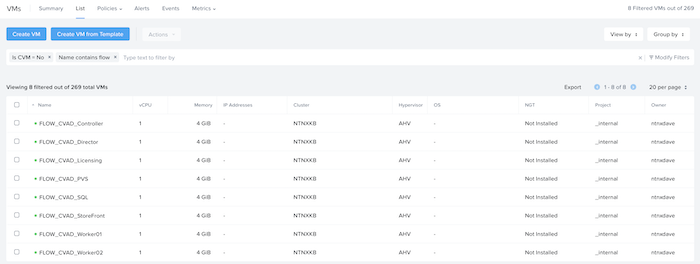
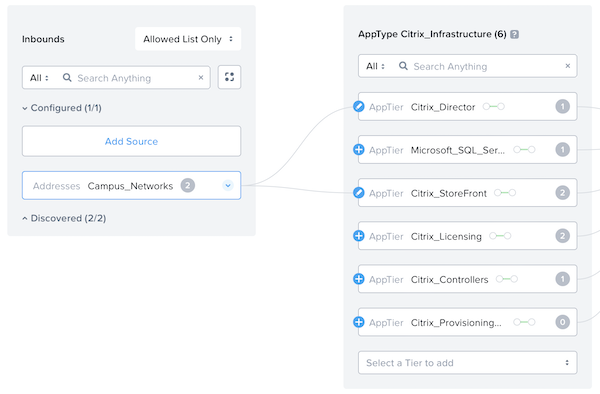
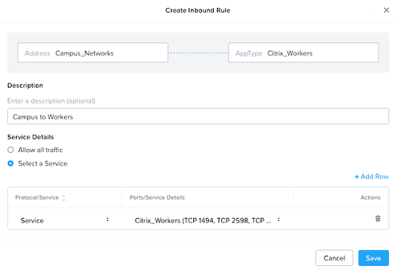
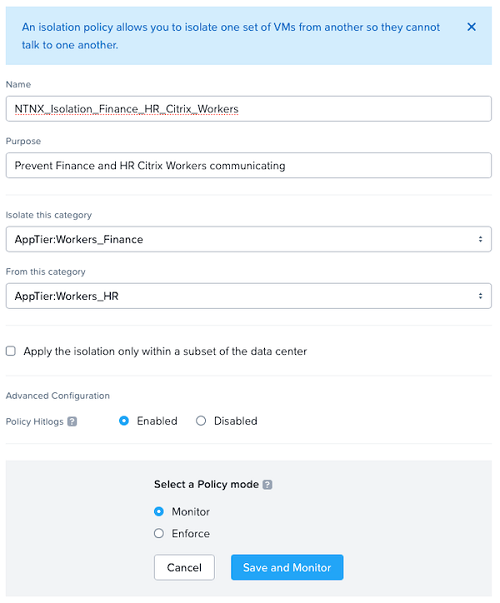

# Implementing Nutanix Flow Network Security

Before creating policies and categories, it’s important to understand the applications and organization being protected. 

For this example, this document is based on a CVAD deployment for an organization that runs AHV and requires additional security between the CVAD infrastructure servers and the VMs (workers) the users will operate on. 

The full deployment scenario consists of the following steps:

- Enable Nutanix Flow Network Security.
- Create Categories.
- Define Services.
- Define Addresses.
- Create a Virtual Machine View.
- Create Security Policies (Monitor). 
- Assign Categories to VMs.
- Validate Communication.
- Enforce Security Policies.
- Configure Auditing.

## Enable Nutanix Flow Network Security

To enable Nutanix Flow Network Security, complete the following:

- Log on to the Prism Central web console.
- Click the collapse menu ("hamburger") button on the left of the main menu and then select "**Prism Central Settings**" to display the Settings page.
- Click "**Microsegmentation**" from the Settings menu (on the left).
- The Enable Microsegmentation dialog box is displayed.
- To determine whether the registered clusters are capable of supporting microsegmentation, complete the following:
  - Click "**View Cluster Capability**", and then review the results of the capability checks that Prism Central performed on the registered clusters.
  - Click "**Back**".
  - Select the "**Enable Microsegmentation**" check box.
  - Click "**OK**".

Once enabled PRISM should show Nutanix Flow Network Security as enabled and capable on the clusters.

## Create Categories

**AppType** and **AppTier** are existing categories in Prism Central identified as a **system category**. Update these categories to add **AppType** and **AppTier** values for all the applications the CVAD deployment uses. 

- Navigate to the Prism Central menu, select "**Administration**", then click "**Categories**". 
- Select "**AppType**", then navigate to the "**Actions**" dropdown menu and click "**Update**".
- Use the blue "**Add More Values**" option to add the **AppType's** defined earlier.

- Click "**Save**" then repeat the process above for the system defined category **AppTier** adding the relevant values defines earlier.

- Click on "**Save**".

## Define Services

To define the services mapped earlier in the guide:

- Navigate to the Prism Central menu, select "**Network and Security**", then click "**Security Policies**". 
- Select "**Services**" from the top level menu, and click on "**Create Service Group**".

- Create a **service group** including all the ports and protocols defined in the planning phase:

- Click **Save** and repeat this process until all **Service Groups** are defined.

## Define Addresses

Next, define all addresses (networks) that will act as part of the Security Policies.

- Navigate to the Prism Central menu, select "**Network and Security**", then click "**Security Policies**". 
- Select "**Addresses**" from the top level menu, and click on "**Create Address**".

- Create an **address group** for the defined networks defined in the planning phase:

- Click "**Create**" and repeat this process for every network address space required for the Nutanix Flow Network Security Policies.

At this point there are defined **AppType's** and **AppTier's** as well as the **Service Groups** and **Address Spaces** required. A custom view should be created to assist in simplifying category assignment as by default the category is not displayed when showing the VMs.

## Create Virtual Machine View

- Navigate to the Prism Central menu, select "**Compute and Storage**", then click "**VMs**". 
- Select "**View by**" from the top level menu on the right, and click on "**Add Custom**".

- Give the new view a name and add all the fields required in the view. Be sure to include "**Categories**" here as this will assist with the assignment of **security policies** to VMs based on **Category**.

- Click "**Save**" to commit the new view, a new custom view should now be defined and displayed in Prism Central.

## Create Security Policies (Monitor)

To secure the environment, Security Policies need to be created. There are two examples used in this guide:

- CVAD_Policy_Infrastructure
- CVAD_Policy_Workers

### CVAD Policy: Infrastructure

- Navigate to the Prism Central menu, select "**Network and Security**", then click "**Security Policies**". 
- Click "**Create Security Policy**".
- Select "**Secure Applications (App Policy)**" and click "**Create**".

Fill out the "**Name**" and "**Purpose**" for this policy. Make this as descriptive as possible as it will make troubleshooting the policies later easier. Select the **AppType** to secure (in this case it will be Citrix_Infrastructure) and select "**Enabled**" for **Policy Hitlogs**.

Click "**Next**" and "**OK, Got it**" to the pop-up that is displayed.

A blank policy will be created. To be define rules based on **AppTier** instead of **AppType** click on the "**Set rules on AppTiers, instead**" link.

Using the drop-down for "**Select a Tier to add**" add all the **AppTier's** defined earlier. Do not include "**Citrix_Workers**" as these will be defined in a separate policy.

Next, define how the different **AppTier's** can communicate with each other. Click on the option for "**Set rules within the app**" and click on the **AppTier** initial **AppTier** (in this case Citrix Controllers).

All the other **AppTier's** will now have a small blue **+** available. Click on this to define all the **AppTier** rules. This example uses the previously outlined examples.

When filling out a connection be as descriptive as possible with the definition as it will make troubleshooting easier. The example shown below shows that the ***Citrix Controllers*** require a connection to the ***Citrix Licensing Servers*** on the defined ports within the ***Citrix Licensing Service.***

Repeat this step for every **AppTier** until all communication requirements are in place. 

Connection policies in and out of the policy now need to be defined. Click on the "**Set Rules to & from the App**" button to do this.

Click on "**Add Source**" for the inbound connection and select "**Addresses**" for the "**add source by**" option, finally select the **address space** to be allowed inbound and click "**Add**".

All **AppTier's** now have a blue **+** next to them, this is where specific rules are defined that allow traffic into the Citrix Infrastructure. Referencing the original architecture diagram, users only need access to the **Citrix Storefront** and **Citrix Director** ***service*** from the **Campus Networks**.

Click on the blue **+** next to the **Citrix StoreFront AppTier** and create the inbound rule to allow the specific **service** from the **Campus Networks** to **Citrix StoreFront**.

Repeat these steps for **Citrix Director** to allow the same access. Inbound rules are now defined.

For the purpose of this guide we will leave the outbound access to "**Allow All**". Changes to outbound rules could be applied here if required.

Click "**Next**" and leave the **Policy mode** set to **monitor**. Click "**Save and Monitor**".

The new **Security Policy** will be displayed in Prism Central.

Clicking on the new **Security Policy** will show a visual representation of the rules defined.

### CVAD Policy: Workers

- Navigate to the Prism Central menu, select "**Network and Security**", then click "**Security Policies**". 
- Click "**Create Security Policy**".
- Select "**Secure Applications (App Policy)**" and click "**Create**".

Fill out the "**Name**" and "**Purpose**" for this policy, make this as descriptive as possible, select the **AppType** (in this case it will be Citrix_Workers) and select "**Enabled**" for **Policy Hitlogs**.

Click "**Next**" and "**OK, Got it**" to the pop-up that is displayed.

A blank policy will be crated. This policy will define the rules based on **AppType**.

Click on "**Add Source**" for the inbound connection and select "**Addresses**" for the **add source by** option. Select the **Address Space** that requires communication to the **Citrix Workers** and click "**Add**".

The **AppType** now has a blue **+** next to it, click on the blue **+** next to the **Citrix Workers AppType** and create the inbound rule to allow the specific **service** from the **Campus Networks** to the **Citrix Workers** using the **service**.

Click "**Next**" and leave the **Policy mode** set to **monitor**. Click "**Save and Monitor**".

Clicking on the new **Security Policy** will show a visual representation of the rules defined.

### CVAD Isolation Policy

The example stated that **Citrix Workers in Finance** should not be able to communicate with **Citrix Workers in HR**. Whilst there is a **Security Policy** to allow inbound access to the **Citrix Workers AppType** an **Isolation Policy** is required to isolate the **Finance workers** and **HR workers** from communicating.

- Navigate to the Prism Central menu, select "**Network and Security**", then click "**Security Policies**". 
- Click "**Create Security Policy**".
- Select "**Isolate Environments (Isolation Policy)**" and click "**Create**".

Fill out the "**Name**" and "**Purpose**" for this policy, Make this as descriptive as possible. Select the 2 **AppTier's** to be isolated from each other and select "**Enabled**" for **Policy Hitlogs**.

Click on "**Save and Monitor**"

## Assign Categories To VMs

Virtual Machines need to be assigned to the correct categories so the relevant Nutanix Flow Security Policies are applied.

- Navigate to the Prism Central menu, select "**Compute and Storage**", then click "**VMs**". 
- Select "**View by**" from the top level menu on the right, and select the custom view defined earlier.

Click to select a VM to add a category to and select "**Actions**" then "**Manage Categories**".

Select the **AppTier** and **AppType's** to add the VM to and select "**Save**".

Repeat this for all the VM's in the deployment. Once completed **categories** will be listed against the VM's

Navigate back to the **Security Policy** and open it. The policy should now be applying to the appropriate VM's based on **Category** assignments.

Policies are now created and configured, operating in **monitor** mode.