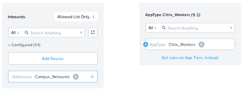
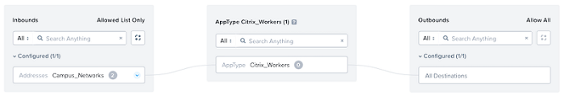

# Implementing Nutanix Flow Network Security

Before you create policies and categories, it’s important to understand the applications and organization you’re protecting. 

For this example, we have a Citrix Virtual Apps and Desktops deployment for an organization that runs on AHV and requires additional security between the Citrix Virtual Apps and Desktop infrastructure and the VMs the users will land on. 

The full deployment scenario consists of the following steps:

- Enable Nutanix Flow Network Security.
- Create Categories.
- Define Services.
- Define Addresses.
- Create Virtual Machine View.
- Create Security Policies (monitor mode). <!--JK: -@david-brett do we need a step that moves from Monitor to enforce?->
- Assign Categories to VMs.

The below outlines how to enable Nutanix Flow Network Security.

## Enable Nutanix Flow Network Security

To enable Nutanix Flow Network Security, complete the following:

- Log on to the Prism Central web console.
- Click the collapse menu ("hamburger") button on the left of the main menu and then select "Prism Central Settings" to display the Settings page.
- Click "Microsegmentation" from the Settings menu (on the left).
- The "Enable Microsegmentation" dialog box is displayed.
- To determine whether the registered clusters are capable of supporting microsegmentation, complete the following:
  - Click "View Cluster Capability", and then review the results of the capability checks that Prism Central performed on the registered clusters.
  - Click "Back".
  - Select the "Enable Microsegmentation" check box.
  - Click "OK".

Once enabled you should see the following showing Nutanix Flow Network Security is enabled and capable on your clusters.

## Create Categories

**AppType** and **AppTier** are existing categories in Prism Central identified as a **system category**. Update these categories to add **AppType** and **AppTier** values for all the applications the CVAD deployment uses. <!--JK: @david-brett this below diagram appears a bit off - we have Delivery Controllers and Citrix Infrastructure as values in the AppType -> Based on the document so far, AppType should be Citrix Infrastructure and Citrix Workers, and then AppTier should be "Citrix StoreFront etc -->

- Navigate to the Prism Central menu, select "**Administration**", then click "**Categories**". 
- Select "**AppType**", then navigate to the "**Actions**" dropdown menu and click "**Update**".

- Use the blue "**Add More Values**" option to add the **AppType's** you need.

- Click "**Save**" then repeat the process above for the system defined category **AppTier** adding the relevant values you need.

- Click on "**Save**".

## Define Services

To define the services that mapped earlier in the planning section:

- Navigate to the Prism Central menu, select "**Network and Security**", then click "**Security Policies**". 
- Select "**Services**" from the top level menu, and click on "**Create Service Group**".

- Create a **service group** including all the ports and protocols defined in the planning phase:

- Click **Save** and repeat this process until all **Service Groups** are defined.

## Define Addresses

Finally, define all addresses (networks) that will act as part of the Security Policies.

- Navigate to the Prism Central menu, select "**Network and Security**", then click "**Security Policies**". 
- Select "**Addresses**" from the top level menu, and click on "**Create Address**".

- Create an **address group** for the defined networks defined in the planning phase:

- Click "**Create**" and repeat this process for every network address space required for the Nutanix Flow Network Security Policies.

At this point there are defined **AppType's** and **AppTier's** as well as the **Service Groups** and **Address spaces** required. A custom view should be created to assist in simplifying category assignment.

## Create Virtual Machine View

- Navigate to the Prism Central menu, select "**Compute and Storage**", then click "**VMs**". 
- Select "**View by**" from the top level menu on the right, and click on "**Add Custom**".

- Give the new view a name and add all the fields that required in the view. Be sure to include "**Categories**" here as this  will enable the assignment of **security policies** to VM based on **Category**.

- Click "**Save**" to commit the new view, a new custom view should now be defined and on display in Prism Central.

<!--JK: @david-brett is this image right below? AppType value shows controllers - isn't that the Tier?-->

## Create Security Policies

To secure the environment, Security Policies need to be created. There are two examples used in this guide:
<!--Moving on we have to now create the Security Policies to be able to secure the CVAD environment. Let's break this down into 2 separate policies. -->

- CVAD_Policy_Infrastructure
- CVAD_Policy_Workers

### CVAD Policy Infrastructure <!--JK: @david-brett I will stop here an IM you for next steps and make sure I am not ruining your document :) -->

First we will define the policy for the CVAD Infrastructure. 

- Navigate to the Prism Central menu, select "Network and Security", then click "Security Policies". 
- Click "Create Security Policy".
- Select "Secure Applications (App Policy)" and click Create.

Here you will need to fill out the "Name" and enter a "Purpose" for this policy. Make these as descriptive as possible as it will make troubleshooting the policies easier in the long run. You will also have to select the AppType that you wish to secure (in this case it will be Citrix_Infrastructure) and select "Enabled" for policy hitlogs.

Click "Next" and "OK, Got it" to the pop-up that is shown.

You will be shown a blank policy and since we are going to be defining the rules based on AppTier not AppType click on the "Set rules on AppTiers, instead" link shown below.

Using the drop-down for "Select a Tier to add" add all the AppTier's that you defined earlier in this guide, not including the "Citrix_Workers" as we will cover these in a separate policy.

Next we need to define how those different AppTier's can talk to each other. Click on the option for "Set rules within the app" and click on the AppTier you want to start with (we will start with the Citrix Controllers)

You will notice that all the other AppTier's now have a small blue + available. Click on this to define all the AppTier rules we described earlier in this document in the overall architecture diagram.

When filling out a connection please be as descriptive as possible with the definition as it will make troubleshooting easier in the event of a problem. The example shown below shows that the Citrix Controllers require a connection to the Citrix Licensing Servers on the defined ports within the Citrix Licensing Service we defined earlier.

Once complete you will see all of your definitions shown in Prism Central. To review any of the connections click on the line connecting the two AppTier's.

Next you need to define connection policies in and out of the policy. Click on the "Set Rules to & from the App" button to do this.

Click on "Add Source" for the inbound connection and select "Addresses" for the add source by option, finally select the address space you defined for your Campus Networks and click "Add".

You will notice that all the AppTier's now have a blue + next to them, here is where you define the specific rules that you wish to allow into your Citrix Infrastructure. Looking back to the original architecture diagram we can see that the users only need access to the Citrix Storefront and Citrix Director service from the Campus Networks.

Click on the blue + next to the Citrix StoreFront AppTier and create the inbound rule to allow the specific service from the Campus Networks to Citrix StoreFront.

Do the same for Citrix Director to allow the same access from the Campus Networks and you will see your inbound rules set up and defined.

Here you are able to also restrict the outbound rules should you wish but for the purpose of this article we will leave the outbound access to "Allow All".

Click "Next" then leave it set to monitor and click on "Save and Monitor"

Your new policy will be displayed in Prism Central.

Clicking on your new Security Policy will show you all the rules you have set up and display a visual representation of those rules.

### CVAD Policy Workers

Next we will define the policy for the CVAD Workers. 

- Navigate to the Prism Central menu, select "Network and Security", then click "Security Policies". 
- Click "Create Security Policy".
- Select "Secure Applications (App Policy)" and click Create.

Here you will need to fill out the "Name" and enter a "Purpose" for this policy. Make these as descriptive as possible as it will make troubleshooting the policies easier in the long run. You will also have to select the AppType that you wish to secure (in this case it will be Citrix_Infrastructure) and select "Enabled" for policy hitlogs.

Click "Next" and "OK, Got it" to the pop-up that is shown.

You will be shown a blank policy and this time we are going to be defining the rules based on AppType.

Click on "Add Source" for the inbound connection and select "Addresses" for the add source by option, finally select the address space you defined for your Campus Networks and click "Add".

You will notice that all the AppType now has a blue + next to it, here is where you define the specific rules that you wish to allow into your Citrix Workers. Looking back to the original architecture diagram we can see that the users only need access to the Citrix Workers from the Campus Networks.

Click on the blue + next to the Citrix Workers AppType and create the inbound rule to allow the specific service from the Campus Networks to the Citrix Workers.

Here you are able to also restrict the outbound rules should you wish but for the purpose of this article we will leave the outbound access to "Allow All".

Click "Next" then leave it set to monitor and click on "Save and Monitor"

Your new policy will be displayed in Prism Central.

Clicking on your new Security Policy will show you all the rules you have set up and display a visual representation of those rules.

## Assign Categories To VMs

Next we will need to add our Virtual Machines to the correct categories so that they are picked up by the relevant Nutanix Flow Security Policies.

- Navigate to the Prism Central menu, select "Compute and Storage", then click "VMs". 
- Select "View by" from the top level menu on the right, and select the custom view you defined earlier.

Below you can see the Virtual Machines relevant to this document as well as the categories currently assigned to the VM's.

Click to select a VM you want to add a category to and select "Actions" then "Manage Categories"

Select the AppTier and AppType's you wish to add the VM to and select "Save"

Repeat this for all the relevant VM's in your deployment

Once done you will see the categories listed against the VM's

If you navigate back to your Security Policy and open it up you will now see that the policy is applying to your VM's

At this point your policies are set up and configured and in monitor mode.