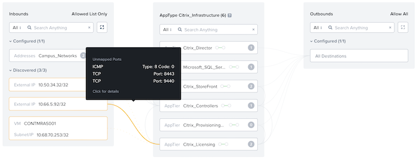

# Validating Communication

When you create policies in monitor mode, you can operate the Citrix Virtual Apps and Desktops environment in an unintrusive monitoring state for a few hours, days, or weeks to check for any traffic missed in the policy. 

Validating your policies in monitor mode is vitally important to prevent an outage when you change the policy mode from monitor to enforce.

In a defined security policy, you can view discovered traffic that isn't yet covered by any defined rules. You can inspect the traffic by hovering over the yellow line between columns and, if applicable, add it to the policy by either allowing access to the address space or updating the service to include the relevant port and protocol.

The previous figure shows traffic from an external IP not included in the campus network address space that is trying to access the Citrix License server over ICMP. Flow Network Security has blocked this traffic.

Once you're satisfied that the policies function as expected and the relevant access is in place, you can enforce the restrictions.