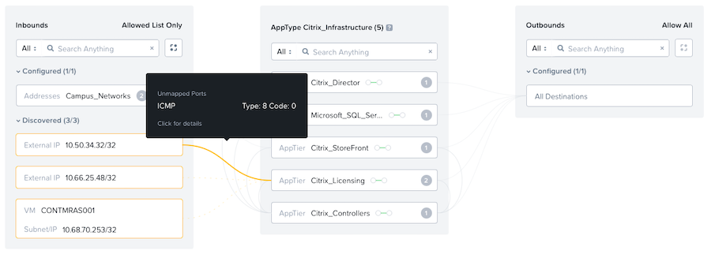

# Monitoring Nutanix Flow Network Security

Creating the policies in Monitor mode allows you to operate the CVAD environment with the policies in Monitor mode for a few hours, days, or weeks to check for any traffic you missed in the policy. 

This is vitally important to prevent an outage when you change the policy mode from "Monitor" to "Enforce".

Detected traffic that’s not part of the policy shows up in yellow on the Edit and View Policy page. You can either add it to the policy by selecting the green check that appears when you hover over the traffic or ignore it.

By opening up a defined Security Policy you are able to view traffic that is discovered but not covered by and rules you have defined.  You can inspect the traffic by hovering over the yellow line and if applicable, add it to the policy by either allowing the address space access or updating the service to include the port and protocol.

In the above example you can see that traffic from an external IP not included in the Campus Network address space was trying to access the Citrix License server over ICMP, this has been blocked by Nutanix Flow.

Once you are happy that your policies are functioning as expected, and you have all the relevant settings in place you can move onto enforcing the security.