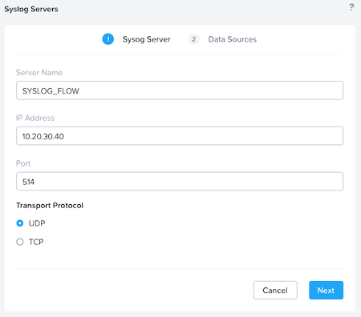
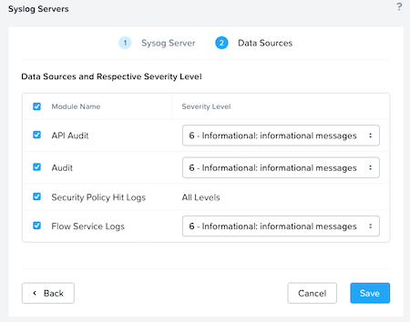

# Auditing Flow Network Security 

Logging is an important part of security infrastructure, and Flow provides two types of logs: audit logs and policy hit logs. 

- Audit logs track changes to security policy configuration and VM category mapping to show when a policy was changed and applied as well as who made the change.
- Policy hit logs track network flows and whether a specific policy allowed or denied them. Use them to determine whether specific traffic is present on the network and what effect a security policy has on traffic.

## Audit Logs

Prism Central can send audit logs to a remote syslog server, but you can also view them directly in Prism Central. To view audit logs in Prism Central, navigate to the **Activity** menu, then click **Audits**. 

Audit logs are enabled by default and capture all changes that someone makes in Prism Central related to Flow Network Security.

## Policy Hit Logs

Policy hit logs are disabled by default, so you must enable them for each policy if you need them. 

Policy hit logs can generate a large amount of data. To analyze the data from policy hit logs, use an external remote syslog server or Security Information and Event Management (SIEM) system to collect logged events. 

Because the policy hit log data that each AHV host sends directly to the syslog server is too large to consume inside Prism, you must perform policy hit log analysis on the external appliance. 

Ensure that the remote syslog server or SIEM expects traffic from both Prism Central and each individual AHV host. To configure a remote syslog server in Prism Central, select the gear icon for **Settings** and click **Syslog Server**. 

Add the server address, select the desired port and protocol, and click **Next**.

Select the data sources you want to send and click **Save**.

