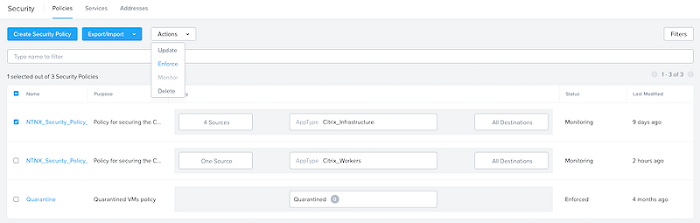

# Enforce Security Policies

To move policies from **Monitor** to **Enforced**:

- Navigate to the Prism Central menu, select "**Network and Security**", then click "**Security Policies**". 
- Select the policy you wish to enforce.
- From the **Actions** drop-down menu select "**Enforce**".
- Fill out the confirmation dialog and click "**Confirm**".

<note>
    You do not need to enforce all your policies at the same time. Use a gradual approach to ensure that there is no negative impact to the production environment.
</note>

The policy is now **enforced**.

If any issues arise due to a policy blocking traffic, roll it back by performing the following.

- Select the **policy** you wish to roll back.
- From the **actions** drop-down menu select "**Monitor**".
- Fill out the confirmation dialog and click "**Confirm**".