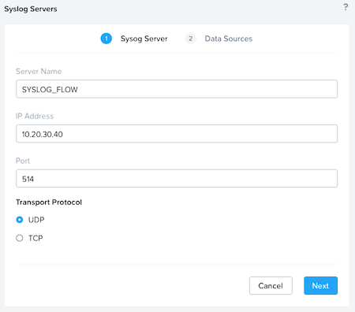
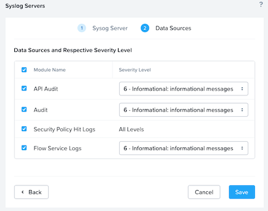

# Auditing Nutanix Flow Network Security <!--JK: @david-brett rewrote this section as it was muddled - see what you think -->

Logging is an important part of security infrastructure, and Flow provides two types of logs: audit logs and policy hit logs. 

- **Audit logs** track changes to **security policy** configuration and VM **category** mappings to show when a policy was changed, applied and who made the change
- **Policy Hitlogs** track network flows and whether they were allowed or denied by a specific policy. Use them to determine if specific traffic is present on the network and what effect a security policy has on traffic.

## Audit Logs

Audit logs track changes to **security policy** configuration and VM **category** mappings to show when a policy was changed, applied and who made the change. 

Audit logs can be sent from Prism Central to a remote syslog server, but you can also see them in Prism Central. To view audit logs:

- Click the Prism Central menu button, navigate to the "**Activity**" menu, then click "**Audits**". 

Audit logs are enabled by default and capture all changes made in Prism Central related to Flow.

## Policy Hitlogs

You must enable Policy Hitlogs per policy if you require them; they are disabled by default. 

Policy Hitlogs may generate a large amount of data. To analyze the data from policy hit logs, use an external remote syslog server or SIEM (Security Information and Event Management) system to collect these events.

Policy Hitlogs are sent directly from each AHV host to the syslog server but generate too much data to consume inside Prism. That’s why you must perform analysis on the external appliance for policy Hitlogs. 

Ensure that the remote syslog server or SIEM expects traffic from both Prism Central and each individual AHV host. Configure a remote syslog server in Prism Central by selecting the gear icon for **Settings** and clicking **Syslog Server**. 

Add the server address and select the desired port and protocol and click Next.

Then select the data sources you wish to send and click Save.

