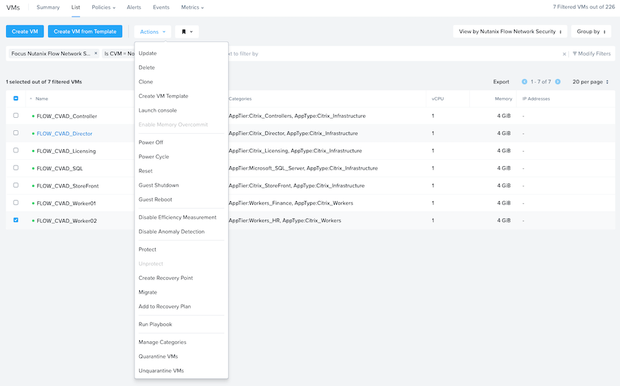
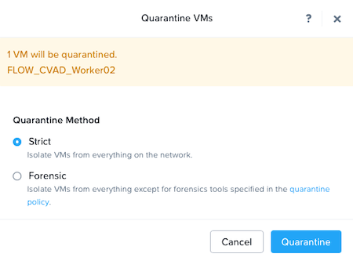
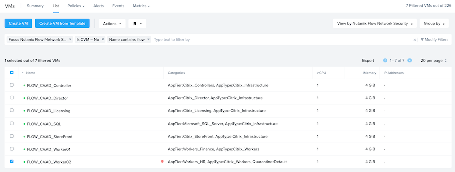

# Quarantine a Virtual Machine

As described earlier in this guide, Nutanix Flow provides the ability to quarantine a VM should there be a security breach in the environment.

- Navigate to the Prism Central menu, select "**Compute and Storage**", then click "**VMs**". 
- Select "**View by**" from the top level menu on the right, and select the custom view you defined earlier.

Click to select a VM you want to quarantine to and select "**Actions**" then "**Quarantine VMs**"

Select "**Strict**" or "**Forensic**" based on your requirements and click "**Quarantine**".

The Virtual Machine view will update to reflect the quarantined VM.

To take the VM out of quarantine click to select a VM you want to take out of quarantine to and select "**Actions**" then "**Unquarantine VMs**"