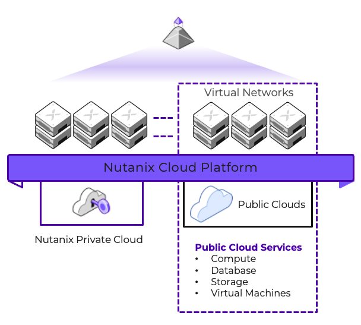

# Executive Summary

This document describes the End User Computing (EUC) performance benchmarking best practices that Nutanix defines and aligns to when performing benchmarking. Where possible we have recommended tools and guides that we see as being fit for purpose however these tools will differ in various enterprise deployments.

# Introduction

In this document, we describe our best practices for running EUC performance benchmark tests. At Nutanix, we run benchmark tests with EUC workloads for several reasons:

-  To ensure there is no regression with an EUC workload performance profile when upgrading Nutanix Cloud Infrastructure (NCI) to a new version. 
-  To outline the performance impact in various publications, such as Nutanix Reference Architectures, Validated Designs, Technotes, and similar publications.
-  To validate performance on different hardware platforms, with different CPU, memory, and storage configurations. This helps us fine-tune the Nutanix Sizer tool and educate customers and field teams.

A critical aspect of performance benchmark tests is consistency. Once you can achieve consistent results, you can define a baseline. A baseline allows you to compare changes in infrastructure or configuration, and then measure and assess the impact of that change.

## Audience

This technote is part of the Nutanix Solutions Library and provides an overview of our recommendations for running EUC performance benchmark tests. 

## Purpose

This document covers End User Computing benchmarking guidelines and best practices methodologies used within Nutanix.

## Document Version History

| **Version Number** | **Published** | **Notes** |
| :---: | --- | --- |
| 1.0 | January 2024 | Original publication. |

# Nutanix Platform Overview

Nutanix designed its software to give customers running workloads in a hybrid cloud environment the same experience they expect from on-premises Nutanix clusters. Because Nutanix in a hybrid multicloud environment runs AOS and AHV with the same CLI, UI, and APIs, existing IT processes and third-party integrations continue to work regardless of where they run.

Nutanix AOS can withstand hardware failures and software glitches and ensures that application availability and performance are never compromised. Combining features like native rack awareness with public cloud partition placement groups, Nutanix operates freely in a dynamic hybrid multicloud environment.

Nutanix's software scales linearly allowing us to baseline a platform, and then scale the platform out by adding nodes. This allows us to demonstrate no degradation in performance whilst adding more compute. 

# Why Run Performance Benchmark Tests for EUC?

Some examples of why you would run an EUC benchmark test are:

-  Baseline the performance profile of the platform.
-  Determine the impact of new software versions (AOS, AHV, Windows OS versions, Citrix VDA, etc).
-  Determine the impact of configuration changes (Group Policy, Profile configuration, etc).

# Benchmarking Tools

There are various benchmarking solutions that you can use to simulate an EUC workload. Keep the following guidelines in mind when selecting an EUC benchmarking solution:

-  The tool must be able to simulate user behavior, such as logging in to the virtual machines, starting applications, opening, editing, and saving documents with various applications. This is called a workload. 
-  It is preferable to be able to use applications in the simulated workload that are used by the user base in production.
-  It is critical to have a repeatable workload that will have a consistent outcome.
-  The tool must be able to collect various metrics that can be used to compare multiple tests.
-  If the tool does not provide the data you require, be sure to investigate gathering the required information using other methods available to you.
-  Being able to compare results is critical. Without this capability, you will not have the ability to compare results against different scenarios. A central reporting tool helps to compare results.

Benchmarking tools can be broken into various categories, it is important to define your requirements before deciding on a tool. Once defined, you can design and implement your solution.

Below are some examples of the high-level benchmarking software categories.

| **Category** | **Description** | 
| :--- | :--- | 
| Workload simulator | Software to simulate user workloads on the endpoints being tested | 
| Broker (optional) | The desktop broker platform used to launch sessions | 
| Image | Operating System and applications |
| Automation | Automation of the test execution |
| Data Collection | Ability to collect appropriate test data | 
| Storage | Repository to store test results and data | 
| Reporting | A mechanism to analyze and present results| 

When defining and designing your environment for testing, you should have a repeatable and ideally automated process for test execution. Having the test defined and executed identically for every test run is critical to ensure accurate results. 

# Consistency

A good user experience is not only defined by how fast a logon is or how fast an application starts, a good user experience is also a consistent user experience. 

In an EUC benchmark test, you want to understand at what point the user experience is no longer consistent. The longer the experience is consistent, the better the result.

To expand on this concept, we can use the commonly measured metric of logon time. Benchmarking tests can be used to identify at what load point, the user logon experience starts to deteriorate. The same test data can also be used to measure the impact of application or patch changes on the logon times.

If you want to know at what point it's not realistic to add more users to the system (what is the maximum number of sessions for this system with this workload), you need to define your acceptable logon time metric, let's use an example of 20 seconds.

If the first 100 users have a logon time of 20 seconds, and the subsequent users start to experience longer logon times, then it is fair to say that the system can comfortably hold 100 users with a consistent experience. You may determine that your acceptable metric is 25 seconds, which will alter your baseline accepted figures for the number of users that can be hosted on a system.

Once you have an accepted baseline created, you can repeat the test and measure changes across different scenarios such as Windows patches, etc.

# Benchmarking Metrics

When benchmarking an EUC workload, the key goal is to understand the baseline performance of your platform. Once you have a baseline, you can measure the performance impact when introducing a change to the environment. 

It is not always possible to achieve an identical usage pattern to that of your user base. However, it is fair to say that if changes are identified against the patterns you are testing, then they will be felt in everyday usage as well.

The best way to determine the user density of a platform is to choose a workload persona as close to your actual user patterns as possible.

With the Nutanix Cloud Platform, you can scale linearly by adding nodes to the cluster. Before you start creating a baseline for the platform at any size, it's important to understand the types of metrics you will be monitoring to measure system and user experience.

## Resource Usage Metrics

The following metrics relate to the system performance directly and need to be kept under certain thresholds for the platform to perform as expected.

### Host Metrics

The below are typical metrics required from a Nutanix host to ensure it is performing correctly.

| **Metric** | **Description** | **Good Result** |
| :--- | :--- | :--- |
| CPU usage | The current and average CPU usage | < 85% during steady state |
| Average CPU ready time | The CPU ready time | Less than 2% |
| Memory usage | The host memory usage | Nutanix does not recommend over-committing memory |
| Storage controller IO | The host read, write IO | A typical read/write ratio for EUC workloads during steady state should be 20-30% reads / 70-80% writes |
| Storage controller latency | The Storage Controller Latency | < 5ms |

### Virtual Machine Metrics

The below are typical metrics required from the Virtual Machine to ensure it is performing correctly. Good results with these metrics will largely depend on the type of workload you are testing, and acceptable levels should be agreed upon before running the test.

| **Metric** | **Description** | 
| :--- | :--- | 
| CPU usage | The max and average CPU usage | 
| Memory usage | The memory usage | 
| Display protocol CPU usage | The display protocol current and average CPU usage | 
| Display protocol Frames per Second | The display protocol frames per second | 

## User Experience metrics

The following metrics relate to the user experience during the test.

### Logon Time Metrics

The below are typical metrics required to measure the logon times.

| **Metric** | **Description** | 
| :--- | :--- |
| Total logon time | The total logon time | 
| Profile load time | The time taken to load the user profile  |
| Connection time | The time to connect to the resource | 
| GPO load time | The time to process the group policies assigned | 

### Application Performance Metrics

The below are typical metrics required to measure application performance during a test. Good results with these metrics will largely depend on the type of workload you are testing, and acceptable levels should be agreed upon before running the benchmark.

| **Metric** | **Description** | 
| :--- | :--- | 
| Application start times | The time taken to launch various applications | 
| Application open file times | The time taken to open a file | 
| Application save file times | The time taken to save a file |

# Setting Up Your Environment for Consistent Benchmark Testing

In this section, we discuss the considerations for setting up the infrastructure to perform a benchmark test.

## Master Image

Building your image is a critical step undertaken when setting up the environment to run EUC benchmark tests. It is this image that will be the basis for all of your baseline testing activity. Ensuring a repeatable, consistent image-building process is key to consistency.

Consider the steps that are normally undertaken to build an image in Nutanix AHV:

-  Deploy the virtual machine shell to a defined specification.
-  Install and patch the operating system.
-  Install the required software.
-  Optimize the image.
-  Snapshot the image.

If this process was only being completed once, then a manual approach would be sufficient, however, as you will be testing various hardware, software, and configuration changes, human error can creep into build tasks. A single non-planned configuration difference during the build can impact the results of your testing.

Key things to consider when building an image are:

-  Automation. Ensure everything is a repeatable task. This includes optimizations across both the Operating System and applications.
-  Ensure your testing team is using the same deployment method for building master images.

## Reboot Before Testing

Before you start a benchmark test, you should consider if you need to reboot components or not. For some components, it's important to start clean, with fresh memory and empty caches. This is especially important for the target machines hosting the sessions, as it could cause big variations in test results.

Another consideration is to tune the hypervisor connection from your chosen broker to allow for mass actions to take place (such as reboot) within a given time frame. Please refer to your broker documentation to read the current best practice guidelines.

In our experience, we find that rebooting the hypervisor has a negligible impact. As such, we do not reboot hypervisors between test runs.

## Clients (Launchers)

There are two methods of initiating a user session on the target VMs. 

1.  A direct session using the VM console.
2.  A remote connection using a remoting protocol.

Connecting via a remoting protocol has the advantage of simulating the use of a display protocol which can have an impact on the resource usage of the target VM. If this approach is taken you need clients (physical or virtual) that connect using a display protocol and typically a broker to distribute the session requests from the clients. 

When you use clients to initiate the sessions, it's important to configure these clients with the same specifications. Examples of these configuration options are:

-  Screen resolution. 
-  Display protocol settings. 
-  Offload settings such as video and audio.

## Logon Window

The Logon Window is the time taken to log on all of the sessions defined within the test parameters. Another concept to note is the Logon rate, which defines the number of logons per second or minute. 

The logon phase during a benchmark test is often the most resource-intensive phase. If the logon window is too short, you will most likely run into CPU contention on the system. 

In our tests, we always use a logon window of 48 minutes. Due to the linear scale capability of Nutanix, if a single node is capable of logging on 100 user sessions on 1 node in 48 minutes, a 4-node cluster of the same type should be able to log on 400 user sessions in the same window.

## BIOS settings

Modern CPUs utilize a technology called "C-States" to manage the amount of power that individual processor cores are utilizing.  When a core is idle, the server's BIOS will reduce its clock rate, power draw, or both to make the system more energy efficient. In many cases, this is the desired condition as it can significantly reduce power consumption. The unused power may be used by other CPU cores to increase their frequency (GHz), allowing instructions executing on active CPU cores to complete faster.

For EUC workloads, this is not a desired behavior. When "power throttling" technologies are enabled, users can experience inconsistent performance. It's best to **disable** C-States to make sure the processors are always running at the same speed. 

In most server brands, setting the BIOS to "(Static) High Performance" (or equivalent) will disable processor C-States.

<note>
Do not change Power Management Configuration settings in the BIOS for Nutanix NX hardware. Nutanix does not support custom power management configurations, and changing the power management settings in the BIOS can cause unpredictable behavior. The Nutanix BIOS contains optimized power management settings by default.
</note>

## Persistent vs Non-Persistent Considerations

It is important to understand the difference between a **persistent** and **non-persistent** workload as it relates to benchmarking.

-  A **persistent workload** retains all user settings at logoff. Any changes made to the machine are "persisted" and can be consumed across subsequent sessions.
-  A **non-persistent workload** will not retain any settings at logoff unless specifically catered for by an external profile solution. Typically the machine is rebooted and wiped back to a known clean state. Any changes to the machine are lost. To retain user settings, profile management is typically included.

For performance benchmarking, we are looking to achieve a consistent user experience and identify configuration change impact, it is recommended to use non-persistent workloads.

## Local vs Roaming vs Containerized Profiles

The profile type used in benchmarking will have an impact on the test results.

Regardless of the workload persistency type, the first logon of a user to a machine will typically be longer than subsequent logons for the same user. The first logon always has a profile creation tax, the second and subsequent logons do not incur this tax if using a profile management solution or using persistent machine configurations.

Here are some considerations for the different profile types:

A **local profile** exists locally to the workload:

-  If using a non-persistent workload, the profile is wiped at the machine rebuild.
-  If using a persistent workload, the user profile is retained and will be used for subsequent sessions for the same user.
-  All IO occurs locally to the machine, and as such will be shown on the cluster hosting the workloads. Counters such as IO and CPU will be impacted by local profiles.
-  With local profiles, the only size consideration is the amount of local disk space available on the VM.

A **file-based profile** is typically stored on a network location externally to the VM. It allows user settings to roam across multiple machines:

-  With file-based solutions, profiles are stored externally to the workload. This means there are additional performance considerations.
-  Additional IO may be placed on the workload when loading the profile in during the logon phase, and out during the logoff phase.
-  To ensure a streamlined profile, it is typically important to manage the profile size.
-  A poorly performing storage repository for profiles can negatively impact your benchmark results.
  
A **container-based profile** solution typically puts a local profile in its entirety into a VHDX container. This container is mounted during the user logon and presented to the Operating System as a local profile.

-  With container-based solutions, the containers (disks) are stored externally to the workload. This means there are additional performance considerations. 
-  A benefit of container-based profiles is that there is no logon performance impact as the container grows, so managing the size is not as important when considering benchmarking.
-  A poorly performing storage repository for profiles will negatively impact your benchmark results. In a default configuration for most container-based profile solutions, all IO will be handled on the external storage location. It is common to say a reduction in metrics on the cluster hosting workloads when comparing a local profile solution to a container-based solution.
-  Container solutions often have features and settings that will change the IO patterns. You should be aware of capabilities or features that use caching features as IO patterns will change significantly.
  
Regardless of the profile solution you select, you should be aware of the changes in behavior and associated performance impacts. This is a great example of when benchmarking can be of benefit.

## Optimizations

Operating System optimizations have a huge impact on system performance when dealing with EUC workloads.

Depending on what your goals are, and why you are benchmarking certain configurations, it may be important to optimize your images by removing unnecessary services or configurations.

Some examples of items to optimize (disable or remove) in an image:

-  Windows Updates.
-  Unnecessary applications such as the X-Box application or anything else that is not required in your environment.
-  Unnecessary Windows Services.
-  Unnecessary Scheduled Tasks.

All non-essential services, processes, and applications consume CPU cycles or memory, therefore decreasing the performance and number of users we can fit onto the platform. Benchmarking with a bare minimal configuration also allows you to understand what happens if your requirements change, and you need to re-enable a previously disabled item.

When considering user experience benchmarking, ensure you are testing using the same optimizations that you would apply to the production environment.

# Conclusion

-  Consistency is critical for EUC benchmarking tests. Consistent configurations lead to accurate and consistent results.
-  Image optimizations have a significant impact on overall performance figures. You should consider what optimizations you are applying against your desired test outcome.
-  When designing your test workload, be sure to mirror production configurations as closely as possible.
-  Profile choice and workload persistency decisions will directly impact your test results. Externally stored profile solutions introduce additional performance and monitoring considerations.
-  Being able to compare different test results is critical. Comparison/overlay techniques allow you to directly assess the impact of changes.
-  Running EUC benchmark tests produces a lot of data, and retention of the data set should be considered.
-  When running benchmark tests, be sure to compare all 3 phases of the test (boot storm, logon window, and the steady-state phases) to understand the full impact.

# References

-  [End User Computing Performance Analysis](https://portal.nutanix.com/page/documents/solutions/details?targetId=TN-2113-Windows-10-Performance-Impact:TN-2113-Windows-10-Performance-Impact)
-  [Nutanix BMC and BIOS Overview](https://portal.nutanix.com/page/documents/details?targetId=Release-Notes-BMC-BIOS:Nutanix%20BMC%20and%20BIOS%20Overview)