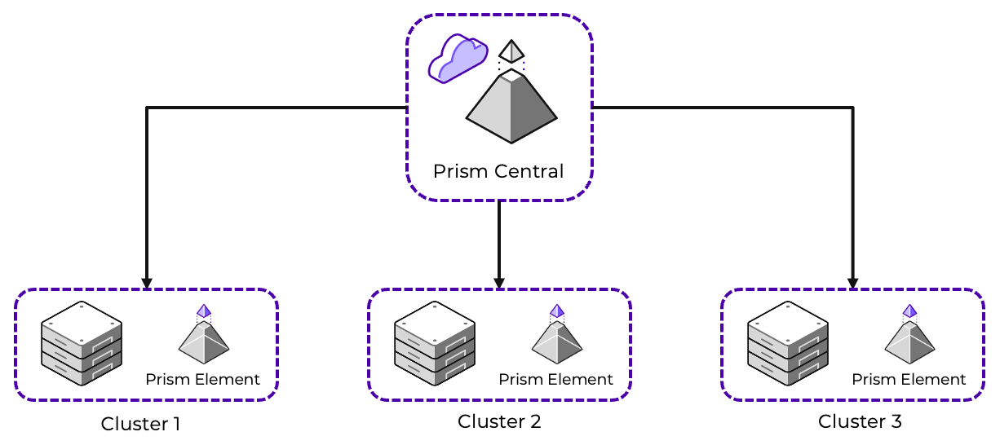
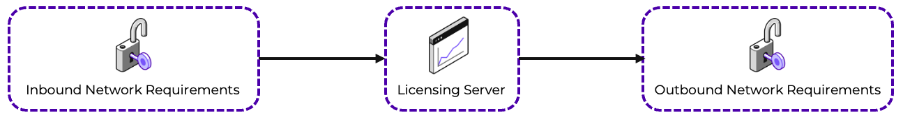
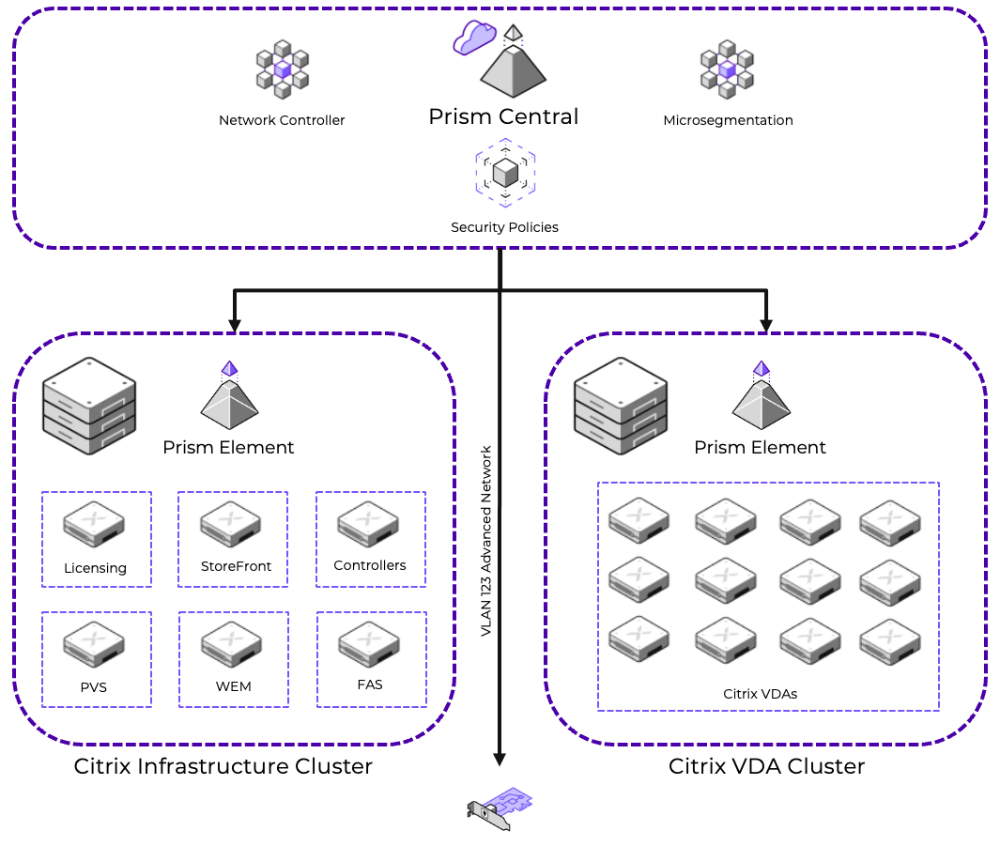
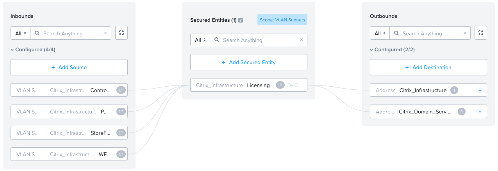
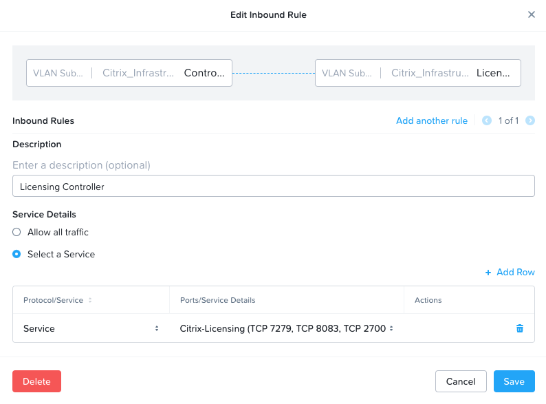
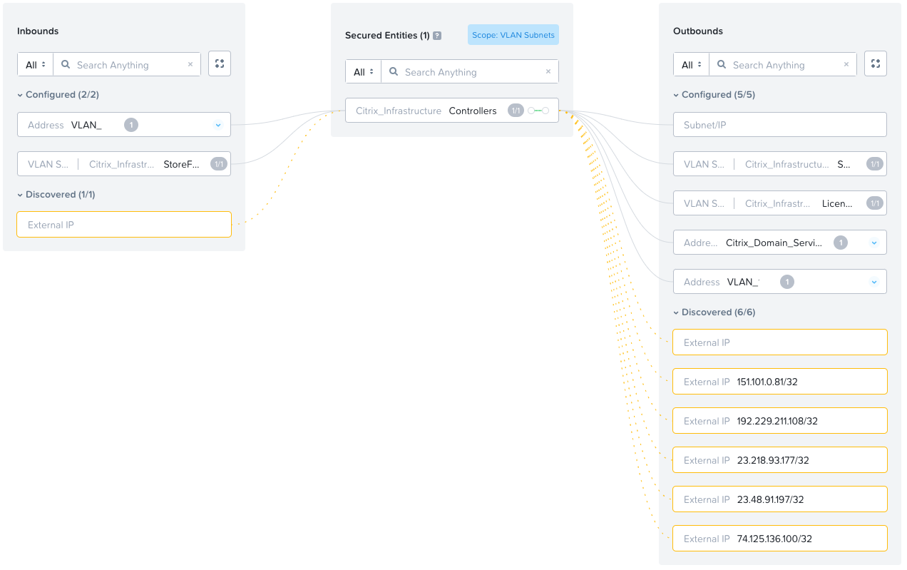
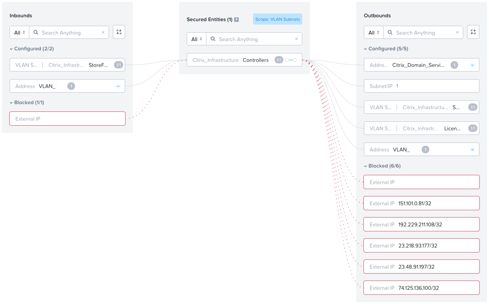
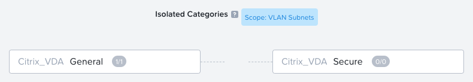
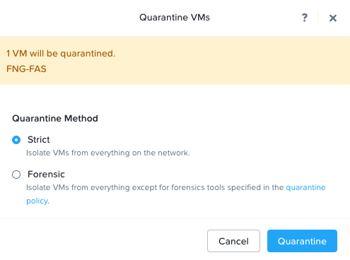
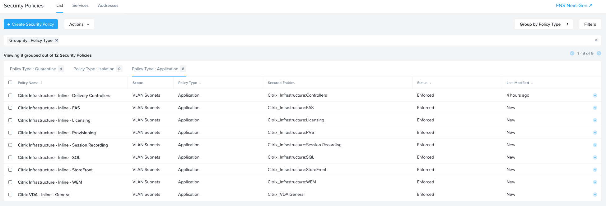

# Executive Summary

Nutanix designed its software to give customers running workloads in a hybrid cloud environment the same experience they expect from on-premises Nutanix clusters. Because Nutanix in a hybrid multicloud environment runs AOS and AHV with the same CLI, UI, and APIs, existing IT processes and third-party integrations continue to work regardless of where they run.

Nutanix AOS can withstand hardware failures and software glitches ensuring that application availability and performance are never compromised. Combining features like native rack awareness with public cloud partition placement groups, Nutanix operates freely in a dynamic hybrid multicloud environment.

Citrix Desktop and Application delivery on Nutanix is a powerful solution that offers unrivaled user experience, simple administration, and web-scale flexibility and economics. Combining Citrix delivery on Nutanix with Nutanix Flow Network Security delivers a secure and performant platform to your end users.

In this best practice guide, we make recommendations for designing, optimizing, and implementing Citrix Desktop and Application delivery with Nutanix Flow Network Security. We provide relevant performance data associated with the implementation of Nutanix Flow Network Segmentation. We used Login Enterprise (Login VSI) and an automated scripting framework on Nutanix to simulate real-world workloads in a secure Citrix Desktop and Application delivery environment.

# Introduction

This best practice guide is part of the Nutanix Solutions Library. We wrote it for individuals responsible for designing, building, managing, and supporting Citrix Desktop and Application delivery with Nutanix Flow Network Security on Nutanix infrastructures. Readers should be familiar with Nutanix AOS, Nutanix Files, Nutanix AHV, Nutanix Flow Network Security, General Networking, and Citrix Desktop and Application delivery. 

## Purpose

This document covers the following subject areas:

- Nutanix management architecture overview
- Citrix desktop and application delivery overview
- Nutanix Flow Network Security overview
- Citrix desktop and application delivery with Nutanix Flow Network Security 
- Security design considerations
- Network design considerations
- Example Secure Citrix Deployment
- Creating Network Security policies
- Network Security logging
- The performance impact of Flow Network Security 

## Document Version History 

| Version Number | Published | Notes |
| :---: | --- | --- |
| 1.0 | September 2024 | Original publication. |

# Nutanix Management Architecture Overview

Nutanix delivers the simplicity and agility of public cloud alongside the performance, security, and control of private cloud. Whether on-premises or hybrid, build the exact cloud you want, with unified management and operations, one-click simplicity, intelligent automation, and always-on availability.

Management of a Nutanix platform can be performed with 2 different GUI interfaces:

Prism Element
: A web management platform used to manage, monitor and optimize a local Nutanix cluster. Provides built-in native high availability and the ability to perform management actions local to the cluster it runs on.

Prism Central
: A central web management platform used to manage, monitor, automate, secure, and optimize multiple Nutanix clusters. Provides a central management platform to effectively manage your entire Nutanix estate.

## Nutanix Management With Flow Network Security

Understanding how to manage a Nutanix platform is critical in order to implement Nutanix Flow Network Security. 

Traditionally, virtual machine networks are defined locally to each cluster using Prism Element. When using Nutanix Flow Network Security and microsegmentation it is managed using Prism Central.

Once a network configuration is defined within Prism Central, it is delivered to the relevant Prism Element instance and is available for the virtual machines. Virtual machines attached to the managed network are secured with security policies.

Nutanix Flow Network Security is controlled by a central [Flow Network Controller](https://portal.nutanix.com/page/documents/details?targetId=Nutanix-Flow-Virtual-Networking-Guide-vpc_2024_1:ear-flow-nw-vpc-concepts-pc-c.html). 

# Citrix Desktop and Application Delivery Overview

Both Citrix Virtual Apps and Desktops and Citrix Desktop as a Service (DaaS) are desktop virtualization solutions that transform desktops and applications into secure, on-demand services available to any user, anywhere, on any device. With Citrix solutions, you can deliver individual Windows, web, and software as a service (SaaS) applications and even full virtual desktops to PCs, Macs, tablets, smartphones, laptops, and thin clients with a high-definition user experience.

Both solutions deliver the same capability, with differing components and considerations: 

The following are the core components of a Citrix Delivery Solution.

Delivery Controller
: The Delivery Controller authenticates users, manages the assembly of users' virtual desktop environments, and brokers connections between users and their virtual desktops. It's installed on servers in the datacenter and controls the state of the desktops, starting and stopping them based on demand and administrative configuration. In a Citrix DaaS deployment, the Delivery Controller is hosted by Citrix.

Cloud Connector
: The Cloud Connector runs on servers in the datacenter and serves as a communication channel between Citrix DaaS and the datacenter. It enables authentication by allowing you to use Active Directory forests and domains, supports Citrix DaaS resource publishing, and facilitates machine catalog provisioning. Cloud Connectors are only used in a Citrix DaaS deployment. 

Studio
: Citrix Studio is the management console that allows you to configure and manage your Citrix environment. It provides different wizard-based deployment or configuration scenarios to publish resources using desktops or applications.

Web Studio
: Citrix Web Studio is the HTML 5 web management console that allows you to configure and manage your Citrix environment. It provides different wizard-based deployment or configuration scenarios to publish resources using desktops or applications.

Machine Creation Services (MCS)
: Machine Creation Services is the building mechanism of the Citrix Delivery Controller that automates and orchestrates desktop deployment using a single image. MCS communicates with the orchestration layer of your hypervisor, providing a robust and flexible method of image management.

Provisioning
: Citrix Provisioning creates and provisions virtual desktops from a single desktop image on demand, optimizing storage utilization and providing a pristine virtual desktop to each user every time they log on. Desktop provisioning also simplifies desktop images, provides optimal flexibility, and offers fewer points of desktop management for both applications and desktops.

Virtual Delivery Agent (VDA)
: The Virtual Delivery Agent is installed on virtual desktops and enables direct FlexCast Management Architecture (FMA) connections between the virtual desktop and user devices.

The Citrix Workspace app
: The Citrix Workspace app, installed on user devices, enables direct HDX connections from user devices to applications and desktops using Citrix DaaS. The Citrix Workspace app allows access to published resources from your desktop, Start menu, web browser, or Citrix Workspace app.

FlexCast
: Citrix DaaS with FlexCast delivers virtual desktops and applications tailored to meet the diverse performance, security, and flexibility requirements of every worker in your organization. Centralized, single-instance management helps you deploy, manage, and secure user desktops more easily and efficiently.

StoreFront
: StoreFront is an enterprise app store that aggregates applications and desktops from Citrix Virtual Apps and Desktops sites and Citrix DaaS into a single store for users to access published resources.

Director
: Citrix Director is a HTML 5 web portal offering basic analytics for your Citrix environment including login times, session metrics, and application usage.

Licensing
: Citrix Licensing is a central web management console to issue, revoke, and manage licenses relevant to your Citrix environment..

Workspace Environment Management
: Citrix Workspace Environment Management (WEM) provides central user environment management providing the ability to apply policy, security measures, and optimizations to your users and VDAs.

Session Recording
: Citrix Session Recording provides the ability to record a users session activity to a central repository using policy or triggers.

NetScaler
: NetScaler provides application delivery and secure remote access for applications published by Citrix Virtual Apps and Desktops and Citrix DaaS. NetScaler provides both gateway capabilities for remote access, and load balancing capabilities for service resiliency.

For more detailed information about these components, as well as best practices for running them on Nutanix, see the following guides:

-  [Citrix Virtual Apps and Desktops on Nutanix best practice guide](https://portal.nutanix.com/page/documents/solutions/details?targetId=BP-2079-Citrix-Virtual-Apps-and-Desktops:BP-2079-Citrix-Virtual-Apps-and-Desktops).
-  [Citrix DaaS on Nutanix best practice guide](https://portal.nutanix.com/page/documents/solutions/details?targetId=BP-2062-Citrix-Virtual-Apps-and-Desktops-Service:BP-2062-Citrix-Virtual-Apps-and-Desktops-Service).

# Nutanix Flow Network Security Overview

Nutanix Flow Network Security is the next-generation Nutanix microsegmentation solution with an enhanced policy model, advanced policy operation, and enterprise readiness features (v4 APIs, RBAC, and improved scale performance and resiliency). 

Implementing Flow Network Security delivers the ability to monitor and control network traffic to and from your critical Citrix delivery solution. For more detailed information about these components read the [Nutanix Flow Network Security](https://portal.nutanix.com/page/documents/details?targetId=Nutanix-Flow-Network-Security-Guide-v4_0_0:fns-flow-2-introduction-c.html) guide. 

The following are the core concepts and terminology definitions for a Nutanix Flow Network Security implementation.

Microsegmentation
: The process of breaking down a network into smaller segments to make it more difficult for an attacker to access a whole system. Each segment acts as its own barrier: If an attacker broke into a system, the intruder would only be able to get to a single segment first, rather than the entire system.

Security Policy Model
: A schema of policies for specifying and enforcing a desired behavior. A Policy Model will have one or more policies.

Security Policy
: Defines how to protect assets from threats and how to handle situations when they do occur. A Security Policy is a collection of security rules and assets [entities, endpoints, categories, applications] on which the rules have to be enforced together.

Category
: Used to define groups of entities which security policies and enforcement are applied to. They typically apply, but are not limited to: 
: - Environment
: - Application Type
: - Application Tier

These categories are leveraged by policies to determine what rules / actions to apply.

Category Set
: A collection of Categories which are evaluated to resolve to a set of VMs where the category is assigned. 

Entity
: A Nutanix entity is one or more instances of an object type such as a VM, cluster, security policy, project, or report. For the scope of Flow, we refer to 'Entity' as an end-point for traffic. This end-point may be either a source, or target for a protected item:

: Secured Entity: The entity which is being protected by the Security policy 

: Source Entity: The entity from where the inbound traffic to a secured entity is to be controlled by a Security policy 

: Destination Entity: The entity to which the outbound traffic from the secured entity needs to be controlled. 

Zero Trust
: A security concept centered on the belief that organizations should not automatically trust anything inside or outside its perimeters and instead must verify anything and everything trying to connect to its systems before granting access.

Blacklist
: Automatically approves everything. The user has to explicitly define what traffic should be rejected. 

Allowlist [least privilege model]
: Automatically denies everything. The user has to explicitly define what is allowed.

# Citrix Desktop and Application Delivery with Nutanix Flow Network Security

A cyber attack is an attempt by an individual or organization (attacker) to gain unauthorized access to a computer system in order to cause harm, steal information or cause malicious activity.

Attackers typically focus on exploiting common vulnerabilities such as implementation errors, old software, and poor authentication within Citrix deployments. They may also seek to bypass security controls, gain unauthorized access to Citrix virtual desktops or applications then escalate their privileges within the network. 

Citrix Desktop and Application delivery deployments are normally targeted due to their role in providing remote access to enterprise desktop and applications. These deployments, if not properly secured, can present a valuable attack vector, as they centralize user sessions and application delivery. Once inside, attackers can potentially move laterally, extract sensitive data, or disrupt business operations. 

Integrating Citrix delivery solutions with Nutanix Flow Network Security offers a powerful solution for enhancing security in virtualized desktop or application environments and can help enterprise IT secure against these attacks.

Nutanix Flow's microsegmentation allows for granular security controls by isolating desktops and applications based on defined policies, reducing the attack surface within the network. This is particularly beneficial in Citrix deployments, where multiple users and applications share the same resources and we can control traffic to and from the shared virtual machine. 

By enforcing strict network policies, Nutanix Flow Network Security helps contain any potential threats, minimizing the risk of lateral movement within the network. Nutanix Flow Network Security also provides the ability to isolate or quarantine entities should an attack be underway allowing forensics to be performed while providing a secure operational deployment.

# Security Design Considerations

A secure Citrix Desktop and Application deployment is critical for protecting sensitive business data, and maintaining uninterrupted access to critical desktops and applications. 

Defining requirements before implementation of security policies helps to provide a seamless implementation of security controls without interruption to business operations. Each component should be thoroughly documented prior to deploying security policies to have the greatest chance of success when enforcing the rules.

Typically Citrix delivery solutions can be broken down into individual components as described earlier in this guide. The most common (but not limited to) components for a Citrix delivery solution are:

- Citrix Licensing
- Citrix StoreFront
- Citrix Director
- Citrix Delivery Controllers
- Citrix Cloud Connectors
- Citrix Federated Authentication
- Citrix Workspace Environment Management
- Citrix Session Recording
- Citrix Provisioning
- Citrix Virtual Desktop Agents
- Microsoft SQL Server

Other supporting service must also be considered when designing security such as (but not limited to):

- Microsoft Active Directory
- File Services
- Core Networking Services
- Printing

Each of these components or entities have unique requirements for inbound and outbound network traffic.

For Citrix Desktop and Application deployments required network port and protocol details can be found in the [Communication Ports Used by Citrix Technologies Guide](https://community.citrix.com/tech-zone/build/tech-papers/citrix-communication-ports). 

A good knowledge of networking requirements is critical before attempting to implement security policies as a misconfiguration could impact the operational ability and stability of your deployment.

<note>
Most implementations only consider inbound network traffic as a risk, having a layered approach to security is paramount. Consider outbound network traffic policies.
</note>

Using Citrix Licensing as a component example, there are 3 elements required to properly secure it. 

| Element | Description | Example |
| --- | --- | --- |
| Inbound | Networks, Services, Ports, and Protocols that require inbound communication to Citrix Licensing. | Citrix Delivery Controllers and TCP Port 27000 |
| Entity | The virtual machines servicing the element. | The Citrix Licensing server |
| Outbound | Networks, Services, Ports, and Protocols that require outbound communication from Citrix Licensing. | Domain Controllers for authentication |

The below image shows an example of a typical Citrix License Server component.

A non-exhaustive example of Citrix Licensing security design tables are shown below.

_Table: Security Design Considerations: Citrix Licensing Inbound_

| Type | Detail | Protocol | Port | Description |
| --- | --- | --- | --- | --- |
| Network | Bastion Hosts | TCP | 8083 | Management of the license server from the bastion hosts |
| Category | Delivery Controllers | TCP | 27000 | Delivery Controller to License Server to validate licenses |
| Category | PVS Servers | TCP | 27000 | Citrix Provisioning to License Server to validate licenses |

_Table: Security Design Considerations: Citrix Licensing Outbound_

| Type | Detail | Protocol | Port | Description |
| --- | --- | --- | --- | --- |
| Category | Domain Controllers | TCP | 3269 | Global Catalog |
| Category | Domain Controllers | TCP | 3268 | Global Catalog |
| IP Address | DNS Servers | TCP | 53 | DNS |

<note>
The above is an example only, in a real world Citrix deployment there are many more inbound and outbound network flows and requirements to consider.
</note>

# Network Design Considerations

Traditional Citrix delivery solutions running on Nutanix may use a basic VLAN network defined within Prism Element. This VLAN will be assigned to the virtual machines and network connectivity will traverse this connection.

Before implementing security policies you must define your networking requirements within Prism Central. Some examples include:

- Configuring VLAN Backed Networks
- Configuring Virtual Private Clouds
- Configuring Overlay Networks
- Configuring Transient Virtual Private Clouds
- Configuring Routes
- Configuring Network Address Spaces

The following are 2 core components of an Advanced Network within Nutanix Prism Central.

Advanced VLAN Network
: A network that is defined within Prism Central using advanced networking. This network will operate in the same way that a basic network does in Prism Element but is managed by Prism Central and accessible to the Flow Network Security Next-Gen policy engine.

Virtual Private Cloud
: A Virtual Private Cloud (VPC) is an independent and isolated IP address space that functions as a logically isolated virtual network. A VPC could be made up of one or more subnets that are connected through a logical or virtual router. The IP addresses within a VPC must be unique. However, IP addresses may overlap across VPCs. As VPCs are provisioned on top of another IP-based infrastructure (connecting AHV nodes), they are often referred to as the overlay networks.

: The Citrix delivery solution in this guide was designed using a VLAN backed advanced network configuration as the current Citrix plugin integrates with Prism Element.

<note>
Customers running Citrix on Azure NC2, utilize the Citrix PC Plugin. This Plugin supports the use of VPC overlay networks
</note>

For more information regarding advanced networking and its implementation please read the [Nutanix Flow Virtual Networking Guide](https://portal.nutanix.com/page/documents/details?targetId=Nutanix-Flow-Virtual-Networking-Guide-vpc_2024_1:ear-flow-nw-audience-and-purpose-c.html).

# Example Secure Citrix Deployment

The above diagram represents the following.

- Prism Central is deployed and operational.
- The Network Controller is running on Prism Central.
- Microsegmentation is enabled on Prism Central. 
- VLAN 123 is defined as a VLAN backed advanced network within Prism Central.
- There is a Nutanix AHV Citrix Infrastructure cluster.
- There is a Citrix Virtual Desktop Agent cluster.
- There are security policies deployed within Prism Central to manage the network traffic to and from the VDAs.
- There are one or more security policies defined within Prism Central to manage the network traffic to and from the individual Citrix Infrastructure components.
- VLAN 123 defined in Prism Central is backed by the enterprise network on the same VLAN.

This configuration was used for functionality and performance validation of Nutanix Flow Network Security Next-Gen within a Citrix delivery solution running on Nutanix AHV. Application Policies were used to define and secure the network surrounding the individual Citrix components within the test environment.

# Creating Security Policies

Full details on the mechanics of creating a Flow Network Security Application Policies can be found in the [Nutanix Flow Network Security Guide](https://portal.nutanix.com/page/documents/details?targetId=Nutanix-Flow-Network-Security-Guide-v4_0_0:fns-security-policy-configuration-c.html). This guide will detail key concepts and steps required to create and apply security policies needed to secure your Citrix delivery solution.

## Categories

Categories must be assigned to the virtual machines (entities) that require securing. In a typical Citrix delivery solution, these can easily be broken down into logical groups for the various components. 

A single category can have multiple values assigned, this makes designing categories straight forward. An example is shown below. 

### Citrix Infrastructure

_Table: Creating Security Policies: Citrix Infrastructure Categories_

| Master Category | Value | 
| --- | --- | 
| Citrix Infrastructure | Cloud Connectors | 
| Citrix Infrastructure | Controllers | 
| Citrix Infrastructure | FAS | 
| Citrix Infrastructure | Licensing | 
| Citrix Infrastructure | PVS | 
| Citrix Infrastructure | Session Recording | 
| Citrix Infrastructure | SQL | 
| Citrix Infrastructure | StoreFront | 
| Citrix Infrastructure | WEM | 

### Citrix Virtual Delivery Agents

_Table: Creating Security Policies: Citrix VDA Categories_

| Master Category | Value | 
| --- | --- | 
| Citrix VDA | General | 
| Citrix VDA | Secure | 

Ensure the applicable category is assigned to the relevant virtual machine prior to designing your policies. 

Nutanix Playbooks or PowerShell scripting can be used to identity new virtual machines at build or provisioning stage, to then assign the relevant category based on any number of criteria. Details of this process can be found in the Appendix. 

## Addresses

Addresses can be defined as known network ranges (specific or a CIDR block) that entities will communicate with either inbound or outbound. Flow Network Security allows you to create these known networks outside of the security policy allowing easy manipulation of the address space should it change.

Create recognizable addresses for known networks that the Citrix components will communicate with. Example address definitions can be found in the table below.

_Table: Creating Security Policies: Addresses_

| Name | Description | Subnet Details |
| --- | --- | --- |
| Domain Services | Domain Controllers | 10.20.30.1-4 |
| VLAN 123 | Citrix VLAN - Infrastructure | 10.20.40.0/24 |
| VLAN 124 | General VDA Network | 10.20.50.0/24 |
| VLAN 125 | Secure VDA Network | 10.20.60.0/24 |

## Services

Managing the various ports and protocols required to operate can fast become overwhelming and confusing. These various ports and protocols can be grouped together in a logical unit called a Service within Flow Network Security Next-Gen.

Create easy to identify services for each Citrix component. Example service definitions can be found in the table below. 

_Table: Creating Security Policies: Services_

| Service Name | Protocol | Port |
| --- | --- | --- |
| Citrix Licensing | TCP | 27000 |
| Citrix Licensing | TCP | 7279 |
| Citrix Licensing | TCP | 8083 |

## Application Policies

Application Policies are created for each component and the relevant inbound and outbound rules applied. Refer to the Security Design tables you created in order to correctly apply the inbound and outbound entities, addresses, and services allowed to communicate with the component.

Create an Application Security Policy for each component defined earlier. When creating the policy be sure to select "Secure Entities", "Generic Policy", "VLAN Subnets" and enable "Policy Hit Logs".

An example Application Security Policy can be seen below.

Save the policy and put it in "Monitor Mode". 

### Monitor Mode

Monitor mode is a valuable tool within Flow Network Security Next-Gen that will allow testing of security policies before enforcing them and blocking un-configured traffic. 

When a policy is in monitor mode it will not actively block traffic inbound or outbound from the secured entity, it will, however, log this and show it in the console. This gives the ability to edit and update the application security policy rules prior to enforcing them and blocking traffic, giving a greater confidence that the application security policy will not interrupt operations.

### Enforce Mode

Enable enforce mode to apply the application security policy and start to active block un-defined traffic inbound and outbound.

<note>
Be sure to validate all un-defined traffic in monitor mode before moving the application security policy to enforce mode to minimize disruption.
</note>

## Isolation Policy

Isolation Policies identify two groups of virtual machines by category, and blocks communications between the groups.

In the case of a Citrix delivery solution, you may wish to isolate the general purpose VDAs from communicating with the Secure VDAs. This ensures that the Secure VDAs remain isolated and cannot be laterally accessed should an attacker breach a general purpose VDA.

Isolation Policies can be put into Monitor Mode initially to ensure that no desired traffic is being sent between the virtual machine groups prior to enforcement of the policy.

## Quarantine Policy

Nutanix Flow Network Security has system-defined quarantine policies that enable you to perform the following tasks:

- Completely isolate an infected VM that must not have any traffic associated with it.
- Isolate an infected VM but specify a set of forensic tools that can communicate with the VM.

The system-defined quarantine policies are created for All VLANs and VPCs. The system-defined VLAN specific quarantine policies are:

- Quarantine Forensic Policy - VLAN Subnets 
- Quarantine Strict Policy - VLAN Subnets 

<note>
You cannot create or delete a quarantine policy. However, you can modify existing (system-defined) quarantine policy.
</note>

You are able to update your Quarantine policies to allow inbound tools to communicate with the virtual machine in the event of an attack then quarantine a virtual machine from Prism Central.

## Example Citrix Policy Set

The following image shows what an example policy set would look like to secure the Citrix infrastructure as well as the VDAs.

# Security Logging

Having access to security logging and history is crucial to be able to investigate the root cause of an attack or breach.

Prism Central enables you to configure multiple remote syslog servers. Additionally, you can configure separate log modules to be sent to each of the syslog servers.

<note>
The Prism Central method of syslog monitoring configuration propagates the configuration to the Prism Element clusters. If you do not want the configuration to be propagated to the clusters, you must use Nutanix command-line interface (nCLI) for syslog monitoring configuration.
</note>

For further information about configuring security logging please read the [Nutanix Prism Central Admin Guide](https://portal.nutanix.com/page/documents/details?targetId=Prism-Central-Admin-Center-Guide-vpc_2024_1:mul-syslog-server-configure-pc-t.html).

# Performance Impact of Flow Network Security

Our overall objective was to determine the performance impact of using Flow Network Security on Nutanix using a Windows VDA image and running the Login Enterprise tests with Citrix Delivery Solutions. We tested with the Login Enterprise knowledge worker profile.

Testing parameters:

- We used Citrix MCS and Provisioning to deploy the Windows VMs.
- We tested using a single, full HD screen with the default Citrix frames per second configuration. Using multiple screens or other screen resolution settings affects the results.
- We used Citrix Profile Management Container–based profiles for our testing. We deployed a simple configuration with minimal baseline changes.

In the following section, we display information associated with the testing we completed. The following table describes the test naming convention used and displayed in the graphs.

_Table: Test Name Matrix for Knowledge Worker Profile on Windows Desktops with AOS 6.8.1 on AHV_

| Test Name | Operating System | Provisioning Method | Nodes | VMs | Users |
| --- | :---: | :---: | :---: | :---: | :---: | 
| w11_int_mcs_3n_A6.8.1_270V_270U_KW_2402_flow-baseline | Windows 11 | Citrix MCS | 3 | 270 | 270 |
| w11_int_mcs_3n_A6.8.1_270V_270U_KW_2402_flow-infrastructure | Windows 11 | Citrix MCS | 3 | 270 | 270 |
| w11_int_mcs_3n_A6.8.1_270V_270U_KW_2402_flow-full | Windows 11 | Citrix MCS | 3 | 270 | 270 |
| w11_int_mcs_3n_A6.8.1_270V_270U_KW_2402_flow-baseline-with-cpm | Windows 11 | Citrix MCS | 3 | 270 | 270 |
| w11_int_mcs_3n_A6.8.1_270V_270U_KW_2402_flow-full-with-cpm | Windows 11 | Citrix MCS | 3 | 270 | 270 |
| w11_int_pvs_3n_A6.8.1_270V_270U_KW_2402_flow-baseline | Windows 11 | Citrix Provisioning | 3 | 270 | 270 |
| w11_int_pvs_3n_A6.8.1_270V_270U_KW_2402_flow-base-full | Windows 11 | Citrix Provisioning | 3 | 270 | 270 |

<note> The w11_int_mcs_3n_A6.8.1_270V_270U_KW_2402_flow-full-with-cpm test used Citrix Profile Management on Nutanix Files.</note>

## Citrix MCS

The following section shows the performance impact of enabling Nutanix Flow Network Security using MCS. The results display average timings and show good user experience in all scenarios.

_Table: Test Explanation for Citrix MCS tests performed_

| Test Name | Description |
| --- | :---: | 
| w11_int_mcs_3n_A6.8.1_270V_270U_KW_2402_flow-baseline | Baseline test with no Nutanix Flow Network Security enabled. | 
| w11_int_mcs_3n_A6.8.1_270V_270U_KW_2402_flow-infrastructure | Test with Flow Network Security enabled on the infrastructure components of the Citrix deployment only. | 
| w11_int_mcs_3n_A6.8.1_270V_270U_KW_2402_flow-full | Test with Flow Network Security enabled on all Citrix components deployed including the VDAs. | 

### Cluster CPU Usage

The following tables show the cluster CPU usage during the entire test. 

### Logon Performance

The following tables show the user experience during the logon process of the test. A lower result represents better performance.

### Application Startup Performance

The following tables show the user experience when starting applications within a test. A lower result represents better performance.

## Citrix Profile Management

The following section shows the performance impact of enabling Nutanix Flow Network Security when using Citrix Profile Management. The results display average timings and show good user experience in all scenarios.

_Table: Test Explanation for Citrix Profile Management tests performed_

| Test Name | Description |
| --- | :---: | 
| w11_int_mcs_3n_A6.8.1_270V_270U_KW_2402_flow-baseline-with-cpm | Baseline test with no Nutanix Flow Network Security enabled. |
| w11_int_mcs_3n_A6.8.1_270V_270U_KW_2402_flow-full-with-cpm | Test with Flow Network Security enabled on all Citrix components deployed including the VDAs. | 

### Cluster CPU Usage

The following tables show the cluster CPU usage during the entire test. 

### Logon Performance

The following tables show the user experience during the logon process of the test. A lower result represents better performance.

### Application Startup Performance

The following tables show the user experience when starting applications within a test. A lower result represents better performance.

## Citrix Provisioning

The following section shows the performance impact of enabling Nutanix Flow Network Security using PVS. The results display average timings and show good user experience in all scenarios.

_Table: Test Explanation for Citrix PVS tests performed_

| Test Name | Description |
| --- | :---: | 
| w11_int_pvs_3n_A6.8.1_270V_270U_KW_2402_flow-baseline | Baseline test with no Nutanix Flow Network Security enabled. |
| w11_int_pvs_3n_A6.8.1_270V_270U_KW_2402_flow-base-full | Test with Flow Network Security enabled on all Citrix components deployed including the VDAs. | 

### Cluster CPU Usage

The following tables show the cluster CPU usage during the entire test. 

### Logon Performance

The following tables show the user experience during the logon process of the test. A lower result represents better performance.

### Application Startup Performance

The following tables show the user experience when starting applications within a test. A lower result represents better performance.

<note>During all of the tests performed we observed similar boot times for the virtual machines. This indicates that enabling Flow Network Security will not impact boot times.</note>

## Results Summary

Our results show that if you enable Flow Network Security with Citrix Delivery Solutions on Nutanix, the system maintains the same average response times.

Test results summary:

- The overall cluster CPU usage was similar with or without Flow Network Security.
- The virtual desktop boot times were not impacted by Flow Network Security.
- Logon times were almost identical for MCS and Citrix Provisioning with or without Flow Network Security enabled.
- Application response times were consistent with or without Flow Network Security enabled.

<note>During our testing we found that certain Microsoft Office 2021 applications require outbound internet access to public Microsoft services. Not allowing this via a security policy can negatively impact the activation and performance of the Office applications.</note>

# Conclusion

The combined Citrix on Nutanix with Flow Network Security solution provides a single, secure high-density platform for virtual desktop delivery. Localized and distributed caching and integrated disaster recovery enable quick deployments and simplify day-to-day operations. Robust self-healing and multistorage controllers deliver high availability in the face of failure or rolling upgrades.

Enabling Nutanix Flow Network Security offers the following benefits:

- Increased security posture within your Citrix Delivery Platform on Nutanix.
- Simple deployment enabling customers to implement Flow Network Security alongside existing Citrix Delivery Platforms.
- Flexible security model allowing granular network control.
- Reduced attack surface area and less risk of lateral movement.
- No performance degradation.

# Appendix

## Custom Machine Categories with Nutanix Playbooks

We used a custom playbook to automatically categorize the deployed virtual machines with the correct class of category. The link on implementing this is at the bottom of this appendix.

## Network

- Arista 7050Q: L3 spine
- Arista 7050S: L2 leaf

## Citrix Policy Customization

We applied the Citrix policies in the following table.

_Table: Custom Citrix Policies_

| Parameter | Value |
| --- | --- |
| Audio quality | Medium |
| Auto connect client drives | Disabled |
| Auto-create client printers | Do not auto-create client printers |
| Automatic installation of in-box printer drivers | Disabled |
| Client fixed drives | Prohibited |
| Client network drives | Prohibited |
| Client optical drives | Prohibited |
| Client removable drives | Prohibited |
| Desktop wallpaper | Prohibited |
| HDX Adaptive Transport | Off |
| Menu animation | Prohibited |
| Multimedia conferencing | Prohibited |
| Optimization for Windows Media multimedia redirection over WAN | Prohibited |
| Use video codec for compression | Do not use video codec |
| View window contents while dragging | Prohibited |
| Windows Media fallback prevention | Play all content |

## EUX Setting Customization

We used the Login Enterprise EUX settings in the following table.

_Table: EUX Actions Settings_

| Action | App | Argument | Label |
| --- | --- | --- | --- | 
| diskmydocs | diskspeed | `folder=\"{myDocs}\" blockSize=4k bufferSize=4K writeMask=0x5555 cachePct=97 latencyPct=99 threads=1 duration=250` | MyDocuments |
| cpuspeed | cpuspeed | `d=250 t=4` | CPU |
| highcompression | compressionspeed | `folder=\"{appData}\" cachePct=95 writePct=100 duration=250 threads=1 -high` | Compression |
| fastcompression | compressionspeed | `folder=\"{appData}\" cachePct=95 writePct=100 duration=250 threads=1` | CachedHigh&ZeroWidthSpace;Compression |
| appspeed | appspeed | `folder=\"{appData}\" duration=10000 launchtimestamp=`&ZeroWidthSpace;`{launchTimestamp}` | App |

_Table: EUX Tuning Settings_

| Parameter | Value |
| --- | :---: |
| PerformancePenalty | 3.0 |
| BucketSizeInMinutes  | 5 |
| NumSamplesForBaseline | 5 |
| CapacityRollingAverageSize | 3 |
| MaxBaselineForCapacity | 4,000 |
| CapacityTrigger | < 80% |
| SteadyStateCooldownWindow | 5 |
| BaselineScoreWindowSize | 5 |

_Table: EUX Measurement Tuning Settings_

| Action | Weight | NominalValue | CapacityTrigger |
| --- | :---: | :---: | :---: | 
| DiskMyDocs | 0 | 8,500 | < 25% | 
| DiskMyDocsLatency | 0 | 1,200 | < 5% | 
| CpuSpeed | 0 | 50,000 | < 55% | 
| HighCompression | 1 | 2,000 | < 5% | 
| FastCompression | 1 | 2,000 | < 5% | 
| AppSpeed | 6 | 2,700 | < 80% | 
| AppSpeedUserInput | 1 | 500 | < 35% | 

## References

1.  [End-User Computing Performance Benchmarking](https://portal.nutanix.com/page/documents/solutions/details?targetId=BP-2161-EUC-Performance-Benchmarking:BP-2161-EUC-Performance-Benchmarking)
2.  [Login Enterprise](https://www.loginvsi.com/)
3.  [Login Enterprise EUX Score](https://support.loginvsi.com/hc/en-us/articles/4408717958162-Login-Enterprise-EUX-Score-#h_01GS8W30049HVB851TX60TDKS3)
4.  [Login Enterprise Workload Templates](https://support.loginvsi.com/hc/en-us/sections/360001765419-Workload-Templates)
5.  [Citrix DaaS Documentation](https://docs.citrix.com/en-us/citrix-daas/overview)
6.  [Microsoft SQL Server on Nutanix](https://portal.nutanix.com/page/documents/solutions/details?targetId=BP-2015-Microsoft-SQL-Server:BP-2015-Microsoft-SQL-Server)
7.  [Custom Machine Categories with Nutanix Playbooks](https://www.nutanix.dev/playbooks/auto-categorize-new-vms/)
