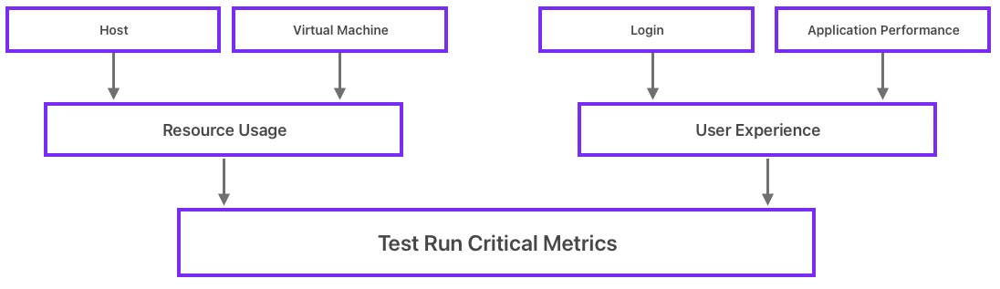
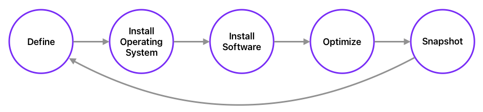
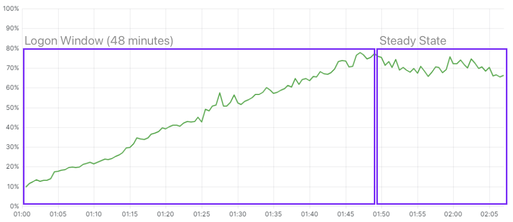

# Executive Summary

This document describes the End User Computing (EUC) performance benchmarking best practices. Where possible we have recommended tools and guides that we see as being fit for purpose however these tools will differ in various enterprise deployments. 

# Introduction

In this document, we describe the best practices for running EUC performance benchmark tests. At Nutanix, we run benchmark tests with EUC workloads for a number of reasons. 

First, we have to make sure that there is no regression with an EUC workload when you upgrade the Nutanix Cloud Infrastructure (NCI) to a newer version. 

We also run EUC benchmark tests to show the performance impact in various publications, like Reference Architectures, Nutanix Validated Designs, Technotes, and different online publications. 

And finally, we run these tests to validate the performance on different hardware platforms, with different CPU, memory and storage configurations. This helps us fine tune the Nutanix Sizer tool.

An important aspect of running performance benchmark tests is to get consistent results. Once you are able to get consistent results, you are able to define a baseline, once done you can change the infrastructure or configuration, run the same test, and then determine the impact of that change.

## Audience

This technote is part of the Nutanix Solutions Library and provides an overview of the recommendations for running EUC performance benchmark tests. 

## Purpose

This document covers End User Computing benchmarking guidelines and best practices.

## Document Version History

| **Version Number** | **Published** | **Notes** |
| :---: | --- | --- |
| 1.0 | January 2024 | Original publication. |

# Nutanix Platform Overview

Nutanix designed its software to give customers running workloads in a hybrid cloud environment the same experience they expect from on-premises Nutanix clusters. Because Nutanix in a hybrid multicloud environment runs AOS and AHV with the same CLI, UI, and APIs, existing IT processes and third-party integrations continue to work regardless of where they run.

Nutanix AOS can withstand hardware failures and software glitches and ensures that application availability and performance are never compromised. Combining features like native rack awareness with public cloud partition placement groups, Nutanix operates freely in a dynamic hybrid multicloud environment.

Nutanix's software will scale linearly allowing us to baseline a platform then scale that out by adding nodes to demonstrate no degradation in performance whilst adding more compute. 

# Why Run Performance Benchmark Tests for EUC?

The primary reason for running a performance benchmark test is to determine the baseline performance of the platform or to measure the impact of a change. Some examples of why you would run an EUC benchmark test are:

- Baseline the performance profile of the platform.
- Determine the impact of new software versions (AOS, AHV, Windows OS versions, Citrix VDA etc).
- Determine the impact of configuration changes (Group Policy, Profile configuration etc).

At Nutanix, we also run performance benchmark tests and use the results for:

- Publications like Reference Architecture documents, Nutanix Validated Design documents, Technotes or other online publications.
- Baseline new hardware platform releases, with newer CPU types, faster memory or storage configurations.
- To educate customers and our field teams, that use this information for sizing new EUC infrastructures.

# Benchmarking Tools

There a various benchmarking solutions that you can use to simulate an EUC workload. Keep the following guidelines in mind when selecting an EUC benchmarking solution:

- The tool must be able to simulate user behavior, like logging in to the virtual machines, starting applications, and opening, editing and saving documents with various applications. This is called a workload.
- It is preferable to be able to use applications in the simulated workload that are used by the user base in production, but it is more important to be able to have a repeatable workload that will have a consistent outcome.
- The benchmarking tool must be able to collect various metrics that can be used to compare multiple tests. 
- If the benchmarking tool does not provide the data you require, be sure to investigate gathering this information using other tools available to you.
- A central reporting tool and being able to compare results is critical. Without this capability you will not have the ability to compare results against one another.

Benchmarking tools can be broken into various categories, and it is important to define the tool set that you are going to use prior to designing and implementing your solution. This is critical to ensure consistency across the platform, that in turn is crucial for good results from the tests. 

Below are some examples of the high level benchmarking software categories.

| **Category** | **Description** | 
| :--- | :--- | 
| Workload Simulator | Software to simulate user workloads on the endpoints being tested | 
| Broker (optional) | The desktop broker platform used for delivery | 
| Image Deployment | Operating System and application deployment |
| Automation | Automation of the test execution |
| Data Collection | Ability to collect existing and additional test data | 
| Storage | Central repository to store test results | 
| Reporting | Central reporting console testing results | 

When defining and designing your environment for testing, the key point is that you have a repeatable and automated process. Having the test bed defined **exactly the same** for every test run is critical to ensure accurate results.

# Consistency

A good user experience is not only defined by how fast a logon is or how fast an application starts, **a good user experience is a consistent user experience**. 

For example, if a user is used to a logon time of 30 seconds every day, then the logon time increases to 60 seconds, they will most likely start complaining about a slow system. Whilst other users may always have a logon time of 60 seconds and be comfortable with it because "it's always like that". 

If the logon time is inconsistent each time the user logs on they will eventually get used to an inconsistent user experience, but will not happy about it and again most likely start to complain. 

In an EUC Benchmark test, you should see consistent logon times along with consistent application start and operation times. If the average logon time for the first 10 users is 20 seconds, then you should see a similar logon time for the last 10 users of the benchmark test.

<!---
James - if you can think how to re-word this that would be ace :)

There are two ways to look at the results of the user experience metrics. 

If you want to know at what point it's not realistic to add more users to the system (what is the maximum number of sessions for this system with this workload), you look at the difference in the numbers between the first and last users. If the logon time for the first 10 users is on average 20 seconds, you will see that these logon times start to increase gradually while more users are logged on to the system. At a certain point, the load on the system will reach a point where the logon time increases progressively. Just before that point is the point where you should not load more users. 

<---! Insert graph as example for increasing login times ---!>

Once you know how many sessions you should logon to the system without going over that tipping point, you could compare the average numbers as well. 

Let's say you run a benchmark test on a system and the average logon time is 20 seconds. You then install a security patch on the system and run the test again. Now the average logon time is 25 seconds. You now know the impact of that security patch on the logon times. 

When you plan to add nodes with a different CPU type to an EUC environment, logons and application starts could be different and users may notice when logging on to the old system one day, and logging on to the new system the next day. 

This can also be the case when using cloud infrastructure, where users could be on different CPU models at various moments in time. A consistent user experience is not guaranteed in such environments.

Again, **consistency** is key for EUC workloads, and your users will get used to and appreciate a stable, consistent user experience. -->

# Benchmarking Metrics

When benchmarking an EUC workload the key outcome is to know the baseline of your platform along with the performance difference after making changes to the environment. 

This is not easy to achieve with a benchmarking tool, as it is very difficult to simulate the real user workload of a production environment, however, what's key is having the knowledge to accurately report on software and hardware changes and how this will impact your user experience and density. 

The best way to determine the user density of a platform is to let users actually work on the system and then gradually add more users. This however, is a risky approach, as you may overload the environment and cause a negative user experience without knowledge of where the issue lies.

With the Nutanix Cloud Platform, you can start small and scale linearly by adding nodes to the cluster. But before you start base lining the platform it's important to understand the types of metrics you will be monitoring to measure system and user experience.

## Resource Usage Metrics

The following metrics relate to the system performance directly and need to be kept under certain thresholds in order for the platform to perform as expected.

### Host Metrics

The below are typical metrics required from a Nutanix host to ensure it is performing correctly.

| **Metric** | **Description** | **Good Result** |
| :--- | :--- | :--- |
| CPU usage | The current and average CPU usage | < 85% during steady state |
| Average CPU ready time | The CPU ready time | Less than 2% |
| Memory usage | The host memory usage |  Irrelevant, as we do not recommend to over commit memory |
| Storage controller IO | The host read, write IO  |  A typical read/write ratio for EUC workloads during steady state should be 20-30% reads / 70-80% writes |
| Storage controller latency | The Storage Controller Latency |  < 5ms |

### Virtual Machine Metrics

The below are typical metrics required from the Virtual Machine to ensure it is performing correctly. Good results with these metrics will largely depend on the type of workload you are testing, and acceptable levels should be agreed prior to running the benchmark.

| **Metric** | **Description** | 
| :--- | :--- | 
| CPU usage | The current and average CPU usage | 
| Memory usage | The memory usage  | 
| Display protocol CPU usage | The display protocol current and average CPU usage  | 
| Display protocol Frames per Second | The display protocol frames per second | 

## User Experience metrics

The following metrics relate to the user experience during the test.

### Login Time Metrics

The below are typical metrics required to measure the login times.

| **Metric** | **Description** | **Good Result** |
| :--- | :--- | :--- |
| Total login time | The total login time | < 30 secs |
| Profile load time | The time taken to load the user profile  | 0-20 sec. Depends on the profile technology, look for consistency |
| Connection time | The time to connect to the resource | 1-5 sec. Look for consistency |
| GPO load time | The time to process the group policies assigned | 1-5 sec. Depends on the number of policies, look for consistency |

### Application Performance Metrics

The below are typical metrics required to measure application performance during a test. Good results with these metrics will largely depend on the type of workload you are testing, and acceptable levels should be agreed prior to running the benchmark.

| **Metric** | **Description** | 
| :--- | :--- | 
| Application start times | The time taken to open up various applications | 
| Application open file times | The time taken to open a file | 
| Application save file times | The time to save a file |

# Setting Up Your Environment for Consistent Benchmark Testing

In this section we discuss the considerations for setting up the infrastructure to perform a benchmark test.

## Master Image

The master image is a critical step you will undertake when setting up your environment to run EUC benchmark tests, after all, it is this image that will be the basis for all of your user activity. Having a repeatable, consistent process here is paramount.

Consider the steps that are normally undertaken to build an EUC Master Image:

- Define the virtual machine specifications.
- Install the operating system.
- Install additional software.
- Optimize the image.
- Snapshot the image.

If this was only being done once, then a manual approach may be sufficient, however as you will be testing various hardware, software, and configuration changes there is a considerable chance that something will be done differently during image creation. Whilst that may not seem a huge problem, a single configuration difference can have a huge impact on the test and therefore the numbers you will see as a result of the test run.

Key things to consider when building a master image are:

- Automation. Ensure everything is a repeatable task.
- Run the same optimizations across all tests.
- Don't forget application optimizations, these can make a big difference in performance.
- Ensure all your testing team are using the same deployment method for building master images.
- Consider the use of containers to standardize on image deployment methods.

## Reboot Before Testing

Before you start a benchmark test, you should consider if you need to reboot components or not. For some components, it's important to start clean, with fresh memory and empty caches. This is especially important for the target machines, as it could cause big variations in test results. Another consideration is to tune the hypervisor connection from your chosen broker to allow for mass actions to take place (such as reboot) within a given time frame. Please refer to your broker documentation to read the current best practice guidelines.

You could argue that a reboot is important for the hypervisor as well, but in our experience, the impact is negligible, especially when you don't use a memory sharing technology on the hypervisor.

You can also reboot the client virtual machines used to start the user sessions (launchers) before each test. However, in some cases this can result in slower login times for the first user starting a session from that client. This will affect the average login times and is something to be mindful of.

## Clients (Launchers)

There are two methods of initiating a user session on the target VMs. 

- Direct to the console.
- Via a remoting protocol.

Connecting via a remoting protocol has the advantage of simulating the use of a display protocol which has an impact on the resource usage of the target VM. If this approach is taken you need clients (physical or virtual) that connect using a display protocol and optionally a broker to distribute the session requests from the clients. 

When you use clients to initiate the sessions, it's important to configure these clients with the same specifications. Examples of these configuration options are.

- Screen resolution. 
- Display protocol settings. 
- Offload settings like video and audio.

## Logon Window

The Logon Window is the time to login all the sessions defined withing the test parameters. Another definition that is used is Logon rate, which defines the number of logons per second or minute. 

The logon phase during a benchmark test is often the most resource intensive phase. If the logon window is too short, you will most likely run into CPU contention on the system. 

In our tests, we always use a logon window of 48 minutes, no matter how many sessions we configure. The thought behind this is, if we configure more sessions to logon, the node or cluster should be able to handle more sessions as well. If a node is capable of logging on 100 sessions on 1 node in 48 minutes, a 4 node cluster of the same type should be able to log on 400 sessions in 48 minutes.

## BIOS settings

Modern CPUs utilize a technology called "C-States" to manage the amount of power that individual processor cores are utilizing.  When a core is idle, the server's BIOS will reduce its clock rate, power draw, or both in an effort to make the system more energy efficient.  In most cases, this is the desired condition as it can significantly reduce power consumption. The unused power may be used by other CPU cores to increase their frequency (GHz), allowing instructions executing on active CPU cores to complete faster.

For EUC workloads, this is not a desired behavior. As described earlier, a consistent user experience is very important. When this kind of "power throttling" technologies are enabled, users can experience inconsistent performance. Therefore, it's best to disable c-states to make sure the processors are always running at the same speed. 

In most server brands, setting the BIOS to "**(Static) High Performance**" will also disable processor c-states.

<note>
Do not change Power Management Configuration settings in the BIOS for Nutanix NX hardware. Nutanix does not support custom power management configurations, and changing the power management settings in the BIOS can cause unpredictable behavior. The Nutanix BIOS contains optimized power management settings by default.
</note>

## Persistent vs Non-Persistent

Unless testing a profile solution where the profiles are saved to a file share then the difference between testing persistent and non-persistent workloads needs to be catered for in the reporting of the benchmark test.

### Persistent 

A persistent workload is one that retains all the user settings at logoff. Therefore, any changes the user makes to an application configuration or environment setting are retained and the next time they log in those changes "persist"

### Non-Persistent

A non-persistent workload is one that will not retain any settings at logoff unless specifically catered for by an external profile solution. In this case any changes that the user makes during their session will be discarded at logoff and the next time they log in they will be treated as a new user on the platform.

Looking at the above definitions it's important to note that if you are testing with persistent workloads and performing multiple runs of the same test you will see differences in the logon and user experience metrics from the second run onwards. This is because when the user logs on for the first time their profile is created and set up, this takes a little more time than just loading the profile. From run 2 onwards the profile already exists as the workload is persistent and will therefore reflect this in the metrics being pulled back from the platform resulting in faster logons.

Compare this to a non-persistent workload where the user profile is created as a "new user" at every logon and will therefore have a more stable user experience metric base but may not show the fastest login times available.

With regard to performance benchmarking as we are looking at getting the most consistent experience possible to show the differences between configuration changes it is recommended to use non-persistent workloads when validating baseline platform metrics.

## Local vs Roaming vs Containerized Profiles

The profile type will have an impact on the test data and additional considerations need to be put in place when testing for this. Details of this can be seen below.

### Local Profiles

 - No profile retention unless testing a persistent workload.
 - All IO on the workload cluster.
 - CPU Load on the workload cluster.
 - No reason to worry about profile size.

### File Based Profiles

 - Profile retention using external file share.
 - IO on workload cluster higher during logon.
 - CPU load on the workload cluster.
 - Profile size needs to be managed via exclusions.
 - File server performance considerations.
  
### Container Based Profiles

 - Profile retention using external file share.
 - IO split between workload and file server cluster dependent on configuration.
 - CPU load split between workload and file server cluster dependent on configuration.
 - Profile size less relevant.
 - File server performance considerations.

Optimizing your profile solutions can have a huge impact on the performance baselines so be sure to pay special attention to the configuration of the profile infrastructure prior to running benchmark tests.

## Optimizations

Operating System optimizations have a huge impact on system performance when dealing with EUC workloads. 

The Problem: "**Windows is full of bloat!**"

Windows can be deployed on thousands of different devices to perform thousands of different tasks. Bloat makes sense here as Microsoft need to cover all the bases to make it work for the consumer across many scenarios. However, in an EUC deployment, many functions of Windows do not make sense. 

Some of these are:

- Windows Updates.
- The XBox Application.
- Wi-Fi Services.

These are just a few examples of the many settings that can be safely disabled on a Windows Server or Windows Desktop operating system before benchmarking the platform. All these services, processes or applications use up precious CPU cycles or memory, therefore decreasing the performance and number of users we can fit onto the platform.

Optimizing an image is a balancing act. You should be looking to disable everything that will not be required to get the best performance, but not be so aggressive that they render the virtual desktop useless. There are various tools available to optimize your master images, ensure you use the tool that's most relevant for your environment.

# Conclusion

- Consistency is paramount when running benchmark tests for EUC. Ensuring that the test conditions are exactly the same for each configuration change is critical for obtaining accurate and reliable results.
- Optimizing your master images can have a big impact on the test outcome and user density with non optimized images using unnecessary resource.
- When designing your workload to test with be sure to mirror production as closely as possible to ensure the results reflect what your users will be experiencing.
- Being able to directly compare (overlay) results is paramount. Having the ability to easily see the performance changes will ensure you know what impact the configuration changes are having in your environment.
- Data retention needs validating. Running EUC benchmark tests can produce a lot of data, keeping this for historical reasons is a valid approach, but the dataset sizes will need to be considered.
- When running benchmark tests be sure to compare all 3 phases of the test (boot storm, logon window and steady state) to get the best possible results.

# References
[End User Computing Performance Analysis](https://portal.nutanix.com/page/documents/solutions/details?targetId=TN-2113-Windows-10-Performance-Impact:TN-2113-Windows-10-Performance-Impact)

[Nutanix BMC and BIOS Overview](https://portal.nutanix.com/page/documents/details?targetId=Release-Notes-BMC-BIOS:Nutanix%20BMC%20and%20BIOS%20Overview)