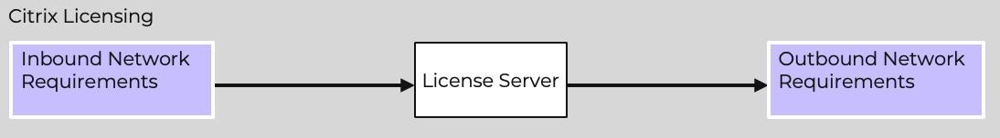

# Building a Secure Citrix Desktop and Application Delivery Solution

A secure Citrix platform is crucial for protecting sensitive business data, ensuring compliance, and maintaining uninterrupted access to critical applications and resources. 

As Citrix environments often serve as the gateway for remote access, they are prime targets for cyber attacks. A breach can lead to unauthorized access, data theft, or disruptions in service, potentially causing significant financial and reputational damage. 

Ensuring the security of a Citrix platform involves implementing strong authentication methods, regular patching, encryption, and network segmentation to safeguard against threats.

This best practice guide covers implementing network segmentation with Nutanix Flow Network Security.

Typically Citrix platforms can be broken down into individual components as described earlier in this guide. The most common components for a Citrix platform are:

- Citrix Licensing
- Citrix StoreFront
- Citrix Delivery Controllers (on-premises deployments)
- Citrix Cloud Connectors (Citrix Cloud deployments)
- Microsoft SQL Server (on-premises deployments)
- Microsoft Active Directory
- Citrix Director
- Citrix Federated Authentication
- Citrix Workspace Environment Management
- Citrix Session Recording
- Citrix Provisioning (formerly Provisioning Services)
- Citrix Virtual Desktop Agents

Each of these components have unique requirements for incoming and outgoing network traffic. In a typical deployment you may use a windows firewall to block certain traffic inbound to the virtual machine, however, little consideration is given to the outbound traffic.

Details for the component network services required to operate correctly can be found in the [Communication Ports Used by Citrix Technologies Guide](https://community.citrix.com/tech-zone/build/tech-papers/citrix-communication-ports). A good knowledge of this and the networking requirements is critical before attempting to implement network segmentation as a misconfiguration could severely effect the operational capacity of your platform.

Looking at one of the components of a Citrix platform (Citrix Licensing) shows that there are 3 requirements needed to define security policies.

| Requirement | Description | 
| :---: | --- | 
| Inbound | Ports and Protocols required inbound for the component to operate. | 
| Component | The virtual machines servicing the component. | 
| Outbound | Ports and Protocols required outbound for the component to operate. | 

Each requirement should be documented prior to deploying microsegmentation in order to have the best chance of success when enforcing the policy.

Security Policy Monitor Mode
: Flow Network Security policies have a monitor mode. This is detailed later in this guide but can greatly assist before enforcing the security policy. Monitor mode will not block inbound or outbound traffic not defined by a specific rule but will rather flag it in the console for inspection, allowing you to explicitly allow or deny the traffic prior to enforcing the policy.