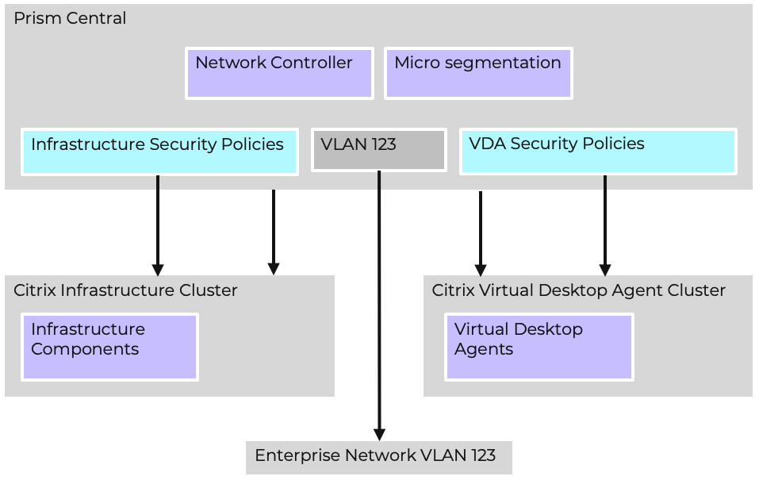

# Example Configuration

Looking at the above diagram it can be determined that the following is true of this deployment.

- Prism Central is deployed and operational within the environment
- The Network Controller is running on Prism Central
- Microsegmentation is enabled on Prism Central
- VLAN 123 is defined as a VLAN backed advanced network within Prism Central
- There is a Nutanix AHV Citrix Infrastructure Cluster deployed running the Citrix Infrastructure components
- There is a Citrix Virtual Desktop Agent cluster deployed running the Citrix VDAs
- There are secirity policies deplined within Prism Central to manage the network traffic to and from the VDAs
- There are one or more security policies defined within Prism Central to manage the network traffic to and from the individual Citrix Infrastructure components
- VLAN 123 defined in Prism Central is backed by the enterprise network on the same VLAN

The above deployment was used for the remainder of this best practice guide for performance validation of Flow Network Security within a Citrix environment.

Flow Network Security offers the ability to define a [VDI Policy](https://portal.nutanix.com/page/documents/details?targetId=Nutanix-Flow-Network-Security-Guide-v4_0_0:fns-vdi-rule-configuration-c.html) that allows secutiry rules to be based on a users active directory group rather than a category. This approach was not used in this guide with Application Policies being the prefered approach.