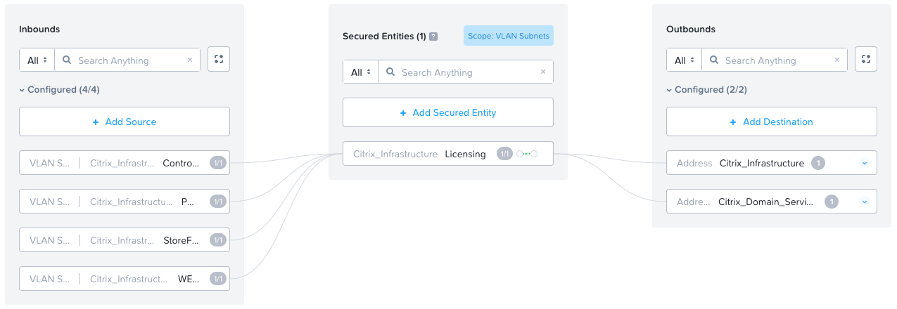
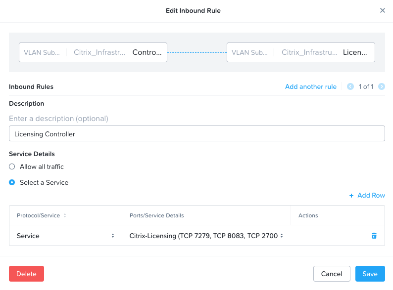
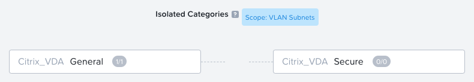
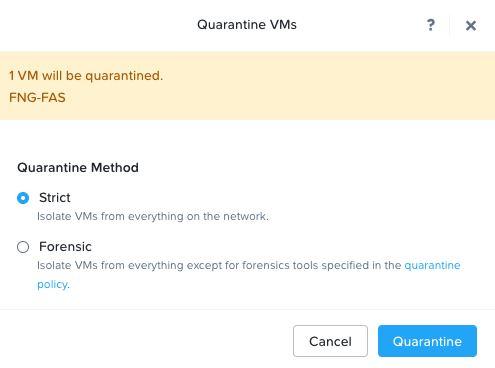

# Creating Flow Network Security Policies

Full details on the mechanics of creating a Flow Network Security Application Policy can be found [here](https://portal.nutanix.com/page/documents/details?targetId=Nutanix-Flow-Network-Security-Guide-v4_0_0:fns-security-policy-configuration-c.html). This guide will detail the steps required to create and apply the policies needed to secure your Citrix platform.

## Categories

Create the required categories in Prism Central so that you can group your virtual machines into components that you wish to secure. In this guide the following categories were created:

- Citrix_Infrastructure
  - Cloud Connectors
  - Controllers
  - FAS
  - Licensing
  - PVS
  - Session Recording
  - SQL
  - StoreFront
  - WEM
- Citrix_VDA
  - General
  - Secure

2 main categore names were used for Citrix Infrastructure and Citrix VDAs then values for each component were assigned to the top level categories in order to be able to be granular with policy application.

Ensure that you have assigned the applicable category to the relevant virtual machine prior to designing your policies. Whilst this is a manual process, this can become tiresome with Citrix MCS or PVS delivered virtual machines as there is no built in workflow to assign a catory at build. Nutanix has a solution to this with Playbooks (detailed in the appendix) of how you can automate the application of categories during virtual machine instantiation.

## Addresses

Create recognisable addresses for known networks that the Citrix platform will communicate with. This allows in and outbound rules to be tied to an applicable network when required.

An example of these can be found in the table below.

| Name | Description | Subnet Details |
| :---: | --- | --- |
| Domain Services | Citrix Relevant Domain Controllers | 10.20.30.1-4 |
| VLAN 123 | Citrix VLAN - Infrastructure | 10.20.40.0/24 |
| VLAN 124 | Finance Application Network | 10.20.50.0/24 |

## Services

Create easy to identify services to allow you to group ports and protocols together in order for easy rule creation.

A Service Example can be found in the table below.

| Service Name | Protocol | Port |
| :---: | --- | --- |
| Citrix WEM | TCP | 8284 |
| Citrix WEM | TCP | 8285 |
| Citrix WEM | TCP | 8286 |
| Citrix WEM | TCP | 8287 |
| Citrix WEM | TCP | 8288 |

## Application Policies

Create a Security Policy for each component defined earlier adding the relevant rules for the entity being secured (via the category) and all inbound and outbound traffic rules required.

When defining the policy be sure to select "Secure Entities" and "Generic Policy", then "VLAN Subnets" and enable "Hit Logs".

An example Application Policy can be seen below.

Save the policy and put it in "Monitor Mode".

### Monitor Mode

When a policy is in monitor mode it will not actively block traffic inbound or outbound from the secured entity, it will however log this and show it in the console (shown below). This gives the ability to edit and update the security policy rules prior to enforcing them and actually blocking traffic, giving a greater confidence that the security policy will not break platform operations.

### Enforce Mode

Select this mode when you want to apply the security policy on the application. When the policy is Enforce state, the application receives and transmits traffic only from/to the allowed sources and destinations. The policy blocks the traffic from entities that are not defined as sources.

NOTE: do this only when happy with the monitor mode and traffic rules

## Isolation Policy

An isolation environment identifies two groups of VMs by category, and it blocks communications between the groups.

In the case of a Citrix Desktop and Application Deployment you may wish to isolate the general purpose VDAs from communicating with the Secure VDAs all together. This will ensure that the Secure VDAs remain secure and cannot be laterally moved to should an attacker break into one of the general purpose VDAs.

As with Application Policies, Isolation Policies can be put into Monitor Mode initially to ensure that no desired traffic is being sent between the 2 virtual machines prior to enforcing the policy.

## Quarentine Policy

Prism Central has system-defined quarantine policies that enable you to perform the following tasks:

Completely isolate an infected VM that must not have any traffic associated with it.
Isolate an infected VM but specify a set of forensic tools that can communicate with the VM.
The system-defined quarantine policies are created for All VLANs and VPCs.

The system-defined VLAN specific quarantine policies are:

Quarantine Forensic Policy - VLAN Subnets 
Quarantine Strict Policy - VLAN Subnets 

Note: You cannot create or delete a quarantine policy. However, you can modify existing (system-defined) quarantine policy.

You are able to update your Quarentine policies to allow inbound tools to communicate with the VM in the event of an attack and then quarentine a VM from the prism central menu for the virtual machine and select strict or forensic.

