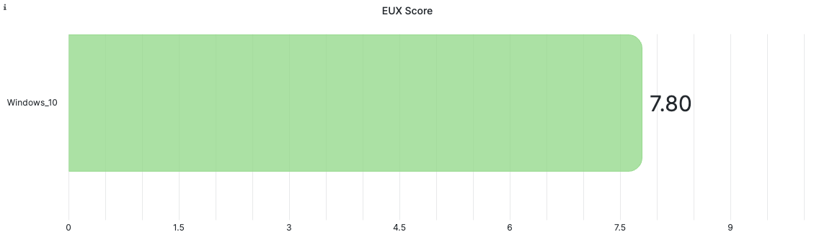
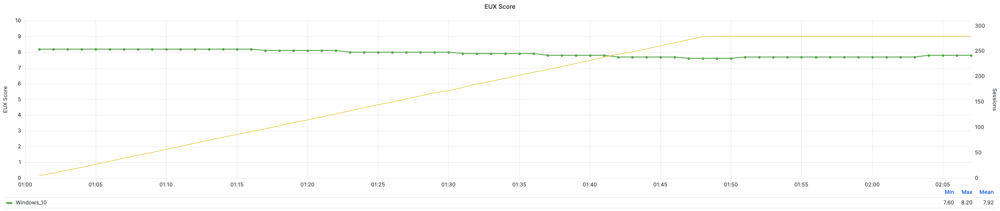

# Benchmarking and Test Environment

## Login Enterprise

[Login VSI](http://www.loginvsi.com/) provides the industry-standard virtual desktop testing platform, Login Enterprise. It's designed to help organizations benchmark and validate the performance and scalability of their virtual desktop solutions. With Login Enterprise, IT teams can reliably measure the impact of changes to their virtual desktop infrastructure on end-user experience and identify performance issues before they impact the business. Login Enterprise uses synthetic user workloads to simulate real-world user behavior, so IT teams can measure the responsiveness and performance of their virtual desktop environment under different scenarios. Login Enterprise comes with two built-in workloads: The [task worker](https://support.loginvsi.com/hc/en-us/articles/6949195003932-Task-Worker-Out-of-the-box) and [knowledge worker](https://support.loginvsi.com/hc/en-us/articles/6949191203740-Knowledge-Worker-Out-of-the-box). 

<note>
You can't compare either of the Login Enterprise workloads to the workloads included in the previous edition of Login VSI.
</note>

The following table includes both workloads available in Login Enterprise.

_Table: Login Enterprise Workloads_

| **Task Worker** | **Knowledge Worker** |
| --- | --- | 
| Light | Medium | 
| 2 vCPU | 2-4 vCPU |
| 2-3 apps | 4-6 apps |
| No video | 720p video |

### Login Enterprise EUX Score

According to [Login Enterprise documentation](https://support.loginvsi.com/hc/en-us/articles/4408717958162-Login-Enterprise-EUX-Score-), the EUX (End User Experience) score represents the performance of any Windows machine (virtual, physical, cloud, or on-premises). The score ranges from 0 to 10 and is based on the experience of one (minimum) or many users.

<note>
As you add more users to your VDI platform, expect your EUX score to drop. As more users demand a greater share of a VDI system’s shared resources, performance and user experience decrease.
</note>

We grade EUX scores internally as shown by the below table and will be displayed via a bar chart as shown below.

| **EUX Score** | **Grade** |
| --- | --- | 
| 1-5 | Bad | 
| 5-6 | Poor |
| 6-7 | Average |
| 7-8 | Good |
| 8-10 | Excellent |

### Login Enterprise VSImax

For our test results, we used the 2023 EUX Score's version of VSImax. In this version, the VSImax (or the maximum number of users) is determined by a number of triggers. These triggers are CPU- and disk-related operations and can determine if the user experience is acceptable or not. Another trigger is when the EUX score is below 5.5. 

We found that we could use this version of the VSImax to do an A/B comparison, but the VSImax on its own doesn't represent the maximum user density accurately. For a more realistic maximum number of users, we suggest using the number of active users at the moment when the EUX score is 85 to 90 percent of the initial EUX score.

### Login Enterprise Metrics

We quantified the evaluation using the following metrics:

- EUXbase: The average EUX score of the first five minutes.
- EUX score: The average EUX score for the entire test.
- Steady State Score: The average EUX score 5 minutes after the final login.
- Average logon time: The average user logon time.
- VSImax: If reached, the maximum value of sessions launched before the VSI Index Average reaches one of the thresholds.
- Maximum CPU usage: The maximum observed CPU usage during the test.
- CPU usage during steady state: The average CPU usage during the steady state, or the state when all the sessions are active and using applications. This state simulates user activity during the entire day, rather than just during the logon period.

<note>
Ideal CPU usage during steady state  < 85%
</note>

The Baseline and Steady State EUX Scores provide additional dimensions to the experience your virtual users are having. The Standard EUX Score provides a single score for the duration of the entire test, including the login period and the application interaction period during the test run. As more users are steadily added to the system being tested, naturally the system will work harder and start to impact the user experience. The Steady State and Baseline EUX Scores show us what the user experience is like during specific periods of the test run.

Baseline EUX Score
: The Baseline EUX Score represents the best possible performance of the system and is the average EUX score of the best 5 minutes of the test. This score gives an indication of how system performs when it is not under stress. Typically, the Baseline Score is captured in the beginning of the test before the system is fully loaded.

Steady State EUX Score
: The Steady State period represents the time after all users have logged (login storm) and the system has begun to normalize. The Steady State EUX Score is the average of the EUX Scores captured 5 minutes after all sessions are logged in, until the end of the test.

### Login Enterprise Graph

The Login Enterprise graph shows the values obtained during the launch for each desktop session. The following figure is an example graph of the test data. The y-axis on the left side measures the EUX score, the y-axis on the right side measures the number of active sessions, and the x-axis represents the test duration in minutes. We configured our benchmark test to sign in all sessions in 48 minutes, followed by a steady state of 10 minutes.

## Test Environment

In this section you can read about the hardware we used for this reference architecture.

### Management Infrastructure Cluster

We used one Nutanix NX-3060-G7 cluster with four nodes to host all infrastructure and Citrix services and the Login Enterprise appliance. Active Directory services, DNS, DHCP, and the SQL Server also ran inside this cluster, which we designated the management infrastructure cluster. With four nodes we had enough resources available to host these servers. The following table shows the Citrix configuration.

_Table: Citrix Configuration_

| VM | Quantity | vCPU | Memory | Disks |
| --- | :---: | :---: | :---: | :---: |
| Delivery Controllers | 2 | 4 | 8 GB | 1 × 60 GB (OS) |
| StoreFront | 1 | 2 | 4 GB | 1 × 60 GB (OS) |
| SQL | 1 | 4 | 8 GB | 3 × 60 GB (OS, DATA, logs) |

### Login Enterprise Launcher Cluster

To initiate the sessions to the virtual desktops, Login Enterprise uses launcher VMs. Depending on the display protocol used, one launcher VM can host up to 25 sessions. For this reference architecture, we used one Nutanix NX-3060-G7 cluster with four nodes to host 75 launcher VMs. Each launcher VM had 4 vCPU and 6 GB of memory.

### Virtual Server Cluster

Eight Nutanix NX-3170-G8 nodes formed the cluster to host all virtual desktops. The next tables contain the specifications of this cluster.

_Table: Virtual Desktop Cluster Specifications_

| Parameter | Setting |
| --- | --- |
| Block type | Nutanix NX-3170-G8 |
| Number of blocks | 8 |
| Number of nodes | 8 |
| CPU type | Intel Xeon Gold 6342 |
| Number of CPUs per node | 2 |
| Number of cores per CPU | 24 |
| Memory per node | 1,536 GB |
| Disk config per node | 6 × 1.9 TB SSD |
| Network | 2 × 25 GbE |

_Table: Nutanix Software Specifications_

| Parameter | Setting | 
| --- | --- |
| Nutanix AOS version | 6.5.1.8 |
| CVM vCPU | 12 |
| CVM memory | 32 GB |
| Redundancy factor | 2 |
| Number of datastores for desktop VMs | 1 |
| Datastore specifications | Compression: On; Compression delay: 0; Deduplication: Off |

_Table: VMware Software Specifications_

| Parameter | Setting | 
| --- | --- |
| Number of vCenter servers | 1 |
| vCenter version | 7.0 U3 |
| Number of vSphere clusters | 1 |
| Number of vSphere ESXi hosts | 8 |
| vSphere ESXi version | 7.0 U3 |
| vSphere DRS configuration | Fully automated (priority 1 and 2 recommendations) |
| vSphere High Availability configuration | On |
| Side-Channel-Aware scheduler configuration | Disabled |

_Table: Citrix Software Specifications_ 

| Parameter | Setting |
| --- | --- |
| Citrix Virtual Apps and Desktops version | 7.2203 CU2 |
| Provisioning Services version | 7.2203 CU2 |

_Table: Windows Server Template Image Configuration_ 
UPDATE HERE
| Parameter | Setting |
| --- | --- |
| Operating system | Windows Server 2022 22H2 (x64) |
| Windows updates | 12/13/22 |
| CPU | 8 vCPU |
| Memory | 42 GB |
| NICs | 1 |
| Virtual network adapter | VMXNet3 Adapter |
| Virtual SCSI controller 0 | LSI Logic |
| Virtual disk VMDK1 | 80 GB |
| Virtual CD/DVD drive 1 | Client |
| Applications | Adobe Acrobat DC, Microsoft Edge Browser, Microsoft Office 2019 (x64) |
| Citrix Virtual Desktop Agent | 7.2203 CU2 |
| Citrix Provisioning Services Target Device | 7.2203 CU2 |
| FSlogix (tests with Nutanix Files only) | 2.9.8440.42104 |
| Optimizations | Citrix Optimizer; custom optimizations to the default user profile |