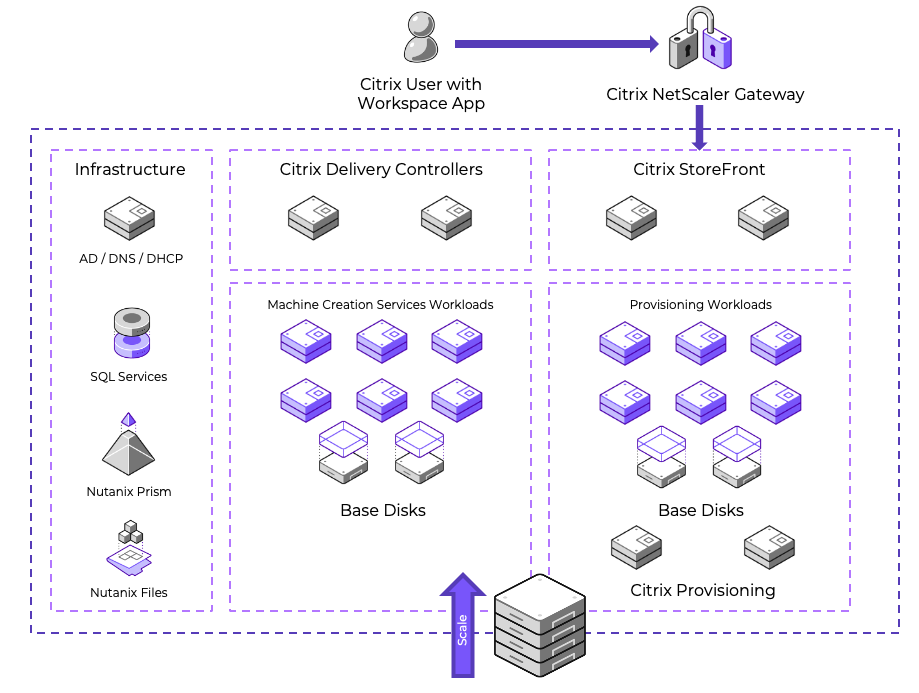

# Virtual Apps and Desktops on Nutanix

The Nutanix modular web-scale architecture lets you start small and expand to meet increasing demand (a node, a block, or multiple blocks at a time) with no impact on performance. This design removes the hurdle of a large initial infrastructure purchase, decreasing the time to value for your Virtual Apps and Desktops implementation. Running Citrix Virtual Apps and Desktops on Nutanix enables you to run multiple workloads, all on the same scalable converged infrastructure, while achieving these benefits:

Modular incremental scale

: With the Nutanix solution you can start small and scale up. A single Nutanix block provides dozens of terabytes of storage and hundreds to thousands of virtual desktops in a compact footprint. Given the modularity of the solution, you can granularly scale by node, by block, or with multiple blocks, accurately matching supply with demand and minimizing the upfront capex.

High performance

: By using system memory caching for read I/O and flash storage for read and write I/O, you can deliver high-performance throughput in a compact form factor. 

Change management

: Maintain environmental control and separation between development, test, staging, and production environments. Snapshots and fast clones can help share production data with nonproduction jobs without requiring full copies and unnecessary data duplication.

Business continuity and data protection

: User data and desktops are mission-critical and need enterprise-grade data management features, including backup and disaster recovery. 

Data efficiency

: AOS distributed storage offers both compression and deduplication to help reduce the storage footprint. The compression functionality is truly VM-centric. Unlike traditional solutions that perform compression mainly at the LUN level, the Nutanix solution provides all these capabilities at the VM and file levels, greatly increasing efficiency and simplicity. These capabilities ensure the highest possible compression and decompression performance, even below the block level. By providing both inline and post-process compression capabilities, the Nutanix solution breaks the bounds set by traditional compression solutions.

Enterprise-grade cluster management

: A simplified and intuitive approach to managing large clusters, including a converged GUI that serves as a central point for servers and storage, alert notifications, and the bonjour mechanism that automatically detects new nodes in the cluster. As a result, you can spend time enhancing your environment rather than maintaining it.

High-density architecture

: Nutanix uses an advanced server architecture that, using the NX-3000 series as an example, can house eight Intel CPUs (up to 160 cores) and up to 6 TB of memory in a single 2RU appliance. Coupled with data archiving and compression, Nutanix can make the desktop hardware footprint five times smaller.

Time-sliced clusters

: Like public cloud environments, Nutanix can provide a truly converged cloud infrastructure, allowing you to run your server and desktop virtualization on a single cloud. Get the efficiency and savings you require with a converged cloud on a truly unified architecture.

## Virtual Apps and Desktops on VMware vSphere with Nutanix AOS
The following figure shows the main architectural components of the Citrix Virtual Apps and Desktops on Nutanix solution and the communication path between services. 
 

## Pod Design
The next table contains highlights from a high-level snapshot of the Citrix Virtual Apps and Desktops on Nutanix hosted virtual desktop pod.

| Pod Purpose | Item | Quantity |
| --- | --- | --- |
| Control Pod | Delivery Controllers | 2 |
| Control Pod | StoreFront servers | 2 |
| Services Pod | vSphere hosts | up to 32 |
| Services Pod | Nutanix clusters | 1 |
| Services Pod | datastores | 1 |
| Services Pod | desktops | up to 7,360 |

You can have a maximum of 32 vSphere host nodes per cluster. We validated Citrix Virtual Apps and Desktops with Windows desktop VDAs, using 3 vCPUs and 4 GB of memory per VM and 230 VMs per node. When you use 32 vSphere host nodes, you can run up to 7,360 Windows desktop VDAs per Nutanix vSphere cluster. If you change the vCPU count or memory, the number of Windows VDAs per node and per cluster change as well.  While testing we saw an AOS NFS metadata size overshoot alert for the datastore and while everything performed as it should, we recommend breaking up one larger datastore into smaller failure domains.  For smaller failure domains consider having 1,000 VMs per datastore.

## Nutanix Compute and Storage

Nutanix provides an ideal combination of high-performance compute and localized storage to meet any demand. True to this capability, this reference architecture contains no reconfiguration or customization of the Nutanix product to optimize for this use case. The following figure shows a high-level example of the relationship between the Nutanix storage pool and containers.
 

The following table details the Nutanix storage pool and container configuration.

| Name | Role | Details |
| --- | --- | --- |
| SP01 | Main storage pool for all data | SSD + HDD |
| VDI | Container for all VMs | vSphere datastore |
| Default-Container | Container for all data (not used here) | vSphere datastore |
