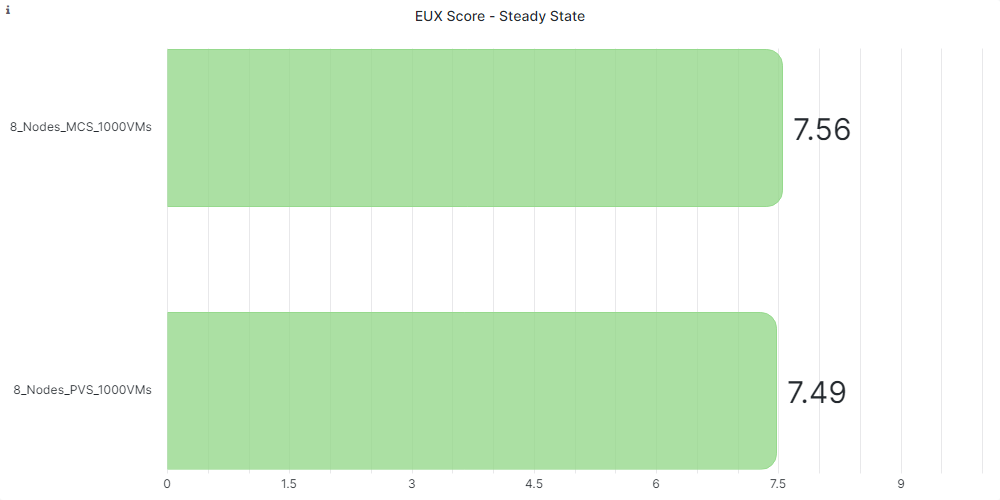
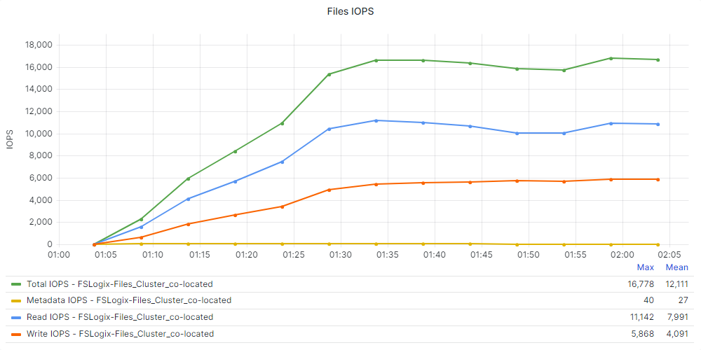
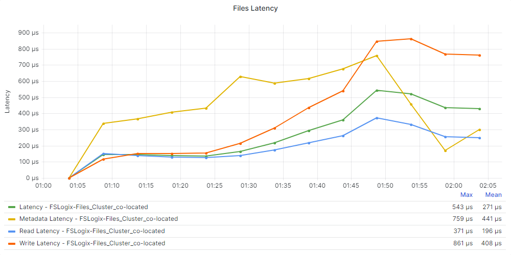

# Test Validation

Below you will find the detail and results of the performance testing completed for Citrix Virtual Apps and Desktops for the Windows Desktop Operating System on vSphere. Each test scenario was run a minimum of 3 times to ensure accuracy.

## Test Objectives
The overall objective was to determine the session capacity we could host on Nutanix using a Windows 10, version 22H2 image and running the Login Enterprise tests with Citrix Virtual Apps and Desktops. We tested with the Login Enterprise knowledge worker profiles.

Our specific objectives were to:

- Determine the time to provision 1,380 desktops on six nodes.
- Determine the maximum number of sessions we can host on this system.
- Determine the maximum number of sessions we can host on this system with the Power Worker workload.
- Determine the maximum number of sessions we can host in a steady-state situation with the CPU usage below its maximum of 80 percent.
- Show the linear scalability of the Nutanix platform.
- Determine the impact of adding Nutanix Files to the Nutanix cluster and using it to store the user’s FSLogix Profile Container.
- Show the differences between MCS and PVS on the Nutanix platform.

## Considerations for Test Results

- We used Citrix MCS to deploy the Windows 10 desktops to validate linear scalability and FSLogix.
- We used Windows 10, version 22H2 to test the infrastructure with Login Enterprise.
- We didn’t enable the Side-Channel-Aware scheduler in VMware vSphere ESXi, and the mitigation for CVE-2018-12207 is disabled by default on ESXi. Enabling these mitigations on the hypervisor affects the performance of VDI- and RDSH-based workloads.
- We tested using a single, full-HD screen as the client and limited the frames per second (FPS) to 16. Using multiple screens or other screen resolution settings affects the results.

## Boot Storm Simulation

The following section will show the performance details during a boot storm simulation test.

### Machine Creation Services - 8 Nodes

Test Run Detail: 8 nodes with 1120 VMs (140 VMs per node)

| Hosting Connection Setting | Detail | 
| --- | --- |
| Simultaneous Actions (Absolute) | 100 |
| Simultaneous Actions (Percentage) | 40 % |
| Max New Actions per Minute (Absolute) | 50 |

### Provisioning Services - 8 Nodes

Test Run Detail: 8 nodes with 1120 VMs (140 VMs per node)

| Hosting Connection Setting | Detail | 
| --- | --- |
| Simultaneous Actions (Absolute) | 100 |
| Simultaneous Actions (Percentage) | 40 % |
| Max New Actions per Minute (Absolute) | 50 |

### Boot Storm Comparison

Below you can see the comparison between MCS and PVS with regard to the boot storm simulation test.

## Linear scalability

The following graphs will show the linear scalability detail for the test runs. The tests were performed with 1, 2, 4, 6 and 8 nodes to ensure accuracy.

### EUX Scores

The following 2 charts detail the EUX Scores during the entire test

### Steady State Scores

The following 2 chart details the EUX Score during the steady state

### Logon Time Scores

The following graphs will show the linear scalability detail for login performance over the test runs. The tests were performed with 1, 2, 4, 6 and 8 nodes to ensure accuracy.

### Application Performance

The following table shows the linear scalability detail for application performance over the test runs. The tests were performed with 1, 2, 4, 6 and 8 nodes to ensure accuracy.

| Application Name (Start Time - Seconds) | 1 Node | 2 Node | 4 Node | 6 Node | 8 Node | 
| --- | --- | --- | --- | --- | --- |
| Outlook | 4.45 | 4.60 | 4.82 | 4.95 | 5.18 |
| Word | 1.10 | 1.10 | 1.10 | 1.14 | 1.15 |
| Excel | 1.54 | 1.61 | 1.68 | 1.73 | 1.77 |
| Powerpoint | 1.39 | 1.43 | 1.47 | 1.52 | 1.54 |

| Application Name (Action - Seconds) | 1 Node | 2 Node | 4 Node | 6 Node | 8 Node | 
| --- | --- | --- | --- | --- | --- |
| Microsoft Edge (Logon) | 0.19 | 0.19 | 0.19 | 0.20 | 0.20 |
| Microsoft Word (Open Doc) | 1.26 | 1.27 | 1.29 | 1.33 | 1.34 |
| Microsoft Excel (Save File) | 0.64 | 0.63 | 0.62 | 0.62 | 0.61 |
  
## MCS vs PVS

Test Run Detail: 8 nodes with 1120 VMs (140 VMs per node) for both MCS and PVS.

| Hosting Connection Setting | Detail | 
| --- | --- |
| Simultaneous Actions (Absolute) | 100 |
| Simultaneous Actions (Percentage) | 40 % |
| Max New Actions per Minute (Absolute) | 50 |

| Application Name (Start Time - Seconds) | MCS | PVS | 
| --- | --- | --- | 
| Outlook | 5.18 | 3.18 | 
| Word | 1.15 | 0.80 | 
| Excel | 1.77 | 1.38 |
| Powerpoint | 1.54 | 1.10 | 

| Application Name (Action - Seconds) | MCS | PVS | 
| --- | --- | --- | 
| Microsoft Edge (Logon) | 0.20 | 0.10 |
| Microsoft Word (Open Doc) | 1.30 | 1.00 | 
| Microsoft Excel (Save File) | 0.61 | 0.44 | 

## FSLogix (Nutanix Files co-located) vs FSLogix (Nutanix Files dedicated)

Test Run Detail: 8 nodes with 1120 VMs (140 VMs per node) FSLogix Profile exists on file server already (not first login).

| Hosting Connection Setting | Detail | 
| --- | --- |
| Simultaneous Actions (Absolute) | 100 |
| Simultaneous Actions (Percentage) | 40 % |
| Max New Actions per Minute (Absolute) | 50 |

| Nutanix Files Setting | Detail | 
| --- | --- |
| Version | 4.2.1.1 |
| Cluster size | 3 VMs |
| vCPUs per VM | 4 |
| Memory per VM | 12 GB |

| FSLogix Setting | Detail | 
| --- | --- |
| Version | 2.9.8440.42104 |
| Configuration | Profile & Office Container |

### Nutanix Files Hosted on the Desktops Cluster (co-located)
In this scenario, we configured the user’s profile to use an FSLogix Profile Container stored on a Nutanix Files share. One of the advantages of FSLogix is that you can store the user’s profile in a VHD or VHDX file. This file is stored on a network share (in our case a share hosted on Nutanix Files) and mounted at user logon. This method can improve logon times and provide advantages for disaster recovery scenarios.

For this test, users had an existing profile stored in an FSLogix container, and we hosted Nutanix Files on the same Nutanix cluster as the desktops. Because this setup affects the overall CPU usage of the cluster nodes, we decreased the number of sessions to 1,000.

### Nutanix Files Hosted on the Infrastructure Cluster (dedicated)
In this scenario, we also used FSLogix Profile Containers for the user profiles and stored them on a Nutanix Files share. This time, we hosted Nutanix Files on the infrastructure cluster. This setup doesn’t affect the overall CPU usage of the cluster nodes hosting the virtual desktops.

### FSLogix Performance Comparison

