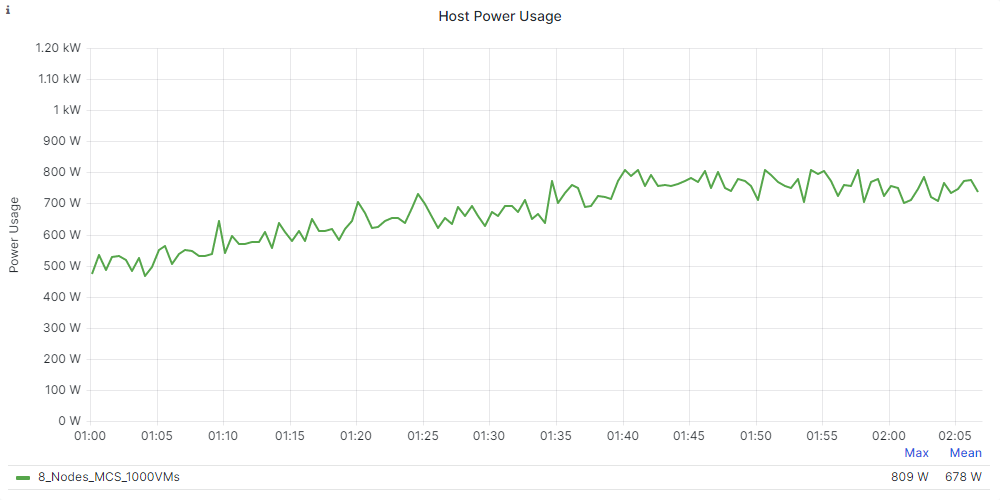
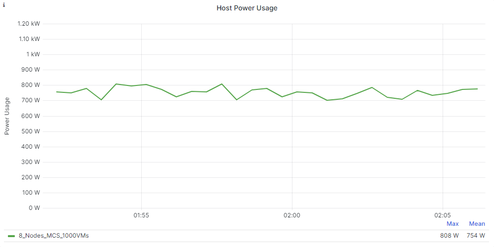
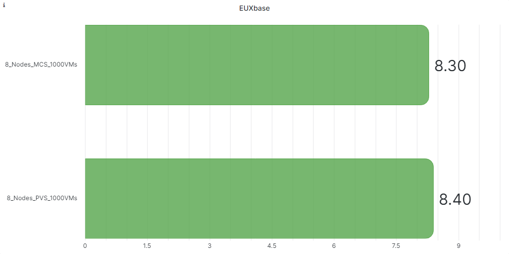
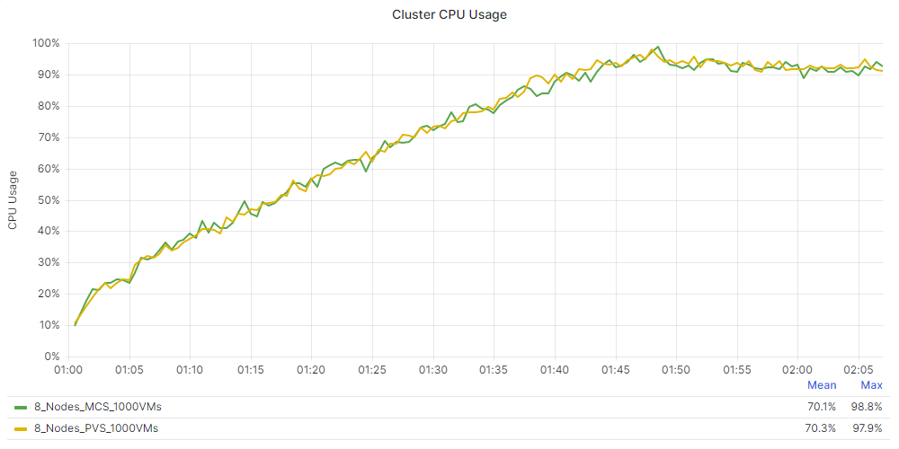

# Citrix Virtual Apps and Desktops on Nutanix Test Validation

This section provides the details and results of our Citrix Virtual Apps and Desktops performance tests on Windows 10 with vSphere. We ran each test scenario a minimum of three times to ensure accuracy.

## Test Objectives

Our overall objective was to determine the session capacity we could host on Nutanix using a Windows 10, version 22H2 image and running the Login Enterprise tests with Citrix Virtual Apps and Desktops. We tested with the Login Enterprise knowledge worker profile.

We had the following specific objectives:

- Run a boot storm simulation with 1,000 virtual desktops on eight nodes.
- Determine the maximum number of sessions we can host on this system with the Login Enterprise knowledge worker workload while maintaining a good EUX Score.
- Show the linear scalability of the Nutanix platform.
- Show the differences between MCS and Citrix Provisioning on the Nutanix platform.
- Determine the impact of adding Nutanix Files to the Nutanix cluster and using it to store the user’s FSLogix Profile Container.

## Considerations for Test Results

- We used Citrix MCS to deploy the Windows 10 desktops to validate linear scalability and FSLogix.
- We used Windows 10, version 22H2 to test the infrastructure with Login Enterprise.
- We didn’t enable the Side-Channel-Aware scheduler in VMware vSphere ESXi and left the mitigation for CVE-2018-12207 disabled (default on ESXi). Enabling these mitigations on the hypervisor affects the performance of VDI- and RDSH-based workloads.
- We tested using a single, full-HD screen as the client and limited the frames per second to 16. Using multiple screens or other screen resolution settings affects the results.

## Boot Storm Simulation

The following section provides the performance details of the boot storm simulation test.

### Machine Creation Services: Eight Nodes

_Table: Eight Nodes, 1,000 VMs (125 VMs per Node) with MCS_

| **Hosting Connection Setting** | **Detail** |
| --- | --- |
| Simultaneous Actions (Absolute) | 100 |
| Simultaneous Actions (Percentage) | 40% |
| Max New Actions per Minute (Absolute) | 50 |

### Citrix Provisioning: Eight Nodes

_Table: Eight Nodes, 1,000 VMs (125 VMs per node) with Citrix Provisioning_

| **Hosting Connection Setting** | **Detail** |
| --- | --- |
| Simultaneous Actions (Absolute) | 100 |
| Simultaneous Actions (Percentage) | 40% |
| Max New Actions per Minute (Absolute) | 50 |

### Boot Storm Comparison

The following figures compare the MCS and Citrix Provisioning boot storm simulation tests.

## Linear Scalability

The following graphs show the linear scalability of the test runs. We performed the tests with one, two, four, six, and eight nodes with 125 VMs per node. The results show good EUX Scores in all scenarios.

### EUX Scores

The following charts show the EUX Scores during the tests.

### Steady State Scores

The following charts show the EUX Scores during the steady state of each test.

### Logon Times

The following graphs show the linear scalability of logon times over the test runs. A lower result represents better performance.

### Application Performance

The following tables show the linear scalability of application performance over the test runs. A lower result represents better performance.

_Table: Application Performance: Logon Time (in Seconds)_

| **Application Name** | **1 Node** | **2 Nodes** | **4 Nodes** | **6 Nodes** | **8 Nodes** | 
| --- | --- | --- | --- | --- | --- |
| Microsoft Outlook | 3.76 sec | 4.20 sec | 4.23 sec | 4.42 sec | 4.69 sec |
| Microsoft Word | 0.80 sec | 0.80 sec | 0.79 sec | 0.80 sec | 0.81 sec |
| Microsoft Excel | 1.23 sec | 1.33 sec | 1.33 sec | 1.38 sec | 1.46 sec |
| Microsoft Powerpoint | 1.02 sec | 1.10 sec | 1.10 sec | 1.13 sec | 1.18 sec |

_Table: Application Performance: Specific Action (in Seconds)_

| **Application Name (Action)** | **1 Node** | **2 Nodes** | **4 Nodes** | **6 Nodes** | **8 Nodes** |
| --- | --- | --- | --- | --- | --- |
| Microsoft Edge (Logon) | 0.09 sec | 0.09 sec | 0.09 sec | 0.09 sec | 0.09 sec |
| Microsoft Word (Open Doc) | 1.08 sec | 1.11 sec | 1.11 sec | 1.13 sec | 1.16 sec |
| Microsoft Excel (Save File) | 0.42 sec | 0.42 sec | 0.42 sec | 0.43 sec | 0.43 sec |

## Power Consumption

During the eight-node test, we monitored one node's power usage. The following chart shows this host's power usage over the test duration.

The next chart shows the power usage during the steady state of the test.

On average, the host used 754 W during the steady state. The eight-node cluster used 6,032 W on average during the steady state with 1,000 active users.

## MCS vs. Citrix Provisioning

In this section, we compare the results of a Login Enterprise test on eight nodes, using MCS and Citrix Provisioning as the deployment methods. 

### EUX Scores

The following chart shows the EUX Base scores from the tests. A higher score indicates better end-user experience.

The following charts detail the EUX Scores during the tests.

### Steady State Scores

The following chart details the EUX Scores during the steady state.

### Logon Time Performance

The following graphs show the linear scalability of logon time performance over the test runs.

### Application Performance

The following table shows the linear scalability detail for application performance.

_Table: MCS vs. Citrix Provisioning: Application Logon Time (in Seconds)_

| **Application** | **MCS** | **Citrix Provisioning** | 
| --- | --- | --- | 
| Outlook | 4.69 sec | 3.59 sec | 
| Word | 0.81 sec | 0.81 sec | 
| Excel | 1.46 sec | 1.31 sec |
| Powerpoint | 1.18 sec | 1.04 sec | 

_Table: MCS vs. Citrix Provisioning: Specific Action (in Seconds)_

| **Application (Action)** | **MCS** | **Citrix Provisioning** | 
| --- | --- | --- | 
| Microsoft Edge (Logon) | 0.09 sec | 0.09 sec |
| Microsoft Word (Open Doc) | 1.16 sec | 1.04 sec | 
| Microsoft Excel (Save File) | 0.43 sec | 0.43 sec | 

The following graphs show Login Enterprise EUX–specific measurements, where a higher score is better.

### CPU Usage
The next chart compares the cluster CPU usage during the test:

### Cluster Controller IOPS

The next chart shows the difference in the cluster controller IOPS.

<note>As we explained earlier, the I/O load in the current release of Login Enterprise EUX 2023 is much higher than is realistic for a knowledge worker. However, this result shows that Nutanix storage can handle the load.</note>

## FSLogix with Nutanix Files: Colocated Versus Dedicated

We ran the test on eight nodes with 1,000 VMs (125 VMs per node). The FSLogix Profile was on the file server already (not first logon).

_Table: Nutanix Files Configuration_

| **Setting** | **Detail** | 
| --- | --- |
| Version | 4.2.1.1 |
| Cluster size | 3 VMs |
| vCPU per VM | 4 |
| Memory per VM | 12 GB |

_Table: FSLogix Configuration_

|  Setting | Detail | 
| --- | --- |
| Version | 2.9.8440.42104 |
| Configuration | Profile & Office Container |

### Nutanix Files Hosted on the Desktops Cluster (Colocated)

In this scenario, we configured the user’s profile to use an FSLogix Profile Container stored on a Nutanix Files share. With FSLogix, you can store the user’s profile in a VHD or VHDX file. The system stores this file on a network share (in our case, a share hosted on Nutanix Files) and mounts it at user logon. This method can improve logon times and provide advantages for disaster recovery scenarios.

For this test, users had an existing profile stored in an FSLogix container, and we hosted Nutanix Files on the same Nutanix cluster as the desktops.

The following charts show the storage performance of the Nutanix Files cluster during the test.

### Nutanix Files Hosted on the Infrastructure Cluster (Dedicated)

In this scenario we used FSLogix Profile Containers for the user profiles and stored them on a Nutanix Files share again, but we hosted Nutanix Files on the infrastructure cluster. This setup doesn’t affect the overall CPU usage of the cluster nodes hosting the virtual desktops.

The following charts show the storage performance of the Nutanix Files cluster during the test.

### Performance Comparison

This section compares the performance of storing FSLogix profiles on a Nutanix Files cluster colocated with the desktops with the performance of storing FSLogix profiles on a Nutanix Files cluster hosted on a dedicated cluster.

The following figure shows the EUX Scores during the steady state.

The following figures show the logon times.

The following figures show Login Enterprise EUX–specific measurements, where a higher score is better.

The following graph shows the desktop cluster's CPU usage.

The next figure shows the cluster controller IOPS.

