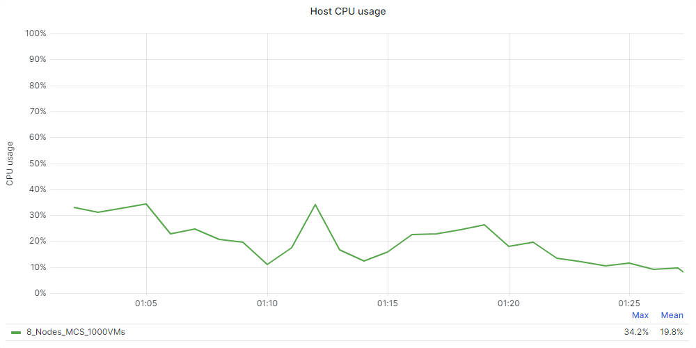
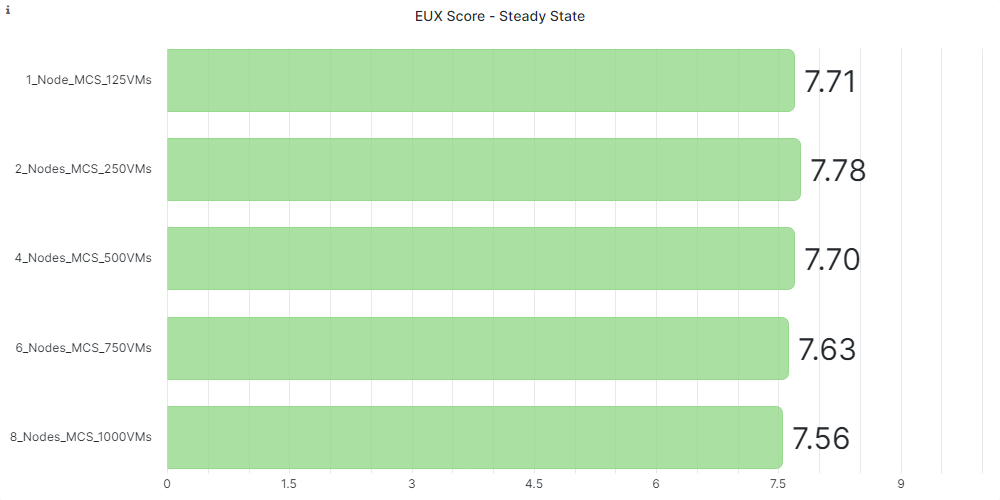
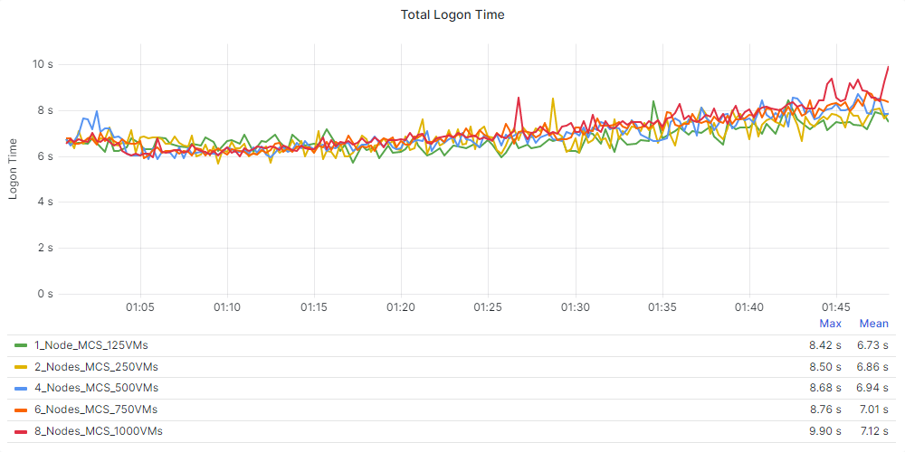
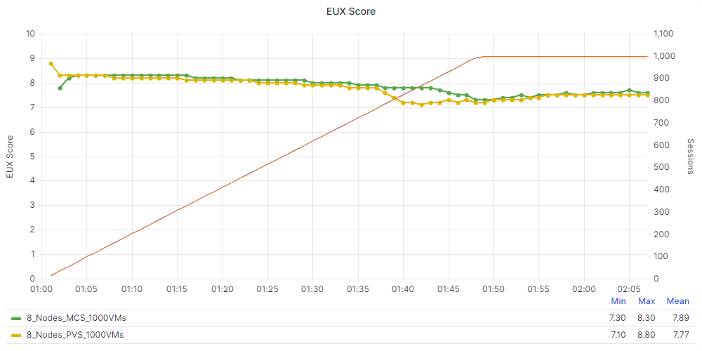
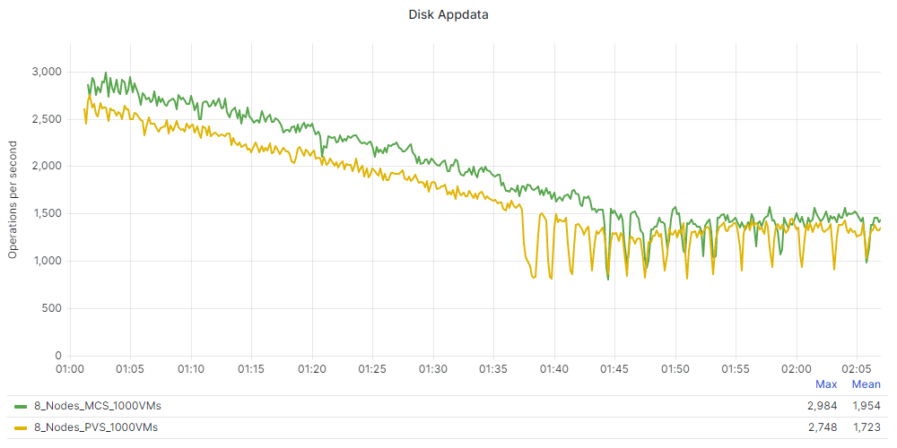
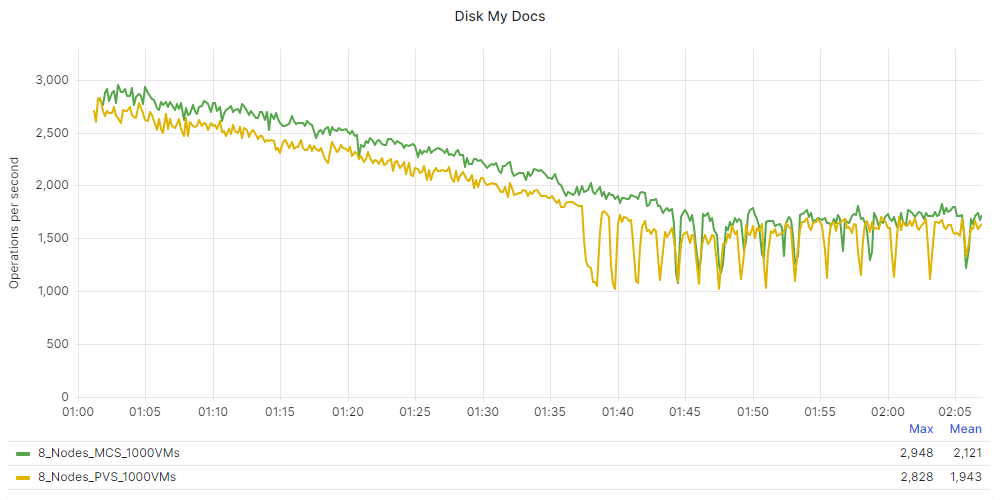
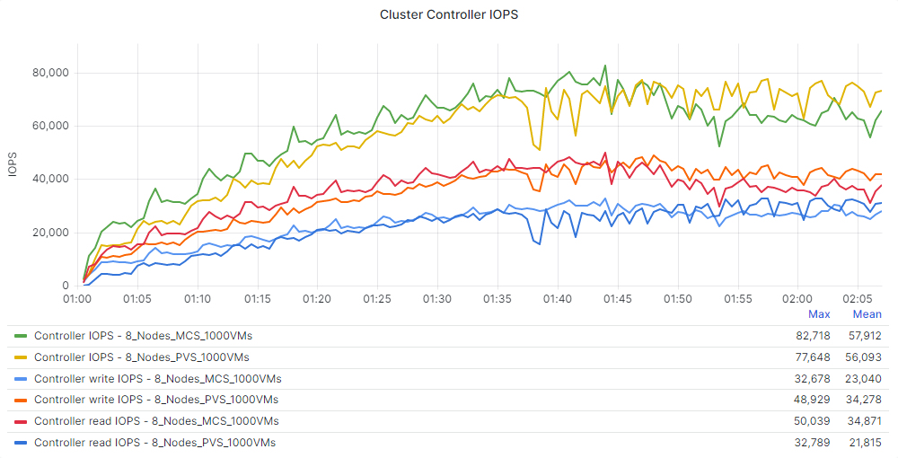
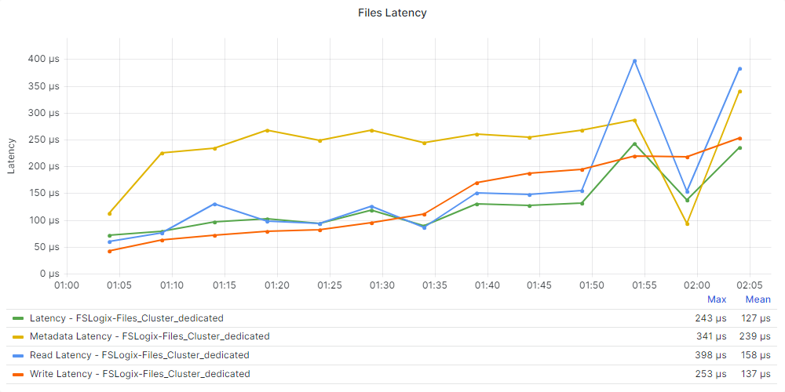
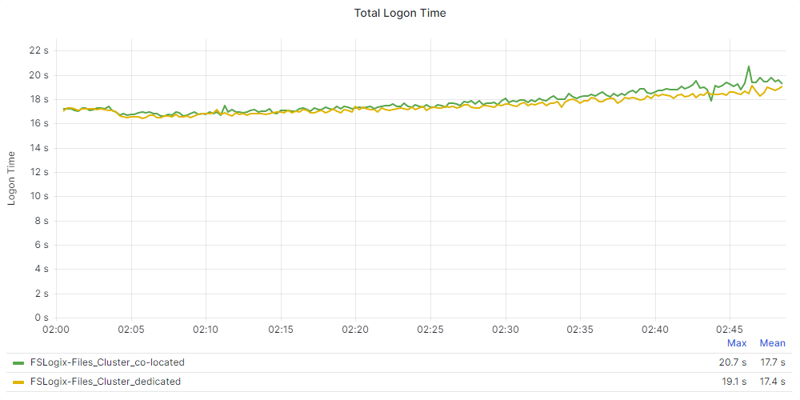

# Test Validation

Below you will find the detail and results of the performance testing completed for Citrix Virtual Apps and Desktops for the Windows Desktop Operating System on vSphere. Each test scenario was run a minimum of 3 times to ensure accuracy.

## Test Objectives
The overall objective was to determine the session capacity we could host on Nutanix using a Windows 10, version 22H2 image and running the Login Enterprise tests with Citrix Virtual Apps and Desktops. We tested with the Login Enterprise knowledge worker profile.

Our specific objectives were to:

- Run a boot storm simulation with 1,000 virtual desktops on 8 nodes.
- Determine the maximum number of sessions we can host on this system with the Login Enterprise Knowledge worker workload while maintaining a good EUX score.
- Show the linear scalability of the Nutanix platform.
- Show the differences between MCS and PVS on the Nutanix platform.
- Determine the impact of adding Nutanix Files to the Nutanix cluster and using it to store the user’s FSLogix Profile Container.

## Considerations for Test Results

- We used Citrix MCS to deploy the Windows 10 desktops to validate linear scalability and FSLogix.
- We used Windows 10, version 22H2 to test the infrastructure with Login Enterprise.
- We didn’t enable the Side-Channel-Aware scheduler in VMware vSphere ESXi, and the mitigation for CVE-2018-12207 is disabled by default on ESXi. Enabling these mitigations on the hypervisor affects the performance of VDI- and RDSH-based workloads.
- We tested using a single, full-HD screen as the client and limited the frames per second (FPS) to 16. Using multiple screens or other screen resolution settings affects the results.

## Boot Storm Simulation

The following section will show the performance details during a boot storm simulation test.

### Machine Creation Services - 8 Nodes

Test Run Detail: 8 nodes with 1000 VMs (125 VMs per node)

| Hosting Connection Setting | Detail | 
| --- | --- |
| Simultaneous Actions (Absolute) | 100 |
| Simultaneous Actions (Percentage) | 40 % |
| Max New Actions per Minute (Absolute) | 50 |

### Provisioning Services - 8 Nodes

Test Run Detail: 8 nodes with 1000 VMs (125 VMs per node)

| Hosting Connection Setting | Detail | 
| --- | --- |
| Simultaneous Actions (Absolute) | 100 |
| Simultaneous Actions (Percentage) | 40 % |
| Max New Actions per Minute (Absolute) | 50 |

### Boot Storm Comparison

Below you can see the comparison between MCS and PVS with regard to the boot storm simulation test.

## Linear scalability

The following graphs will show the linear scalability detail for the test runs. The tests were performed with 1, 2, 4, 6 and 8 nodes and 125 VMs per node. The results show good EUX scores in all scenarios.

### EUX Scores

The following two charts detail the EUX Scores during the entire tests:

### Steady State Scores

The following two chart details the EUX Score during the steady state:

### Logon Time Scores

The following graphs will show the linear scalability detail for logon performance over the test runs. A lower result is better:

### Application Performance

The following table shows the linear scalability detail for application performance over the test runs. A lower result is better.

| Application Name (Start Time) - Seconds | 1 Node | 2 Node | 4 Node | 6 Node | 8 Node | 
| --- | --- | --- | --- | --- | --- |
| Outlook | 3.76 | 4.20 | 4.23 | 4.42 | 4.69 |
| Word | 0.80 | 0.80 | 0.79 | 0.80 | 0.81 |
| Excel | 1.23 | 1.33 | 1.33 | 1.38 | 1.46 |
| Powerpoint | 1.02 | 1.10 | 1.10 | 1.13 | 1.18 |

| Application Name (Action) - Seconds | 1 Node | 2 Node | 4 Node | 6 Node | 8 Node | 
| --- | --- | --- | --- | --- | --- |
| Microsoft Edge (Logon) | 0.09 | 0.09 | 0.09 | 0.09 | 0.09 |
| Microsoft Word (Open Doc) | 1.08 | 1.11 | 1.11 | 1.13 | 1.16 |
| Microsoft Excel (Save File) | 0.42 | 0.42 | 0.42 | 0.43 | 0.43 |

## Power Consumption
During the 8 nodes test, we monitored the Power usage of one of the nodes. The following chart shows the power usage of this host:

The next chart shows the power usage during the steady state of the test:

On average, the host used 754 Watts during the steady state. The 8 nodes cluster used 6,032 Watts on average during the steady state with 1,000 active users.

## MCS vs PVS

In this section we compare the results of a Login Enterprise test on 8 nodes, using MCS and PVS as the deployment method. 
Test Run Detail: 8 nodes with 1,000 VMs (125 VMs per node) for both MCS and PVS.

### EUX Scores
The following chart details the EUX Base score of the test (a higher score is better):

The following two charts detail the EUX Scores during the entire test:

### Steady State Scores

The following chart details the EUX Score during the steady state:

The next chart compares the cluster CPU usage during the test:

### Logon Time Scores

The following graphs will show the linear scalability detail for login performance over the test runs.

### Application Performance
The following table shows the linear scalability detail for application performance.

| Application Name (Start Time - Seconds) | MCS | PVS | 
| --- | --- | --- | 
| Outlook | 4.69 | 3.59 | 
| Word | 0.81 | 0.81 | 
| Excel | 1.46 | 1.31 |
| Powerpoint | 1.18 | 1.04 | 

| Application Name (Action - Seconds) | MCS | PVS | 
| --- | --- | --- | 
| Microsoft Edge (Logon) | 0.09 | 0.09 |
| Microsoft Word (Open Doc) | 1.16 | 1.04 | 
| Microsoft Excel (Save File) | 0.43 | 0.43 | 

The following graphs are Login Enterprise EUX specific measurements. A higher score is better:

### CPU usage

### Cluster controller IOPS
The next chart shows the difference in Cluster Controller IOPS:

## FSLogix (Nutanix Files co-located) vs FSLogix (Nutanix Files dedicated)

Test Run Detail: 8 nodes with 1,000 VMs (125 VMs per node), FSLogix Profile exists on file server already (not first logon).

| Nutanix Files Setting | Detail | 
| --- | --- |
| Version | 4.2.1.1 |
| Cluster size | 3 VMs |
| vCPUs per VM | 4 |
| Memory per VM | 12 GB |

| FSLogix Setting | Detail | 
| --- | --- |
| Version | 2.9.8440.42104 |
| Configuration | Profile & Office Container |

### Nutanix Files Hosted on the Desktops Cluster (co-located)
In this scenario, we configured the user’s profile to use an FSLogix Profile Container stored on a Nutanix Files share. One of the advantages of FSLogix is that you can store the user’s profile in a VHD or VHDX file. This file is stored on a network share (in our case a share hosted on Nutanix Files) and mounted at user logon. This method can improve logon times and provide advantages for disaster recovery scenarios.

For this test, users had an existing profile stored in an FSLogix container, and we hosted Nutanix Files on the same Nutanix cluster as the desktops.
The following charts show the storage performance of the Nutanix Files cluster during the test.

### Nutanix Files Hosted on the Infrastructure Cluster (dedicated)
In this scenario, we also used FSLogix Profile Containers for the user profiles and stored them on a Nutanix Files share. This time, we hosted Nutanix Files on the infrastructure cluster. This setup doesn’t affect the overall CPU usage of the cluster nodes hosting the virtual desktops.
The following charts show the storage performance of the Nutanix Files cluster during the test.

### Performance Comparison
In this section we compare the results of the Login Enterprise test where the FSLogix profiles are stored on a Nutanix Files cluster co-located with the desktops with the test where the FSLogix profiles are stored on the a Nutanix Files cluster hosted on a dedicated cluster.

First, the EUX scores during the steady state:

The next two charts show the details of the logon:

The following graphs are Login Enterprise EUX specific measurements. A higher score is better:

The cluster CPU usage of the Desktop cluster:

The next chart shows the cluster controller IOPS:

