# Citrix Virtual Apps and Desktops on Nutanix Test Validation

This section provides the details and results of our Citrix Virtual Apps and Desktops performance tests on Nutanix NX-3155-G9 nodes with Nutanix AHV. We ran each test scenario at least 3 times to ensure accuracy.

## Test Objectives

Our objective was to determine the session capacity we could host on Nutanix using a Windows VDA image and running the Login Enterprise tests with Citrix Virtual Apps and Desktops. We tested with the Login Enterprise Knowledge Worker profile.

We had the following specific objectives:

- Determine the maximum number of sessions we can host on this system with the Login Enterprise Knowledge Worker workload while maintaining a good user experience.
- Show the linear scalability of the Nutanix platform.
- Show the Power Usage in Watts of the Nutanix platform.
- Show the differences between Machine Creation Services and Citrix Provisioning on the Nutanix platform.
- Show the differences between G7, G8, and G9 Nutanix node types.
- Show the differences between Windows 10 and Windows 11 on the Nutanix platform.

## Considerations for Test Results

- We used Citrix MCS and PVS to deploy the Windows VMs to validate linear scalability.
- We tested using a single, full-HD screen with the default Citrix frames per second configuration. Using multiple screens or other screen resolution settings affects the results.

## Boot Storm Simulation

The following section provides the performance details of the boot storm simulation test.

_Table: Hosting Connection Settings_ 

| Setting | Detail |
| --- | --- |
| Simultaneous Actions (Absolute) | 100 |
| Simultaneous Actions (Percentage) | 20 % |
| Max New Actions per Minute (Absolute) | 50 |

### Booting 1040 Windows Desktops on 8 Nutanix G9 Nodes

_Table: Boot Storm Simulation: 8 Node MCS Test_

| Measurement | Detail |
| --- | --- |
| Maximum CPU Usage | 25.9 % |
| Average CPU Usage | 18.1 % |
| Average Controller IOPS | 29,426 |
| Boot Time | 27.7 minutes |

## Linear Scalability

The following section shows the linear scalability of the Nutanix platform. We performed the tests with 1, 2, 4, 6, and 8 nodes with 130 VMs per node. The results display average timings and show good user experience in all scenarios.

### Logon Phase

The following charts detail the user experience during the logon phase of the test.

#### Logon Time Scores

The following shows the linear scalability of logon times over the test runs. A lower result represents better performance.

_Table: Logon Performance Linear Scale Logon Phase: Logon Time (in Seconds)_

| Measurement | 1 Node | 2 Nodes | 4 Nodes | 6 Nodes | 8 Nodes | 
| --- | --- | --- | --- | --- | --- |
| Average Logon Time | 6.5 seconds | 6.7 seconds | 6.8 seconds | 6.6 seconds | 6.6 seconds |
| User Profile Load | 0.40 seconds | 0.42 seconds | 0.42 seconds | 0.38 seconds | 0.38 seconds |
| Group Policies | 2.21 seconds | 2.28 seconds | 2.27 seconds | 2.24 seconds | 2.25 seconds |
| Connection | 2.65 seconds | 2.70 seconds | 2.81 seconds | 2.69 seconds | 2.70 seconds |
| Total Logon Time | 6.52 seconds | 6.73 seconds | 6.76 seconds | 6.60 seconds | 6.63 seconds |

#### Application Performance

The following shows the linear scalability of application performance over the test runs. A lower result represents better performance.

_Table: Application Performance Linear Scale Logon Phase: App Start (in Seconds)_

| Application Name | 1 Node | 2 Nodes | 4 Nodes | 6 Nodes | 8 Nodes | 
| --- | --- | --- | --- | --- | --- |
| Microsoft Outlook | 2.95 seconds | 3.34 seconds | 3.24 seconds | 3.15 seconds | 3.17 seconds |
| Microsoft Word | 0.86 seconds | 0.87 seconds | 0.90 seconds | 0.88 seconds | 0.89 seconds |
| Microsoft Excel | 1.02 seconds | 1.06 seconds | 1.05 seconds | 1.01 seconds | 1.03 seconds |
| Microsoft PowerPoint | 0.95 seconds | 0.97 seconds | 0.98 seconds | 0.93 seconds | 0.94 seconds |

_Table: Application Performance Linear Scale Logon Phase: Specific Action (in Seconds)_

| Application Name (Action) | 1 Node | 2 Nodes | 4 Nodes | 6 Nodes | 8 Nodes |
| --- | --- | --- | --- | --- | --- |
| Microsoft Edge (Page Load) | 1.36 seconds | 1.44 seconds | 1.40 seconds | 1.39 seconds | 1.44 seconds |
| Microsoft Word (Open Doc) | 1.02 seconds | 0.94 seconds | 0.96 seconds | 0.91 seconds | 0.92 seconds |
| Microsoft Excel (Save File) | 0.35 seconds | 0.33 seconds | 0.35 seconds | 0.33 seconds | 0.33 seconds |

### Steady State Phase

The following charts detail the user experience during the steady state phase of the test.

#### Application Performance

The following shows the linear scalability of application performance over the steady state phase of the test runs. A lower result represents better performance.

_Table: Application Performance Linear Scale Steady State Phase: App Start (in Seconds)_

| Application Name | 1 Node | 2 Nodes | 4 Nodes | 6 Nodes | 8 Nodes | 
| --- | --- | --- | --- | --- | --- |
| Microsoft Word | 0.88 seconds | 0.89 seconds | 0.93 seconds | 0.91 seconds | 0.92 seconds |
| Microsoft Excel | 0.88 seconds | 0.90 seconds | 0.94 seconds | 0.90 seconds | 0.91 seconds |
| Microsoft PowerPoint | 0.81 seconds | 0.82 seconds | 0.84 seconds | 0.82 seconds | 0.83 seconds |

_Table: Application Performance Linear Scale Steady State Phase: Specific Action (in Seconds)_

| Application Name (Action) | 1 Node | 2 Nodes | 4 Nodes | 6 Nodes | 8 Nodes |
| --- | --- | --- | --- | --- | --- |
| Microsoft Edge (Page Load) | 1.40 seconds | 1.47 seconds | 1.45 seconds | 1.45 seconds | 1.49 seconds |
| Microsoft Word (Open Doc) | 0.94 seconds | 0.97 seconds | 0.99 seconds | 0.94 seconds | 0.96 seconds |
| Microsoft Excel (Save File) | 0.33 seconds | 0.33 seconds | 0.34 seconds | 0.33 seconds | 0.33 seconds |

## Power Consumption

During the test, we monitored one node's power consumption to determine the power usage. The following chart shows the host's power usage over the test duration.

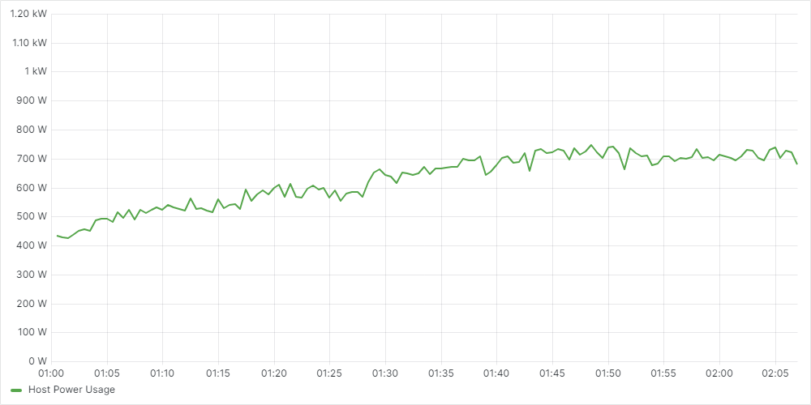

The next chart shows the power usage during the steady state phase of the test.

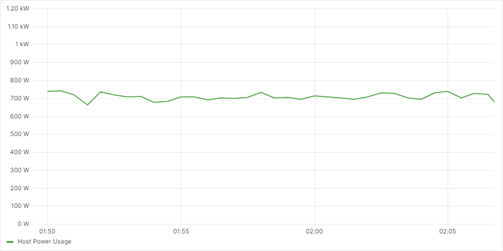

On average, the a single Nutanix host used 685 Watts (W) during the steady state.

## MCS vs. PVS

In this section, we compare the results of a Login Enterprise test on 8 nodes, using Machine Creation Services (MCS) and Citrix Provisioning (PVS) as the deployment methods.

### System Performance

The following charts show the overall system performance during the entire test run.

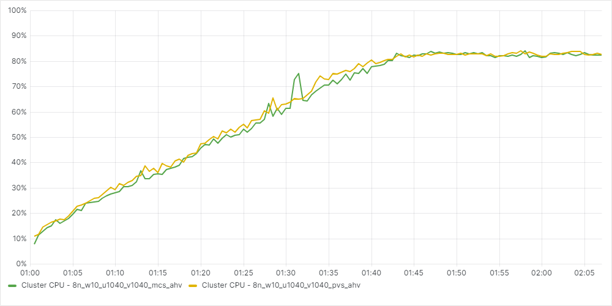

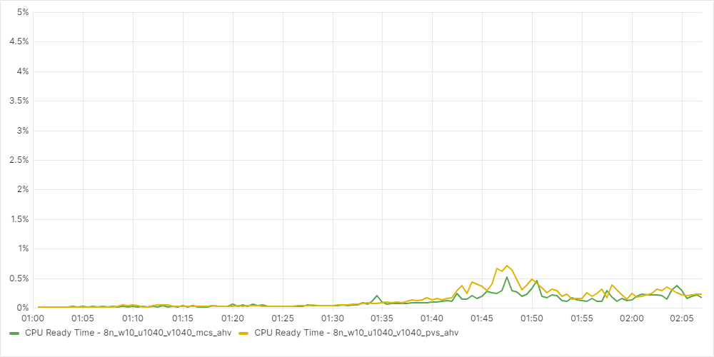

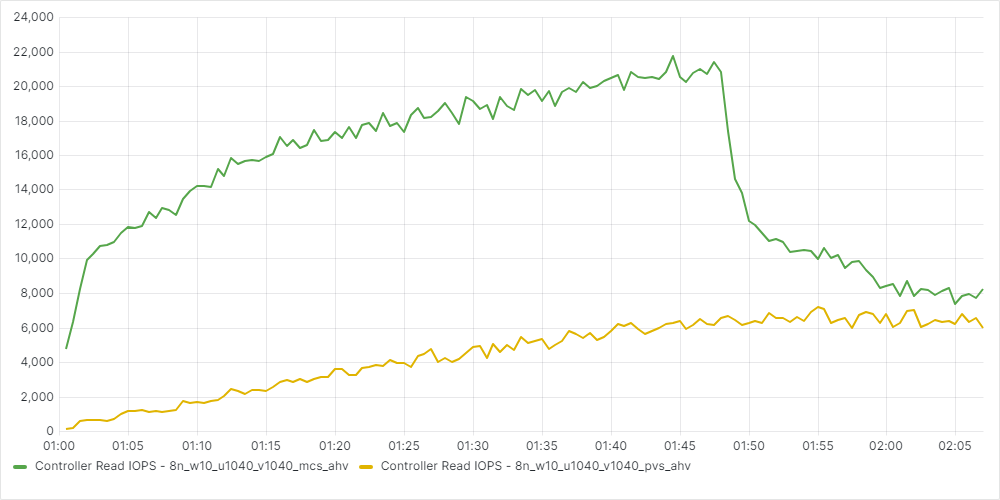

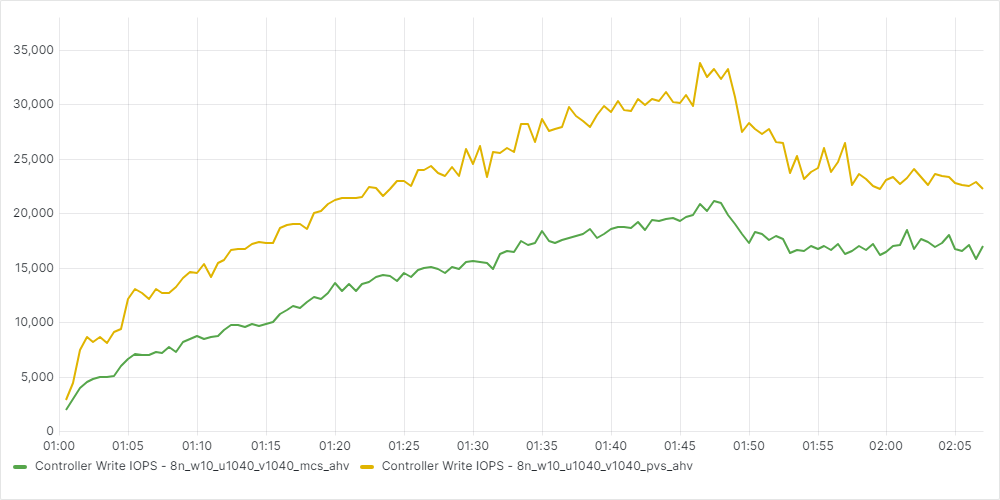

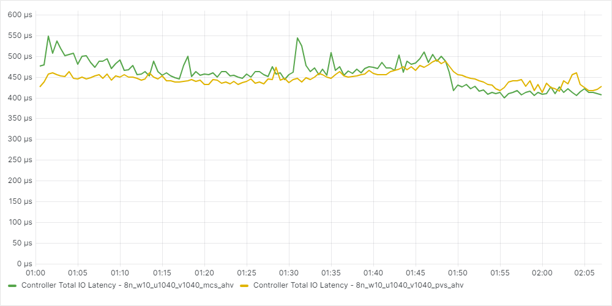

The average graph data above is summarized in the following table.

_Table: System Performance MCS vs. PVS: System Performance Summary_

| Measurement | MCS | PVS |
| --- | --- | --- | 
| CPU Usage | 60.2 % | 61.2 % |
| CPU Ready Time | 0.10 % | 0.14 % | 
| Controller Read IOPS | 21,745 | 7,199 | 
| Controller Write IOPS | 21,148 | 33,763 | 
| Controller Latency | 0.45 ms | 0.45 ms | 

### Logon Phase

The following charts detail the user experience during the logon phase.

#### Logon Time Scores

The following shows the logon times over the test runs. A lower result represents better performance.

_Table: Logon Performance MCS vs. PVS Logon Phase: Logon Time (in Seconds)_

| Measurement | MCS | PVS |
| --- | --- | --- | 
| Average Logon Time | 6.6 seconds | 7.7 seconds |
| User Profile Load | 0.40 seconds | 0.50 seconds | 
| Group Policies | 2.2 seconds | 2.3 seconds | 
| Connection | 2.7 seconds | 3 seconds | 
| Total Logon Time | 6.6 seconds | 7.7 seconds | 

#### Application Performance

The following shows the detail for application performance. A lower result represents better performance.

_Table: Application Performance MCS vs. PVS Logon Phase: App Start (in Seconds)_

| Application | MCS | PVS | 
| --- | --- | --- | 
| Microsoft Outlook | 3.17 seconds | 3.95 seconds | 
| Microsoft Word | 0.89 seconds | 0.92 seconds | 
| Microsoft Excel | 1.03 seconds | 1.25 seconds |
| Microsoft PowerPoint | 0.94 seconds | 1.15 seconds | 

_Table: Application Performance MCS vs. PVS Logon Phase: Specific Action (in Seconds)_

| Application (Action) | MCS | PVS | 
| --- | --- | --- | 
| Microsoft Word (Open Doc) | 0.92 seconds | 1.09 seconds | 
| Microsoft Excel (Save File) | 0.33 seconds | 0.35 seconds | 

### Steady State Phase

The following charts detail the user experience during the steady state.

#### Application Performance

The following shows the detail for application performance during steady state. A lower result represents better performance.

_Table: Application Performance MCS vs. PVS Steady State Phase: App Start (in Seconds)_

| Application | MCS | PVS | 
| --- | --- | --- | 
| Microsoft Word | 0.92 seconds | 0.93 seconds | 
| Microsoft Excel | 0.91 seconds | 0.97 seconds |
| Microsoft PowerPoint | 0.83 seconds | 0.86 seconds | 

_Table: Application Performance MCS vs. PVS Steady State Phase: Specific Action (in Seconds)_

| Application (Action) | MCS | PVS | 
| --- | --- | --- | 
| Microsoft Edge (Page Load) | 1.49 seconds | 1.55 seconds |
| Microsoft Word (Open Doc) | 0.96 seconds | 1.00 seconds | 
| Microsoft Excel (Save File) | 0.33 seconds | 0.34 seconds | 

## Windows 10 vs. Windows 11

In this section, we compare the results of a Login Enterprise test on 8 nodes, using Windows 10 vs Windows 11.

### System Performance

The following charts show the system performance during the tests.

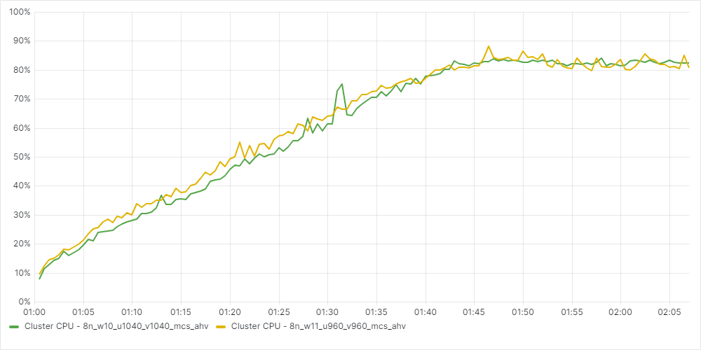

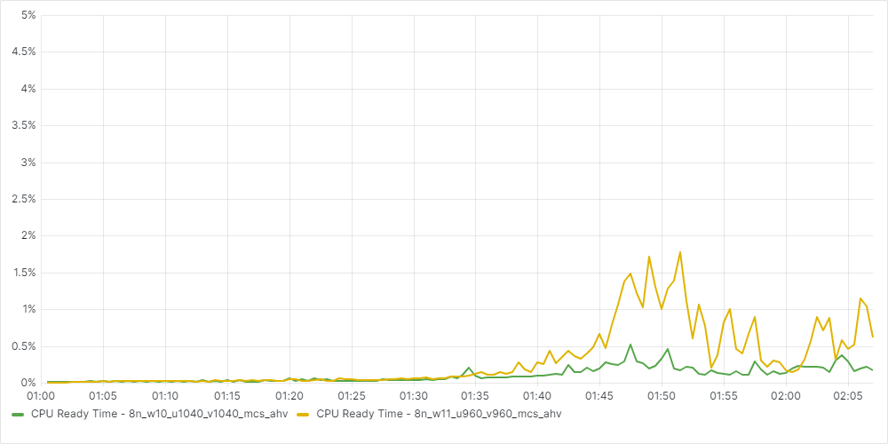

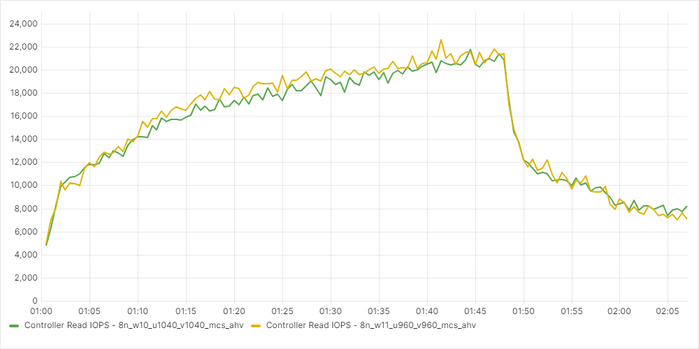

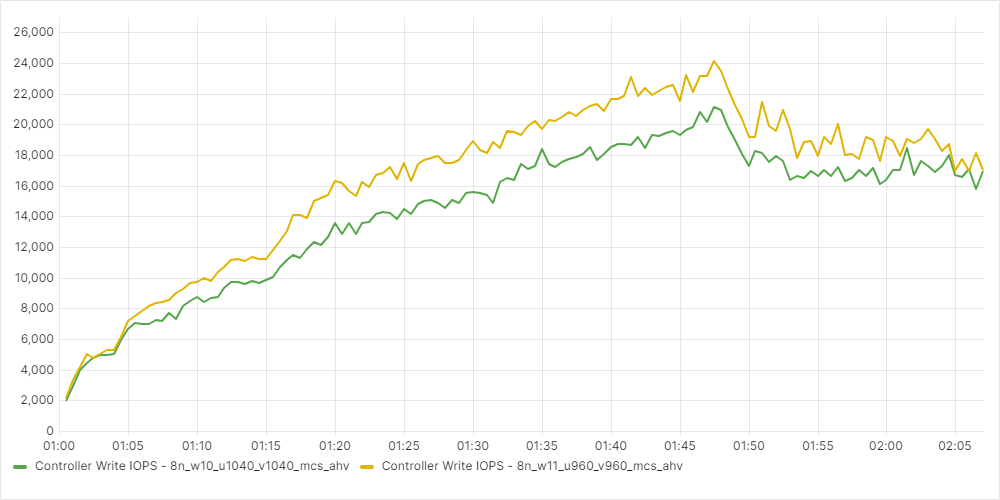

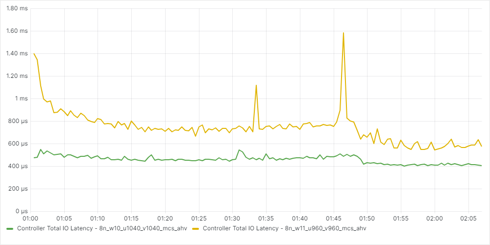

The average graph data above is summarized in the following table.

_Table: System Performance Windows 10 vs. Windows 11: System Performance Summary_

| Measurement | Windows 10 | Windows 11 |
| --- | --- | --- | 
| CPU Usage | 60.2 % | 61.7 % |
| CPU Ready Time | 0.10 % | 0.31 % | 
| Controller Read IOPS | 21,745 | 22,598 | 
| Controller Write IOPS | 21,148 | 24,123 | 
| Controller Latency | 0.45 ms | 0.74 ms | 

### Logon Phase

The following charts detail the user experience during the logon phase.

#### Logon Time Scores

The following shows the logon times over the test runs. A lower result represents better performance.

_Table: Logon Performance Windows 10 vs. Windows 11 Logon Phase: Logon Time (in Seconds)_

| Measurement | Windows 10 | Windows 11 |
| --- | --- | --- |
| Average Logon Time | 6.6 seconds | 6.3 seconds |
| User Profile Load | 0.40 seconds | 0.6 seconds | 
| Group Policies | 2.21 seconds | 1.49 seconds | 
| Connection | 2.65 seconds | 2.9 seconds | 
| Total Logon Time | 6.52 seconds | 6.26 seconds | 

#### Application Performance

The following shows the detail for application performance. A lower result represents better performance.

_Table: Application Performance Windows 10 vs. Windows 11 Logon Phase: App Start (in Seconds)_

| Application | Windows 10 | Windows 11 | 
| --- | --- | --- | 
| Microsoft Outlook | 3.17 seconds | 3.74 seconds | 
| Microsoft Word | 0.89 seconds | 0.95 seconds | 
| Microsoft Excel | 1.03 seconds | 1.25 seconds |
| Microsoft PowerPoint | 0.94 seconds | 1.12 seconds | 

_Table: Application Performance Windows 10 vs. Windows 11 Logon Phase: Specific Action (in Seconds)_

| Application (Action) | Windows 10 | Windows 11 | 
| --- | --- | --- | 
| Microsoft Edge (Page Load) | 1.44 seconds | 1.78 seconds |
| Microsoft Word (Open Doc) | 0.92 seconds | 1.10 seconds | 
| Microsoft Excel (Save File) | 0.33 seconds | 0.35 seconds | 

### Steady State Phase

The following charts detail the user experience during the steady state.

#### Application Performance

The following shows the detail for application performance. A lower result represents better performance.

_Table: Application Performance Windows 10 vs. Windows 11 Steady State Phase: App Start (in Seconds)_

| Application | Windows 10 | Windows 11 | 
| --- | --- | --- | 
| Microsoft Word | 0.92 seconds | 0.98 seconds | 
| Microsoft Excel | 0.91 seconds | 1.04 seconds |
| Microsoft PowerPoint | 0.83 seconds | 0.94 seconds | 

_Table: Application Performance Windows 10 vs. Windows 11 Steady State Phase: Specific Action (in Seconds)_

| Application (Action) | Windows 10 | Windows 11 | 
| --- | --- | --- | 
| Microsoft Edge (Page Load) | 1.49 seconds | 1.78 seconds |
| Microsoft Word (Open Doc) | 0.96 seconds | 1.12 seconds | 
| Microsoft Excel (Save File) | 0.33 seconds | 0.35 seconds | 

## Nutanix G7, G8 vs G9 Nodes

To show the improved performance and density when you use a newer CPU generation, we tested with the Login Enterprise workload on three generations of Nutanix hardware: a G7, G8 and G9. The following table shows the specifications of these nodes:

_Table: G8 vs. G8 vs. G9: Specifications_

| Node | G7 | G8 | G9 |
| --- | --- | --- | --- |
| CPU | Intel Xeon Gold 5220 | Intel Xeon Gold 6342 | Intel Xeon Gold 6442Y |
| Generation | Cascade Lake | Ice Lake | Sapphire Rapids |
| Cores per CPU | 18 | 24 | 24 |
| Cores per node | 36 | 48 | 48 |
| MHz per core | 2200 | 2800 | 2600 |
| Storage config | Hybrid | All Flash SSD | All Flash NVMe |

 The following section shows the difference between the Nutanix G7, G8, and G9 hardware.

### System Performance

For these tests, we used the results of single-node tests. The goal of these tests was to get a CPU utilization of around 80% during steady state. The following charts show the system performance during the tests.

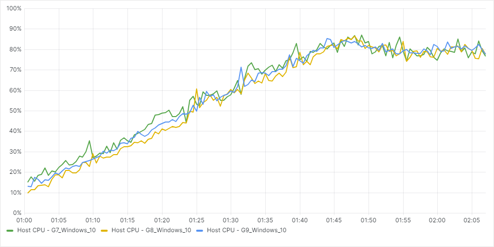

The following table shows the number of users per node and the resulting CPU calculations:

_Table: G8 vs. G8 vs. G9: CPU results_

| Item | G7 | G8 | G9 | 
| --- | --- | --- | -- |
| Number of users per node | 70 | 120 | 130 |
| Number of users per node (%) | **100%** | **171%** | **186%** |
| MHz per session during steady state | 905 | 896 | 768 |
| MHz per session during steady state (%) | **100%** | **99%** | **85%** |
| Sessions per core | 1.94 | 2.50 | 2.71 |
| Sessions per core (%) | **100%** | **129%** | **139%** |
| vCPUs per core (including CVM) | 4.22 | 5.25 | 5.67 |
| vCPUs per core (including CVM) (%) | **100%** | **124%** | **134%** |

### Application Performance

The following shows the detail for application performance. A lower result represents better performance.

_Table: G8 vs. G8 vs. G9: Key Differences_

| Item | G7 | G8 | G9 | 
| --- | --- | --- | -- |
| Login Time | 8.7 seconds | 7.1 seconds | 6.5 seconds |
| Word Start | 1.17 seconds | 0.90 seconds | 0.86 seconds |
| Excel Start | 1.28 seconds | 1.04 seconds | 0.98 seconds |
| PowerPoint Start | 1.16 seconds | 0.96 seconds | 0.87 seconds |
| Edge Page Load | 1.93 seconds | 1.54 seconds | 1.35 seconds |

The results of these tests show an improvement in performance and density when upgrading to a new generation of CPU.