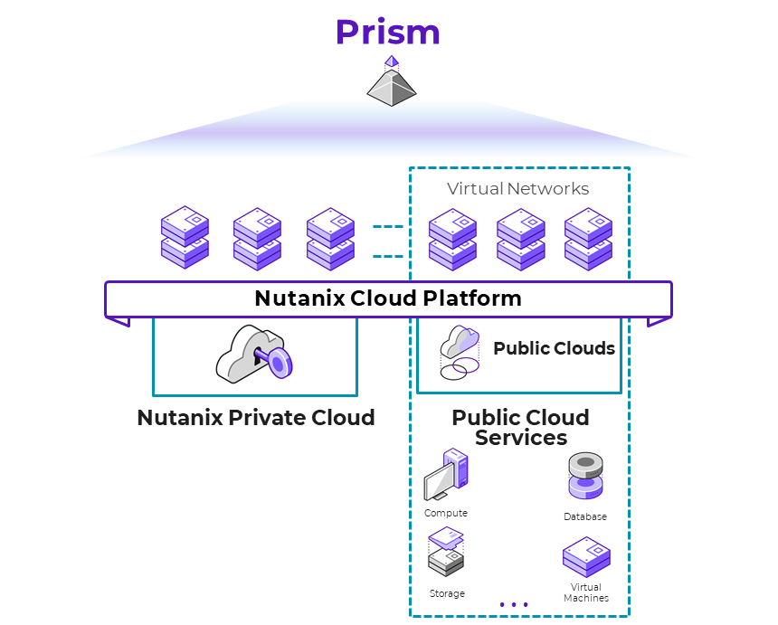

# Executive Summary

Nutanix designed its software to give customers running workloads in a hybrid cloud environment the same experience they expect from on-premises Nutanix clusters. Because Nutanix in a hybrid multicloud runs AOS and AHV with the same CLI, UI, and APIs, existing IT processes and third-party integrations continue to work regardless of where they run.

AOS can withstand hardware failures and software glitches and ensures that application availability and performance are never compromised. Combining features like native rack awareness with public cloud partition placement groups allows Nutanix to operate freely in a dynamic hybrid multicloud environment.

Citrix Desktop as a Service (Citrix DaaS) on Nutanix is a powerful solution that offers unrivaled user experience, simple administration, and web-scale flexibility and economics. In this reference architecture, we make recommendations for designing, optimizing, and scaling Citrix DaaS deployments on Windows Desktops on Nutanix AHV with Citrix Machine Creation Services (MCS) and Citrix Provisioning (PVS). We used Login Enterprise (Login VSI) and an automated scripting framework on Nutanix to simulate real-world workloads in a Citrix VAD environment.

In addition to desktop and application performance reliability, when you deploy Citrix DaaS on Nutanix you get unlimited scalability, data locality, AHV clones, and a single datastore. Nutanix also takes the Citrix commitment to simplicity to another level, with streamlined management, reduced rollout time, and lower operating expenses.