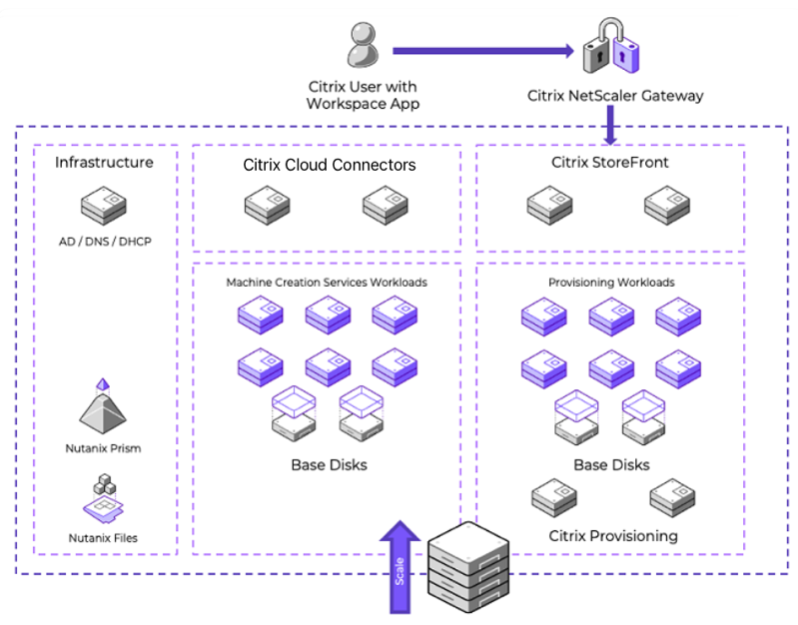
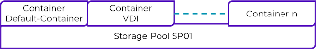

# Citrix Desktops as a Service on Nutanix

The Nutanix modular web-scale architecture lets you start small and expand to meet increasing demand—a node, a block, or multiple blocks at a time—with no impact on performance. This design removes the hurdle of a large initial infrastructure purchase, decreasing the time to value for your Citrix DaaS implementation. Running Citrix DaaS on Nutanix enables you to run multiple workloads, all on the same scalable converged infrastructure, while achieving these benefits:

Modular incremental scale
: With the Nutanix solution, you can start small and scale up. A single Nutanix block provides dozens of terabytes of storage and hundreds to thousands of virtual desktops in a compact footprint. With the solution's modularity, you can granularly scale by node, by block, or with multiple blocks, accurately matching supply with demand and minimizing upfront capex.

High performance
: By using system memory caching for read I/O and flash storage for read and write I/O, you can deliver high-performance throughput in a compact form factor. 

Change management
: Maintain environmental control and separation between development, test, staging, and production environments. Snapshots and fast clones can help share production data with nonproduction jobs without requiring full copies and unnecessary data duplication.

Business continuity and data protection
: User data and desktops are mission-critical and need enterprise-grade data management features, including backup and disaster recovery. 

Data efficiency
: Nutanix storage offers both compression and deduplication to help reduce your storage footprint. The compression functionality is truly VM-centric. Unlike traditional solutions that perform compression mainly at the LUN level, the Nutanix solution provides all these capabilities at the VM and file levels, greatly increasing efficiency and simplicity. These capabilities ensure the highest possible compression and decompression performance, even below the block level.

Enterprise-grade cluster management
: Nutanix offers a simplified and intuitive approach to managing large clusters, including a converged user interface that serves as a central point for servers and storage, alert notifications, and the bonjour mechanism that automatically detects new nodes in the cluster. As a result, you can spend time enhancing your environment rather than maintaining it.

High-density architecture
: Nutanix uses an advanced server architecture, coupled with data archiving and compression, which can make your desktop hardware footprint five times smaller.

Time-sliced clusters
: Like public cloud environments, Nutanix can provide a truly converged cloud infrastructure, allowing you to run your server and desktop virtualization on a single cloud. Gain the efficiency and savings you require with a converged cloud on a unified architecture.

## Citrix Desktops as a Service on Nutanix AHV

The following figure shows the main architectural components of the Citrix DaaS on Nutanix solution and the communication path between services.
 

## AHV Pod Design

The following tables contain highlights from a high-level snapshot of the Citrix DaaS on Nutanix virtual desktop pod.

_Table: Control Pod Details_

| Item | Quantity |
| --- | :---: |
| Cloud Connectors | 2 |
| StoreFront servers | 2 |

_Table: Services Pod Details_

| Item | Quantity |
| --- | :---: |
| AHV hosts | 16 | 
| Nutanix clusters | 1 |
| Containers | 1 |

Limiting the cluster sizes to 16 nodes reduces the failure domain and the time to patch and update the clusters. This reference architecture uses 16-node building blocks to take advantage of single-rack design, smaller failure domains, and reduced time to patch and update. 

We validated Citrix DaaS with pod design sizing based on the Login Enterprise knowledge worker workload. A more resource-intensive workload results in a lower density, and a less resource-intensive workload results in a higher density. If you change the vCPU count or memory, the number of VDAs per node and per cluster changes as well.

The following table shows the configuration details and results for the pod based testing, and the associated projected cluster densities.

_Table: Windows 11 configuration details_

| Item | Value |
| --- | :---: |
| Windows 11 Spec | 3 vCPU and 6GB Memory |
| VMs per Node | 150 |
| VMs in a 6 Node Cluster (baseline testing) | 900 |
| VMs in a 16 Node Cluster with N+1 resiliency | 2250 |

_Table: Windows 10 configuration details_

| Item | Value |
| --- | :---: |
| Windows 10 Spec | 2 vCPU and 4GB Memory |
| VMs per Node | 150 |
| VMs in a 6 Node Cluster (baseline testing) | 900 |
| VMs in a 16 Node Cluster with N+1 resiliency | 2250 |

## Nutanix Compute and Storage

Nutanix provides an ideal combination of high-performance compute resources and localized storage to meet any demand. True to this capability, this reference architecture contains no reconfiguration or customization of the Nutanix product to optimize for this use case. The following figure shows a high-level example of the relationship between the Nutanix storage pool and containers, where a single storage pool can host multiple containers with different configurations.

The following table details the Nutanix storage pool and container configuration.

_Table: Nutanix Storage Configuration_

| Name | Role | Details |
| --- | --- | --- |
| SP01 | Main storage pool for all data | SSD |
| VDI | Container for all VMs | AHV datastore |
| Default-Container | Container for all data (not used here) | AHV datastore |