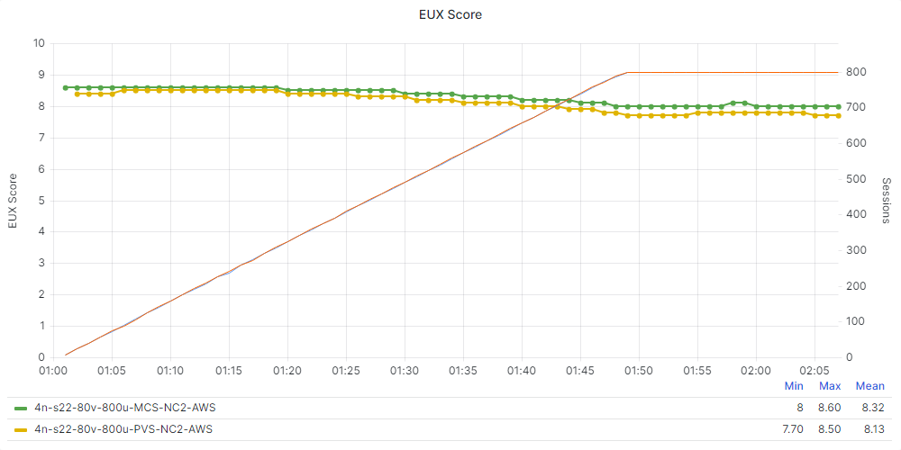

# Test Validation

Below you will find the detail and results of the performance testing completed for Citrix Virtual Apps and Desktops for the Windows Server Operating System on NC2 in AWS. Each test scenario was run a minimum of 3 times to ensure accuracy.

## Test Objectives
The overall objective was to determine the session capacity we could host on Nutanix Cloud Clusters using a Windows Server, version 21H2 image and running the Login Enterprise tests with Citrix Virtual Apps and Desktops. We tested with the Login Enterprise knowledge worker profile.

Our specific objectives were to:

- Determine the maximum number of sessions we can host on this system with the Login Enterprise Knowledge worker workload while maintaining a good EUX score.
- Determine the maximum number of users we can host in a steady-state situation with the CPU usage at its maximum of 85 percent.
- Show the linear scalability of the Nutanix platform.
- Show the differences between MCS and PVS on the Nutanix platform.

## Considerations for Test Results

- We used Citrix MCS to deploy the Windows Server VMs to validate linear scalability.
- We used Windows Server 2022, version 21H2 to test the infrastructure with Login Enterprise.
- We hosted 20 VMs per node with 10 users per VM.
- We tested using a single, full-HD screen as the client and limited the frames per second (FPS) to 16. Using multiple screens or other screen resolution settings affects the results.

## Linear scalability

The following graphs will show the linear scalability detail for the test runs. The tests were performed with 1, 2 and 4 nodes with 20 VMs per node and 200 sessions per node. The results show good EUX scores in all scenarios.

### EUX Scores

The following two charts detail the EUX Scores during the entire tests:

_Table: EUX Score MCS_ 

| Test Detail | EUX Score | 
| --- | --- | 
| 1n-s22-20v-200u-MCS-NC2-AWS | 8.20 | 
| 2n-s22-40v-400u-MCS-NC2-AWS | 8.10 | 
| 4n-s22-80v-800u-MCS-NC2-AWS | 8.10 | 

### Steady State Scores

The following two chart details the EUX Score during the steady state:

_Table: EUX Steady State Score MCS_ 

| Test Detail | EUX Score (Steady State) | 
| --- | --- | 
| 1n-s22-20v-200u-MCS-NC2-AWS | 8.11 | 
| 2n-s22-40v-400u-MCS-NC2-AWS | 8.04 | 
| 4n-s22-80v-800u-MCS-NC2-AWS | 8.01 | 

### Logon Time Scores

The following graphs will show the linear scalability detail for logon performance over the test runs. A lower result is better:

_Table: Login Times MCS_ 

| Test Detail | Average Logon Time | 
| --- | --- | 
| 1n-s22-20v-200u-MCS-NC2-AWS | 23.5 secs | 
| 2n-s22-40v-400u-MCS-NC2-AWS | 23.6 secs | 
| 4n-s22-80v-800u-MCS-NC2-AWS | 24.1 secs | 

<note>
During this testing we did not have Active Directory presence in the AWS region hosting the Nutanix Cluster therefore the elevated login time is expected as the authentication was traveling over the AWS VPN back to the on-premises data center.
</note>

### Application Performance

The following table shows the linear scalability detail for application performance over the test runs. A lower result is better.

_Table: Application Start Time MCS_ 

| Application Name (Start Time) - Seconds | 1 Node | 2 Node | 4 Node | 
| --- | --- | --- | --- |
| Outlook | 2.03 | 2.05 | 2.09 |
| Word | 0.89 | 0.91 | 0.94 | 
| Excel | 0.80 | 0.81 | 0.84 | 
| Powerpoint | 0.82 | 0.83 | 0.85 | 

_Table: Application Action MCS_ 

| Application Name (Action) - Seconds | 1 Node | 2 Node | 4 Node | 
| --- | --- | --- | --- | 
| Microsoft Edge (Logon) | 0.07 | 0.07 | 0.07 |
| Microsoft Word (Open Doc) | 0.79 | 0.80 | 0.80 | 
| Microsoft Excel (Save File) | 0.33 | 0.34 | 0.34 |

## MCS vs PVS

In this section we compare the results of a Login Enterprise test on 4 nodes, using MCS and PVS as the deployment method. 
Test Run Detail: 4 nodes with 80 VMs (200 sessions per node) for both MCS and PVS.

### EUX Scores
The following chart details the EUX Base score of the test (a higher score is better):

_Table: EUX Base Score MCS vs PVS_ 

| Test Detail | EUX Base Score | 
| --- | --- | 
| 4n-s22-80v-800u-MCS-NC2-AWS | 8.60 | 
| 4n-s22-80v-800u-PVS-NC2-AWS | 8.50 | 

The following two charts detail the EUX Scores during the entire test:

_Table: EUX Score MCS vs PVS_ 

| Test Detail | EUX Score | 
| --- | --- | 
| 4n-s22-80v-800u-MCS-NC2-AWS | 8.10 | 
| 4n-s22-80v-800u-PVS-NC2-AWS | 7.90 | 

### Steady State Scores

The following chart details the EUX Score during the steady state:

_Table: EUX Steady State Score MCS vs PVS_ 

| Test Detail | EUX Score (Steady State) | 
| --- | --- | 
| 4n-s22-80v-800u-MCS-NC2-AWS | 8.01 | 
| 4n-s22-80v-800u-PVS-NC2-AWS | 7.77 | 

### Logon Time Scores

The following graphs will show the linear scalability detail for login performance over the test runs.

### Application Performance
The following table shows the linear scalability detail for application performance.

_Table: Application Start Time MCS vs PVS_ 

| Application Name (Start Time - Seconds) | MCS | PVS | 
| --- | --- | --- | 
| Outlook | 2.09 | 2.14 | 
| Word | 0.94 | 1.03 | 
| Excel | 0.84 | 0.89 |
| Powerpoint | 0.85 | 0.93 | 

_Table: Application Action MCS vs PVS_ 

| Application Name (Action - Seconds) | MCS | PVS | 
| --- | --- | --- | 
| Microsoft Edge (Logon) | 0.07 | 0.08 |
| Microsoft Word (Open Doc) | 0.83 | 0.89 | 
| Microsoft Excel (Save File) | 0.34 | 0.35 | 

The following graphs are Login Enterprise EUX specific measurements. A higher score is better:

### CPU usage

### Cluster controller IOPS
The next chart shows the difference in Cluster Controller IOPS:

### Network Bandwidth

The next chart shows the network bandwidth usage by the AWS VPN during the test.

