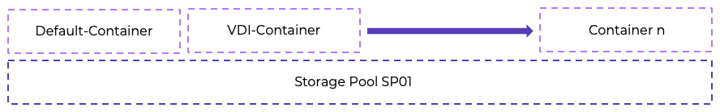

# Virtual Apps and Desktops on Nutanix

The Nutanix modular web-scale architecture lets you start small and expand to meet increasing demand (a node, a block, or multiple blocks at a time) with no impact on performance. This design removes the hurdle of a large initial infrastructure purchase, decreasing the time to value for your Virtual Apps and Desktops implementation. Running Citrix Virtual Apps and Desktops on Nutanix enables you to run multiple workloads, all on the same scalable converged infrastructure, while achieving these benefits:

Modular incremental scale

: With the Nutanix solution you can start small and scale up. A single Nutanix block provides dozens of terabytes of storage and hundreds to thousands of virtual desktops in a compact footprint. Given the modularity of the solution, you can granularly scale by node, by block, or with multiple blocks, accurately matching supply with demand and minimizing the upfront capex.

High performance

: By using system memory caching for read I/O and flash storage for read and write I/O, you can deliver high-performance throughput in a compact form factor. 

Change management

: Maintain environmental control and separation between development, test, staging, and production environments. Snapshots and fast clones can help share production data with nonproduction jobs without requiring full copies and unnecessary data duplication.

Business continuity and data protection

: User data and desktops are mission-critical and need enterprise-grade data management features, including backup and disaster recovery. 

Data efficiency

: AOS distributed storage offers both compression and deduplication to help reduce the storage footprint. The compression functionality is truly VM-centric. Unlike traditional solutions that perform compression mainly at the LUN level, the Nutanix solution provides all these capabilities at the VM and file levels, greatly increasing efficiency and simplicity. These capabilities ensure the highest possible compression and decompression performance, even below the block level. By providing both inline and post-process compression capabilities, the Nutanix solution breaks the bounds set by traditional compression solutions.

Enterprise-grade cluster management

: A simplified and intuitive approach to managing large clusters, including a converged GUI that serves as a central point for servers and storage, alert notifications, and the bonjour mechanism that automatically detects new nodes in the cluster. As a result, you can spend time enhancing your environment rather than maintaining it.

Time-sliced clusters

: Like public cloud environments, Nutanix can provide a truly converged cloud infrastructure, allowing you to run your server and desktop virtualization on a single cloud. Get the efficiency and savings you require with a converged cloud on a truly unified architecture.

## Virtual Apps and Desktops on NC2 with AWS
The following figures show the main architectural components of the Citrix Virtual Apps and Desktops on Nutanix solution and the communication path between services along with the high level architecture of running Nutanix Cloud Clusters on AWS. 
 

## Pod Design
The next table contains highlights from a high-level snapshot of the Citrix Virtual Apps and Desktops on Nutanix hosted virtual desktop pod.

_Table: Pod Design_ 

| Pod Purpose | Item | Quantity |
| --- | --- | --- |
| Control Pod | Delivery Controllers | 2 |
| Control Pod | StoreFront servers | 2 |
| Services Pod | AHV hosts | up to 28 |
| Services Pod | Nutanix Cloud Clusters | 1 |
| Services Pod | datastores | 1 |
| Services Pod | desktops | up to 4760 |

You can have a maximum of 28 AHV host nodes per NC2 on AWS instance. Citrix VAD Windows Desktop VDAs have 2 vCPU per VM and 170 VMs per node, with 4760 Windows Desktop VDAs per NCA instance. If you change the vCPU count, the numbers of Windows Desktop VDAs per node and per cluster change as well.

## Nutanix Compute and Storage

Nutanix provides an ideal combination of high-performance compute and localized storage to meet any demand. True to this capability, this reference architecture contains no reconfiguration or customization of the Nutanix product to optimize for this use case. The following figure shows a high-level example of the relationship between the Nutanix storage pool and containers.
 

The following table details the Nutanix storage pool and container configuration.

_Table: Storage Design_ 

| Name | Role | Details |
| --- | --- | --- |
| SP01 | Main storage pool for all data | NVMe |
| VDI | Container for all VMs | AHV datastore |
| Default-Container | Container for all data (not used here) | AHV datastore |
