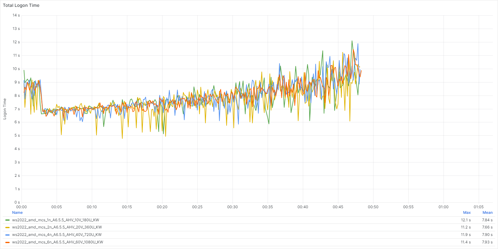
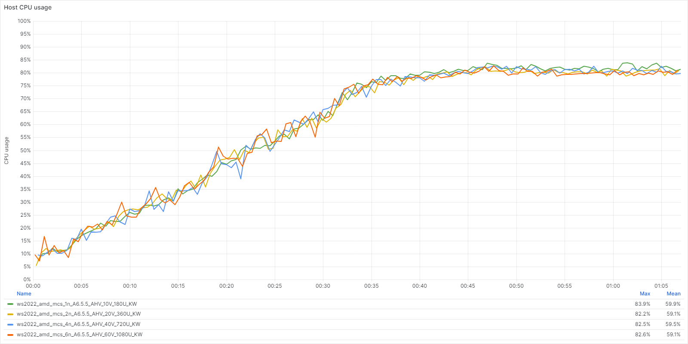
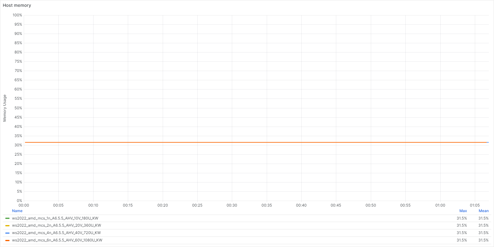
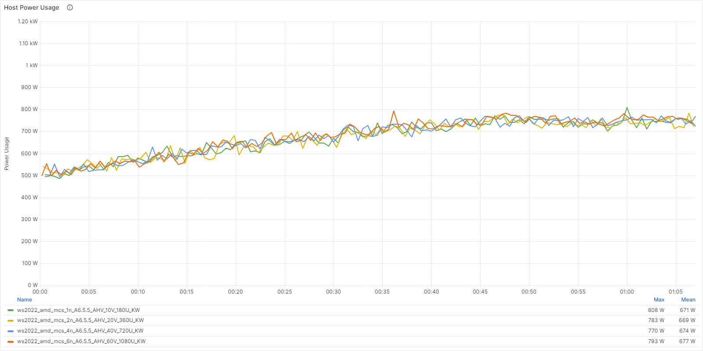

# Citrix Virtual Apps and Desktops on Nutanix Test Validation

This section provides the details and results of our Citrix Virtual Apps and Desktops performance tests on Lenovo ThinkAgile HX665 V3 CN nodes with Nutanix AHV. We ran each test scenario at least 3 times to ensure accuracy.

## Test Objectives

Our objective was to determine the session capacity we could host on Nutanix using a Windows VDA image and running the Login Enterprise tests with Citrix Virtual Apps and Desktops. We tested with the Login Enterprise Knowledge Worker profile.

Objectives:

-  Determine the maximum number of sessions we can host on this system with the Login Enterprise Knowledge Worker workload while maintaining a good user experience.
-  Show the linear scalability of the Nutanix platform.
-  Show the Power Usage in Watts of the Nutanix platform.
-  Show the differences between Machine Creation Services and Citrix Provisioning on the Nutanix platform.

Testing parameters:

-  We used Citrix MCS and PVS to deploy the Windows VMs to validate linear scalability.
-  We tested using a single, full-HD screen with the default Citrix frames per second configuration. Using multiple screens or other screen resolution settings affects the results.

## Boot Storm Simulation

We used the following hosting connection settings for our boot storm simulation test.

_Table: Hosting Connection Settings_ 

| Setting | Detail |
| --- | --- |
| Simultaneous Actions (Absolute) | 100 |
| Simultaneous Actions (Percentage) | 20 % |
| Max New Actions per Minute (Absolute) | 50 |

We started 60 Windows Server session hosts on six Lenovo ThinkAgile HX665 V3 CN nodes. The following table shows the performance results of this test.

_Table: Boot Storm Simulation: Six Node MCS Test_

| Measurement | Detail |
| --- | --- |
| Maximum CPU Usage | 82.9 % |
| Average CPU Usage | 59.1 % |
| Average Controller IOPS | 20,976 |
| Boot Time | 2.6 minutes |

## Linear Scalability

The following section shows the linear scalability of the Nutanix platform. We performed the tests with one, two, four, and six nodes with 10 Windows Server 2022 VMs per node. The results display average timings and show good user experience in all scenarios.

### Linear Scalability Logon Phase

The following charts detail the user experience during the logon phase of the test. A lower result represents better performance.

_Table: Linear Scalability Logon Phase: Logon Times_

| Measurement | 1 Node | 2 Nodes | 4 Nodes | 6 Nodes |
| --- | --- | --- | --- | --- | 
| Average Logon Time |  7.8 seconds | 7.7 seconds | 7.9 seconds | 7.9 seconds | 
| User Profile Load | 0.7 seconds | 0.7 seconds | 0.8 seconds | 0.8 seconds | 
| Group Policies | 1.2 seconds | 1.2 seconds | 1.2 seconds | 1.2 seconds | 
| Connection | 3.0 seconds | 3.0 seconds | 3.1 seconds | 3.1 seconds | 

The following chart displays the login times across the tests. A lower result represents a better experience.

The following shows the linear scalability of application performance over the test runs. A lower result represents better performance.

_Table: Linear Scalability Logon Phase: App Start Times_

| Application Name | 1 Node | 2 Nodes | 4 Nodes | 6 Nodes |
| --- | --- | --- | --- | --- |
| Microsoft Outlook | 1.96 seconds | 1.88 seconds | 1.95 seconds | 1.95 seconds | 
| Microsoft Word | 0.91 seconds | 0.87 seconds | 0.95 seconds | 0.93 seconds |
| Microsoft Excel | 0.75 seconds | 0.71 seconds | 0.77 seconds | 0.76 seconds |
| Microsoft PowerPoint | 0.78 seconds | 0.72 seconds | 0.79 seconds | 0.79 seconds | 

_Table: Linear Scalability Logon Phase: Specific Action Times_

| Application Name (Action) | 1 Node | 2 Nodes | 4 Nodes | 6 Nodes |
| --- | --- | --- | --- | --- |
| Microsoft Edge (Page Load) | 1.02 seconds | 0.96 seconds | 1.02 seconds | 1.02 seconds | 
| Microsoft Word (Open Doc) | 0.77 seconds | 0.71 seconds | 0.77 seconds | 0.76 seconds |
| Microsoft Excel (Save File) | 0.37 seconds | 0.36 seconds | 0.37 seconds | 0.37 seconds | 

### Linear Scalability Steady State

The following tables detail the user experience during the steady state of the test. A lower result represents better performance.

_Table: Linear Scalability Steady State Phase: App Start Times_

| Application Name | 1 Node | 2 Nodes | 4 Nodes | 6 Nodes |
| --- | --- | --- | --- | --- | 
| Microsoft Word | 1.17 seconds | 1.07 seconds | 1.16 seconds | 1.16 seconds | 
| Microsoft Excel | 0.94 seconds | 0.86 seconds | 0.92 seconds| 0.93 seconds | 
| Microsoft PowerPoint | 0.94 seconds | 0.82 seconds | 0.90 seconds | 0.89 seconds | 

_Table: Application Performance Linear Scale Steady State Phase: Specific Action (in Seconds)_

| Application Name (Action) | 1 Node | 2 Nodes | 4 Nodes | 6 Nodes |
| --- | --- | --- | --- | --- |
| Microsoft Edge (Page Load) | 1.22 seconds | 1.15 seconds | 1.26 seconds | 1.22 seconds | 
| Microsoft Word (Open Doc) | 0.96 seconds | 0.87 seconds | 0.94 seconds | 0.93 seconds | 
| Microsoft Excel (Save File) | 0.41 seconds | 0.40 seconds | 0.42 seconds | 0.42 seconds | 

### Single Node Host Resources

The following tables detail the host utilization of a single node during the entire duration of the test, both boot and steady state phases. We tested 10 VMs per Node with 180 users per VM and captured the following metrics.

| Host Metric | Max | Average |
| --- | --- | --- |
| Host CPU Usage | 82.6 % | 59.1 % |
| Host Memory Usage | 31.5 % | 31.5 % |
| Host Power Usage | 793 W | 677 W |

The following charts detail the host utilization during the entire test duration, both the boot and steady state phases.

## Citrix MCS vs. PVS

In this section, we compare the results of a Login Enterprise test on six nodes, using Machine Creation Services (MCS) and Citrix Provisioning (PVS) as the deployment methods.

### MCS vs. PVS System Performance

The following charts show the overall system performance during the entire test run.

<!--JK: These need to be updated-->

<!--JK: These need to be updated-->

<!--JK: These need to be updated-->

The following table provides the averages for the overall system performance results displayed in the graphs above.

_Table: System Performance MCS vs. PVS: System Performance Summary_

| Measurement | MCS | PVS |
| --- | --- | --- | 
| CPU Usage | `TBD` % | `TBD` % |
| CPU Ready Time | `TBD` % | `TBD` % |
| Controller Read IOPS | `TBD` | `TBD` | 
| Controller Write IOPS | `TBD` | `TBD` | 
| Controller Latency | <1 ms | <1 ms | 

### MCS vs. PVS Logon Phase

The following charts detail the user experience during the logon phase.

#### Logon Time Scores

The following shows the logon times over the test runs. A lower result represents better performance.

_Table: Logon Performance MCS vs. PVS Logon Phase: Logon Times_

| Measurement | MCS | PVS |
| --- | --- | --- | 
| Average Logon Time | `TBD` seconds | `TBD` seconds |
| User Profile Load | `TBD` seconds | `TBD` seconds | 
| Group Policies | `TBD` seconds | `TBD` seconds |
| Connection | `TBD` seconds | `TBD` seconds | 

The following chart displays the login times across the tests. A lower result represents a better experience.

<!--JK: This needs to be updated-->

The following tables show the details for application performance during the logon phase of the test. A lower result represents better performance.

_Table: Application Performance MCS vs. PVS Logon Phase: App Start Times_

| Application | MCS | PVS | 
| --- | --- | --- | 
| Microsoft Outlook | `TBD` seconds | `TBD` seconds | 
| Microsoft Word | `TBD` seconds | `TBD` seconds |
| Microsoft Excel | `TBD` seconds | `TBD` seconds |
| Microsoft PowerPoint | `TBD` seconds | `TBD` seconds | 

_Table: Application Performance MCS vs. PVS Logon Phase:  Specific Action Times_

| Application (Action) | MCS | PVS | 
| --- | --- | --- | 
| Microsoft Word (Open Doc) | `TBD` seconds | `TBD` seconds |
| Microsoft Excel (Save File) | `TBD` seconds | `TBD` seconds |

### MCS vs. PVS Steady State

The following tables show the details for application performance during the steady state of the test. A lower result represents better performance.

_Table: MCS vs. PVS Steady State Phase: App Start Times_

| Application | MCS | PVS | 
| --- | --- | --- | 
| Microsoft Word | `TBD` seconds | `TBD` seconds | 
| Microsoft Excel | `TBD` seconds | `TBD` seconds |
| Microsoft PowerPoint | `TBD` seconds | `TBD` seconds |

_Table: MCS vs. PVS Steady State Phase: Specific Action Times_

| Application (Action) | MCS | PVS | 
| --- | --- | --- | 
| Microsoft Edge (Page Load) | `TBD` seconds | `TBD` seconds |
| Microsoft Word (Open Doc) | `TBD` seconds | `TBD` seconds |
| Microsoft Excel (Save File) | `TBD` seconds | `TBD` seconds |