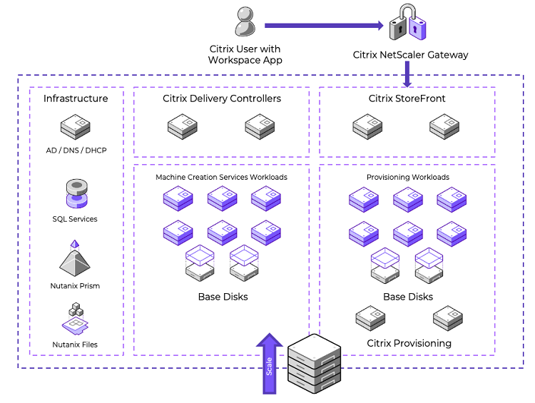
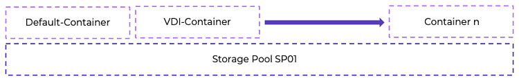

## Citrix Virtual Apps and Desktops on Nutanix AHV with Nutanix Cloud Platform

The following figure shows the main architectural components of the Citrix Virtual Apps and Desktops on Nutanix solution and the communication path between services. 
 

## Pod Design

The following tables contain high-level details of the Citrix Virtual Apps and Desktops on Nutanix hosted virtual desktop pod.

_Table: Control Pod Details_

| Item | Quantity |
| --- | :---: |
| Delivery Controllers | 2 |
| StoreFront servers | 2 |

_Table: Services Pod Details_

| Item | Quantity |
| --- | :---: |
| Nutanix hosts | 16 |
| Nutanix clusters | 1 |
| Datastores | 1 |
| Sessions | Up To XXXX |

We recommend having a maximum of 16 Nutanix AHV host nodes per cluster. We validated Citrix Virtual Apps and Desktops LTSR 2203 CU4, using 2 vCPU and 4 GB of memory per VM and XXXX VMs per node. When you use 8 Nutanix AHV host nodes, you can run up to XXXX VDAs per Nutanix AHV cluster.

<note>
Note: Limiting the cluster sizes to 16 nodes reduces the failure domain and the time to patch and update the clusters. This reference architecture uses 16-node building blocks to take advantage of single-rack design, smaller failure domain, and reduced time to patch and update.
</note>

<note>
This calculation reserves one node as a spare (n + 1).
</note>

We based the sizing of this pod design on the Login Enterprise Knowledge Worker workload. A more resource-intensive workload results in a lower density, and a less resource-intensive workload results in a higher density. If you change the vCPU count or memory, the number of VDAs per node and per cluster changes as well.

## Nutanix Compute and Storage

Nutanix provides an ideal combination of high-performance compute and localized storage to meet any demand. True to this capability, this reference architecture contains no reconfiguration or customization of the Nutanix product to optimize for this use case. The following figure shows a high-level example of the relationship between the Nutanix storage pool and containers.
 

The following table details the Nutanix storage pool and container configuration.

_Table: Nutanix Storage Configuration_

| Name | Role | Details |
| --- | --- | --- |
| SP01 | Main storage pool for all data | SSD + HDD |
| VDI | Container for all VMs | Nutanix datastore |
| Default-Container | Container for all data (not used here) | Nutanix datastore |