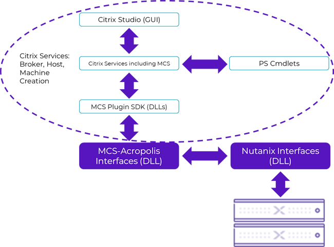
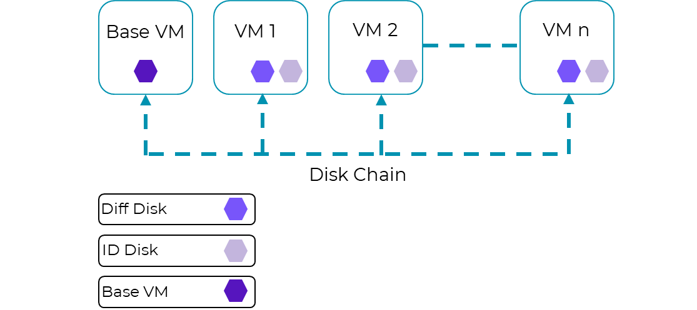

# Citrix Desktop as a Service Overview

Citrix Desktop as a Service (DaaS) is a desktop virtualization solution that transforms desktops and applications into secure, on-demand services available to any user, anywhere, on any device. With Citrix DaaS, you can deliver individual Windows, web, software as a service (SaaS) applications, and even full virtual desktops to PCs, Macs, tablets, smartphones, laptops, and thin clients with a high-definition user experience.

Citrix DaaS provides a complete virtual desktop and application delivery system by integrating several distributed components with advanced configuration tools that simplify the creation and real-time management of the virtual desktop infrastructure (VDI).

The following are the core components of Citrix DaaS. For more detailed information about these components, as well as best practices for running them on Nutanix, see the [Citrix DaaS on Nutanix best practice guide](https://portal.nutanix.com/page/documents/solutions/details?targetId=BP-2062-Citrix-Virtual-Apps-and-Desktops-Service:BP-2062-Citrix-Virtual-Apps-and-Desktops-Service).

Cloud Connector
: The Cloud Connector runs on servers in the datacenter and serves as a communication channel between Citrix DaaS and the datacenter. It enables authentication by allowing you to use Active Directory forests and domains, supports Citrix DaaS resource publishing, and facilitates machine catalog provisioning while removing the need to manage Citrix DaaS delivery infrastructure components such as Delivery Controllers, SQL Server, Director, StoreFront, Licensing, and Citrix Gateway.

Studio
: Citrix Studio is the management console that allows you to configure and manage your Citrix DaaS environment. It provides different wizard-based deployment or configuration scenarios to publish resources using desktops or applications.

Machine Creation Services (MCS)
: Machine Creation Services is the building mechanism of the Citrix Delivery Controller that automates and orchestrates desktop deployment using a single image. MCS communicates with the orchestration layer of your hypervisor, providing a robust and flexible method of image management.

Provisioning
: Citrix Provisioning creates and provisions virtual desktops from a single desktop image on demand, optimizing storage utilization and providing a pristine virtual desktop to each user every time they log on. Desktop provisioning also simplifies desktop images, provides optimal flexibility, and offers fewer points of desktop management for both applications and desktops.

Virtual Delivery Agent (VDA)
: The Virtual Delivery Agent is installed on virtual desktops and enables direct FlexCast Management Architecture (FMA) connections between the virtual desktop and user devices.

Workspace app
: The Citrix Workspace app, installed on user devices, enables direct HDX connections from user devices to applications and desktops using Citrix DaaS. The Citrix Workspace app allows access to published resources from your desktop, Start menu, web browser, or Citrix Workspace app user interface.

FlexCast
: Citrix DaaS with FlexCast delivers virtual desktops and applications tailored to meet the diverse performance, security, and flexibility requirements of every worker in your organization. Centralized, single-instance management helps you deploy, manage, and secure user desktops more easily and efficiently.

## Provisioning Software Development Kit

The Citrix Provisioning Software Development Kit (SDK) is a recent addition to the Citrix DaaS platform for developers and technology partners. It applies the power and flexibility of Citrix-provisioned VMs to any hypervisor or cloud infrastructure service you choose.

The SDK enables you to create your own Provisioning plug-in, which you can add to the plug-ins installed by default with the Citrix DaaS products. Once you install your plug-in, the Cloud Connector services discover and load it automatically. It then appears as a new connection type in Citrix Studio, allowing you to easily connect, configure, and provision on your infrastructure platform using two key features:

- A set of .NET programming interfaces used to call your Provisioning plug-in whenever it needs to act. Your plug-in takes the form of a .NET assembly (DLL) that implements these interfaces. A plug-in must implement several .NET interfaces, which are small and easy to understand. Most interfaces have both a synchronous and an asynchronous variant, allowing you to choose the programming pattern that works best.
- The Citrix Common Capability Framework, which provides information to the product about the specific custom features of your infrastructure and how to display those features in Citrix Studio. The framework uses a high-level XML-based description language. Your plug-in uses this language to produce specifications that allow Citrix Studio to intelligently adapt its task flows and wizard pages.

The plug-in made with the Citrix Provisioning SDK allows you to create the connection between Citrix Studio and AHV and gives you access to all the APIs offered through AHV. However, before you can use it, you need to install the Nutanix AHV plug-in for Citrix DaaS on Cloud Connectors.

### Nutanix AHV Plug-in for Citrix DaaS on Cloud Connectors

We designed the Nutanix AHV plug-in for Citrix DaaS on Cloud Connectors (also called the MCS plug-in SDK) to create and manage Citrix-provisioned VMs in a Nutanix AHV infrastructure environment. We developed the plug-in based on the Citrix-defined plug-in framework.

Install the Nutanix AHV plug-in for Citrix DaaS (MCS plug-in SDK) on all Cloud Connectors in the Citrix DaaS resource locations where you've deployed Nutanix AHV. As of the Citrix DaaS April 2022 release, you no longer need to install the Nutanix AHV plug-in for Citrix on all Cloud Connectors in all resource locations in the instance. Citrix changed the configuration sequence to require selecting the resource location or zone before selecting the connection type, so you only need the Nutanix AHV plug-in for Citrix in the resource location or zone with AHV. The Connection type dropdown list only displays hosting resources available in the resource location or zone. This integration results in the architecture shown in the following figure.

<note>We frequently update the Nutanix AHV plug-in for Citrix with fixes and new functionality and to accommodate changes between Citrix DaaS releases. We recommend that you update your plug-in installations whenever we update the plug-in to ensure continued functionality. Don't use different versions of the Nutanix AHV plug-in for Citrix on Cloud Connectors in the same Citrix DaaS instance.</note>

When you load the Nutanix AHV plug-in on an existing Citrix DaaS Cloud Connector installation, you receive the additional services to deploy and manage your desktops from the Citrix DaaS Web Studio on a Nutanix AHV cluster and have the full native integration that Nutanix supports for Microsoft System Center Virtual Machine Manager (SCVMM) and VMware vCenter.

### Deployment Mechanism in Citrix DaaS

Each VM that you create from the base has two disks assigned to it: an identity disk and a difference disk. Each VM has a disk chain to the base VM template with the recovery point you used to create the deployed VMs.

- Base VM: A single base disk that resides on a shared datastore that's mounted on the hosts in the cluster and configured with the Citrix Studio host connection
- Identity disk (or ID disk): A very small disk (16 MB maximum) that contains identity information. This information provides a unique name for the VM and allows it to join Active Directory
- Difference disk (write cache): A disk that separates the writes from the base disk (the system still acts as if the write has been committed to the base disk)

The identity disk and the difference disk together make the provisioned VM unique.