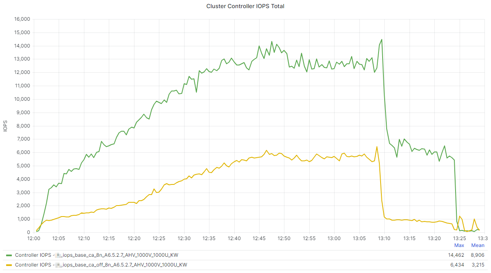
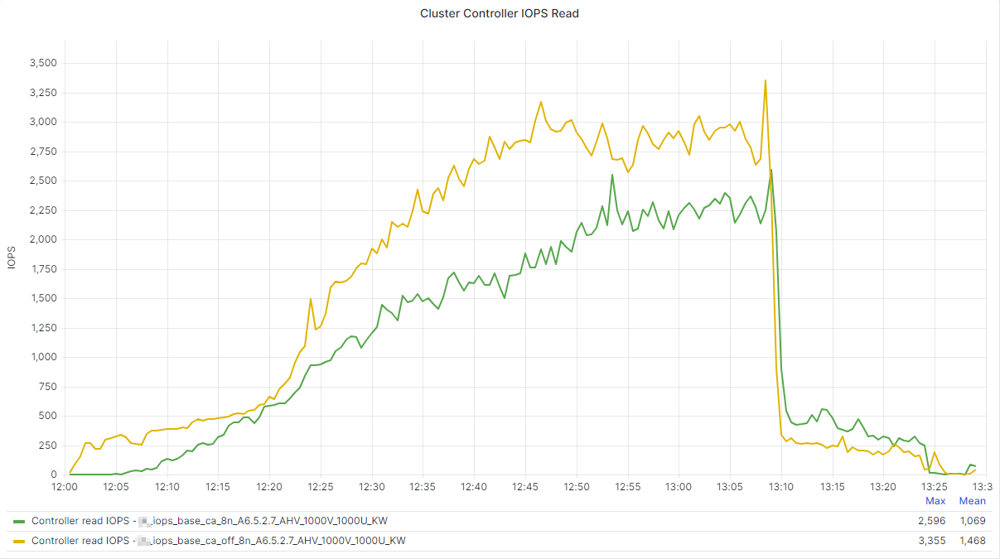
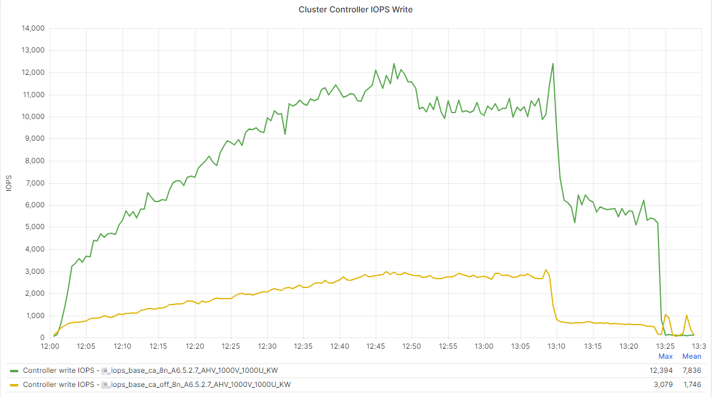

# Testing Logic

## Login Enterprise

We used Login Enterprise 5.1.2 to perform multiple 1000 concurrent session tests against the environment.

We utilized the following personas:

- [Knowledge Worker 2022](https://support.loginvsi.com/hc/en-us/articles/6949191203740-Knowledge-Worker-Out-of-the-box)

Initially we baselined Nutanix Files with different configuration options to identify the best configuration for the file server. We then tested various configurations associated with FSLogix Containers.

Where appropriate, when we changed an FSLogix configuration option, we ran a corresponding test three times. We wanted to measure the impact of "new user profile creation" on Run 1 and then "existing user profile" impacts on run 2 and 3 for each change. We deleted all user profile after the third run of each test.

## Test Environment

In this section, we describe the hardware we used for this tech note.

### Login Enterprise Launcher Cluster

To initiate the sessions to the virtual desktops, Login Enterprise uses launcher VMs. Depending on the display protocol used, one launcher VM can host up to 25 sessions. For this reference architecture, we used one Nutanix NX-3060-G7 cluster with four nodes to host 75 launcher VMs. Each launcher VM had 4 vCPU and 6 GB of memory.

### Virtual Desktop Cluster

Eight Nutanix NX-3170-G8 nodes formed the cluster to host all virtual desktops. The next tables contain the specifications of this cluster.

_Table: Virtual Desktop Cluster Specifications_

| **Parameter** | **Setting** |
| --- | --- |
| Block type | Nutanix NX-3170-G8 |
| Number of blocks | 8 |
| Number of nodes | 8 |
| CPU type | Intel Xeon Gold 6342 |
| Number of CPUs per node | 2 |
| Number of cores per CPU | 24 |
| Memory per node | 1,536 GB |
| Disk config per node | 6 × 1.9 TB SSD |
| Network | 2 × 25 GbE |

_Table: Nutanix Software Specifications_

| **Parameter** | **Setting** | 
| --- | --- |
| Nutanix AHV version | 20220304.423 |
| Nutanix AOS version | 6.5.3.6 LTS |
| CVM vCPU | 12 |
| CVM memory | 32 GB |
| Redundancy factor | 2 |
| Number of containers for worker VMs | 1 |
| Datastore specifications | Compression: On; Compression delay: 0; Deduplication: Off |

### Nutanix Files Cluster

_Table: Nutanix Files Cluster Specifications_

| **Parameter** | **Setting** |
| --- | --- |
| Block type | Nutanix NX-3155G-G8 |
| Number of blocks | 4 |
| Number of nodes | 4 |
| CPU type | Intel Xeon Gold 6354 |
| Number of CPUs per node | 2 |
| Number of cores per CPU | 18 |
| Memory per node | 1,024 GB |
| Disk config per node | 6 × 1.9 TB SSD |
| Network | 2 × 25 GbE |

_Table: Nutanix Software Specifications_

| **Parameter** | **Setting** | 
| --- | --- |
| Nutanix AHV version | 20220304.420 |
| Nutanix AOS version | 6.5.3.5 LTS |
| CVM vCPU | 12 |
| CVM memory | 32 GB |
| Redundancy factor | 2 |
| Datastore specifications | Compression: On; Compression delay: 0; Deduplication: Off |

### FSLogix Container Storage Configuration

We deployed Nutanix Files to support the User Profile repository. We tested a single File Server configuration deployed on an All-Flash cluster.

The following configuration was used for Nutanix Files:

_Table: FSLogix Container Storage Configuration_

| Component | Setting |
| --- | --- |
| Platform | Nutanix AHV |
| Version | 4.3.0.1 |
| FSVM count | 3 |
| Size | 4vCPU/12GiB |
| Share Type | Distributed |

This configuration was mirrored for Cloud Cache testing scenarios with a second cluster.

## FSLogix Base Settings

The following relevant options were enabled as part of the FSLogix Profile Container Group Policy base configuration.

| Setting | State | 
| --- | --- |
| Logging | Enabled: All Logs |
| Enabled | Enabled |
| Is Dynamic (VHD) | Enabled |
| Profile Type | Normal Profile |
| Set Temp Folders to Local Path | Redirect TEMP, TMP and INetCache to local drive |
| Flip Flop Profile Directory Name | Enabled |
| Volume Type | VHDX |
| Roam Search Database | Single-User Search |
| VHD Locations | `\\NutanixFiles\Share\` |

Additionally, a basic `redirections.xml` was used to mirror what many customer environments have in place. Given that `redirections.xml` files are specific to each environment, we are not documenting the specifics of the file.

## Test Results

### Nutanix Files Baseline Configuration Tests

The purpose of these tests was to determine the best baseline configuration for Nutanix Files. The following configurations were tested.

_Table: Baseline Testing: Files Share Configuration_

| **Share Type** | **ABE** | **CA** | **Encryption** | **Graph Test Name Reference** |
| --- | --- | --- | --- | --- |
| Distributed | Off | Off | Off | Windows 10 Profile FSLogix - Files All Off |
| Distributed | Off | On | Off | Windows 10 Profile FSLogix - Files CA On |
| Distributed | On | On | On | Windows 10 Profile FSLogix - Files All On |

The metrics below are captured from the second run of each test, where containers have already been created.

### Workload Cluster Results

The below table shows the breakdown of the Cluster CPU usage (Steady State) on the workload cluster during the tests. 

_Table: Baseline Testing: Cluster CPU Usage Steady State_

|  | **Cluster CPU (Steady State)** | **Difference in %** |
| --- | --- | --- |
| Windows 10 Profile FSLogix - Files All Off | 77.2% | Baseline Value|
| Windows 10 Profile FSLogix - Files CA On | 76.4% | 1.1% Lower CPU Usage |
| Windows 10 Profile FSLogix - All On | 77.4% | 0.3% Higher CPU Usage |

The following table shows the Cluster IOPS breakdown on the workload cluster during the tests.

_Table: Baseline Testing: Cluster IOPS Usage_

| **Test** | **Controller IOPS (Average)** | **Difference in %** |
| --- | --- | --- |
| Windows 10 Profile FSLogix - Files All Off | 11,432 | Baseline Value |
| Windows 10 Profile FSLogix - Files CA On | 11,521 | 0.77% Higher | 
| Windows 10 Profile FSLogix - Files All On | 11,480 | 0.42% Higher |

This table shows the Login Time details from the tests.

_Table: Baseline Testing: Logon Time_

| **Test** | **Result (Average)** | **Difference in %** |
| --- | --- | --- |
| Windows 10 Profile FSLogix - Files All Off | 17.2 seconds | Baseline Value |
| Windows 10 Profile FSLogix - Files CA On | 17.4 seconds | 1.16% slower |
| Windows 10 Profile FSLogix - All On | 17.4 seconds | 1.16% slower |

Finally, you can see the breakdown of the Microsoft Word Open Document process start during the steady state portion of the tests.

_Table: Baseline Testing: Microsoft Word Open Document Steady State_

| **Test** | **Result (Steady State)** | **Difference in %** |
| --- | --- | --- |
| Windows 10 Profile FSLogix - Files All Off | 1.03 seconds| Baseline Value |
| Windows 10 Profile FSLogix - Files CA On | 1.03 seconds | Equal | 
| Windows 10 Profile FSLogix - Files All On | 1.04 seconds | 0.97% slower |

The tables above show minimal difference in performance for the workload cluster when enabling the 3 additional features on a Nutanix File Share. 

### Nutanix Files Results

The below tables outline the baseline testing scenario impacts on the Nutanix Files deployment:

_Table: Baseline Testing: Files IOPS_

| **Test** | **Result (Average)** | **Difference in %** |
| --- | --- | --- |
| Windows 10 Profile FSLogix - Files All Off | 12,856 | Baseline Value |
| Windows 10 Profile FSLogix - Files CA On | 7,414 | 42.33% | 
| Windows 10 Profile FSLogix - Files All On | 7,946 | 38.24% |

<note>
Whilst the data indicates a reduction in IOPS when enabling Continuous Availability on Shares, this is not the entire story. Whilst the data pulled from the Nutanix Files API shows a reduction, the actual IO load is moved across the the Nutanix Cluster hosting the Files deployment and is represented under the Controller IOPS count of the Cluster itself.
</note>

_Table: Baseline Testing: Files Latency_

| **Test** | **Result (Average)** | **Difference** |
| --- | --- | --- |
| Windows 10 Profile FSLogix - Files All Off | 0.2 ms | Baseline Value |
| Windows 10 Profile FSLogix - Files CA On | 1.03 ms | 415% | 
| Windows 10 Profile FSLogix - Files All On | 0.97 ms | 385% |

_Table: Baseline Testing: Files Throughput_

| **Test** | **Result (Average)** | **Difference** |
| --- | --- | --- |
| Windows 10 Profile FSLogix - Files All Off | 187 MB/s | Baseline Value |
| Windows 10 Profile FSLogix - Files CA On | 159 MB/s | 15.02% | 
| Windows 10 Profile FSLogix - Files All On | 171 MB/s | 8.56% |

### Impact of Continuous Availability on IOPS

As mentioned in the above note, when enabling Continuous Availability on a Nutanix Files share, there is a change in IO placement. The following outlines the impact of a baseline run with CA on by comparing to a baseline run where CA is off. These results are captured from the Nutanix Cluster hosting the Nutanix Files deployment.

_Table: Baseline Testing: CA Impact on Cluster IOPS (Averages)_

| | **Continuous Availability On** | **Continuous Availability Off** | **Rough Impact** |
| --- | --- | --- | --- |
| Cluster Controller IOPS Total | 9,946 | 3,872 | 6074 more with CA On |
| Cluster Controller Read IOPS | 1,247 | 1,810 | 563 less with CA On |
| Cluster Controller Write IOPS | 8,699 | 2,062 | 6,637 more with CA On |
| Nutanix Files IOPS Total | 7,414 | 12,856 | 5,442 less with CA On |
| Nutanix Files Read IOPS | 2,848 | 5,660 | 2,812 less with CA on |
| Nutanix Files Write IOPS | 4,550 | 7,181 | 2,631 less with CA On |
| Nutanix Files Metadata IOPS | 12 | 13 | 1 less with CA On |

<!--JK:, Sven the above table may have more clear impact if we remove the breakdown or Write vs Read, however I will lave that up to you on what you think is best-->

There are other considerations around the Cluster Controller IOPS count such as additional processes and services that may be running on the Cluster. Whilst the numbers above are not a direct match, what the data shows is that when CA is enabled, the Write IOPS is reduced considerably from a FSVM view point, and moved to the Cluster Controllers. CA enabled shares have less Read IOPS overheads on the FSVM and the Cluster Controllers.

The graphs below show an extended view of the Cluster Controller data, including the full ramp up and ramp down of the tests:

The above information should be taken into consideration when reviewing the findings in the next section of this document. Our data collection is focused on the Nutanix File Server VMs from a performance perspective.
