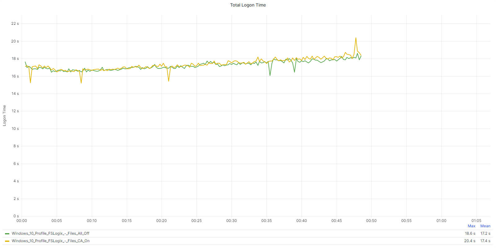
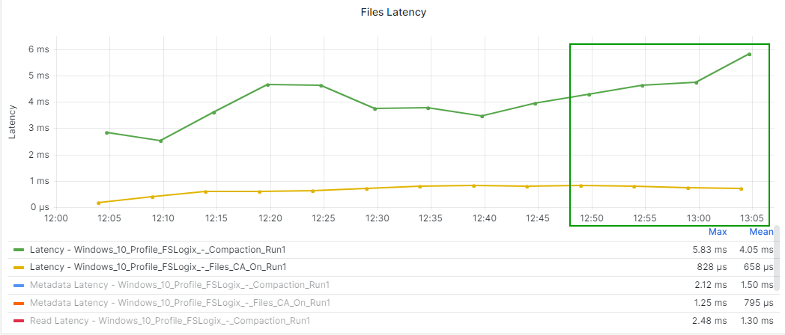

# FSLogix Profiles Configuration Tests - VHD Locations

Our baseline configuration based on performance and resiliency are outlined below for FSLogix with Nutanix Files:

_Table: Nutanix Share Configuration Baseline Settings_

| **Component** | **Setting** |
| --- | --- |
| Access Based Enumeration | Disabled |
| Encryption | Disabled |
| Continuous Availability | Enabled |
| Compression | Enabled |

<note>
Access Based Enumeration and Encryption may be required in some environments. Our testing identifies minimal performance impacts when enabling these features. We recommend additional testing when enabling encryption to ensure there is no inter-operability validation issues with other software products in your environment.
</note>

## FSLogix Profiles with Nutanix Files Continuous Availability (Mode 0)

The purpose of this test was to identify the impact of Nutanix Files `Continuous Availability` both **Enabled** and **Disabled**. We used FSLogix Profiles with a Direct Attach (Mode 0) configuration. We measured the mount operation rather than the create operation.

_Table FSLogix Test Configuration_

| **Containers** | **Operation Mode** | **Measurements** |
| --- | --- | --- |
| Profile Only | Mode 0 - Direct Attach | Mount Operation |

_Table: Test Run Information_

| **Test Name** | **Detail** | 
| --- | --- |
| Windows 10 Profile FSLogix - Files All Off | CA Disabled | 
| Windows 10 Profile FSLogix - Files CA On | CA Enabled |

The following tables and graphs show the difference between CA being **Enabled** and **Disabled** on the workload cluster.

_Table: FSLogix Profiles CA vs No CA comparison: Logon Time Metrics (Averages)_

|  | **Windows 10 Profile FSLogix - Files All Off** | **Windows 10 Profile FSLogix - Files CA On** |
| --- | --- | --- |
| Total Login | 17.2 seconds | 17.4 seconds | 
| User Profile | 0.1 seconds | 0.1 seconds | 
| Group Policies | 1.93 seconds | 1.92 seconds | 
| Connection | 3.84 seconds | 3.98 seconds | 

_Table: FSLogix Profiles CA vs No CA comparison: Cluster Performance Summary during tests (Averages)_

|  | **Windows 10 Profile FSLogix - Files All Off** | **Windows 10 Profile FSLogix - Files CA On** |
| --- | --- | --- |
| CPU Usage | 54.7% | 54.2% |
| Memory Usage | 36.4% | 36.4% |
| Controller IOPS | 17,730 | 17,736 |
| Controller Write IOPS | 7,500 | 7,504 |
| Controller Read IOPS | 10,229 | 10,232 |
| Controller Latency | < 1ms | < 1ms |
| Controller Write IO Latency | < 1ms | < 1ms |
| Controller Read IO Latency | < 1ms | < 1ms |

CPU usage during steady state is the average CPU usage during the steady state, or the state when all the sessions are active and using applications. This state simulates user activity during the entire day, rather than just during the logon period.

_Table: FSLogix Profiles CA vs No CA comparison: Cluster CPU (Steady State)_

|  | **Cluster CPU (Steady State)** | **Difference in %** |
| --- | --- | --- |
| Windows 10 Profile FSLogix - Files All Off | 77.2% | 0.8% Higher CPU Usage |
| Windows 10 Profile FSLogix - Files CA On | 76.4% | Lowest CPU Value |

The following tables and graphs show the difference between CA being **Enabled** and **Disabled** from a Nutanix Files perspective.

_Table: FSLogix Profiles CA vs No CA comparison: Nutanix Files Metrics_

|  | **Windows 10 Profile FSLogix - Files All Off** | **Windows 10 Profile FSLogix - Files CA On** |
| --- | --- | --- |
| Nutanix Files Iops | 12,856 | 7,414 |
| Nutanix Files Latency | < 1ms | 1.03 ms |
| Nutanix Files Throughput | 187 MB/s | 159 MB/s |

### Key Takeaways

-  `Continuous Availability` provides resiliency which is critical for container workloads, any performance impact should be weighed against the impact of not having continuity on the file share hosting containers.
-  With `Continuous Availability` **Enabled**, there is a minor impact to the workload cluster hosting the VDAs. The difference is negligible and the graphs indicate almost identical resource patterns across both **Enabled** and **Disabled** configurations.
-  With `Continuous Availability` **Enabled**, the Nutanix Files deployment reports a significantly less throughput and IO profile than when CA is **Disabled**. This is due to CA handing load over to the Cluster Controllers hosting the Nutanix Files deployment. There is very minimal Latency difference between both scenarios.
-  The user logon experience impact was negligible with `Continuous Availability` **Enabled**.
-  With FSLogix Container workloads, Nutanix always recommend the use of `Continuous Availability` when Cloud Cache is not used.

## FSLogix Profiles Creation vs Mount (Mode 0)

The purpose of this test was to identify the differences between the create and mount phases. We used FSLogix Profiles with a Direct Attach (Mode 0) configuration and compared the create and mount operations.

_Table FSLogix Test Configuration_

| Containers | Operation Mode | Measurements |
| --- | --- | --- |
| Profile Only | Mode 0 - Direct Attach | Create vs Mount Operation |

_Table: Test Run Information_

| **Test Name** | **Detail** | 
| --- | --- |
| Windows 10 Profile FSLogix - Files CA On | CA Enabled. Run 1 = Create | 
| Windows 10 Profile FSLogix - Files CA On | CA Enabled. Run 3 = Mount |

The following tables and graphs show the difference between the **create** and **mount** scenarios on the workload cluster.

_Table: FSLogix Profiles Create vs Mount comparison: Logon Time Metrics (Averages)_

|  | **Windows 10 Profile FSLogix - Files CA On - Create** | **Windows 10 Profile FSLogix - Files CA On - Mount** |
| --- | --- | --- |
| Total Login | 20.9 seconds | 17.3 seconds |
| User Profile | 0.6 seconds | 0.1 seconds |
| Group Policies | 2.45 seconds | 1.9 seconds | 
| Connection | 6 seconds | 3.92 seconds | 

_Table: FSLogix Profiles Create vs Mount comparison: Cluster Performance Summary during tests (Averages)_

|  |  **Windows 10 Profile FSLogix - Files CA On - Create**  |  **Windows 10 Profile FSLogix - Files CA On - Mount** |
| --- | --- | --- |
| CPU Usage | 56.3% | 54.7% |
| Memory Usage | 36.4% | 36.4% |
| Controller IOPS | 19,174 | 17,794 |
| Controller Write IOPS | 7,495 | 7,537 |
| Controller Read IOPS | 11,678 | 10,256 |
| Controller Latency | < 1ms | < 1ms |
| Controller Write IO Latency | < 1ms | < 1ms |
| Controller Read IO Latency | < 1ms | < 1ms |

CPU usage during steady state is the average CPU usage during the steady state, or the state when all the sessions are active and using applications. This state simulates user activity during the entire day, rather than just during the logon period.

_Table: FSLogix Profiles Create vs Mount comparison: Cluster CPU (Steady State)_

|  | **Cluster CPU (Steady State)** | **Difference in %** |
| --- | --- | --- |
| Windows 10 Profile FSLogix - Files CA On - Run1 | 77.1% | 0.4% Higher CPU Usage |
| Windows 10 Profile FSLogix - Files CA On - Run3 | 76.7% | Lowest CPU Value |

The following tables and graphs show the difference between the **create** and **mount** scenarios from a Nutanix Files perspective.

_Table: FSLogix Profiles Create vs Mount comparison:: Nutanix Files Metrics_

|  | **Windows 10 Profile FSLogix - Files CA On - Create** | **Windows 10 Profile FSLogix - Files CA On - Mount** |
| --- | --- | --- |
| Nutanix Files Iops | 8,050 | 8,173 |
| Nutanix Files Latency | 1.35 ms | 1.02 ms |
| Nutanix Files Throughput | 249 MB/s | 175 MB/s |

### Key Takeaways

-  As expected, the initial run creating the profiles showed higher impact on the workload cluster than the run using existing containers. All metrics were lower on the workload cluster for the mount run.
-  As expected, there was a reduction in latency and throughput via Nutanix Files metrics when looking at the the initial `create` vs `mount` runs. IOPS increased slightly, however CA is enabled on the shares so the Controller hosting the Files deployment profile is more important.
-  If considering bulk onboarding users to FSLogix containers, consider the impact on Nutanix Files.

## FSLogix Profiles Direct Attach (Mode 0) vs Try for Read Write and Fallback to Read Only (Mode 3)

The purpose of this test was to identify the differences between FSLogix Profiles in **Direct Attach** (Mode 0) vs **Try for Read Write and Fallback to Read Only** (Mode 3). We measured the mount operation rather than the create operation.

_Table FSLogix Test Configuration_

| Containers | Operation Mode | Measurements |
| --- | --- | --- |
| Profile Only | Mode 0 vs Mode 3 | Mount Operation |

_Table: Test Run Information_

| **Test Name**  | **Detail** | 
| --- | --- |
| Windows 10 Profile FSLogix - Files CA On | CA Enabled. Mode 0. Run 2 = Mount | 
| Windows 10 Profile FSLogix - Mode3 | CA Enabled. Mode 3. Run 2 = Mount |

The following tables and graphs show the difference between **Direct Attach** (Mode 0) and **Try for Read Write and Fallback to Read Only** (Mode 3) FSLogix configurations on the workload cluster.

_Table: FSLogix Profiles Mode 0 vs Mode 3 comparison: Logon Time Metrics (Averages)_

|  | **Windows 10 Profile FSLogix - Files CA On** | **Windows 10 Profile FSLogix - Mode3** |
| --- | --- | --- |
| Total Login | 17.4 seconds | 17.6 seconds | 
| User Profile | 0.1 seconds | 0.1 seconds | 
| Group Policies | 1.92 seconds | 1.91 seconds | 
| Connection | 3.98 seconds | 4.20 seconds | 

_Table: FSLogix Profiles Mode 0 vs Mode 3 comparison: Cluster Performance Summary during tests (Averages)_

|  | **Windows 10 Profile FSLogix - Files CA On** | **Windows 10 Profile FSLogix - Mode3** |
| --- | --- | --- |
| CPU Usage | 54.2% | 54.5% |
| Memory Usage | 36.4% | 36.3% |
| Controller IOPS | 17,736 | 17,864 |
| Controller Write IOPS | 7,504 | 7,542 |
| Controller Read IOPS | 10,232 | 10,321 |
| Controller Latency | < 1ms | < 1ms |
| Controller Write IO Latency | < 1ms | < 1ms |
| Controller Read IO Latency | < 1ms | < 1ms |

CPU usage during steady state is the average CPU usage during the steady state, or the state when all the sessions are active and using applications. This state simulates user activity during the entire day, rather than just during the logon period.

_Table: FSLogix Profiles Mode 0 vs Mode 3 comparison: Cluster CPU (Steady State)_

|  | **Cluster CPU (Steady State)** | **Difference in %** |
| --- | --- | --- |
| Windows 10 Profile FSLogix - Files CA On | 76.4% | Lowest CPU Value |
| Windows 10 Profile FSLogix - Mode3 | 77% | 0.6% Higher CPU Usage |

The following tables and graphs show the difference between **Direct Attach** (Mode 0) and **Try for Read Write and Fallback to Read Only** (Mode 3) FSLogix configurations from a Nutanix Files perspective.

_Table: FSLogix Profiles Mode 0 vs Mode 3 comparison: Nutanix Files Metrics_

|  | **Windows 10 Profile FSLogix - Files CA On** | **Windows 10 Profile FSLogix - Mode3** |
| --- | --- | --- |
| Nutanix Files Iops | 7,414 | 8,649 |
| Nutanix Files Latency | 1.03 ms | < 1ms |
| Nutanix Files Throughput | 159 MB/s | 179 MB/s |

### Key Takeaways

-  There is higher IOPS when using RW.VHDX differencing disks vs Mode 0 on Nutanix Files. CA is enabled on the shares so there is impact on the Controllers hosting the Nutanix Files deployment.
-  There was almost no impact to the workload cluster when using Mode 3 disks when compared to Mode 0.
-  Logon times were barely impacted when using Mode 3 disks. These measurements were taken when there were no existing RW.VHDX files to be merged at logon (there had been a graceful logoff in the previous session). This metric would be variable based on if the previous logoff was graceful or not as the RW.VHDX is merged at logon if found, and then recreated.
-  Despite Nutanix Files performing well in both models, Mode3 usage should be considered carefully when considering deployment options. There are application considerations when considering differencing disks for profiles.

## FSLogix Profile Compaction

The purpose of this test was to identify the impact of FSLogix `Profile Compaction`. We used FSLogix Profiles with a **Direct Attach** (Mode 0) configuration. We injected data into the profile artificially during the logon phase and then deleted the data to create whitespace within the container. We used a simple ISO file for the expansion data.

The focus on this test is on the Nutanix Files Data only. The workload cluster is impacted given the bulk injection of data in the logon phase. The associated workload cluster metrics for this test become irrelevant as they do not represent a real world use case. Instead, the focal point is the impact on Nutanix Files during the logoff phase, as this is where profile compaction occurs.

_Table FSLogix Test Configuration_

| Containers | Operation Mode | Measurements |
| --- | --- | --- |
| Profile Only | Mode 0 | Create Operation |

_Table: Test Run Information_

| **Test Name** | **Detail** | 
| --- | --- |
| Windows 10 Profile FSLogix - Compaction | CA Enabled. Expand and Compact | 

The following graphs show the impact of data being injected to bloat the container, and then the impact at logoff when `Profile Compaction` is **enabled** from a Nutanix Files perspective.

To put the data in perspective, if we compare against a scenario where compaction is not enabled, it is evident that during the ramp down phase of a test, Nutanix Files shows a reduction in IOPs, Latency and throughput, however with compaction enabled, the ramp down phase shows a slightly elevated set of statistics across the board as users are logged off, and their profiles are compacted.

<note>
It is important to note that these comparisons are used to purely focus on the ramp down phase of the test. The datasets for the compaction testing will show higher Nutanix Files stats throughout the testing due to the ongoing data copying tasks used to bloat the containers during the logon phase. The important indicator is the pattern rather than the metric values.
</note>

### Key Takeaways

-  This test involved bloating a profile with 3GiB of data to create whitespace. As expected, the ramp down phase of the tests where user accounts are logged off, showed an increase in Write IOPS, Latency and Throughput on the Nutanix Files Cluster.
-  The impact of Profile Compaction is only on the Nutanix Files backend storage.
-  When planning to enable profile compaction, be considerate of the impact to Nutanix Files during the logoff phase. This is likely a one off consideration, unless the profiles are consistently expanding and shrinking regularly.