# FSLogix Cloud Cache

Our baseline configuration based on performance and resiliency are outlined below for FSLogix with Nutanix Files:

When using Microsoft FSLogix Cloud Cache, don't enable continuous availability on the shares. FSLogix Cloud Cache and continuous availability have a known interoperability issue.

_Table: Nutanix Share Configuration Baseline Settings_

| Component | Setting |
| --- | --- |
| Access Based Enumeration | Disabled |
| Encryption | Disabled |
| Continuous Availability | Disabled |
| Compression | Enabled |

<note>
Access Based Enumeration and Encryption may be required in some environments. Our testing identifies minimal performance impacts when enabling these features. We recommend additional testing when enabling encryption to ensure there is no inter-operability validation issues with other software products in your environment.
</note>

The following relevant options were enabled as part of the FSLogix Profile Container Group Policy base configuration when testing Cloud Cache Scenarios.

| Setting | State | 
| --- | --- |
| Logging | Enabled: All Logs |
| Enabled | Enabled |
| Is Dynamic (VHD) | Enabled |
| Profile Type | Normal Profile |
| Set Temp Folders to Local Path | Redirect TEMP, TMP and INetCache to local drive |
| Flip Flop Profile Directory Name | Enabled |
| Volume Type | VHDX |
| Roam Search Database | Single-User Search |
| Healthy Providers Required For Register | 1 |
| Healthy Providers Required For Unregister | 1 |
| CCD Locations | `type=smb,connectionString=Path;type=smb,connectionString=Path` |

We deployed two Nutanix Files instances on identical dedicated clusters. We captured metrics from one Files deployment in this tech note. It is fair to assume the secondary Files deployment would have performed with similar metrics.

## FSLogix Cloud Cache with Direct Attach (mode 0)

The purpose of this test was to identify the impacts of FSLogix Cloud Cache.

_Table FSLogix Test Configuration_

| Containers | Operation Mode | Measurements |
| --- | --- | --- |
| Profile Only | Mode 0 | Create vs Mount Operation |

_Table: Test Run Information_

| **Test Name**  | **Detail** | 
| --- | --- |
| Windows 10 CC FSLogix | CA Disabled. Run 1 = Create | 
| Windows 10 CC FSLogix | CA Disabled. Run 2 = Mount |

The following tables and graphs show the difference between a Cloud Cache `create` and `mount` run on the workload cluster.

_Table: FSLogix Profiles Cloud Cache Create vs Mount comparison: Logon Time Metrics (Averages)_ 

|  | **Windows 10 CC FSLogix - Create** | **Windows 10 CC FSLogix - Mount** |
| --- | --- | --- |
| Total Login | 21.9 seconds | 18.5 seconds|
| User Profile | 1.08 seconds | 0.95 seconds | 
| Group Policies | 2.55 seconds | 1.98 seconds | 
| Connection | 6.80 seconds | 5.07 seconds |

<!--SH: Should we fix those 2 peaks?-->

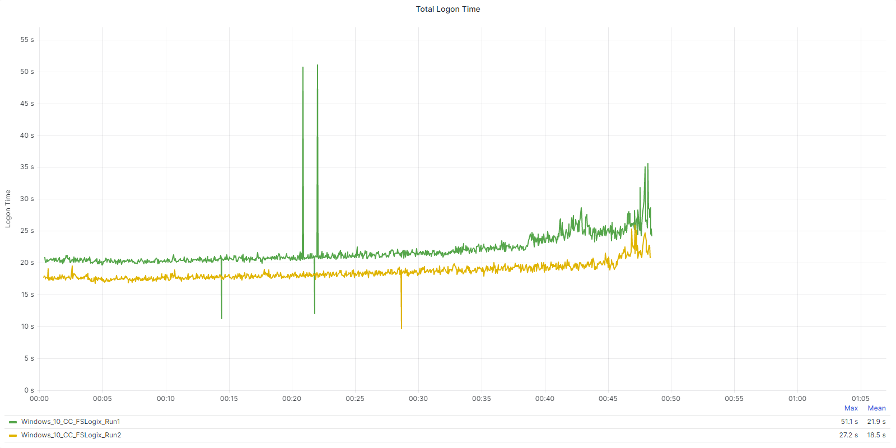

_Table: FSLogix Profiles Cloud Cache Create vs Mount comparison: Cluster Performance Summary during tests (Averages)_

|  | **Windows 10 CC FSLogix - Create** | **Windows 10 CC FSLogix - Mount** |
| --- | --- | --- |
| CPU Usage | 67.1% | 64.6% |
| Memory Usage | 36.4% | 36.4% |
| Controller IOPS | 79,292 | 71,973 |
| Controller Write IOPS | 56,618 | 51,670 |
| Controller Read IOPS | 22,674 | 20,303 |
| Controller Latency | < 1ms | < 1ms |
| Controller Write IO Latency | < 1ms | < 1ms |
| Controller Read IO Latency | 1.08 ms | < 1ms |

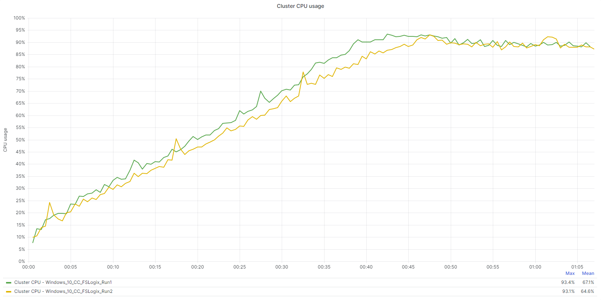

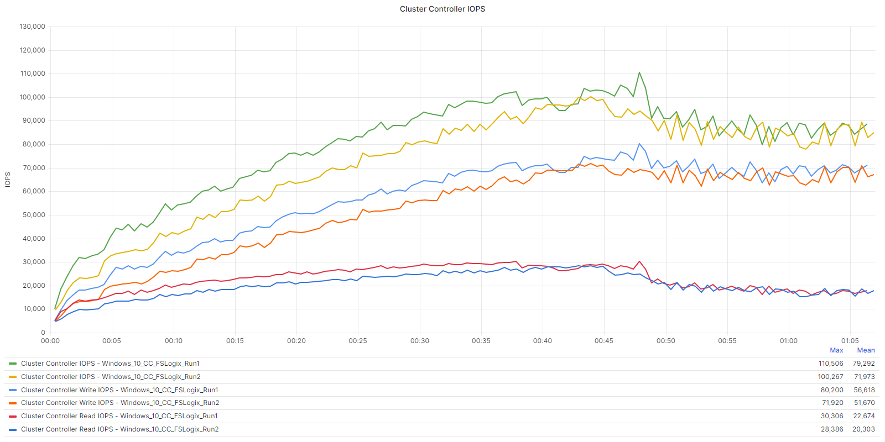

CPU usage during steady state is the average CPU usage during the steady state, or the state when all the sessions are active and using applications. This state simulates user activity during the entire day, rather than just during the logon period.

_Table: FSLogix Profiles Cloud Cache Create vs Mount comparison: Cluster CPU (Steady State)_

|  | **Cluster CPU (Steady State)** | **Difference in %** |
| --- | --- | --- |
| Windows 10 CC FSLogix - Run1 | 89.2% | 0.5% Higher CPU Usage |
| Windows 10 CC FSLogix - Run2 | 88.9% | Lowest CPU Value |

The following tables and graphs show the difference between a Cloud Cache `create` and `mount` run from a Nutanix Files perspective.

_Table: FSLogix Profiles Cloud Cache Create vs Mount comparison: Nutanix Files Metrics_

|  | **Windows 10 CC FSLogix - Create** | **Windows 10 CC FSLogix - Mount** |
| --- | --- | --- |
| Nutanix Files Iops | 4,460 | 4,353 |
| Nutanix Files Latency | 2.09 ms | 1.24 ms |
| Nutanix Files Throughput | 194 MB/s | 132 MB/s |

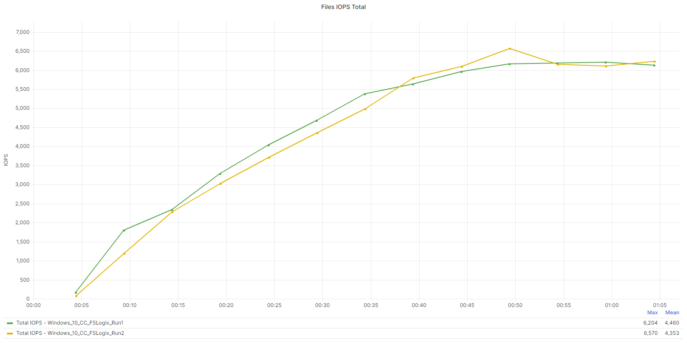

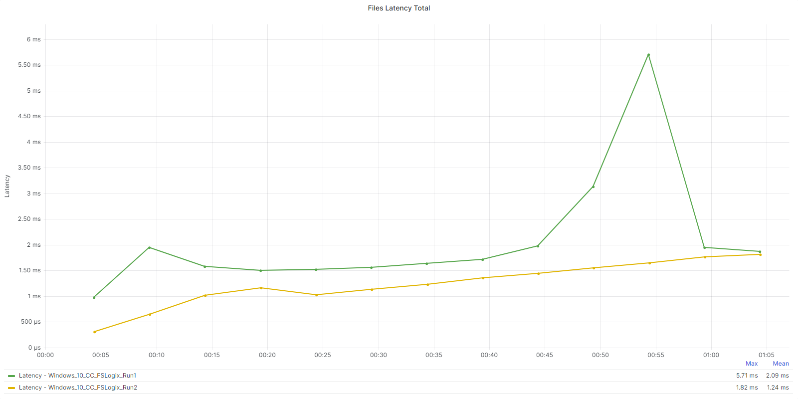

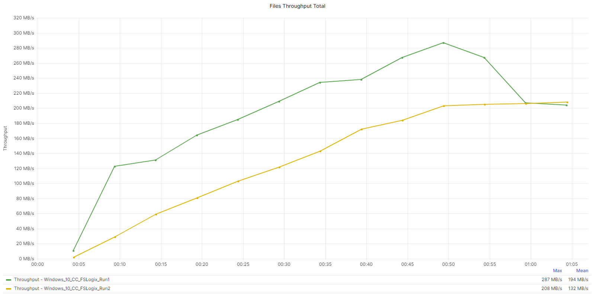

### Key Takeaways

-  There is significantly more impact on the workload cluster when comparing `create` vs `mount` operations using Cloud Cache.
-  IOPS, Latency, and Throughput on Nutanix Files were all reduced (positive result) on the `mount` operations when using Cloud Cache. These results were consistent across multiple `mount` runs.
-  IO loads are split between both the workload cluster and Nutanix Files storage repositories when using Cloud Cache.

## FSLogix Cloud Cache with Direct Attach (Mode 0) vs Try for Read Write and Fallback to Read Only (Mode 3)

The purpose of this test was to identify the differences between FSLogix Profiles in **Direct Attach** (Mode 0) vs **Try for Read Write and Fallback to Read Only** (Mode 3) when using **Cloud Cache**.

_Table FSLogix Test Configuration_

| Containers | Operation Mode | Measurements |
| --- | --- | --- |
| Profile Only | Mode 0 vs Mode 3 | Mount Operation |

_Table: Test Run Information_

| **Test Name**  | **Detail** | 
| --- | --- |
| Windows 10 CC FSLogix | CA Disabled. Run 3 = Mount | 
| Windows 10 CC FSLogix - Mode3 | CA Disabled. Run 3 = Mount |

The following tables and graphs show the difference between **Direct Attach** (Mode 0) and **Try for Read Write and Fallback to Read Only** (Mode 3) with **Cloud Cache** on the workload cluster.

_Table: FSLogix Profiles Cloud Cache Mode 0 vs Mode 3 comparison: Logon Time Metrics (Averages)_ 

|  | **Windows 10 CC FSLogix** | **Windows 10 CC FSLogix - Mode3** |
| --- | --- | --- |
| Total Login | 18.5 seconds | 18.8 seconds | 
| User Profile | 0.1 seconds | 0.1 seconds | 
| Group Policies | 2.0 seconds | 2.0 seconds | 
| Connection | 5.1 seconds | 5.4 seconds | 

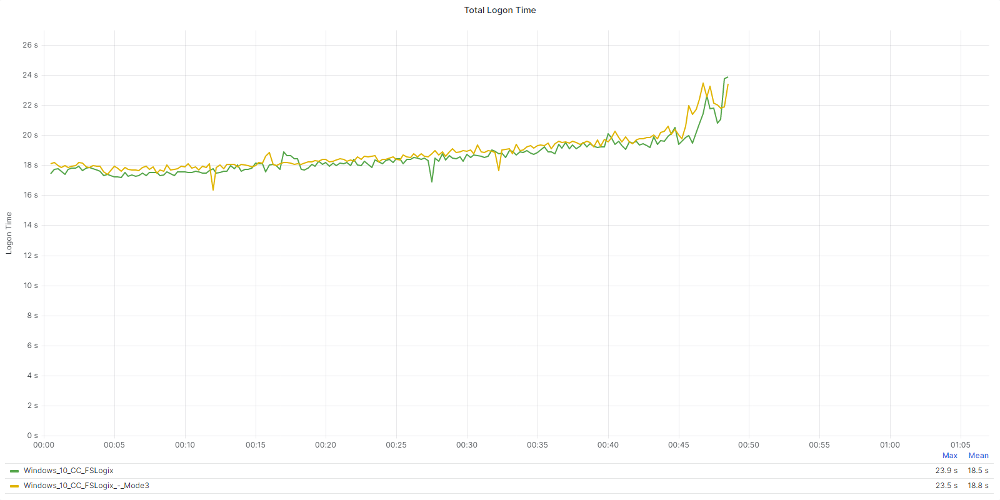

_Table: FSLogix Profiles Cloud Cache Mode 0 vs Mode 3 comparison: Cluster Performance Summary during tests (Averages)_ 

|  | **Windows 10 CC FSLogix** | **Windows 10 CC FSLogix - Mode3** |
| --- | --- | --- |
| CPU Usage | 64.5% | 64.4% |
| Memory Usage | 36.4% | 36.4% |
| Controller IOPS | 71,321 | 72,433 |
| Controller Write IOPS | 51,085 | 52,112 |
| Controller Read IOPS | 20,236 | 20,320 |
| Controller Latency | < 1ms | < 1ms |
| Controller Write IO Latency | < 1ms | < 1ms |
| Controller Read IO Latency | < 1ms | < 1ms |

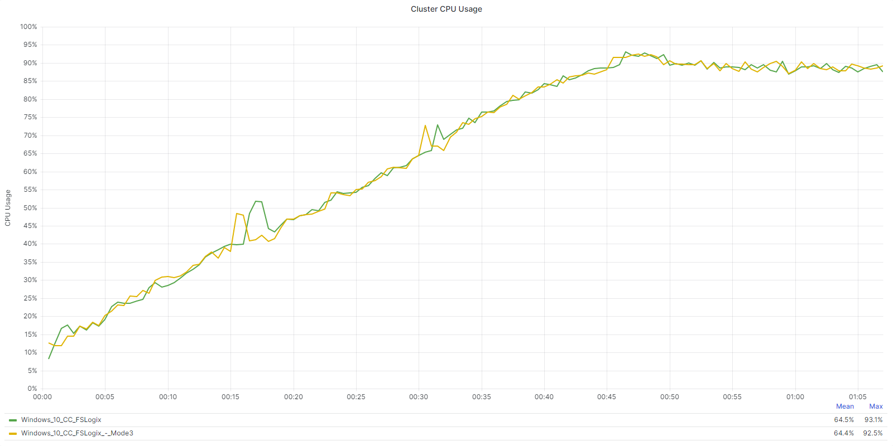

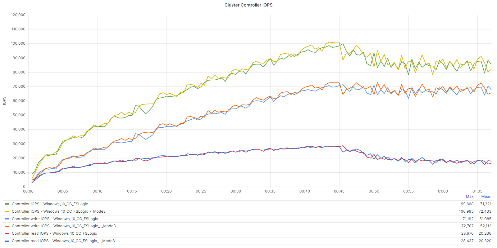

CPU usage during steady state is the average CPU usage during the steady state, or the state when all the sessions are active and using applications. This state simulates user activity during the entire day, rather than just during the logon period.

_Table: FSLogix Profiles Cloud Cache Mode 0 vs Mode 3 comparison: Cluster CPU (Steady State)_

|  | **Cluster CPU (Steady State)** | **Difference in %** |
| --- | --- | --- |
| Windows 10 CC FSLogix | 88.7% | Lowest CPU Value |
| Windows 10 CC FSLogix - Mode3 | 88.8% | 0.1% Higher CPU Usage |

The following tables and graphs show the difference between **Direct Attach** (Mode 0) and **Try for Read Write and Fallback to Read Only** (Mode 3) with **Cloud Cache** from a Nutanix Files perspective.

_Table: FSLogix Profiles Cloud Cache Mode 0 vs Mode 3 comparison: Nutanix Files Metrics_

<!--JK: The below metrics were incorrect. Fixed by JK 22.12.23

|  | **Windows 10 CC FSLogix** | **Windows 10 CC FSLogix - Mode3** |
| --- | --- | --- |
| Nutanix Files Iops | 4,335 | 4,706 |
| Nutanix Files Latency | 1.28 ms | < 1ms |
| Nutanix Files Throughput | 134 MB/s | 141 MB/s |
-->

|  | **Windows 10 CC FSLogix** | **Windows 10 CC FSLogix - Mode3** |
| --- | --- | --- |
| Nutanix Files Iops | 4,026 | 4,369 |
| Nutanix Files Latency | 1.19 ms | < 1ms |
| Nutanix Files Throughput | 124 MB/s | 131 MB/s |

<!--JK: This image set was incorrect. Fixed by JK 22.12.23
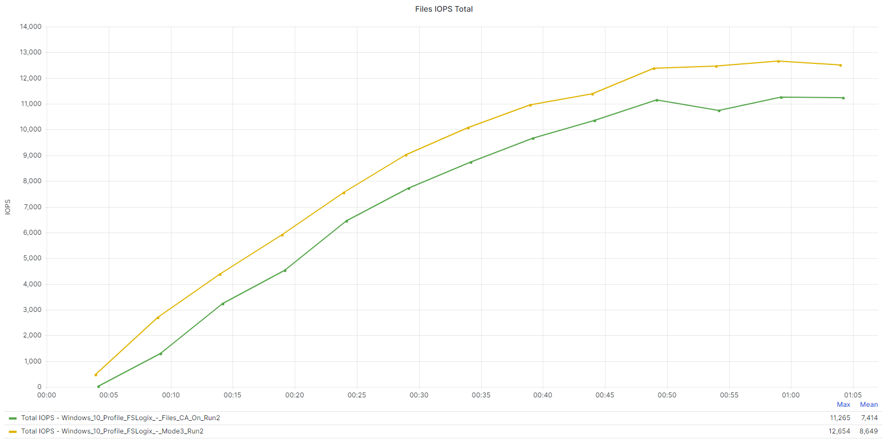

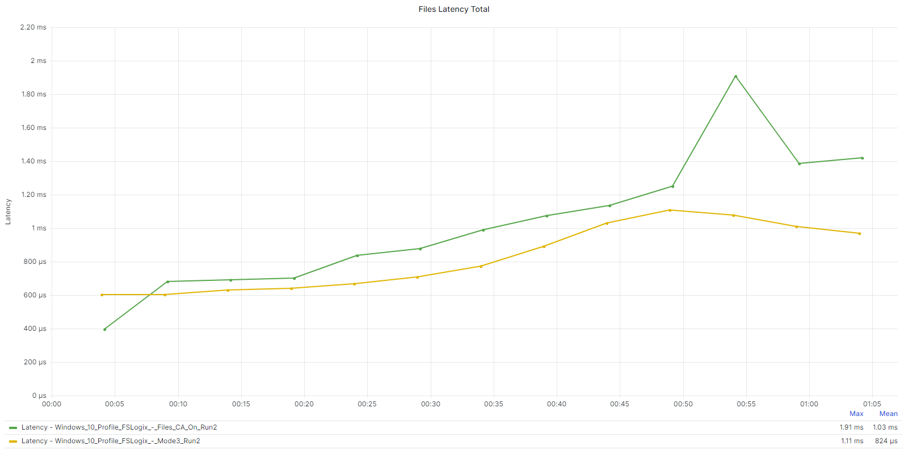

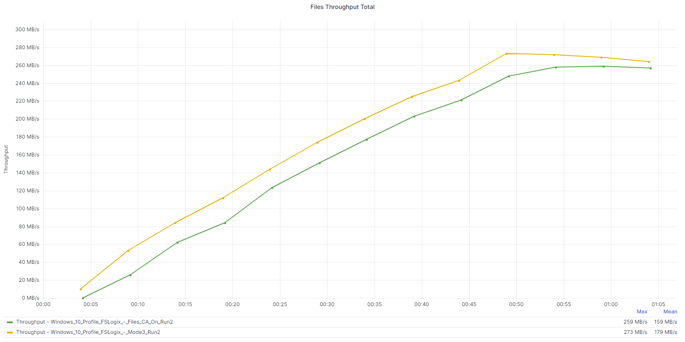
-->
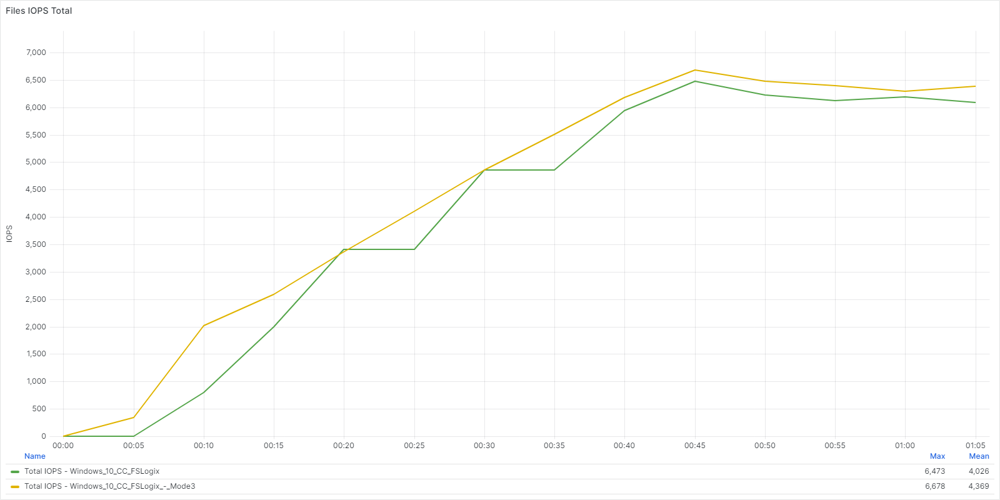

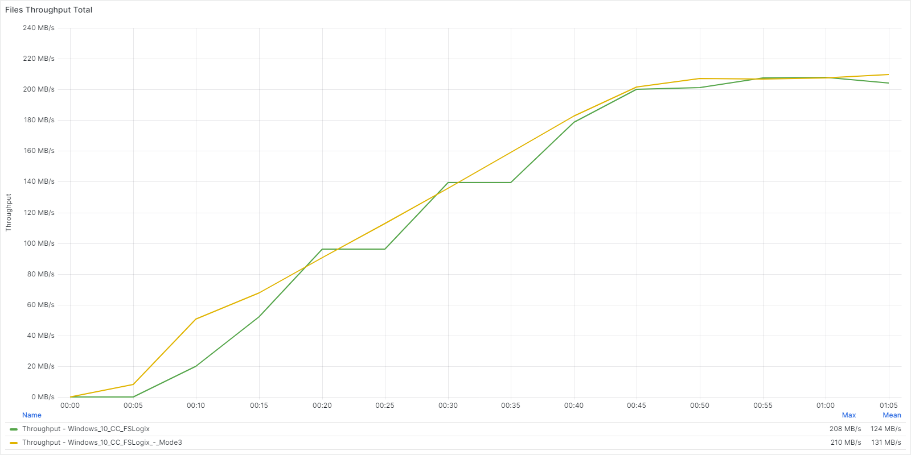

### Key Takeaways

-  Mode 0 and Mode 3 disks have a very similar resource footprint on the workload clusters as expected.
-  Mode 3 disks, have a slightly higher impact on Throughput and IOPS on Nutanix Files. This makes sense given the merge operations that occur on Mode 3 differencing disks.
-  Logon metrics were almost identical across both Mode 0 and Mode 3 mount runs.

## FSLogix Cloud Cache with Profile Compaction

The purpose of this test was to identify the impact of FSLogix `Profile Compaction` when using Cloud Cache. We used FSLogix Profiles with a **Direct Attach** (Mode 0) configuration. We injected data into the profile artificially during the logon phase and then deleted the data to create whitespace within the container. We used a simple ISO file for the expansion data.

The focus on this test is on the Nutanix Files Data only. The workload cluster is impacted given the bulk injection of data in the logon phase and the fact that Cloud Cache is enabled. The associated workload cluster metrics for this test become mostly irrelevant as they do not represent a real world use case. Instead, the focal point is the impact on Nutanix Files during the logoff phase, as this is where profile compaction occurs.

_Table FSLogix Test Configuration_

| Containers | Operation Mode | Measurements |
| --- | --- | --- |
| Profile Only | Mode 0 | Create Operation |

_Table: Test Run Information_

| **Test Name** | **Detail** | 
| --- | --- |
| Windows 10 CC FSLogix - Compaction | CA Disabled. Expand and Compact | 

The following graphs show the impact of data injected to bloat the container, and then the impact at logoff when `Profile Compaction` is **enabled** from a Nutanix Files perspective.

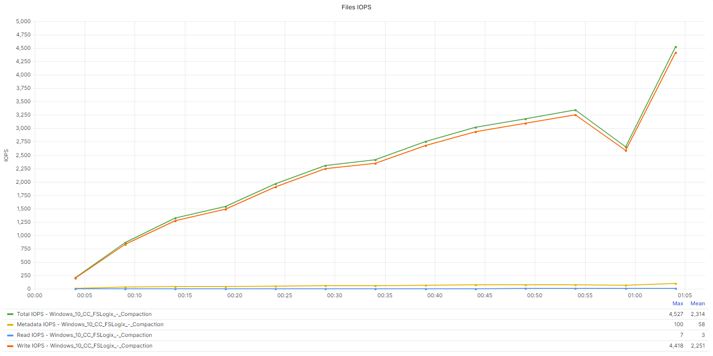

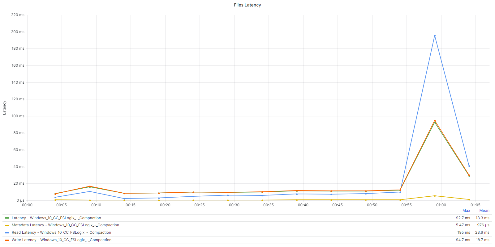

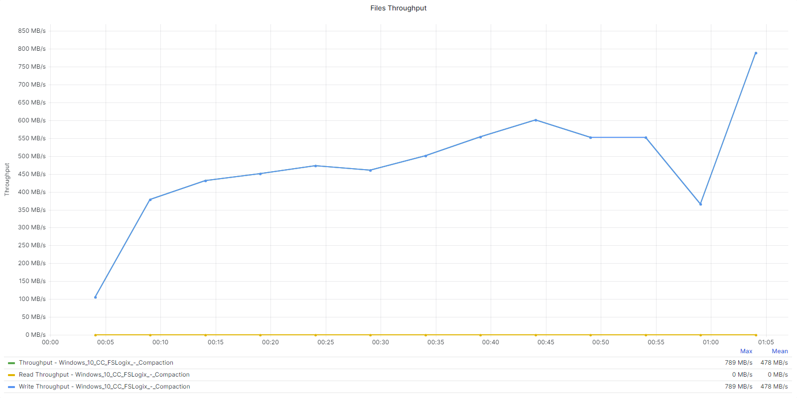

If we compare the metrics where `Profile Compaction` is **enabled** for both Cloud Cache and standard VHD Locations:

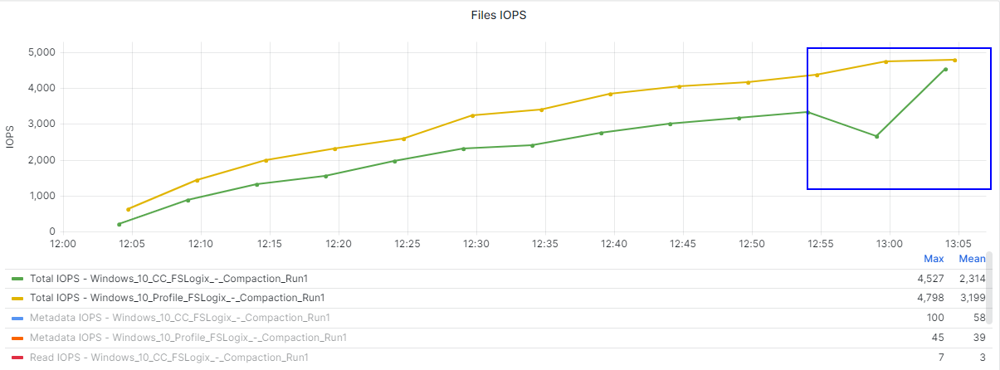

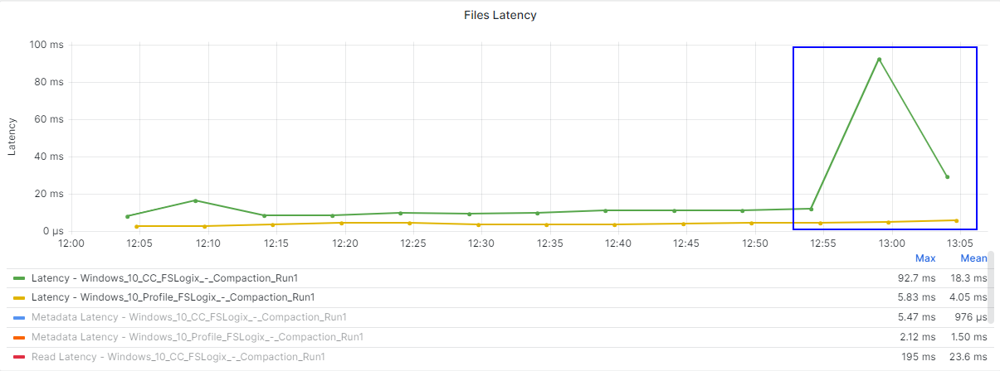

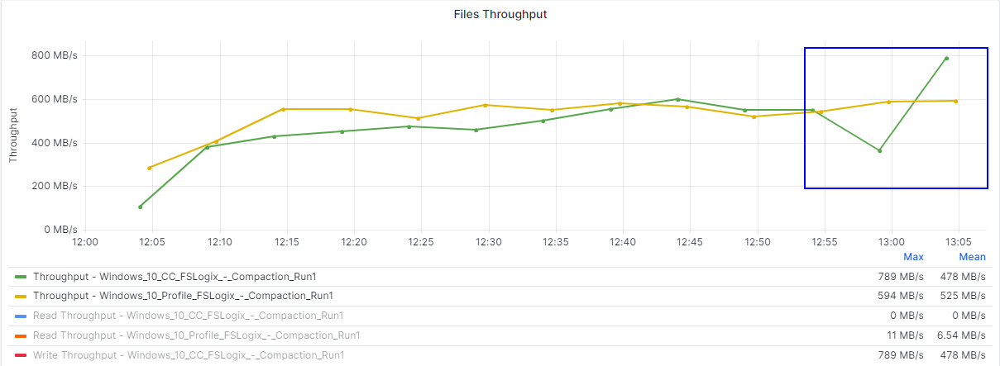

We can note that the impact when `Profile Compaction` is **enabled** is more evident on Nutanix Files when Cloud Cache is **Enabled**. Latency and Throughput in particular are increased more prevalently in a Cloud Cache deployment during the logoff phase.

### Key Takeaways

-  This test involved bloating a profile with 3GiB of data to create whitespace. As expected, the ramp down phase of the tests where user accounts are logged off, showed an increase in Write IOPS, Latency and Throughput on the Nutanix Files Cluster.
-  The impact of Profile Compaction in a Cloud Cache deployment is only on the Nutanix Files backend storage.
-  When planning to enable profile compaction, be considerate of the impact to Nutanix Files during the logoff phase. This is likely a one off consideration, unless the profiles are consistently expanding and shrinking regularly.

