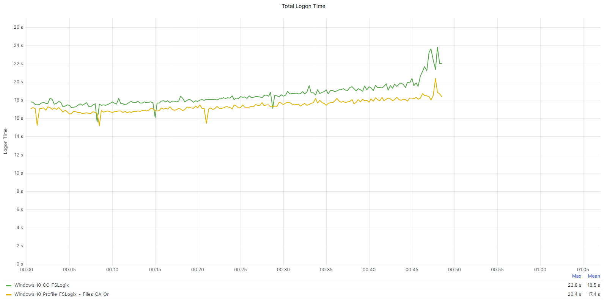
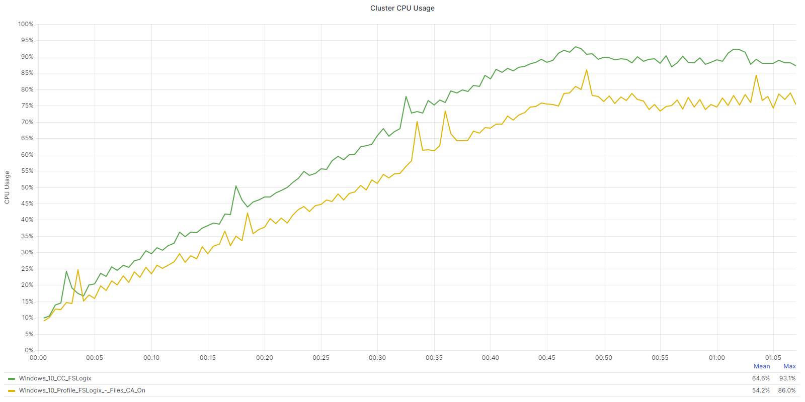
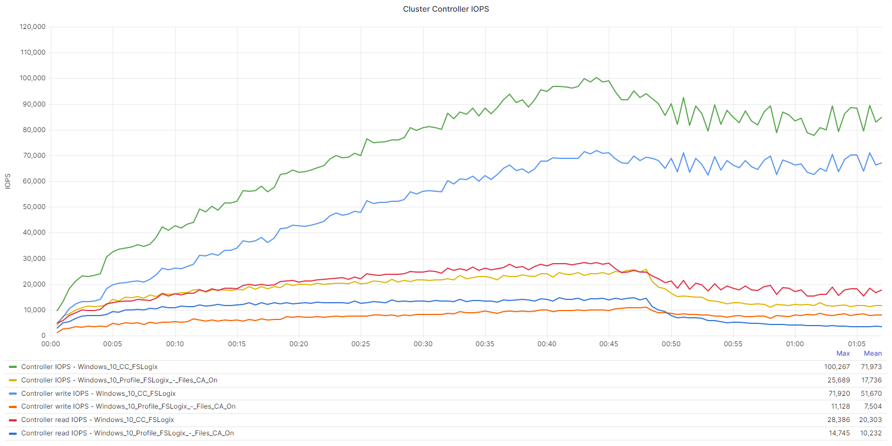
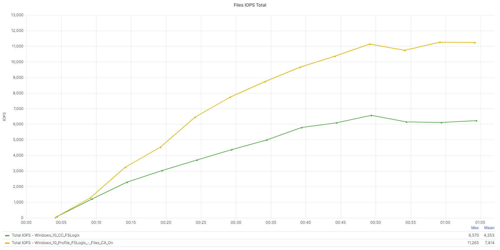
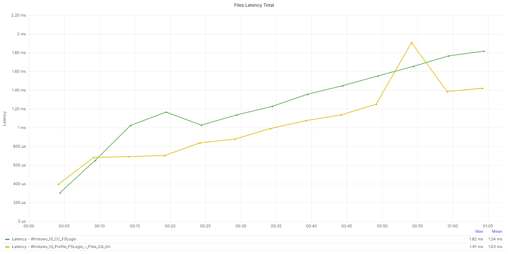
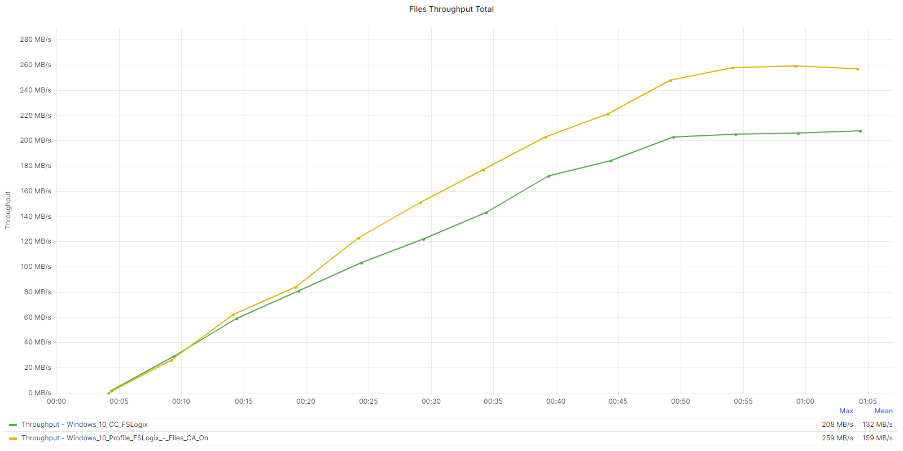
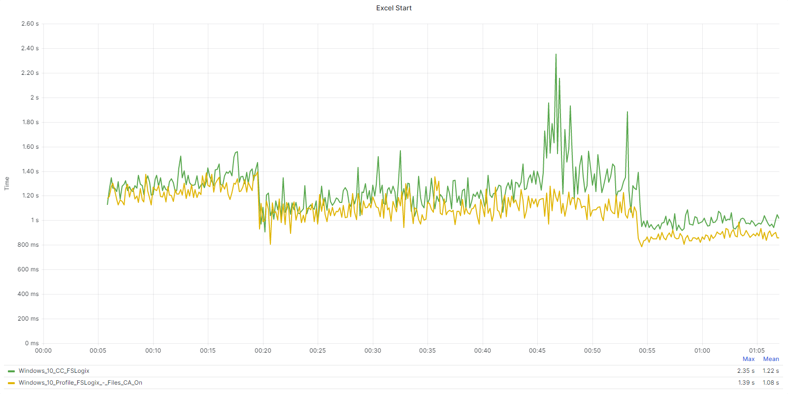
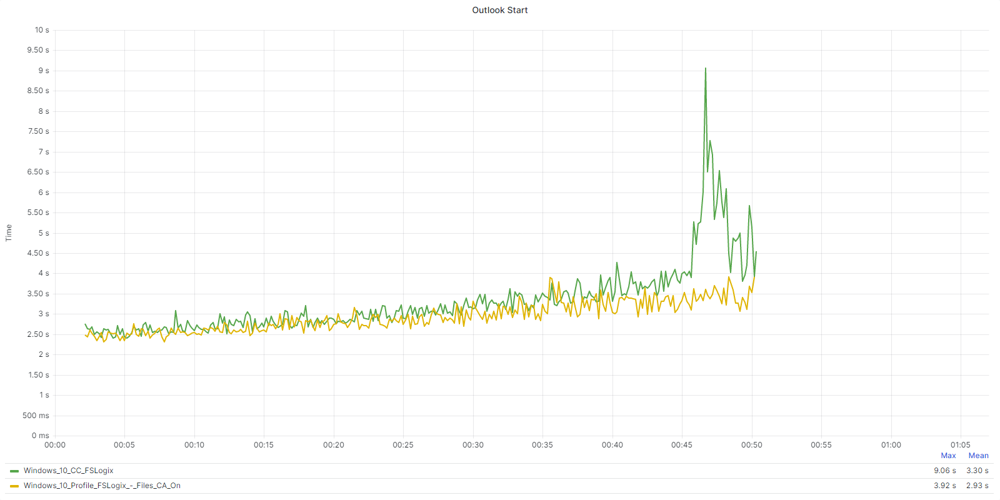

# FSLogix VHD Locations vs Cloud Cache

## FSLogix VHD Locations vs Cloud Cache with Direct Attach (mode 0)

The purpose of this test was to identify the differences between FSLogix Profiles with and without Cloud Cache.

_Table FSLogix Test Configuration_

| Containers | Operation Mode | Measurements |
| --- | --- | --- |
| Profile | Mode 0 | Mount Operation |

_Table: Test Run Information_

| **Test Name** | **Detail** | 
| --- | --- |
| Windows 10 Profile FSLogix - Files CA On | CA Disabled. VHD Locations. Run 2 = Mount | 
| Windows 10 CC FSLogix | CA Disabled. Cloud Cache. Run 2 = Mount |

The following tables and graphs show the difference between configurations with Cloud Cache **Disabled** and **Enabled** on the workload cluster.

_Table: FSLogix Profiles VHD Locations vs Cloud Cache comparison: Logon Time Metrics (Averages)_

|  | **Windows 10 Profile FSLogix - Files CA On** | **Windows 10 CC FSLogix** |
| --- | --- | --- |
| Total Login | 17.4 seconds | 18.5 seconds |  | 
| User Profile | 0.1 seconds | 0.1 seconds | 
| Group Policies | 1.9 seconds | 2.0 seconds | 
| Connection | 4.0 seconds| 5.1 seconds | 

_Table: FSLogix Profiles VHD Locations vs Cloud Cache comparison: Cluster Performance Summary during tests (Averages)_ 

|  | **Windows 10 Profile FSLogix - Files CA On** | **Windows 10 CC FSLogix** |
| --- | --- | --- |
| CPU Usage | 54.2% | 64.6% |
| Memory Usage | 36.4% | 36.4% |
| Controller IOPS | 17,736 | 71,973 |
| Controller Write IOPS | 7,504 | 51,670 |
| Controller Read IOPS | 10,232 | 20,303 |
| Controller Latency | < 1ms | < 1ms|
| Controller Write IO Latency | < 1ms | < 1ms |
| Controller Read IO Latency | < 1ms | < 1ms |

CPU usage during steady state is the average CPU usage during the steady state, or the state when all the sessions are active and using applications. This state simulates user activity during the entire day, rather than just during the logon period.

_Table: FSLogix Profiles VHD Locations vs Cloud Cache comparison: Cluster CPU (Steady State)_

|  | **Cluster CPU (Steady State)** | **Difference in %** |
| --- | --- | --- |
| Windows 10 Profile FSLogix - Files CA On | 76.4% | Lowest CPU Value |
| Windows 10 CC FSLogix | 88.9% | 12.5% Higher CPU Usage |

The following tables and graphs show the difference between Cloud Cache being **disabled** and **enabled** from a Nutanix Files perspective.

_Table: FSLogix Profiles VHD Locations vs Cloud Cache comparison: Nutanix Files Metrics_

|  | **Windows 10 Profile FSLogix - Files CA On** | **Windows 10 CC FSLogix** |
| --- | --- | --- |
| Nutanix Files Iops | 7,414 | 4,353 |
| Nutanix Files Latency | 159 MB/s | 132 MB/s |
| Nutanix Files Throughput | 1.03 ms | 1.24 ms |

<!--JK: Sven, I added these as I liked them in the context of this comparison, but happy if you want to remove them-->

The following tables represent the impact to application performance (Steady State) when using Cloud Cache:

_Table: FSLogix Profiles VHD Locations vs Cloud Cache comparison: Application Performance (Steady State)_

|  | **Windows 10 CC FSLogix** | **Windows 10 Profile FSLogix - Files CA On** |
| --- | --- | --- |
| Microsoft Edge (browsing + multimedia) - Logon | 0.11 seconds | 0.10 seconds - 9.09% Faster | 
| Microsoft Excel - App Start Time | 1.04 seconds | 0.91 seconds - 12.50% Faster | 
| Microsoft Excel - Open Excel Document | 1.11 seconds | 1.03 seconds - 7.21% Faster | 
| Microsoft Excel - Open Window | 0.39 seconds | 0.32 seconds - 17.95% Faster | 
| Microsoft Excel - Saving File | 0.47 seconds | 0.43 seconds - 8.51% Faster | 
| Microsoft PowerPoint - App Start Time | 0.98 seconds | 0.87 seconds - 11.22% Faster | 
| Microsoft PowerPoint - Open Powerpoint Document | 1.59 seconds | 1.48 seconds - 6.92% Faster | 
| Microsoft PowerPoint - Open Window | 0.37 seconds | 0.31 seconds - 16.22% Faster | 
| Microsoft PowerPoint - Saving File | 1.02 seconds | 0.93 seconds - 8.82% Faster | 
| Microsoft Word - App Start Time | 0.94 seconds | 0.84 seconds - 10.64% Faster | 
| Microsoft Word - Open Window | 0.41 seconds | 0.34 seconds - 17.07% Faster | 
| Microsoft Word - Open Word Document | 1.15 seconds | 1.03 seconds - 10.43% Faster | 
| Microsoft Word - Saving File | 0.38 seconds | 0.35 seconds - 7.89% Faster | 

The following graphs represent the impact of start times of both Excel and Outlook when Cloud Cache is enabled:

### Key Takeaways

-  FSLogix Cloud Cache has a significant impact on the the Workload Cluster resources, particular CPU and Controller IOPS. It is critical to size the workload cluster appropriately when enabling Cloud Cache.
-  The logon phase was increased slightly when enabling Cloud Cache. The predominant component of the increased time was the Connection phase.
-  The test where Cloud Cache was not in use reported a higher EUX score and EUX Base scores.
-  Latency was reduced when looking at the AppData and My Docs latency statistics. This makes sense as in a Cloud Cache deployment the data is being accessed from the local worker VM and we had high performing Cache Disk.
-  All measured application metrics took longer when Cloud Cache was enabled.
-  Cloud Cache is used to provide resiliency and provide the ability to sustain a short term loss of a backend storage repository. Nutanix Files was able to easily handle Cloud Cache requirements, however there is a small tax to the user experience. Given that VHD Locations with Continuous Availability provides resiliency within a Files deployment, Cloud Cache is best suited to multi-site deployments such as active-active architectures.
-  Customers should be cognizant of the impacts of Cloud Cache on an existing deployment and ensure both their workload clusters and Nutanix Files deployments (any backend storage repository) is sized appropriately. 