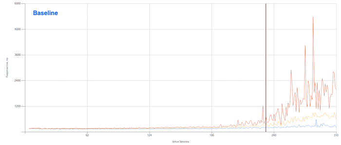
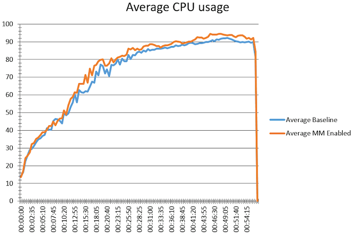

# Executive Summary

This document describes the performance impact of various Citrix Workspace Environment Management (WEM) settings on the Windows Desktop and Windows Server Virtual Delivery Agents (VDAs) running on a Nutanix Cloud Infrastructure (NCI) cluster. We cover the following areas of WEM configuration:

- CPU management
- Memory management

Individual customer results vary, but the performance data reported here gives a general indication of the effects WEM implementation can have on system optimization and provides support for your organization's decision making.

The following components are outside the scope of this document:

- I/O optimization
  - I/O optimization is unique to each environment; there is no defined default configuration.
- Fast Logoff
  - Fast Logoff is a Citrix feature that affects the user experience for logoff processes, not performance. 
- Citrix Optimizer
  - Citrix optimization typically occurs on a base image.
- Multisession optimization 
  - The multisession optimization option only affects disconnected sessions.

# Introduction

## Audience

This tech note is part of the Nutanix Solutions Library and provides an overview of the performance impact when enabling WEM system optimization settings on Nutanix AHV workloads. We wrote it for our sales force and engineering resources. Consumers of this document should be familiar with desktop virtualization and Nutanix at an intermediate level. 

## Purpose

This document covers the following subject areas:

- WEM and virtual desktop infrastructure
- Performance testing with Login VSI
- Performance test infrastructure
- Performance test specifics
- Performance test results
- Conclusion

Unless otherwise stated, the solution described in this document is valid on all supported Nutanix AOS releases.

## Document Version History

| **Version Number** | **Published** | **Notes** |
| :---: | ------ | --------- |
| 1.0 | January 2023 | Original publication. |

# Workspace Environment Management and Virtual Desktop Infrastructure

WEM is a software-only, driver-free solution that uses intelligent resource management to deliver improved performance, desktop logon experience, and application response times. It offers enhanced security and elevation controls along with user environment management based on a range of flexible filters and conditions. As there is no long-term service release (LTSR) for WEM, we used the version of WEM from the latest release of the Citrix product set for this performance analysis.

<note>
Although we don't cover the Citrix Cloud WEM service in this document, we expect that it would have similar performance outcomes, as the same optimization features are available for both the on-premises and service offerings. 
</note>

This document focuses only on the system optimization features for WEM. We retained the default configuration for all other components of the solution.

# Performance Testing With Login VSI

## Login VSI Benchmark

Login VSI provides performance insights for virtualized desktop and server environments. Enterprise IT departments use Login VSI products in all phases of VDI operations management&mdash;from planning to deployment to change management&mdash;for more predictable performance, higher availability, and a more consistent user experience. 

The following table includes all four workload definitions available on Login VSI 4.1.

_Table: Login VSI 4.1 Workloads_

| **Task Worker** | **Office Worker** | **Knowledge Worker** | **Power User** |
| --- | --- | --- | --- |
| Light | Medium | Medium | Heavy|
| 1 vCPU | 1 vCPU | 2 vCPU | 2–4 vCPU |
| 2–3 apps | 4–6 apps | 4–7 apps | 5–9 apps|
| No video | 240p video | 360p video | 720p video|

The following table includes all four workflows available on Login VSI 4.1.40.1.

_Table: Login VSI 4.1.40.1 Workflows_

| **Workload Name**	| **Task Worker** | **Office Worker** | **Knowledge Worker** | **Power User** |
| ---	| --- | --- | --- | --- |
| Apps open | 2–7 | 5–8 | 5–9 | 8–12 |
| CPU usage | 70% | 82% | 100% | 119% |
| Disk reads | 79% | 90% | 100% | 133% |
| Disk writes | 77% | 101% | 100% | 123% |
| OPS | 6 | 8.1 | 8.5 | 10.8 |
| Memory | 1 GB | 1.5 GB | 1.5 GB | 2 GB |
| vCPU | 1 | 1 | 2 | 2+ |

## Interpreting Login VSI Results

Login VSI values represent the time it takes for an application or task to complete (launching Outlook, for example) and aren’t in addition to traditional desktop response times. These figures don’t refer to the round-trip time (RTT) for network I/O; rather, they refer to the total time to perform an action on the desktop. During the test, we turned on all VMs and started the workload on a new desktop until all sessions and workloads were active. The workload used a launch window of 2,880 seconds for all tests.

We quantified the evaluation using the following metrics:

- Minimum Response: The minimum application response time.
- Average Response: The average application response time.
- Maximum Response: The maximum application response time.
- VSI Baseline: The average application response time of the first 15 measurements.
- VSI Index Average: The average response time, dropping the highest and lowest two percent.
- VSImax: If reached, the maximum value of sessions launched before the VSI index average gets above the VSI baseline + 1,000 ms.
- CPU usage during steady state: When all the sessions are active and continue to use the applications. This state simulates the state of the users during the entire day, rather than just during the session startup period.

_Table: Login VSI Metric Values_

| **Metric** | **Value** | **Interpretation** |
| --- | --- | --- |
| VSI Baseline | < 799 ms | Very good |
| VSI Baseline | 800–1,200 ms | Good |
| VSI Baseline | > 1,200 ms | Average or poor |
| CPU usage during steady state | < 85% | Ideal CPU usage |

## Login VSI Graphs

Login VSI graphs show the values obtained during the launch for each session. The following figure shows an example graph of the test data. The y-axis is the response time in milliseconds, and the x-axis is the number of active sessions.

## Login VSI Calculations

For information about the metrics discussed in this document, refer to [Login VSI Support](https://support.loginvsi.com/hc/en-us/articles/360001069519-Login-VSI-Login-VSI-VSImax-VSImax-VSItimer-threshold-NFO-NSLD-ZHC-ZLC-CPU-). In our testing, we focused on benchmarking I/O and CPU response time. 

_Table: Login VSI Metric Values_ 

| **Measurement Area** | **Measurement Action** |
| --- | --- |
| I/O | Write the CPU random data file to disk. | 
| CPU | Calculate a large array of random data for use in the I/O timer. | 

# Performance Test Infrastructure

This section describes the infrastructure we used during the tests.

_Table: Hardware_

| **Attribute**	| **Specifications** |
| --- | --- |
| Model | NX-3155G-G8 |
| Processor type | Intel Xeon Gold 6354 @ 3.0 GHz |
| CPU | 2 |
| Cores per CPU | 36 |
| Hyperthreading enabled | Yes |
| Logical processors | 72 |
| CPU capacity | 108 GHz |
| Available memory | 1.48 TB |
| Memory assigned to CVM | 32 GB |
| AOS version | 6.5.1.6 LTS |
| Disks | 6 x 1.92 TB SSD |

_Table: Windows 10 Image_

| **Attribute**	| **Specifications** |
| ---- | ---- |
| CPU | 2 vCPU |
| Memory | 4 GB |
| Disk | 64 GB |
| Operating system | Windows 10 |
| Applications | Adobe Acrobat DC, Doro PDF 1.82, FreeMind, Microsoft Edge, MS Office 2019 |
| VDA | Citrix VDA 2203 CU1 |
| WEM agent | Citrix WEM Agent 2209 |

_Table: Windows Server 2022 Image_

| **Attribute**	| **Specifications** |
| ---- | ---- |
| CPU | 8 vCPU |
| Memory | 42 GB |
| Disk | 80 GB |
| Operating system | Windows Server 2022 |
| Applications | Adobe Acrobat DC, Doro PDF 1.82, FreeMind, Microsoft Edge, MS Office 2019 |
| VDA | Citrix VDA 2203 CU1 |
| WEM agent | Citrix WEM Agent 2209 |

## Deployment Method

We used Citrix Virtual Desktops 2301 CU1 with Machine Creation Services (MCS) to deploy the desktops on the hosts and only used a single host in each test. We performed three runs of each test using the Power User profile to get an average baseline for each scenario. We chose the Power User profile rather than the Knowledge Worker profile so we could consume enough CPU to invoke the WEM CPU management feature.

# Performance Test Specifics

We performed testing for two scenarios:

- CPU management
- Memory management

## CPU Management

_Table: Test Scenario 1: CPU Management (Automatic)_

| **Attribute**	| **Specifications** |
| ---- | ---- |
| CPU spike protection | Enabled, with the **Auto Prevent CPU Spikes** option selected (WEM calculates the appropriate core configuration) | 
| Intelligent CPU optimization | Enabled |
| Intelligent I/O optimization | Enabled | 

_Table: Test Scenario 2: CPU Management (Manual)_

| **Attribute**	| **Specifications** |
| ---- | ---- |
| CPU spike protection | Enabled, with the **%** value set to 1% lower than a single core (2 cores = 49%) | 
| Intelligent CPU optimization | Enabled |
| Intelligent I/O optimization | Enabled | 

For more information on CPU management settings, review [Citrix WEM documentation](https://docs.citrix.com/en-us/workspace-environment-management/current-release/user-interface-description/system-optimization/cpu-management.html).

_Table: Memory Management_

| **Attribute**	| **Specifications** |
| ---- | ---- |
| Optimize memory usage for idle processes | Enabled, with the **Idle Time** parameter set to 15 | 
| Idle state limit (percent) | Enabled and set to 1 |

For more information on memory management settings, review [Citrix WEM documentation](https://docs.citrix.com/en-us/workspace-environment-management/current-release/user-interface-description/system-optimization/memory-management.html).

# Performance Test Results

This section describes the results of our tests and indicates the impact of changes on the environment. We provide these details to support the conclusions made later in this document.

## CPU Management

### Windows 10

The Login VSI overlay for the Windows 10 workload captures the following test results:

- Baseline
- CPU management set to automatic
- CPU management set to manual 

We ran 230 VMs with 230 users to determine the VSImax. Note that the VSImax values are closely clustered.

The following figure zooms in on the VSImax values and shows the configuration for the specific tests. The VSImax varies from 209 to 224 (a difference of 15 to 7 percent). 

")

The following figure shows the average CPU consumption over all three tests. CPU usage is fairly consistent across all the test runs. 

The following figures show the CPU response details for each test run. The CPU and I/O response times are higher for the test where CPU management was set to Manual.

The following figures show the I/O details for each test run.

### Windows Server 2022

The Login VSI overlay for the Windows Server 2022 workload captures the following test results:

- Baseline
- CPU management set to automatic
- CPU management set to manual 

We ran 16 VMs with 310 users. Note that the VSImax values are closely clustered.

The following figure zooms in on the VSImax values and shows the configuration for the specific tests. The VSImax varies from 227 to 250 (a difference of 23 to 10 percent). 

")

The following figure shows the average CPU consumption over all three tests. CPU usage is fairly consistent across all the test runs. 

The following figures show the CPU response details for each test run. The CPU response times are higher for the test where CPU management was set to manual.

The following figures show the I/O details for each test run.

## Memory Management

### Windows 10

The Login VSI overlay for the Windows 10 workload captures the following test results:

- Baseline
- Memory management enabled

We ran 230 VMs with 230 users. Note that the VSImax values are no longer closely clustered.

The following figure zooms in on the VSImax values and shows the configuration for the specific tests. The VSImax varies from 200 to 224 (a difference of 24 to 12 percent). 

")

The following figure shows the average CPU consumption over both tests. CPU usage is higher with memory management enabled.

The following figures show the CPU response details for each test run. 

The following figures show the I/O details for each test run.

### Windows Server 2022

The Login VSI overlay for the Windows Server 2022 workload captures the following test results:

- Baseline
- Memory management enabled

We ran 16 VMs with 310 users. Note that the VSImax values are no longer closely clustered.

The following figure zooms in on the VSImax values and shows the configuration for the specific tests. The VSImax varies from 210 to 249 (a difference of 39 to 18 percent). 

")

The following figure shows the average CPU consumption over both tests. CPU usage is similar with and without memory management enabled. 

The following figures show the CPU response details for each test run.

The following figures show the I/O details for each test run.

# Conclusion

We ran these tests within a specified time frame and under tightly controlled circumstances to give a basic look at how WEM system optimization features perform from the outset. Given the design of Citrix WEM's system optimization features, keep the following points in mind.

## CPU Spike Protection

The WEM agent records the history of every process on the machine that triggers spike protection. It records the number of times that the process has triggered spike protection and the user for whom spike protection occurred. The WEM agent gains insight into which users trigger spikes and how to handle the spikes more intelligently. If you also enable the **Intelligent CPU Optimization** option, the system flags processes as more CPU spikes occur and eventually launches them with a lower priority, leveling out the CPU load over time. 

Our testing shows that CPU management&mdash;specifically spike protection&mdash;works best (and has less baseline impact) when you use the **Auto Prevent CPU Spikes** option. We noticed the smallest difference between the baseline and test VSImax values with this setting enabled.

## Memory Management

For both Windows 10 and Windows Server 2022, the VSImax dropped significantly when we enabled the **Optimize Memory for Idle Processes** option because the average application response time increased with the user load. Although this technology could be a good choice for memory-constrained systems, be careful that you don't adversely affect your user experience to save on memory usage.

One option for Remote Desktop Session Host (RDSH) workloads is to use the multisession optimization feature that drains memory only for disconnected users, so you could save on memory in a multiuser environment without affecting the experience for users who are logged on.

## General Conclusions
Because of the product design, WEM CPU management can become more beneficial for your VDAs over time. We recommend using the **Auto Prevent CPU Spikes** option, as this setting had the least impact on the baseline VDA in our testing. 

Use memory management with caution, as it affects other areas of VDA performance in order to save memory. Although there is a specific use case for memory management, be sure to carefully consider and test the repercussions before you implement it in a production environment.