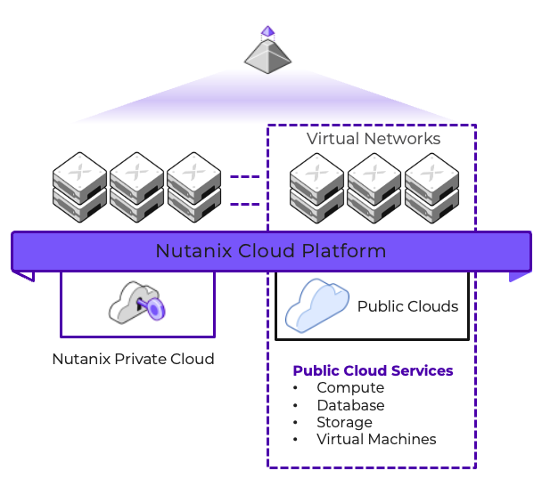

# Executive Summary

This tech note discusses the supported scenarios to run Omnissa Horizon on Nutanix while running the native Nutanix hypervisor, AHV. Omnissa Horizon offers a digital workspace experience and it delivers virtual desktops and apps.

# Introduction

## Audience

This tech note is part of the Nutanix Solutions Library and provides an overview of the Omnissa Horizon on Nutanix solution. It's a technical introduction to the solution for IT architects and administrators.

## Purpose

This document covers the following topics:

- Nutanix Platform Overview
- Omnissa Horizon Platform Overview
- Omnissa Horizon on Nutanix AHV
- Automation of the desktop pools
- Limitations

This document describes what components of Omnissa Horizon are currently supported to run on Nutanix AHV.
Unless otherwise stated, the solution described in this document is valid on all supported AHV releases.

## Document Version History

| **Version Number** | **Published** | **Notes** |
| :---: | --- | --- |
| 1.0 | July 2024 | Original publication. |

# Nutanix Platform Overview

Nutanix designed its software to give customers running workloads in a hybrid cloud environment the same experience they expect from on-premises Nutanix clusters. Because Nutanix in a hybrid multicloud environment runs AOS and AHV with the same CLI, UI, and APIs, existing IT processes and third-party integrations continue to work regardless of where they run.



Nutanix AOS can withstand hardware failures and software glitches and ensures that application availability and performance are never compromised. Combining features like native rack awareness with public cloud partition placement groups, Nutanix operates freely in a dynamic hybrid multicloud environment.

# Omnissa Horizon Platform Overview

The Omnissa Horizon platform manages and delivers virtualized or hosted desktops and applications to end users. Horizon allows you to create and broker connections to Windows virtual desktops, Linux virtual desktops, Remote Desktop Server (RDS)–hosted applications and desktops, Linux-hosted applications, and Windows physical machines. Horizon is available as an on-premises datacenter solution and as a cloud based service, where Omnissa delivers and maintains all the critical management components.

Currently, only manual desktop pools are supported with Nutanix AHV as the hypervisor. Manual desktop pools are a collection of non-vCenter Windows or Linux virtual machines. For manual pools, Horizon does not create and manage the life cycle of the desktops in the pool. The desktops are created outside of Horizon and then imported into Horizon Console.

## Horizon Connection Servers on AHV
The Omnissa Horizon Connection server can be installed on a physical or virtual machine, as long as it meets the [recommended hardware specifications](https://docs.omnissa.com/bundle/Horizon8InstallUpgrade/page/HardwareRequirementsforHorizonConnectionServer.html). It is supported to run the Horizon Connection server on Nutanix AHV, if the virtual machine meets these requirements.

<note>
Do not migrate a virtual machine running the Horizon Connection server software from VMware ESXi to Nutanix AHV. This can result in users not being able to connect to their desktop. Instead, install a Horizon replica Connection server on a virtual machine running on AHV, then add it to the existing Horizon Pod. Once this Horizon replica server is confirmed to work correctly, it can be added to the load balancer. You can then remove one of the Horizon connection servers running on VMware ESXi. Repeat this until there are no more Horizon Connection servers on VMware ESXi.
</note>

## Virtual Appliances
Omnissa provides certain components as a virtual appliance, like the Universal Access Gateway (UAG). Refer to the Omnissa [documentation and download](https://customerconnect.omnissa.com/downloads/#all_products) section to get the latest information about support for Nutanix AHV. It is not supported to install a virtual appliance on Nutanix AHV that is intended for a different virtualization platform. 

## Manual Pools
Omnissa Horizon currently supports manual pools on Nutanix AHV. This means that you can create virtual desktops or virtual servers on AHV and add these to a desktop pool in Omnissa Horizon. You can entitle active directory users or groups to logon to these virtual machines using the Horizon client. If you create virtual machines from a template or base image, the Horizon agent needs to be installed after the desktop or server has been generalized (sysprepped on Windows operating systems). This is required to be able to register the machines correctly in Horizon. The cloned virtual machines will copy properties from the template or base image, it is important to set these properties as you want them. Examples of these properties are virtual CPUs, memory allocation, disk size, vGPU assignment. The cloned machines will be persistent, so it is possible to change these properties after cloning (on a per virtual machine base).

### Virtual Desktops
You can add a desktop pool in Omnissa Horizon and choose type "Manual Desktop Pool" with Machine Source "Other sources". This allows you to select registered machines running on Nutanix AHV to include in the Virtual Desktop Pool. The User Assignment can still be "Floating", but it is recommended to use "Dedicated" assignment because of the persistency of the virtual machines. In most scenarios it's not desirable to have users logged on to virtual machines that potentially contain data from other users.

### Session Hosts
Before you create a desktop pool with RDS hosts, you first need to create a RDS Farm (manual farm) and add the registered RDS hosts to this farm. Then you are able to create a desktop pool or application pool and add the manual farm to this pool.

# Automation
The steps that are required to create, install, register and create the manual desktop pool(s) in Omnissa Horizon can be automated using various tools. Nutanix AHV and Omnissa Horizon both provide a Restful API to perform various tasks, like creating or cloning virtual machines, adding machines to Omnissa Horizon, assigning users to desktops or delete desktops. In the following table you can see examples of tools you can use to perform a certain task:

| **Task** | **Automation tool** |
| --- | --- | 
| Create golden image | Nutanix REST API, Microsoft Deployment Toolkit, Ansible | 
| Clone and customize virtual machines | Nutanix REST API |
| Install Horizon Agent and register to Horizon | Ansible, Microsoft Configuration Manager |
| Create Horizon Manual Pool | Omnissa Horizon REST API |
| Entitle User (Group) to the Manual Pool | Omnissa Horizon REST API |

The following tables show some of the items that you should consider if attempting to automate your Omnissa Horizon manual pool creation process.

## Create Golden Image 

| **Item** | **Consideration** |
| :--- | :--- | 
| Horizon Agent | This cannot be installed as part of the golden image as you are unable to generalize the agent and register it post boot. | 
| Sysprep | You have to sysprep a Windows golden image prior to cloning so that Omnissa Horizon is able to uniquely identify each new virtual machine. |
| Optimizations | Most optimizations will be lost during the sysprep process of a Windows virtual machine so consider re-applying these after the clone operation. |
| Networking | If you are building your golden image as part of a CI/CD workflow, remember that Sysprep will remove the networking information from the virtual machine so consider running this as the last task in your pipeline with /shutdown as a parameter. |

## Clone Virtual Machines

| **Item** | **Consideration** |
| :--- | :--- | 
| Customization | The Nutanix Restful API offers the ability to inject a Unattended or CloudInit file during the clone process. This can be automated to ensure the virtual machines boot and register with the domain correctly. | 
| Task Execution | Once the clone operation has been executed, wait for the AHV tasks to complete before installing any Omnissa software. |

## Install Horizon Agent and Register to Horizon

| **Item** | **Consideration** |
| :--- | :--- | 
| Per Machine Install | The Omnissa Horizon Agent cannot be installed for manual pools on the golden image, use a post clone task to install the software. | 
| Command Line Switches | Omnissa provide command line switches to ensure the agent is registering with the correct connection server during install. | 
| Example Command Line Switch (Ansible) | ```VDM_VC_MANAGED_AGENT=0 VDM_SERVER_NAME={{ horizon_connection_server }} VDM_SERVER_USERNAME={{ horizon_user }} VDM_SERVER_PASSWORD={{ horizon_password }}``` |
| Reboots | The Omnissa Horizon Agent will require a reboot to register correctly with Horizon. Ensure you have catered for this in your automation pipeline to validate registration post install. |

## Create Horizon Manual Pool

| **Item** | **Consideration** |
| :--- | :--- | 
| Order of Operation | When creating a manual pool execute in this order: Create Pool with relevant parameters, add registered desktops to pool, add the desktop pool entitlement (see below). | 

## Entitle User (Group) to the Manual Pool

| **Item** | **Consideration** |
| :--- | :--- | 
| Entitlement SID | Omnissa Horizon entitlements are managed using an Active Directory SID. The Horizon Restful API can be used to broker the connection between your automation engine and Active Directory to obtain a list of the available users or groups and their associated SIDs. |

# Limitations
Running Horizon Agent in virtual machines on Nutanix AHV has the following limitations and known issues:
- No power actions (power on, power off, restart) available on virtual machines running on Nutanix AHV using the Horizon Console.
- There is currently no provisioning possible on Nutanix AHV from within the Horizon console. Virtual machines will need to be created manually.

# Appendix

## Example Task Sequence

Below you will find an example automation task sequence with the associated tooling used to deploy an Omnissa Manual Pool. The base script is run from PowerShell.

- Golden Image Build
  - Deploy OS (Microsoft MDT)
  - Install Base Software (Ansible)
  - Sysprep (Ansible)
- Clone VM
  - Generate Unique Unattend.xml File (PowerShell)
  - Clone VMs with Unattend.xml (Nutanix Api)
  - Boot VMs (Nutanix Api)
  - Wait for WMI to be available (PowerShell)
  - Execute Post Deployment Software Install (Ansible)
  - Confirm Omnissa Desktop Registration (Omnissa Api)
- Create Pool
  - Create Manual Pool (Omnissa Api)
  - Add Desktops to Pool (Omnissa Api)
  - Get Group SID from Active Directory (Omnissa Api)
  - Add entitlement to Desktop Pool (Omnissa Api)

# References

1. [Horizon on Nutanix](http://portal.nutanix.com/kb/xxxx)
2. [Create Manual pools on Horizon](https://docs.omnissa.com/bundle/Desktops-and-Applications-in-HorizonV2312/page/CreateaManualDesktopPool.html)
3. [Nutanix Restful API](https://www.nutanix.dev/)
4. [Omnissa Horizon Restful API](https://developer.broadcom.com/xapis/vmware-horizon-server-api/latest/)
5. [Omnissa Horizon Agent 2306 Command Line Switches](https://docs.omnissa.com/bundle/WindowsDesktops-and-Applications-in-HorizonV2306/page/SilentInstallationPropertiesforHorizonAgent.html)

