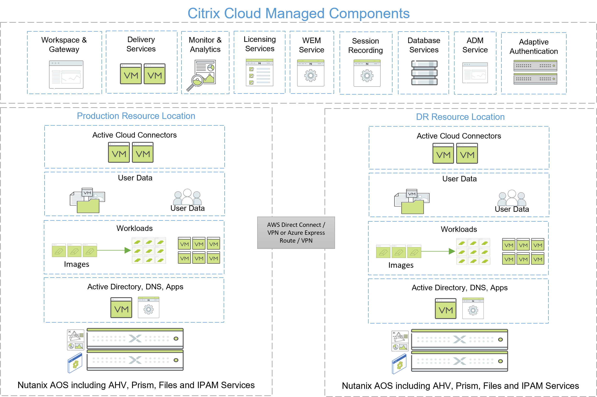

# Executive Summary

Because Nutanix AOS can withstand hardware failures and software glitches, it ensures that application availability and performance are never compromised.

In this tech note, we make recommendations for designing and protecting Citrix Desktop as a Service (DaaS) deployments running Windows workloads on Nutanix AHV with Citrix Machine Creation Services (MCS), Citrix Provisioning (PVS), and persistent VMs.

We take into consideration the supporting infrastructure surrounding and enabling the DaaS stack as well as the Citrix components. The Citrix solution depends on the ability to recover your network, Active Directory, file services, and backend application services.

Depending on the architecture of your DaaS solution, you may need additional components such as SQL and Licensing services. We note these components as needed throughout this document.

## Disaster Recovery Scenario Assumptions

This document assumes the following:

- Citrix DaaS has workloads deployed in one resource location.
- You're using a Citrix Cloud–first approach, including Citrix Workspace and Gateway Service (capturing customer-managed components).
- You have two datacenters with adequate compute to satisfy disaster recovery requirements.
- You're using Nutanix AHV as the hypervisor.
- You're using Nutanix Files for file services (including profiles, user data, and App Layers).
- You're using the relevant Nutanix Disaster Recovery features.
- You have adequate Citrix licensing for services such as Citrix NetScaler in case you need to start standby instances.

There are multiple strategies for providing business continuity and high availability for customer-managed components in a DaaS architecture. Citrix documents and details these techniques and capabilities for each product and provides more general recommendations in [TechZone documentation for disaster recovery planning](https://docs.citrix.com/en-us/tech-zone/design/design-decisions/cvad-disaster-recovery.html).

Deploying Citrix DaaS on Nutanix AHV provides the environment with always-on availability across multiple sites. With Citrix DaaS, Citrix administers the management services and components along with end-user access to services in Citrix Cloud. Administrators manage authentication and workload components in their resource locations. 

The following diagram outlines the architecture discussed in this document. With Nutanix Cloud Clusters (NC2), the disaster recovery location can be either an on-premises datacenter or a public cloud provider such as Amazon Web Services (AWS) or Microsoft Azure.

If you're using NC2, ensure that you have the appropriate networking to support the solution. The following table outlines the options for connectivity between on-premises and the cloud.

_Table. On-Premises-to-Cloud Connectivity Options for NC2_

| **Provider** | **Connectivity Option** | **Detail** |
| --- | --- | --- |
| AWS | AWS Site-to-Site VPN | Remote networks can connect to a Virtual Private Cloud (VPC) by creating an [AWS Site-to-Site VPN](https://docs.aws.amazon.com/vpn/latest/s2svpn/VPC_VPN.html) connection and configuring routing to pass traffic through it. | 
| AWS | AWS Direct Connect | The [AWS Direct Connect](https://aws.amazon.com/directconnect/) cloud service is the shortest path to AWS resources. While in transit, network traffic remains on the AWS global network and never touches the public internet. |
| Microsoft Azure | Site-to-Site VPN via Azure VPN Gateway | A [VPN gateway](https://learn.microsoft.com/en-us/azure/vpn-gateway/vpn-gateway-about-vpngateways) sends encrypted traffic between an Azure virtual network and an on-premises location. The encrypted traffic travels over the public internet. |
| Microsoft Azure | ExpressRoute | [ExpressRoute](https://learn.microsoft.com/en-us/azure/expressroute/) connections use a private, dedicated connection through a third-party connectivity provider. The private connection extends your on-premises network into Azure. | 