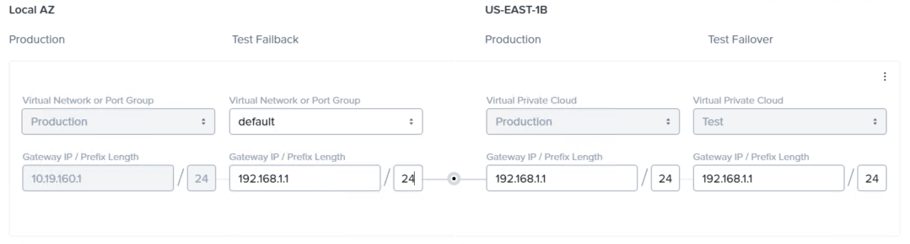

# Citrix DaaS Overview

In a Citrix DaaS deployment, Citrix controls management services and components as well as end-user access services in Citrix Cloud. Applications and desktops delivered to end users are hosted in one or more resource locations. Citrix DaaS resource locations contain Cloud Connectors, VDAs, and identity providers, along with optional components like Citrix Provisioning, Citrix Gateway, and Citrix StoreFront. Whether your deployment needs these optional components or not depends on which VDA provisioning method you choose and whether your deployment needs additional functionality for Citrix Gateway and Citrix StoreFront that Citrix Gateway service and Citrix Workspace can't currently provide. Each resource location is considered a zone, keeping applications and desktops closer to users and improving performance.

The following figure shows the main architectural components of the Citrix DaaS on Nutanix AHV solution.


## Citrix DaaS Components: Overview

Citrix coordinates the following component-management services and end-user access services in Citrix Cloud.

<note>
For the following services, Citrix manages the associated infrastructure components.
</note>

Workspace
: [Citrix Workspace](https://docs.citrix.com/en-us/citrix-workspace/overview.html) aggregates and integrates Citrix Cloud services, giving end users unified access to all the available resources. In a DaaS context, Citrix Workspace serves as a cloud-provided StoreFront. 

Gateway service
: The [Citrix Gateway service](https://docs.citrix.com/en-us/citrix-gateway-service.html) provides a secure remote access solution. The Gateway service can replace a traditional Citrix NetScaler Gateway and requires no customer management. 

Adaptive Authentication
: [Adaptive Authentication](https://docs.citrix.com/en-us/citrix-secure-private-access/adaptive-authentication-service.html) is a Citrix Cloud service that provides advanced authentication for customers and users signing in to Citrix Workspace. 

Cloud Licensing
: Citrix Cloud provides license and usage monitoring for certain cloud services. License and usage monitoring is available for on-premises deployments where Citrix License Server is registered with Citrix Cloud. [Citrix Cloud licensing](https://docs.citrix.com/en-us/citrix-cloud/citrix-cloud-management/licensing.html) doesn't support [PVS](https://docs.citrix.com/en-us/provisioning/current-release) activation. Customers must host a [License Server](https://docs.citrix.com/en-us/licensing/current-release.html) in their own datacenter. 

Database
: Citrix DaaS stores the site configuration, monitoring data, and configuration logs, so you don't need databases or customer-managed SQL Server instances. Citrix DaaS doesn't provide database services to support components such as [PVS](https://docs.citrix.com/en-us/provisioning/current-release) or [Session Recording (SR)](https://docs.citrix.com/en-us/session-recording/service.html). Customers must host the appropriate database components in their own datacenter. 

Delivery Controllers
: Citrix DaaS provides services to load-balance applications and desktops, authenticate users, and broker end-user connections directly, so you don't need customer-managed Delivery Controllers. [Citrix Cloud Connectors](https://docs.citrix.com/en-us/citrix-cloud/citrix-cloud-resource-locations/citrix-cloud-connector.html) serve proxy communications from the customer environment to Citrix DaaS. 

Monitor
: [Monitor](https://docs.citrix.com/en-us/citrix-daas/monitor.html) is a monitoring and troubleshooting console hosted and provided by Citrix DaaS. The dashboard scans the environment, troubleshoots, and performs support tasks for subscribers. 

Workspace Environment Management (WEM)
: [WEM](https://docs.citrix.com/en-us/workspace-environment-management/service.html) uses intelligent resource management to deliver enhanced performance, desktop sign ins, and application response times for DaaS deployments. It's a software-only, driver-free solution. 

<note>
For the following services, Citrix manages the associated orchestration components. Customers are responsible for the supporting on-premises components.
</note>

Session Recording (SR)
: The [SR service](https://docs.citrix.com/en-us/session-recording/service.html) provides an advanced administration experience and simplifies deployment. It supports centralized management of server settings, policies, and playback. The SR service doesn't provide database or storage components. Customers must host the appropriate database components in their own datacenter. 

Citrix Application Delivery Management (ADM)
: [Citrix ADM](https://docs.citrix.com/en-us/citrix-application-delivery-management-service/citrix-application-delivery-management-service.html) provides an easy and scalable solution for managing [Citrix NetScaler](https://docs.citrix.com/en-us/citrix-adc/current-release.html) deployments, including NetScalers deployed through [Adaptive Authentication](https://docs.citrix.com/en-us/citrix-secure-private-access/adaptive-authentication-service.html). An [ADM agent](https://docs.citrix.com/en-us/citrix-application-delivery-management-service/setting-up/adding-multiple-agents.html) enables communication between Citrix ADM and the managed instances in the customer datacenter. 

The following image outlines the minimum components in a typical DaaS deployment. 


The tables in the following sections refer to **Application**, **Hypervisor**, and **Platform** as configuration options for replication and recovery. 

- Application: The disaster recovery configuration and implementation for the component occurs at the application or service level; you don't need to replicate or recover specific instances (for example, Active Directory).
- Hypervisor: The specific production instance of a specific component requires full replication and recovery.
- Platform: The Nutanix AOS platform that offers functionality associated with the recovery requirement (for example, Nutanix Files or IP address management (IPAM) capability).

In some instances, a component may require more than one recovery option, depending on existing strategies and capability.

## Supporting Infrastructure Components

The following components support a Citrix DaaS deployment and are critical to the functionality of the solution.

_Table. Citrix DaaS Supporting Components_

| **Component** | **Definition** | **Replication and Recovery** |
| --- | --- | --- |
| [SQL databases](https://docs.citrix.com/en-us/citrix-virtual-apps-desktops/system-requirements.html#databases) | Citrix PVS and SR require SQL infrastructure. | Application |
| [Active Directory](https://docs.citrix.com/en-us/citrix-virtual-apps-desktops/technical-overview/active-directory.html) | Citrix DaaS directly depends on Active Directory. | Application |
| [File services](https://portal.nutanix.com/page/documents/details?targetId=Files:Files) | Highly available file services store user and application data on SMB shares. | Hypervisor |
| [Domain Name Services (DNS)](https://learn.microsoft.com/en-us/windows-server/networking/dns/dns-top) | DNS connects URLs and host names with the right IP addresses. | Application |
| [Nutanix IPAM (DHCP)](https://portal.nutanix.com/page/documents/details?targetId=AHV-Admin-Guide:ahv-acr-host-ipam-r.html) | With IPAM, AHV can assign IP addresses automatically to VMs by using DHCP. DHCP is a network management protocol for automatically assigning IP addresses and other communication parameters to devices connected to the network using a client-server architecture. Both Citrix MCS and PVS directly depend on DHCP. | Platform (Nutanix IPAM) or Application ([Microsoft](https://learn.microsoft.com/en-us/windows-server/networking/technologies/dhcp/dhcp-top) or third party) |
| [Key Management Services (KMS)](https://learn.microsoft.com/en-us/deployoffice/vlactivation/configure-a-kms-host-computer-for-office) | KMS is a Windows service that provides volume activation. Volume activation is a configurable solution that helps automate and manage the product activation process on computers running Windows operating systems that have been licensed under a volume licensing program. | Hypervisor or Application |
| [Active Directory–based activation](https://learn.microsoft.com/en-us/deployoffice/vlactivation/activate-office-by-using-active-directory) | With Active Directory–based activation, enterprises can activate computers through a connection to their domain. Active Directory–based activation is similar to KMS and doesn't require a Windows Server role outside of Active Directory. | Application |
| [Remote Desktop Services (RDS) Licensing](https://learn.microsoft.com/en-us/windows-server/remote/remote-desktop-services/rds-client-access-license) | Each user and device that connects to a Remote Desktop Session Host (RDSH) needs a client access license. The RDS License server role provides licensing capability to RDSH. | Hypervisor |
| [Network Time Protocol (NTP)](https://learn.microsoft.com/en-us/windows-server/networking/windows-time-service/how-the-windows-time-service-works#network-time-protocol) | NTP is a networking protocol for clock synchronization between computer systems. | Application |
| [Active Directory Certificate Services (ADCS)](https://learn.microsoft.com/en-us/windows-server/networking/core-network-guide/cncg/server-certs/server-certificate-deployment) | ADCS provides customizable services for issuing and managing digital certificates used in software security systems that employ public key technologies. Citrix FAS directly depends on ADCS. | Hypervisor or Application |
| RADIUS and associated authentication engines | Citrix Gateway often integrates with RADIUS or third-party authentication solutions to provide multifactor authentication. These endpoints typically reside in the same datacenter as the supporting Citrix infrastructure. | Hypervisor or Application |
| Print services | Printing is often a core function of an EUC environment. Windows Print servers are typically required for central queue management. | Hypervisor or Application |
| Network switching, routing, firewall, and security appliances | Core networking components are critical to the functionality of DaaS components. | Not specific to DaaS |

<note>
Depending on specific configurations, you may need additional components such as those supporting Azure Active Directory or OKTA Identity providers.
</note>

### Microsoft SQL Server

Microsoft SQL Server logically exists in the control layer of a DaaS deployment. SQL Server provides a range of high-availability and disaster recovery capabilities. For more information, see the [High Availability Design](https://portal.nutanix.com/page/documents/solutions/details?targetId=BP-2015-Microsoft-SQL-Server:high-availability-design.html) and [Backup and Disaster Recovery Design](https://portal.nutanix.com/page/documents/solutions/details?targetId=BP-2015-Microsoft-SQL-Server:backup-and-disaster-recovery-design.html) sections in the Microsoft SQL Server on Nutanix best practice guide.

The following Citrix components rely directly on restored and functional SQL in a disaster recovery scenario:

- [Citrix PVS](https://docs.citrix.com/en-us/provisioning/current-release/advanced-concepts/managing-high-availability/ha-sql-always-on.html)
- [Citrix SR](https://docs.citrix.com/en-us/session-recording/current-release/configure/high-availability-and-load-balancing/session-recording-database-high-availability.html)

[Microsoft Always On availability groups](https://learn.microsoft.com/en-us/sql/database-engine/availability-groups/windows/always-on-availability-groups-sql-server?redirectedfrom=MSDN&view=sql-server-ver15) are the most common disaster recovery solution for SQL and have full support and integration with Citrix services.

Citrix Cloud manages SQL database components as part of the DaaS offering.

### Directory Services and DHCP

Active Directory logically exists in the control layer of a DaaS deployment and is typically the first service to be restored in a disaster recovery scenario. You must decide how to appropriately restore and ensure the health of Active Directory and DNS services.

DHCP services are required to support workloads provisioned through both PVS and MCS. Typically, if you're restoring to a different network in a disaster recovery scenario, configure DHCP services in preparation for the restored environment. With a DaaS focus, the configuration should include items to support the following components: 

- Citrix MCS scopes
- Citrix PVS networks and scopes, including streaming configurations
- Persistent workload scopes

If you're provisioning infrastructure servers using DHCP-based reservations, ensure that the appropriate disaster recovery configurations are in place and ready to support failover scenarios if network segments are changing. 

[Nutanix IPAM](https://portal.nutanix.com/page/documents/details?targetId=AHV-Admin-Guide:ahv-acr-host-ipam-r.html) enables simple DHCP services natively in AHV for simple disaster recovery configurations.

#### Nutanix Offset-Based IP Mapping and Network Mapping in Disaster Recovery Orchestration

[Offset-based IP mapping](https://portal.nutanix.com/page/documents/solutions/details?targetId=TN-2027-Data-Protection-and-Disaster-Recovery:offset-based-ip-mapping.html) tracks the last octet of VM IP addresses so the system can change or maintain them automatically based on the subnet configuration in the recovery plan. If the source and destination subnets remain the same, the system can maintain the existing IP address. If the destination subnet changes to a new value, the new subnet keeps the last four digits. 



The network mapping portion of a Nutanix recovery plan supports full and partial subnet failover. If the source and destination AZs have the same network mapping, the full subnet fails over so applications can retain their IP addresses and you don't have to script and update the DNS. 

When an administrator runs a planned full subnet failover, even the MAC addresses are retained, which can be crucial when dealing with applications licensed through MAC and IP addresses. If you're using AHV's built-in IPAM, you don't need to install anything in the guest VM to retain the addresses. If you're using a custom DHCP server or assigning VMs with manual IP addresses, install the NGT software package. NGT helps maintain the network information regardless of the hypervisor.


We mention IP and DNS considerations multiple times throughout this document. Nutanix IPAM and the network mapping feature of a recovery plan in disaster recovery orchestration greatly reduce the complexity of managing network components.

### File Services: Nutanix Files

This document assumes that you're using Nutanix Files for file services. Nutanix Files offers a range of backup and disaster recovery solutions. Following modern data protection methodologies, Nutanix provides administrators and users quick restore access using self-service restore (SSR) and site recovery with Nutanix-based snapshots. File services logically exist in the resource layer of a DaaS deployment. 

_Table. File Services Protection_

| **Service** | **Detail** |
| --- | --- |
| [SSR](https://portal.nutanix.com/page/documents/solutions/details?targetId=TN-2041-Nutanix-Files:self-service-restore.html) | Administrators can enable SSR at any time for SMB or NFS shares. The Windows Previous Version option in each folder exposes SSR for SMB shares. |
| [Protection domains and consistency groups](https://portal.nutanix.com/page/documents/solutions/details?targetId=TN-2041-Nutanix-Files:protection-domains-and-consistency-groups.html) | Nutanix provides integrated, automated disaster recovery between Nutanix clusters. You can protect a Nutanix Files cluster with Prism, and it uses the same asynchronous replication with protection domains and consistency groups as any other Nutanix cluster. | 
| [Cluster migration, failure, and restoration](https://portal.nutanix.com/page/documents/solutions/details?targetId=TN-2041-Nutanix-Files:cluster-migration-failure-and-restoration.html) | In the event of a Nutanix Files cluster failure, restore Files in a remote cluster by initiating the Activate workflow, which restores from the last good snapshot. | 
| [Cloning](https://portal.nutanix.com/page/documents/solutions/details?targetId=TN-2041-Nutanix-Files:cloning.html) | Nutanix Files cloning doesn't affect the original Files cluster; it offers improved support for a variety of use cases including disaster recovery at the secondary site. | 
| [Files Smart DR](https://portal.nutanix.com/page/documents/solutions/details?targetId=TN-2041-Nutanix-Files:files-smart-disaster-recovery.html) | Files Smart DR moves remote replication management and orchestration into Prism Central. |

Customers typically store critical data that directly impacts the usability of the disaster recovery environment on Nutanix Files. Customers often use Nutanix Files to store and manipulate the following data types:

- User profile data, which can be either file-based or container-based
- User data redirection, such as documents, pictures, and any other shell-based redirection
- User home drives and network drives
- FSLogix AppMasking rules
- Application data
- Containerized or virtualized applications

For additional information, see the Nutanix Files Design section of the [Nutanix Validated Design for Citrix DaaS](https://portal.nutanix.com/page/documents/solutions/details?targetId=NVD-2158-Citrix-DaaS:nutanix-files-design.html). 

Vendors such as Citrix and Microsoft offer native profile replication options that allow near real-time replication to multiple SMB locations. With these technologies, you might not need other failover or recovery operations for user profile data. Microsoft offers [FSLogix Cloud Cache](https://learn.microsoft.com/en-us/fslogix/cloud-cache-resiliency-availability-cncpt), and Citrix offers the [Replicate User Stores](https://docs.citrix.com/en-us/profile-management/current-release/configure/replicate-user-stores.html) feature in Citrix Profile Management.

#### Microsoft Distributed File System 

Microsoft [Distributed File System (DFS)](https://learn.microsoft.com/en-us/windows/win32/dfs/distributed-file-system-dfs-functions) functions provide the ability to logically group shares on multiple servers and to transparently link shares in a single hierarchical namespace. DFS organizes shared resources on a network in a tree structure.

DFS supports standalone namespaces, namespaces with one host server, and domain-based namespaces that have multiple host servers and high availability. The DFS topology data for domain-based namespaces is stored in Active Directory. This data includes the DFS root, DFS links, and DFS targets.

Many environments use the powerful DFS option for directing single namespace entries to multiple endpoints in disaster recovery scenarios.

<note>
Nutanix recommends using domain-based namespaces that span multiple servers and align with Active Directory disaster recovery strategies.
</note>

## DaaS Access Layer 

The access layer defines how users access resources. It's responsible for both internal and remote access, authentication, and resource presentation to the user. In addition to Active Directory, this layer depends on peripheral services such as RADIUS and associated authentication providers.


<note>
Citrix Cloud provides access layer functionality such as Citrix Workspace, Citrix Gateway service, and Adaptive Authentication as part of the DaaS offering. The following components are relevant based on specific requirements.
</note>

_Table. Customer-Managed DaaS Components: Access Layer_

| **Component** | **Definition** | **Replication and Recovery** |
| --- | --- | --- |
| [NetScaler](https://docs.citrix.com/en-us/citrix-adc/current-release.html) | NetScaler is an Application Delivery Controller that optimizes, manages, and secures network traffic. Customers primarily use NetScaler Gateway for secure remote access to DaaS environments. With DaaS deployments, NetScaler appliances are deployed in the customer datacenter. | Application or Hypervisor |
| [StoreFront](https://docs.citrix.com/en-us/storefront/current-release.html) | StoreFront is an enterprise app store that aggregates and presents virtual app and desktop resources from on-premises and hybrid deployments to users. With DaaS deployments, StoreFront servers are deployed in the customer datacenter. | Hypervisor |
| [Federated Authentication Services (FAS)](https://docs.citrix.com/en-us/federated-authentication-service.html) | FAS is a privileged component designed to integrate with Active Directory Certificate Services. It dynamically issues certificates for users, so they can sign in to an Active Directory environment as if they had a smart card. With this capability, StoreFront can use SAML (Security Assertion Markup Language) assertions. FAS supports both StoreFront and [Workspace integration](https://docs.citrix.com/en-us/citrix-workspace/optimize-cvad/workspace-federated-authentication.html). FAS servers are deployed in the customer datacenter. | Hypervisor |

### NetScaler

[Citrix NetScaler](https://docs.citrix.com/en-us/citrix-adc/current-release.html) typically provides the following key functions in a DaaS deployment (though there might be more): 

- [Load balancing](https://docs.citrix.com/en-us/citrix-adc/current-release/load-balancing.html), for services such as StoreFront and LDAP authentication
- [Citrix Gateway](https://docs.citrix.com/en-us/citrix-gateway/current-release/about-citrix-gateway.html), to provide HDX Proxy capability to published resources
- [Identity provider](https://docs.citrix.com/en-us/citrix-cloud/citrix-cloud-management/identity-access-management/connect-ad-gateway.html), to authenticate subscribers signing in to Workspace

NetScaler is a networking appliance that depends heavily on the configuration and health of the underlying networks, including:

- Routing 
- Switching (including VLAN configurations)
- Firewalls and NAT rules
- DNS records for both private and public zones

The following table outlines recovery options for NetScaler.

_Table. NetScaler Protection Options_

| **Option** | **Detail** |
| --- | --- |
| [Global Server Load Balancing (GSLB)](https://docs.citrix.com/en-us/citrix-adc/current-release/global-server-load-balancing.html) configuration across two datacenters | Both sites contain NetScalers. For the situations described in this document, GSLB is in an active-passive configuration with failover triggered in a disaster recovery scenario. |
| Standby NetScaler in secondary location | The least complex and lowest-risk solution. Requires a standby appliance. This model is much more accessible to customers consuming pooled licensing. | 
| NetScaler virtual appliance failover at the hypervisor layer (VM failover) | Appliance failover comes with significant complexity if you change networks. This approach requires configuration alteration to address any changes to the network stack. |

### StoreFront

[Citrix StoreFront](https://docs.citrix.com/en-us/storefront/current-release.html) is a standalone function that depends solely on Active Directory. You can restore StoreFront by recovering the production servers.

StoreFront talks to the XML services hosted on Cloud Connectors to enumerate resources for the user. Typically, if you aren't using NetScaler to load balance XML requests, specify Cloud Connectors by host name. If you are using a NetScaler to load balance XML, then configure a DNS record and specify it in the controller list.

Additionally, if you're using a different NetScaler Gateway for incoming connections in disaster recovery scenarios, define the gateway objects in production to support the connectivity path change that occurs during disaster recovery. 

You can preconfigure Gateway Callback services either with dedicated DNS records or with host file entries on the StoreFront servers. If you're using host files, remember to document change requirements in disaster recovery.

StoreFront might be configured with SSPR functionality ([deprecated](https://docs.citrix.com/en-us/citrix-virtual-apps-desktops/whats-new/removed-features.html)). If it is, you need the recovered SSPR servers to support the feature.

Configure NetScaler load balancers with DNS records rather than IP addresses to support environments that require network changes in disaster recovery scenarios. Document load-balanced VIP addresses for StoreFront. Also document DNS changes in case a network change occurs during disaster recovery.

### Federated Authentication Services

[Citrix FAS](https://docs.citrix.com/en-us/federated-authentication-service.html) directly relies on a certificate authority (CA). A common practice is to colocate a subordinate CA role with each FAS server, providing a self-contained issuing environment for FAS. In this scenario, you can restore FAS and CA by recovering the production servers.

If the FAS server is an independent role and relies on CA functions housed on additional servers, then the FAS depends on the recovery and health of those servers. Without an issuing CA, FAS doesn't function and users can't use SAML authentication to access resources.

Group policy objects define FAS servers by their host name. If network changes occur, it's critical that DNS is up to date.

For a DaaS deployment, [FAS resource Location assignment and priority](https://docs.citrix.com/en-us/citrix-workspace/optimize-cvad/workspace-federated-authentication.html#fas-servers) is critical. 

## DaaS Control Layer

The control layer defines the components that control the Citrix solution.


<note>
Citrix Cloud provides control layer functionality via Workspace, hosted delivery services, database services, WEM, Citrix Licensing, and SR orchestration as part of the DaaS offering.
</note>

_Table. Customer-Managed DaaS Components: Control Layer_

| **Component** | **Definition** | **Replication and Recovery** |
| --- | --- | --- |
| [SQL databases](https://docs.citrix.com/en-us/citrix-virtual-apps-desktops/system-requirements.html#databases) | Citrix PVS and SR require SQL infrastructure. | Application |
| [Active Directory](https://docs.citrix.com/en-us/citrix-virtual-apps-desktops/technical-overview/active-directory.html) | Citrix DaaS directly depends on Active Directory. | Application |
| [Cloud Connectors](https://docs.citrix.com/en-us/citrix-cloud/citrix-cloud-resource-locations/citrix-cloud-connector.html) | The Citrix Cloud Connector serves as a channel for communication between Citrix Cloud and customer resource locations. | Application (Rebuild)
| [License Server](https://docs.citrix.com/en-us/licensing/current-release.html) | Customers must deploy a License Server to support [PVS](https://docs.citrix.com/en-us/provisioning/current-release) in a DaaS solution. | Hypervisor |
| [Self Service Password Reset (SSPR)](https://docs.citrix.com/en-us/self-service-password-reset/current-release.html) (deprecated) | SSPR gives end users greater control over their user accounts. Users can unlock their accounts or change their passwords by correctly answering several security questions. | Hypervisor |
| [SR](https://docs.citrix.com/en-us/session-recording/service.html) | Customers must deploy database and storage components to support the SR service. | Hypervisor |
| [Universal Print Server (UPS)](https://docs.citrix.com/en-us/citrix-virtual-apps-desktops/printing/printing-provision-printers.html) | The UPS provides universal printing support for network printers. The UPS uses the universal print driver, a single driver that allows local or network printing from any device, including thin clients and tablets. | Hypervisor |

### Microsoft SQL Databases

See the earlier Microsoft SQL Databases section for disaster recovery capabilities.

### Active Directory

See the earlier Directory Services and DHCP section for disaster recovery capabilities.

### Cloud Connectors

The [Citrix Cloud Connector](https://docs.citrix.com/en-us/citrix-cloud/citrix-cloud-resource-locations/citrix-cloud-connector.html) serves as a communication channel between Citrix Cloud and [resource locations](https://docs.citrix.com/en-us/citrix-cloud/citrix-cloud-resource-locations/resource-locations.html), enabling cloud management without requiring any complex networking or infrastructure configuration.

Don't restore Citrix Cloud Connectors during a disaster recovery event. Instead, Nutanix recommends one of the following options for disaster recovery scenarios:

- Build, operate, and manage a standby resource location for disaster recovery scenarios.
- Deploy new Cloud Connectors during a disaster recovery scenario. With this option, some additional considerations apply during disaster recovery operations:
  - Update Citrix NetScaler load balancing.
  - Update Citrix StoreFront configuration.
  - Update controller registration policies.

Nutanix recommends deploying Cloud Connectors into a standby resource location in the disaster recovery environment. With this design, hosting connections, catalogs, and appropriate DaaS configuration items already exist prior to a disaster recovery event, reducing overall DaaS disaster recovery complexity.

If you deploy new Cloud Connectors, Nutanix recommends [automating the Cloud Connector process of deployment](https://www.citrix.com/blogs/2018/10/04/automating-the-citrix-cloud-connector-deployment-lessons-learned/) and including the [Nutanix AHV Plugin](https://portal.nutanix.com/page/documents/details?targetId=NTNX-AHV-Plugin-Citrix%3ANTNX-AHV-Plugin-Citrix) components.

#### Nutanix AHV Plug-in for Citrix 

Nutanix designed the Nutanix AHV plug-in for Citrix (also called the MCS plug-in SDK) to create and manage Citrix-provisioned VMs in a Nutanix AHV infrastructure environment. Nutanix developed the plug-in based on the Citrix-defined plug-in framework.

The Nutanix AHV plug-in for Citrix is only required in the resource location or zone with AHV. The connection type dropdown list only displays hosting resources available in the resource location or zone. This integration results in the architecture shown in the following figure.


When you load the Nutanix AHV plug-in for Citrix on an existing Citrix DaaS Cloud Connector installation, you receive the additional services to deploy and manage your desktops from Citrix Cloud Studio on a Nutanix AHV cluster and have full native Nutanix integration with System Center Virtual Machine Manager and vCenter.

<note>
Install the same version of the Nutanix plug-in for Citrix on all Citrix Cloud Connectors in the DaaS instance in resource locations where you've deployed AHV.
</note>

### License Server

The [Citrix License Server](https://docs.citrix.com/en-us/licensing/current-release.html) depends solely on Active Directory. You can restore the License Server by recovering the production server.

Currently, you only need a License Server for a Citrix DaaS deployment to support [PVS](https://docs.citrix.com/en-us/provisioning/current-release).

Document IP address and DNS changes if a network change occurs during disaster recovery. Nutanix recommends using a DNS alias to support license server lookups.

### Session Recording

[SR](https://docs.citrix.com/en-us/session-recording/current-release.html) relies directly on Active Directory and Microsoft SQL to function and consists of multiple components:

- SQL database
- SR server and console
- SR player
- SR agent (installed on the VDA)

The SQL database is core to the SR functionality. It must be restored and healthy for services to function. Once you've validated the SQL database, you can restore the SR servers by recovering the production servers.

A NetScaler typically handles [SR load balancing](https://docs.citrix.com/en-us/session-recording/current-release/best-practices/configure-load-balancing-in-an-existing-deployment.html). Configure load balancing with DNS records rather than IP addresses to support environments that require network changes in disaster recovery scenarios. Document load-balanced VIP addresses for SR. Also document DNS changes if a network change occurs during disaster recovery.

### Universal Print Server

[UPS](https://docs.citrix.com/en-us/citrix-virtual-apps-desktops/printing/printing-provision-printers.html) relies on Windows Print Servers to function. UPS disaster recovery works through existing processes for Windows Print Server recovery.

Citrix policy load balances Print Servers based on DNS name. Ensure that Print Server DNS records are accurate in a disaster recovery scenario.

## DaaS Resource and Platform Layers

The resource layer defines the provisioning of Citrix workloads and how resources are assigned to users. The platform layer defines the physical elements where the hypervisor components and cloud service provider framework run to host the Citrix workloads.


_Table. Customer-Managed DaaS Components: Resource and Platform Layers_

| **Component** | **Definition** | **Replication and Recovery** |
| --- | --- | --- |
| [File services](https://portal.nutanix.com/page/documents/details?targetId=Files:Files) | Highly available file services store user and application data on SMB shares. | Hypervisor |
| [App Layering](https://docs.citrix.com/en-us/citrix-app-layering/4.html) | App Layering separates management of the OS and apps from the infrastructure. | Hypervisor and Platform (Nutanix Files) |
| [PVS](https://docs.citrix.com/en-us/provisioning/current-release) | PVS is software streaming technology that delivers patches, updates, and other configuration information to multiple virtual desktop endpoints through a shared desktop image. It centralizes VM management while reducing the operational and storage costs of a virtualized desktop environment. | Hypervisor | 
| [PVS vDisk](https://docs.citrix.com/en-us/provisioning/current-release/manage/managing-vdisks.html) | PVS streams virtual disks (vDisks) to target devices. vDisks can be stored locally to each PVS server or centralized on a shared store and accessed through the SMB protocol. | Hypervisor and Platform (Nutanix Files, if a shared vDisk store is configured) |
| [Hosting connections](https://docs.citrix.com/en-us/citrix-daas/install-configure/resource-location/nutanix.html) | A hosting connection, defined in Citrix DaaS Web Studio, is the bridge that allows Citrix to provision and manage power for virtual entities across hypervisors or public cloud platforms. | Application |
| [Hypervisor](https://www.nutanix.com/au/products/ahv) | Software (including public cloud platforms) that creates and runs VMs. | Application |
| [Base images](https://docs.citrix.com/en-us/tech-zone/design/reference-architectures/image-management.html#why-image-management-is-necessary) | A template for a VM, virtual desktop, server, or hard disk drive. | Hypervisor |
| [MCS](https://docs.citrix.com/en-us/tech-zone/design/reference-architectures/image-management.html#machine-creation-services) | MCS configures, starts, stops, and deletes VMs using the hypervisor APIs. MCS is a disk-based provisioning approach that works with major hypervisors and leading cloud platforms. | Application |
| Workloads | Workloads support the user. They can be physical or virtual entities, server or desktop operating systems, or Windows- or Linux-based. | Application or Hypervisor |

### File Services

See the earlier File Services: Nutanix Files section for disaster recovery capabilities.

### App Layering 

[App Layering](https://docs.citrix.com/en-us/citrix-app-layering/4.html) relies directly on Active Directory and an SMB share to store layers and user data. The following components are critical for App Layering:

- The App Layering appliance
- Elastic layer shares (if applicable)
- User layer shares (if applicable)

You don't need the App Layering appliance in order to support operational functions. You need the appliance when you must make changes to the layered images.

The simplest disaster recovery model for App Layering is the Citrix replication model outlined in the [App Layering Availability, Backup, and Recovery](https://docs.citrix.com/en-us/tech-zone/design/reference-architectures/app-layering.html#availability-backup-and-recovery) documentation.

This document assumes that you're using Nutanix Files to store user and elastic layer shares. Follow the logic outlined in the File Services: Nutanix Files section of this document.

You can configure layer locations by applying a Group Policy to the VDA. Capture changes as part of operational documentation.

### Provisioning

[PVS](https://docs.citrix.com/en-us/provisioning/current-release) relies directly on Active Directory, Microsoft SQL Server, and Citrix License Servers to function. PVS consists of multiple components:

- SQL database 
- Provisioning Servers and console
- vDisk stores
- Streaming networks to target devices
- DHCP services
- PVS target device (installed on the VDA)

The SQL database is core to PVS functionality. It must be restored and healthy for services to function. Once you've validated the SQL database, restore the Provisioning Servers by recovering the production servers.

If a network change occurs during disaster recovery, ensure that server name records are accurate in DNS. Additionally, you must reconfigure streaming interfaces with the [PVS configuration wizard](https://docs.citrix.com/en-us/provisioning/current-release/configure/configure-server.html#rerunning-the-configuration-wizard) before streaming operations can resume.

To launch the configuration wizard, enter the following PowerShell command:

```
$ Start-Process -FilePath "C:\Program Files\Citrix\Provisioning Services\ConfigWizard.exe"
```

[vDisks](https://docs.citrix.com/en-us/provisioning/current-release/manage/managing-vdisks.html) are stored on an SMB share that must be accessible to each Provisioning Server. In most deployments, the shares exist on each Provisioning Server and the vDisks replicate to each Provisioning Server. If, however, the share is centralized, you must recover it in the disaster recovery environment.

[Target devices](https://docs.citrix.com/en-us/provisioning/current-release/manage/managing-target-device.html) stream a vDisk over the network. They reach the appropriate PVS streaming services via DHCP options or Boot Device Manager records (which are ISO-based and attached to each target device). Document any network changes and alter DHCP scopes to reflect these changes in a disaster recovery event.

You can use NetScaler load balancers for [TFTP load balancing](https://www.citrix.com/blogs/2014/04/01/a-solid-option-for-the-pvs-boot-method-tftp-load-balancing-using-netscaler-10-1/) in some scenarios. Document and update the appropriate VIP address configurations during disaster recovery.

Nutanix doesn't recommend recovering target devices. Instead, deploy new target devices during disaster recovery using the [provisioning wizard](https://docs.citrix.com/en-us/provisioning/current-release/configure/xendesktop-setup-wizard.html) and destroy the original target devices after the disaster recovery event if required. Nutanix recommends having a dedicated organizational unit (OU) for disaster recovery operations in Active Directory.

#### Nutanix AHV Plug-in for Citrix (Provisioning)

You must have the Nutanix AHV plug-in for Citrix configured before you can use Citrix PVS for AHV. This configuration allows the Citrix Virtual Apps and Desktops setup wizard to create and manage PVS target devices on AHV using the Provisioning SDK and enables the architecture shown in the following figure.


<note>
When used with Citrix PVS, the Nutanix AHV plug-in for Citrix relies on the hosting connection information set by the Nutanix AHV plug-in for Citrix.
</note>

### Hosting Connections

You can create [hosting connections](https://docs.citrix.com/en-us/citrix-daas/install-configure/resource-location/nutanix.html) in production in advance without impact. This capability supports preconfiguration and testing of Citrix catalogs as required.

### Base Images

[Base images](https://docs.citrix.com/en-us/tech-zone/design/reference-architectures/image-management.html#why-image-management-is-necessary) are specific to MCS provisioning. A base image is a VM that you snapshot and use with MCS to provision workloads. You can replicate the base image VM with Nutanix disaster recovery capabilities to ensure that a local copy is available in the disaster recovery cluster.

The [protection domain VM data instant recovery option](https://portal.nutanix.com/page/documents/solutions/details?targetId=TN-2047-Data-Protection-for-AHV-Based-VMs:protection-domain-vm-data-instant-recovery-option.html) provides a mechanism to schedule VM snapshots.

- To **protect** a base image, follow the process to [create a protection domain VM data recovery option](https://portal.nutanix.com/page/documents/solutions/details?targetId=TN-2047-Data-Protection-for-AHV-Based-VMs:create-a-protection-domain-vm-data-recovery-option.html).
- To **recover** a base image, follow the process to [use the protection domain VM data recovery option](https://portal.nutanix.com/page/documents/solutions/details?targetId=TN-2047-Data-Protection-for-AHV-Based-VMs:use-the-protection-domain-vm-data-recovery-option.html).
- After you **restore** the VM, create a [snapshot](https://portal.nutanix.com/page/documents/details?targetId=AHV-Admin-Guide:wc-cluster-vm-snapshot-ahv-c.html) ready for MCS provisioning. Refer to the Nutanix University video on [how to take a snapshot of your VM in Prism Central](https://www.youtube.com/watch?v=gbpeF3KTYGA) for more detailed guidance.

Base images are typically replicated in a [one-to-many topology](https://portal.nutanix.com/page/documents/details?targetId=Prism-Element-Data-Protection-Guide:Prism-Element-Data-Protection-Guide).


### Workloads: MCS

[MCS](https://docs.citrix.com/en-us/tech-zone/design/reference-architectures/image-management.html#machine-creation-services) is a component of Citrix DaaS with implications for disaster recovery. MCS directly relies on Active Directory to be healthy and requires connections to the appropriate Nutanix hosting environment.

MCS provides two types of provisioning, both deployed from a base image:

- Pooled or nonpersistent workloads
- Dedicated or persistent workloads

You can use Nutanix-protected base images for MCS in disaster recovery scenarios.

#### Citrix Virtual Delivery Agent Registration

In a Citrix DaaS environment, virtual delivery agents (VDAs) register with a Citrix Cloud Connector. Before you can use a VDA, it must check the ListOfDDCs, which contains DNS entries that tell the VDA how to establish communication and register with Citrix Cloud Connectors in a resource location. The VDA automatically distributes connections across all Citrix Cloud Connectors in the ListOfDDCS for load balancing.

When a ListOfDDCs contains more than one Citrix Cloud Connector, the VDA connects to them in a random order. The ListOfDDCs can also contain Citrix Cloud Connector groups to enforce an order of preference. The VDA attempts to connect to each Citrix Cloud Connector in a group by order of preference before connecting to Citrix Cloud Connectors in other groups.

You can configure the VDA with one of three methods for establishing communication and registering with Citrix Cloud Connectors:

- Policy-based (Citrix Policy Engine)
- Registry-based (group policy, VDA installation, manual registry entry)
- MCS-based (personality.ini only works with MCS-provisioned VDAs)

Nutanix recommends that you configure VDA registration policies via Group Policy in preparation for disaster recovery events.

#### Pooled or Nonpersistent Workloads

For pooled or nonpersistent workloads, configure a new catalog for disaster recovery with workloads redeployed from the replicated base image. You can deploy these new workloads either during the disaster recovery event or in production in preparation for disaster recovery. These workloads should exist in an appropriate segmented OU in Active Directory so you can make changes based on disaster recovery. 

#### Dedicated or Persistent Workloads

The copy mode specified on the Machines page determines whether MCS creates thin (fast copy) or thick (full copy) clones from the base image. The default setting is to create fast copy clones.

- Use fast copy clones for more efficient storage use and faster machine creation.
- Use full copy clones for better data recovery and migration support, with potentially reduced IOPS after the machines are created.

Nutanix recommends using full copy provisioning for environments planning to recover MCS-provisioned persistent workloads.

See the MCS High-Level VM and Disk Architecture section of the [Citrix Image Management TechZone reference](https://docs.citrix.com/en-us/tech-zone/design/reference-architectures/image-management.html) for details.

Because Citrix doesn't allow the [Citrix DaaS Remote PowerShell SDK](https://docs.citrix.com/en-us/citrix-daas/sdk-api.html) to change the HypervisorConnectionUID and ZoneUID attributes for machines with the MCS provisioning type, there are a few extra steps when you fail over an MCS full-clone persistent VDA between production and disaster recovery. After MCS full-clone persistent VDAs have failed over, perform the following steps:

- Note the VDA user assignments.
- Remove the VDAs from the Delivery Group and the machine catalog, but don't delete the VDA or Active Directory machine accounts.
- Create a new machine catalog. Select the options **power managed** and **Another service or technology** for machines.

Once you've created the new machine catalog and added the VMs to it, you can add the VMs to a new Delivery Group and assign users to the appropriate desktops.

Note that this change is permanent and has implications for the database. Nutanix recommends moving MCS-dedicated machines to a power-managed catalog prior to disaster recovery events. This option allows for a simplified disaster recovery strategy for providing continued power management when a hosting connection ID changes.

To use the [Citrix DaaS Remote PowerShell SDK](https://docs.citrix.com/en-us/citrix-daas/sdk-api.html) to update the `HypervisorConnectionUID` and `ZoneUID` attributes, run the following commands. Replace `<Machine Catalog Name>` with the actual machine catalog name in Studio. 

```
$ Get-BrokerHypervisorConnection | Select Name, UID
```

Replace `<UID>` in the following command with the hypervisor connection UID returned from the `Get-BrokerHypervisorConnection` command:

```
$ Get-BrokerMachine | Where {(($_.CatalogName -eq "<Machine Catalog Name>"))} | ForEach-Object { set-brokermachine -HypervisorConnectionUid <UID> -MachineName $_.MachineName}
```

```
$ Get-ConfigZone | Select Name, UID
```

Replace `<UID>` in the following command with the UID returned from the `Get-ConfigZone` command.

```
$ Set-BrokerCatalog -Name <Machine Catalog Name> -ZoneUID <UID>
```

### Workloads: Manual

When failing over persistent VDAs not provisioned using MCS, you can use the [Citrix DaaS Remote PowerShell SDK](https://docs.citrix.com/en-us/citrix-daas/sdk-api.html) to update the `HypervisorConnectionUID` and `ZoneUID` attributes of the existing catalogs. Use the same commands provided in the previous section.

You can fail over and start VDAs.


## DaaS Operations Layer

The operations layer defines the tools that support the delivery of the core solution. The Monitor and Analytics Services of Citrix Cloud handle all components in the operations layer.


## DaaS Advanced Layer Summary 

Ultimately, a DaaS solution may consume some or all of the discussed components. The following diagram is a consolidated view of all potential components in the stack. 


## Summary Tables

The following tables summarize the disaster recovery strategy for each component outlined previously, along with high-level dependency mappings.

_Table. Disaster Recovery Strategy Options and Dependencies_

| **Component** | **Disaster Recovery Strategy Options** | **Dependencies** |
| --- | --- | --- |
| Network | Follow existing strategy | N/A |
| Active Directory, DNS, DHCP, NTP, ADCS, and Volume Activation | Follow existing strategy | Network |
| SQL Database | Follow existing strategy | Network, Active Directory, DNS | 

_Table. Disaster Recovery Strategy Options and Dependencies: DaaS Access Layer_

| **Component** | **Disaster Recovery Strategy Options** | **Dependencies** |
| --- | --- | --- |
| NetScaler | Nutanix protection domains, Nutanix Disaster Recovery | Network, Active Directory, DNS, RADIUS, authentication services |
| StoreFront | Nutanix protection domains, Nutanix Disaster Recovery | Network, Active Directory, DNS, NetScaler (load balancing), SSPR |
| FAS | Nutanix protection domains, Nutanix Disaster Recovery | Network, Active Directory, DNS, ADCS | 

_Table. Disaster Recovery Strategy Options and Dependencies: DaaS Control Layer_

| **Component** | **Disaster Recovery Strategy Options** | **Dependencies** |
| --- | --- | --- |
| Cloud Connectors | Deploy new | Network, Active Directory, DNS, NetScaler (load balancing) |
| License Server | Nutanix protection domains, Nutanix Disaster Recovery | Network, Active Directory, DNS |
| SSPR (deprecated) | Nutanix protection domains, Nutanix Disaster Recovery | Network, Active Directory, DNS, SSPR Central Store |
| SR | Nutanix protection domains, Nutanix Disaster Recovery | Network, Active Directory, DNS, SQL, NetScaler |
| UPS| Follow existing strategy for printing | Network, Active Directory, DNS, Windows Print Servers |

_Table. Disaster Recovery Strategy Options and Dependencies: DaaS Resource and Platform Layers_

| **Component** | **Disaster Recovery Strategy Options** | **Dependencies** |
| --- | --- | --- |
| File services (Nutanix Files) | Nutanix protection capabilities, Smart DR, data replication | Network, Active Directory, DNS |
| App Layering | Nutanix protection capabilities, Smart DR, data replication | Network, Active Directory, SMB shares (Nutanix Files) | 
| PVS | Nutanix protection domains, Nutanix Disaster Recovery | Network, Active Directory, DNS, SQL, vDisk SMB Store, DHCP, NetScaler (load balancing), Citrix License Server |
| Hosting connections | Precreated for disaster recovery clusters | N/A; can exist in production |
| Base images | Nutanix protection domains, Nutanix Disaster Recovery | N/A; can exist in production |
| Workloads: MCS | With pooled, recreate; with dedicated, migrate to manually power managed | Hosting connections, base image |
| Workloads: Manual | For the failover VM, update hosting connections | Network, Active Directory, DNS, DDC |

## DNS Configurations

The following table outlines the suggested DNS configurations for components.

_Table. DNS Configurations_

| **Component** | **Record Type** | **Rationale** | **Example** |
| --- | --- | --- | --- |
| SQL | Record | Availability Group listener | sql-ag1-ctx.internal.domain |
| Citrix License | Record or CNAME | Supports extrapolation from the underlying IP address or server name | ctxlicense.internal. domain |
| RDS License | Record or CNAME | Supports extrapolation from the underlying IP address or server name | rdslicense.internal. domain |
| Citrix XML | Record | Supports NetScaler-based XML load balancing | xml.internal.domain |
| StoreFront | Record | Supports NetScaler-based StoreFront load balancing | sf.internal.domain |
| Callback Gateway | Record | Supports callback Gateways in StoreFront; mitigates host file use | callback.internal. domain, callback-dr.internal.domain |
| Gateway URL | Record | Gateway address | gateway.internal. domain, gateway. external.domain |
| SSPR URL | Record | SSPR Web Service address | sspr.internal.domain |
| TFTP load balancing | Record | Supports NetScaler-based TFTP load balancing | tftp.internal.domain |

## Nutanix License-to-Capability Matrix

The following table outlines a license-to-capability option matrix for disaster recovery on Nutanix.

_Table. Nutanix License-to-Capability Matrix_ 

| **Management** | **Files** | **AHV** |
| --- | --- | --- |
| Nutanix Cloud Infrastructure (NCI) Starter | N/A | Disaster recovery orchestration (protection policies, recovery plans), asynchronous replication, application-consistent snapshots |
| NCI Pro | Smart DR, advanced replication (streaming, NearSync, advanced runbooks), data synchronization (Tech Preview) | Self-Service Restore, multiple-site disaster recovery (many-to-one, one-to-many, many-to-many) |
| NCI Ultimate | N/A | Metro Availability, synchronous replication, NearSync replication, advanced orchestration with runbook automation; you can add Ultimate features to NCI Pro with an Adv Replication add-on license |

<note>
Disaster recovery for Nutanix Files is available to all Nutanix customers, as it depends on protection domains defined by Prism Element.
</note>