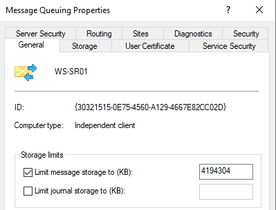

# Executive Summary

Because Nutanix AOS can withstand hardware failures and software glitches, it ensures that application availability and performance are never compromised.


<--Text Here-->

# Introduction

## Audience

This tech note is part of the Nutanix Solutions Library. We wrote it for individuals responsible for designing, building, managing, and supporting Citrix Session Recording on Nutanix infrastructures. Readers should be familiar with Nutanix AOS, Prism, AHV, Files along with Citrix Session Recording components.

## Purpose

This document covers the following subject areas:

- Overview of the Nutanix solution.
- Overview of the Citrix Session Recording Solution.
- Considerations for Citrix Session Recording on Nutanix.

Traditionally, Storage has been a focal point for Citrix Session Recording deployments with a preference for locally attached storage on the Session Recording Servers. We wanted to understand why this was the case, and identify if Nutanix Files could mitigate the requirement for locally attached storage. 

## Document Version History

| **Version Number** | **Published** | **Notes** |
| :---: | --- | --- |
| 1.0 | March 2023 | Original publication. |

# Nutanix Files

<!--JK: Need a description-->
# Citrix Session Recording

[Citrix Session Recording (SR)](https://docs.citrix.com/en-us/session-recording/current-release/) records, catalogs, and archives sessions for retrieval and playback.

Session Recording provides flexible policies to trigger recordings of application and desktop sessions automatically. Session Recording also supports dynamic session recording. Session Recording enables IT personnel to monitor and examine user activity, and so supports internal controls for regulatory compliance and security monitoring. Similarly, Session Recording also aids in technical support by speeding problem identification and time-to-resolution.

## Citrix Session Recording Components

SR consists of several key concepts and components outlined below:

[Session Recording database](https://docs.citrix.com/en-us/session-recording/current-release/system-requirements.html#session-recording-database)
: fref <!--JK: Need a description-->

[Session Recording server](https://docs.citrix.com/en-us/session-recording/current-release/system-requirements.html#session-recording-server)
: lkj <!--JK: Need a description-->

[Session Recording Policy Console](https://docs.citrix.com/en-us/session-recording/current-release/system-requirements.html#session-recording-policy-console)
: dsf <!--JK: Need a description-->

[Session Recording agent](https://docs.citrix.com/en-us/session-recording/current-release/system-requirements.html#session-recording-agent)
: dfd <!--JK: Need a description-->

[Session Recording player](https://docs.citrix.com/en-us/session-recording/current-release/system-requirements.html#session-recording-player)
: dfd <!--JK: Need a description-->

[Session Recording Storage Repository](https://docs.citrix.com/en-us/session-recording/current-release/get-started/scalability-considerations.html#storage)
: sdfs <!--JK: Need a description-->

### Citrix Session Recording Test Environment

For our validation and testing, we built the following environment. We tested utilizing the Long Term Service Release (LTSR) 2203 CU2 of Session Recording and we deployed all components on premises on Nutanix AHV.

| Component | Product Version | Operating System | Quantity | CPU/Memory |
| --- | --- | --- | --- | --- |
| Session Recording Database | Microsoft SQL Server 2016 | Windows Server 2016 | 1 | |
| Session Recording Server & Policy Console & Web Console | 2203 LTSR CU2 | Windows Server 2022 | 2 | 4vCPU/12GB |
| Session Recording Agent | 2203 LTSR CU2 | Windows 10 Enterprise 22H2 | 1500 | |
| Session Recording Player | 2203 LTSR CU2| Windows Server 2022 | 2 | 2vCPU/8GB|
| Citrix NetScaler | NS13.1: Build 37.38 | Linux | 1 | |

### Nutanix Files Configuration

We deployed Nutanix Files to support the Recording Storage Repository. The following configuration was used for Files:

<!--JK: Need to chat with Jarian around important items of note and how to structure them-->

| Component | Setting |
| --- | --- |
| Version | TBD |
| Platform | Nutanix AHV |
| File Server Size | | 
| File Server Configuration | |
| File Server Name | FS01 |
| Share Name | SessionRecording | 
| Distributed share | Enabled |
| Compression | |

Additionally, we deployed a single Active Directory Group containing both SR Servers. This Group was used to assign full control permissions to the *SessionRecording* Share.

<!--JK: Image Here - maybe also discuss permission sets-->

To ensure optimal use of Distributed Shares, we configured each Session Recording with its own Top Level Directory (TLD) on the *SessionRecording* Share.

| Server | TLD Path |
| --- | --- |
| SR01 | \\\FS01\SessionRecording\SR01 |
| SR01 | \\\FS01\SessionRecording\SR01_Restored |
| SR02 | \\\FS01\SessionRecording\SR02 |
| SR02 | \\\FS01\SessionRecording\SR02_Restored |

<note>
    Citrix Session Recording Servers create their own directory structure based on the configuration input into the Session Recording Server Properties. All Session Recording Servers should have access to all shares. Nutanix recommends leveraging an Active Directory Group containing the Session Recording Computer Accounts.
</note>

### Citrix NetScaler Configuration

Citrix NetScaler was utilized for load balancing using the [guidance provided by Citrix](https://docs.citrix.com/en-us/session-recording/2203-ltsr/best-practices/configure-load-balancing-in-an-existing-deployment.html). We implemented the [TCP passthrough](https://docs.citrix.com/en-us/session-recording/2203-ltsr/best-practices/configure-load-balancing-in-an-existing-deployment.html#configure-load-balancing-through-tcp-passthrough) model for simplicity.

We made one significant change to the load balancing configuration. We chose *Round Robin* for our load balancing method type

<!--JK: do we see more risk or value by including LB configurations?? If we keep, then we need to make the data anonymous-->

```
enable ns feature LB

add server WS-SR01 10.57.64.34 -comment "Session Recording Server"
add server WS-SR02 10.57.64.35 -comment "Session Recording Server"

add service WS-SR01_80 WS-SR01 TCP 80 -gslb NONE -maxClient 0 -maxReq 0 -cip DISABLED -usip NO -useproxyport YES -sp OFF -cltTimeout 9000 -svrTimeout 9000 -CKA NO -TCPB NO -CMP NO
add service WS-SR02_80 WS-SR02 TCP 80 -gslb NONE -maxClient 0 -maxReq 0 -cip DISABLED -usip NO -useproxyport YES -sp OFF -cltTimeout 9000 -svrTimeout 9000 -CKA NO -TCPB NO -CMP NO

add service WS-SR01_443 WS-SR01 TCP 443 -gslb NONE -maxClient 0 -maxReq 0 -cip DISABLED -usip NO -useproxyport YES -sp OFF -cltTimeout 9000 -svrTimeout 9000 -CKA NO -TCPB NO -CMP NO
add service WS-SR02_443 WS-SR02 TCP 443 -gslb NONE -maxClient 0 -maxReq 0 -cip DISABLED -usip NO -useproxyport YES -sp OFF -cltTimeout 9000 -svrTimeout 9000 -CKA NO -TCPB NO -CMP NO

add service WS-SR01_1801 WS-SR01 TCP 1801 -gslb NONE -maxClient 0 -maxReq 0 -cip DISABLED -usip NO -useproxyport YES -sp OFF -cltTimeout 9000 -svrTimeout 9000 -CKA NO -TCPB NO -CMP NO
add service WS-SR02_1801 WS-SR02 TCP 1801 -gslb NONE -maxClient 0 -maxReq 0 -cip DISABLED -usip NO -useproxyport YES -sp OFF -cltTimeout 9000 -svrTimeout 9000 -CKA NO -TCPB NO -CMP NO

add lb vserver lbvs_sr_80 TCP 10.57.64.72 80 -persistenceType SOURCEIP -lbMethod ROUNDROBIN-cltTimeout 9000
bind lb vserver lbvs_sr_80 WS-SR01_80
bind lb vserver lbvs_sr_80 WS-SR02_80

add lb vserver lbvs_sr_443 TCP 10.57.64.72 443 -persistenceType SOURCEIP -lbMethod ROUNDROBIN-cltTimeout 9000
bind lb vserver lbvs_sr_443 WS-SR01_443
bind lb vserver lbvs_sr_443 WS-SR02_443

add lb vserver lbvs_sr_1801 TCP 10.57.64.72 1801 -persistenceType SOURCEIP -lbMethod ROUNDROBIN-cltTimeout 9000
bind lb vserver lbvs_sr_1801 WS-SR01_1801
bind lb vserver lbvs_sr_1801 WS-SR02_1801
```

### Citrix Session Recording Server Configuration

Each Session Recording Server was configured with the following settings:

-  Load Balancing was enabled by [setting the appropriate registry value](https://docs.citrix.com/en-us/session-recording/2203-ltsr/best-practices/configure-load-balancing-in-an-existing-deployment.html#step-2-configure-an-existing-session-recording-server-to-support-load-balancing)

    ```
    New-ItemProperty -Path "HKLM:\SOFTWARE\Citrix\SmartAuditor\Server" -Name "EnableLB" -Type DWORD -Value 1
    ```

-  MSMQ configurations were implemented to support load balancing as per [Citrix recommendations](https://support.citrix.com/article/CTX248554/session-recording-server-not-recording-sessions-while-using-the-cname-or-dns-alias). 

    ```
    New-ItemProperty -Path "HKLM:\SOFTWARE\Microsoft\MSMQ\Parameters" -Name "IgnoreOSNameValidation" -Type DWORD -Value 1
    ```

-  We ran the *SrServerConfigurationSync.ps1* script to configure the *sr_lb_map.xml* file to support load balancing via the ADC

    ```
    & "C:\Program Files\Citrix\SessionRecording\Scripts\SrServerConfigurationSync.ps1" -Action AddRedirection -ADCHost <sessionrecording.testdomain.com>
    ```

<note>
    Note that we specifically configured both methods to support either TCP or HTTP/HTTPS configurations.
</note>

-  MSMQ storage buffer was increased from the default 1Gb to 4Gb (Computer Management -> Services and Applications -> Message Queuing Properties)

    

- Windows Defender Antivirus was disabled during the testing. Citrix provide guidance on Antivirus configurations for [Session Recording Servers including MSMQ](https://docs.citrix.com/en-us/tech-zone/build/tech-papers/antivirus-best-practices.html#session-recording---server), the [Session Recording Agent](https://docs.citrix.com/en-us/tech-zone/build/tech-papers/antivirus-best-practices.html#session-recording---agent) and the [Session Recording Player](https://docs.citrix.com/en-us/tech-zone/build/tech-papers/antivirus-best-practices.html#session-recording---player).

### Citrix Session Recording Agent Configuration

<!--JK: Need to note what was installed, and the importance of sealing for MSMQ ID-->

# Testing Logic

We used Login Enterprise to perform multiple 1500 concurrent session tests against the environment. <!--JK: Need to get some input from Sven-->

We used the included *Record entire sessions (for everyone without notification)* Policy so that we could capture the entire session without interaction.


    - need to capture that we retrieved sessions whilst they were being recording too

# Test Results

## Infrastructure Servers

    - Can we get some data for CPU/Mem Usage
    - SQL Data?

## Nutanix Files

    - Storage consumed
    - IO Consumed
    - Latency/Issues/Challenges
## 

# Conclusion

<--Text Here-->

# Appendix

## References

-  [URL1](https://whatever.com)
-  [URL2](https://whateverelse.com)