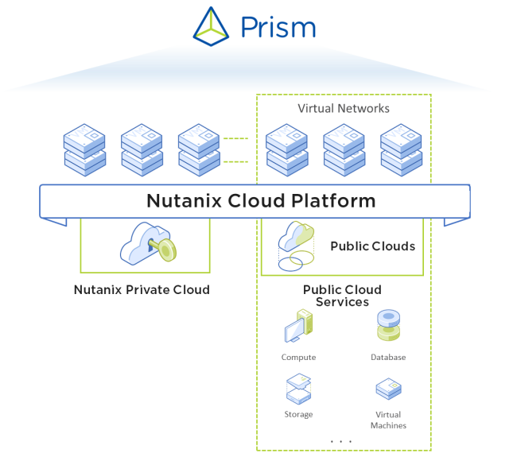
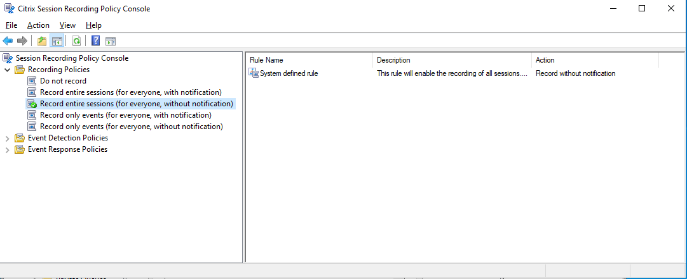
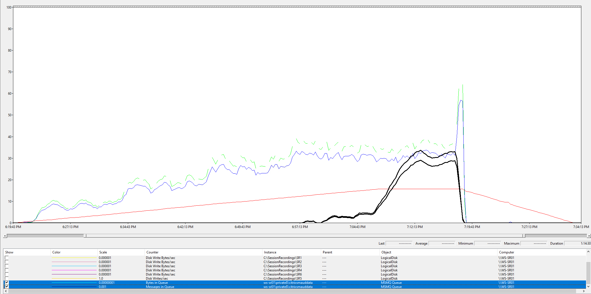
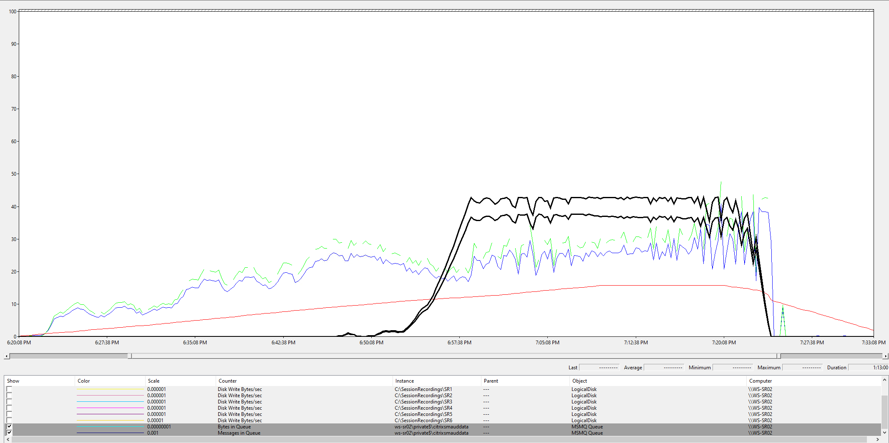
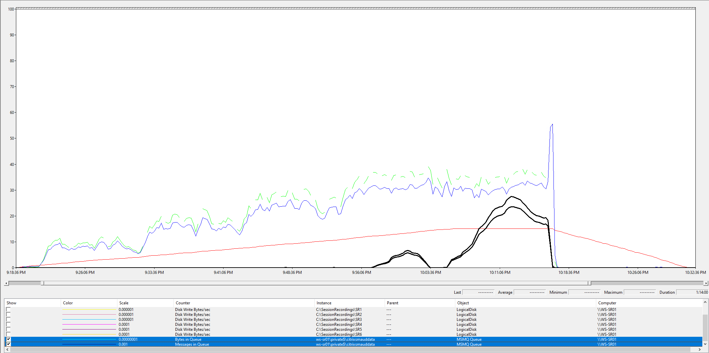
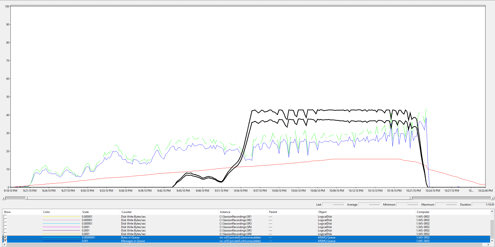
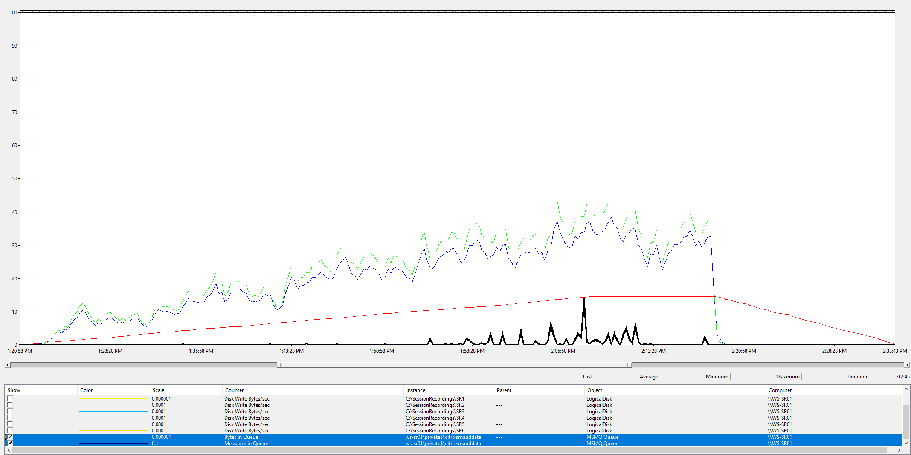
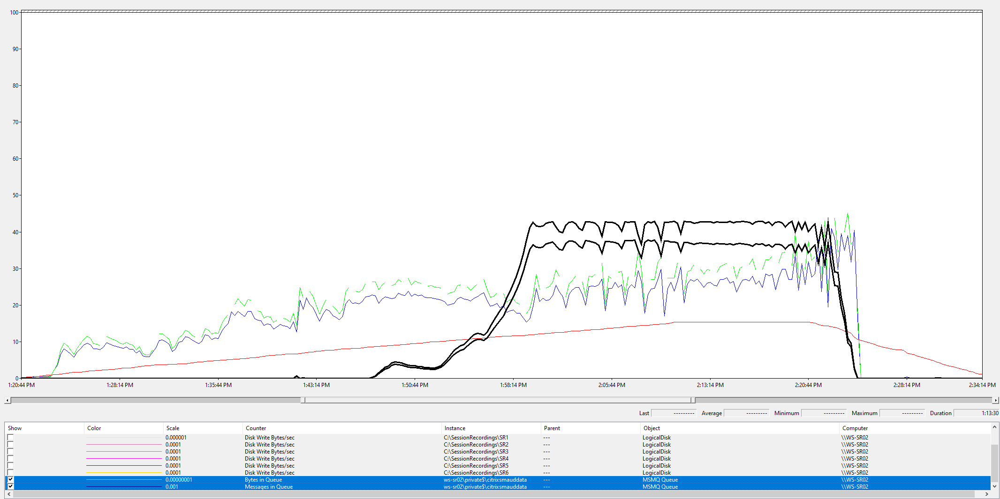
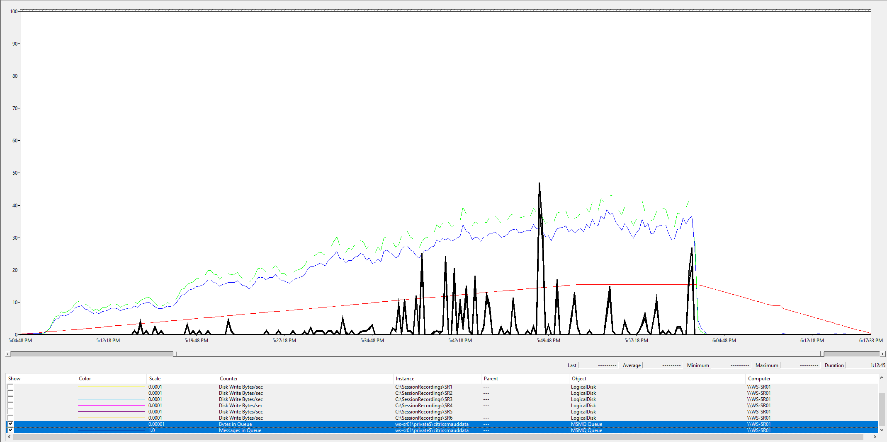
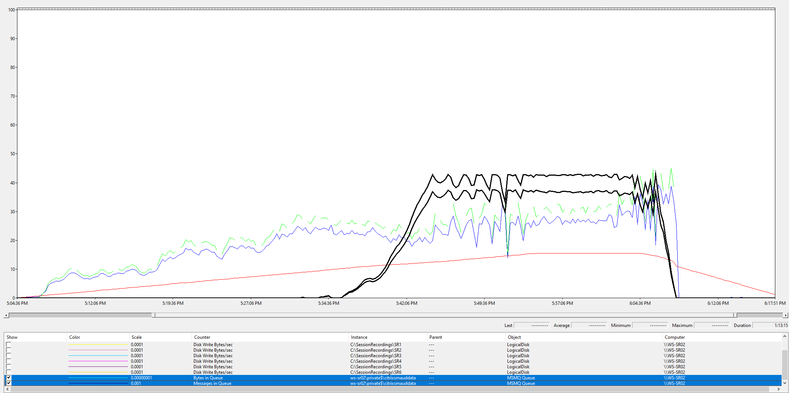

# Executive Summary

Because Nutanix AOS can withstand hardware failures and software glitches, it ensures that application availability and performance are never compromised.



<--Text Here-->

# Introduction

## Audience

This tech note is part of the Nutanix Solutions Library. We wrote it for individuals responsible for designing, building, managing, and supporting Citrix Session Recording on Nutanix infrastructures. Readers should be familiar with Nutanix AOS, Prism, AHV, Files along with Citrix Session Recording components.

## Purpose

This document covers the following subject areas:

- Overview of the Nutanix Files solution.
- Overview of the Citrix Session Recording Solution.
- Considerations for Citrix Session Recording on Nutanix.

Traditionally, Storage has been a focal point for Citrix Session Recording deployments with a preference for locally attached storage on the Session Recording Servers. We wanted to understand if Nutanix Files could provide an alternative approach to locally attached disks, as well as understanding the optimal configuration both local and Files based configurations when deployed on Nutanix.

## Document Version History

| **Version Number** | **Published** | **Notes** |
| :---: | --- | --- |
| 1.0 | March 2023 | Original publication. |

# Nutanix Files

Nutanix Files is a software-defined, scale-out file storage solution that provides a repository for unstructured data, such as home directories, user profiles, departmental shares, application logs, backups, and archives. Flexible and responsive to workload requirements, Files is a fully integrated, core component of Nutanix.

You can deploy Nutanix Files on an existing or standalone cluster. Unlike standalone NAS appliances, Files consolidates VM and file storage, eliminating the need to create an infrastructure silo. Administrators can manage Files with Nutanix Prism, just like VM services, which unifies and simplifies management. Integration with Active Directory enables support for quotas and access-based enumeration (ABE), as well as self-service restores with the Windows Previous Versions feature. Nutanix Files also supports native remote replication and file server cloning, which lets you back up Files off-site and run antivirus scans and machine learning without affecting production.

Nutanix Files can run on a dedicated cluster or be collocated on a cluster running user VMs. Nutanix supports Files with both ESXi and AHV. Files includes native high availability and uses AOS storage for intracluster data resiliency. AOS storage also provides data efficiency techniques such as erasure coding (EC-X).

Nutanix Files includes File Analytics, which gives you a variety of useful insights into your data, including full audit trails, anomaly detection, ransomware detection and intelligence, data age analytics, and custom reporting. You can also leverage Nutanix Data Lens to provide deeper insights and more robust ransomware protection for your Nutanix Files environment. Data Lens provides analytics and ransomware defense at scale for Nutanix Unified Storage. 
# Citrix Session Recording

[Citrix Session Recording (SR)](https://docs.citrix.com/en-us/session-recording/current-release/) records, catalogs, and archives sessions for retrieval and playback.

Session Recording provides flexible policies to trigger recordings of application and desktop sessions automatically. Session Recording also supports dynamic session recording. Session Recording enables IT personnel to monitor and examine user activity, and so supports internal controls for regulatory compliance and security monitoring. Similarly, Session Recording also aids in technical support by speeding problem identification and time-to-resolution.

## Citrix Session Recording Components

Session Recording consists of several key concepts and components outlined below:

[Session Recording database](https://docs.citrix.com/en-us/session-recording/current-release/system-requirements.html#session-recording-database)
: A component that manages the SQL Server database for storing recorded session data. When this component is installed, it creates a database named CitrixSessionRecording by default

[Session Recording server](https://docs.citrix.com/en-us/session-recording/current-release/system-requirements.html#session-recording-server)
: A Windows server that hosts: 
    - **The Broker**. An IIS 6.0+ hosted Web application that serves the following purposes:
      - Handling search queries and file download requests from the Session Recording player and web player.
      - Handling policy administration requests from the Session Recording policy console.
      - Evaluating recording policies for each Citrix Virtual Apps and Desktops or Citrix DaaS (formerly Citrix Virtual Apps and Desktops service) session.
    - **The Storage Manager**. A Windows service that manages the recorded session files received from each Session Recording-enabled VDA.
    - **Administrator Logging**. An optional subcomponent installed with the Session Recording server to log the administration activities. All the logging data is stored in a separate SQL Server database named CitrixSessionRecordingLogging by default. You can customize the database name.

[Session Recording Policy Console](https://docs.citrix.com/en-us/session-recording/current-release/system-requirements.html#session-recording-policy-console)
: A console used to create policies to specify which sessions are recorded.

[Session Recording agent](https://docs.citrix.com/en-us/session-recording/current-release/system-requirements.html#session-recording-agent)
: A component installed on each VDA for multi-session OS or single-session OS to enable recording. It is responsible for recording session data.

[Session Recording player](https://docs.citrix.com/en-us/session-recording/current-release/system-requirements.html#session-recording-player)
: A user interface that users access from a workstation to play recorded session files.

[Session Recording Storage Repository](https://docs.citrix.com/en-us/session-recording/current-release/get-started/scalability-considerations.html#storage)
: A location or set of locations used to store the session recording data files.

### Citrix Session Recording Test Environment

For our validation and testing we utilized the Current Release (2212) of Citrix Session Recording and we deployed all components on premises on Nutanix AHV.

| Component | Product Version | Operating System | Quantity | CPU/Memory |
| --- | --- | --- | --- | --- |
| Session Recording Database | Microsoft SQL Server 2016 | Windows Server 2016 | 1 | |
| Session Recording Server & Policy Console & Web Console | 2212 | Windows Server 2022 | 2 | 4vCPU/12GB | <!--JK: TBD -->
| Session Recording Agent | 2212 | Windows 10 Enterprise 22H2 | 1500 | |
| Session Recording Player | 2212 | Windows Server 2022 | 2 | 2vCPU/8GB|
| Citrix NetScaler | NS13.1: Build 37.38 | Linux | 1 | | <!--JK: TBD -->

<Note>
    Due to direct feedback from the Citrix product management team, Session Recording LTSR testing was not performed due to a number of known issues which were resolved in newer releases.
</Note>

### Citrix Session Recording Server Configuration

Each Session Recording Server was configured with the following settings to support load balancing:

-  Load Balancing was enabled by [setting the appropriate registry value](https://docs.citrix.com/en-us/session-recording/2203-ltsr/best-practices/configure-load-balancing-in-an-existing-deployment.html#step-2-configure-an-existing-session-recording-server-to-support-load-balancing)

    ```
    New-ItemProperty -Path "HKLM:\SOFTWARE\Citrix\SmartAuditor\Server" -Name "EnableLB" -Type DWORD -Value 1
    ```

-  MSMQ configurations were implemented to support load balancing as per [Citrix recommendations](https://support.citrix.com/article/CTX248554/session-recording-server-not-recording-sessions-while-using-the-cname-or-dns-alias). 

    ```
    New-ItemProperty -Path "HKLM:\SOFTWARE\Microsoft\MSMQ\Parameters" -Name "IgnoreOSNameValidation" -Type DWORD -Value 1
    ```

-  We ran the *SrServerConfigurationSync.ps1* script to configure the *sr_lb_map.xml* file to support load balancing via the ADC

    ```
    & "C:\Program Files\Citrix\SessionRecording\Scripts\SrServerConfigurationSync.ps1" -Action AddRedirection -ADCHost <sessionrecording.testdomain.com>
    ```

<note>
    Note that we specifically configured both methods to support either TCP or HTTP/HTTPS configurations.
</note>

- Windows Defender Antivirus was disabled during the testing. Citrix provide guidance on Antivirus configurations for [Session Recording Servers including MSMQ](https://docs.citrix.com/en-us/tech-zone/build/tech-papers/antivirus-best-practices.html#session-recording---server), the [Session Recording Agent](https://docs.citrix.com/en-us/tech-zone/build/tech-papers/antivirus-best-practices.html#session-recording---agent) and the [Session Recording Player](https://docs.citrix.com/en-us/tech-zone/build/tech-papers/antivirus-best-practices.html#session-recording---player).

### Citrix Image Build

We built a fresh gold image on Nutanix AHV with the following components installed:

- Windows 10 Enterprise 22H2
- Nutanix VirtIO Drivers
- Microsoft Edge Web Browser (Chromium)
- Microsoft FSLogix Apps
- Microsoft Office 2016 Professional Plus
- VLC Media Player
- Adobe Acrobat Reader DC
- Citrix Virtual Delivery Agent 2203 CU2
- Citrix Session Recording Agent 2212 (CR)
- Citrix Workspace Environment Management Agent 2212 (CR)
- VMWare Optimizer used for optimization
- Base Image Script Framework used for Image Sealing

The image build was automated and a snapshot was output to be used with Machine Creation Services provisioning. 

### Citrix Session Recording Agent Configuration

The Session Recording Agent was deployed with default configurations. It is critical to understand that each Recording Agent must have a unique QMID else data will be lost when interacting with the SR servers. To ensure this was always unique, we sealed our base images with the **Base Image Script Framework** which executes the appropriate configurations to provide a unique QMID.

[VDAs can have the same QMId under certain conditions](https://docs.citrix.com/en-us/session-recording/current-release/install-upgrade-uninstall.html#step-8-complete-the-installation)

### Session Recording Configuration with Local Storage

We configured the following settings to baseline the environment:

| Component | Detail |
| --- | --- |
| MSMQ Message Storage Size | **4194304 KB**. Left in the default location. We raised this from the default **1048576 KB** due to the nature of our load testing. We introduced and were impacted by [burst](https://docs.citrix.com/en-us/session-recording/current-release/get-started/scalability-considerations.html#bursts-and-faults) scenarios when using the default 1Gb configuration. |
| A central directory for Mount Points | **C:\SessionRecordings** to reduce the requirement on drive letters and simplify the topology. |
| A single root share configured on the SR Server | **C:\SessionRecordings** shared as **\\\ServerName\SessionRecordings$**. This is to allow access for all SR servers to all shares when scaling out. |
| Active Directory Group Permissions | We deployed a single Active Directory Group containing all SR Servers. This Group was used to assign **full control** permissions to the **SessionRecording$** Share. |
| A dedicated Storage Container on AOS | This Container was used to store Session Recording data disks. |
| A directory per physical disk mount | For example, **Disk 1** mounted to **C:\SessionRecordings\SR1**.  |
| SR Server storage configuration | **\\\ServerName\SessionRecordings$\SR1\Recordings**. The Session Recording Server creates the ***Recordings*** Directory. |

<!--JK: Should we include compression, dedup and Erasure coding configurations?-->
### Session Recording Configuration with Nutanix Files

We deployed Nutanix Files to support the Recording Storage repository. We tested two File Server configurations, one based on Hybrid technology, the other using an All-Flash configuration.

The following configuration was used for Files both for Flash and Hybrid configurations:

<!--JK: Need to chat with Jarian around important items of note and how to structure them-->

| Component | Setting |
| --- | --- |
| Platform | Nutanix AHV |
| Distributed share | Enabled |
| Compression | Enabled |

Additionally, we deployed a single Active Directory Group containing both SR Servers. This Group was used to assign full control permissions to the *SessionRecording* Share.

We ensured that the shares were configured with a Top Level Directory (TLD) for each Session Recording Server so that load would be split across File Server VMs as the Session Recording Servers were scaled out

| Server | TLD Path |
| --- | --- |
| WS-SR01 | \\\files\SessionRecording\WS-SR01\Recordings |
| WS-SR02 | \\\files\SessionRecording\WS-SR02\Recordings |

<note>
    Citrix Session Recording Servers create their own directory structure based on the configuration input into the Session Recording Server Properties. In the above example, the Session Recording Server will create the *Recordings* directory
</note>

<note>
     All Session Recording Servers should have access to all shares. Nutanix recommends leveraging an Active Directory Group containing the Session Recording Computer Accounts.
</note>

### Citrix NetScaler Configuration

Citrix NetScaler was utilized for load balancing using the [guidance provided by Citrix](https://docs.citrix.com/en-us/session-recording/2203-ltsr/best-practices/configure-load-balancing-in-an-existing-deployment.html). We implemented the [TCP passthrough](https://docs.citrix.com/en-us/session-recording/2203-ltsr/best-practices/configure-load-balancing-in-an-existing-deployment.html#configure-load-balancing-through-tcp-passthrough) model for simplicity.

We made the following changes to the NetScaler configuration to meet our needs

-  Round Robin Load Balancing Method
-  Persistency configuration set to 1440 minutes to ensure each Agent was pinned to a specific Session Recording Server at all times

<note>
    When load Balancing with a Citrix NetScaler, be sure to size the NetScaler with the appropriate throughput licensing.
</note>

# Testing Logic

We used Login Enterprise to perform multiple 1500 concurrent session tests against the environment. We utilized the following personas
    - Knowledge Worker
    - Task Worker
<!--JK: - Sven Worker-->

We used the ***Record entire sessions (for everyone without notification)*** Policy so that we could capture the entire session without interaction.


During the testing we actively played back both finished recordings (completed) and live recordings (active) via both the traditional console and the web console.

Our goal was to understand a scale unit configuration for growth. We wanted to identify at what point, either the storage or server (MSMQ) configurations became a bottleneck.

Whilst we [monitored key metrics as outlined by Citrix](https://docs.citrix.com/en-us/session-recording/current-release/get-started/scalability-considerations.html#measuring-throughput) we ultimately decided to focus on the *Message in Queue* and *Bytes in Queue* MSMQ performance counters to measure impact. This was decided on due to MSMQ being the key transport model for data between Agents and Session Recording Servers. If there are delay in any component of the transfer process, these counters show the impact. This is true for *normal state* operations, *disk latency or write challenges* or *inbound data overload scenarios*. 

In a healthy and optimal scenario, the MSMQ counters should display a *Store and Flush* pattern, where data is received, processed, and removed from the queues. Sustained data load within the queues without a downward trend indicate that the server is constantly under load with an inability to flush data faster than data is received. Finally, when the MSMQ cache limit is reached, data will queue on the Agent prior until a slot is made available for the data to be moved to the Session Recording Server.

If the MSMQ cache is full, and event log entry (Event ID 2183, Source MSMQ) is logged with the following warning: *Machine MSMQ storage quota was exceeded or there is insufficient disk space. No more messages can be stored in user queues. You can increase Message Queuing storage quota or purge unneeded messages by using Computer Management console.* This event indicates that there is too much data being delivered to the Session Recording Server, and that it is likely you need to consider scaling out.

# Test Results

Perfmon natively alters it's scale based on the data collected. To standardize the perfmon data outputs, we scaled all data sets to the "worst case" scale for consistency. This equated to:

- Bytes in Queue: 0.00000001
- Messages in Queue: 0.001

All graphs reflect these scale ratios.

## Data Gathering and Benchmarking Tests

### Multiple local disks with loopback share configuration - 6 disks

This test was executed using a NetScaler load balancer with load distribution on a round robin basis. One node was configured on all flash cluster, the other one a hybrid cluster. The load test was based on a 1500 session load distributed across both servers.

The below image shows WS-SR01 with 6 local disks configured in a loopback configuration. Each disk is configured identically and Session Recording is configured with 6 write locations. WS-SR01 is deployed on an all-flash cluster.



The below image shows WS-SR02 with 6 local disks configured in a loopback configuration. Each disk is configured identically and Session Recording is configured with 6 write locations. WS-SR02 is deployed on an hybrid cluster.



The data shows several key facts: <!--JK: Need to add some context here-->
- The all-flash configuration was able to handle more sessions and data prior to the queue ramp up than the hybrid server. This is evident by the rapid upward trajectory of the black lines indicating messages in queue.
- Both scenarios show that neither server was able to fully flush its queues throughout the test.

### Multiple local disks with loopback share configuration - 3 disks

This test was executed using a NetScaler load balancer with load distribution on a round robin basis. One node was configured on all flash cluster, the other one a hybrid cluster. The load test was based on a 1500 session load distributed across both servers.

The below image shows WS-SR01 with 3 local disks configured in a loopback configuration. Each disk is configured identically and Session Recording is configured with 3 write locations. WS-SR01 is deployed on an all-flash cluster.



The below image shows WS-SR02 with 3 local disks configured in a loopback configuration. Each disk is configured identically and Session Recording is configured with 3 write locations. WS-SR02 is deployed on an hybrid cluster.



The data shows several key facts: <!--JK: Need to add some context here-->
- TBD
- TBD

### Single local disk with loopback share configuration

This test was executed using a NetScaler load balancer with load distribution on a round robin basis. One node was configured on all flash cluster, the other one a hybrid cluster. The load test was based on a 1500 session load distributed across both servers.

The below image shows WS-SR01 with 1 local disk configured in a loopback configuration. Session Recording is configured with 1 write location. WS-SR01 is deployed on an all-flash cluster.



<note>
    NOTE ABOUT SCALE CHANGE IMPORTANCE HERE FOR THE ABOVE IMAGE <!--JK: Need to add some context here-->
</note>

The below image shows WS-SR02 with 1 local disk configured in a loopback configuration. Session Recording is configured with 3 write location. WS-SR02 is deployed on an hybrid cluster.



The data shows several key facts: <!--JK: Need to add some context here-->
- Scale changes for Flash Server here
- TBD
- TBD

### Nutanix Files - single TLD per server

Given our learnings with local storage, we could see no value in further testing with multiple write locations. So for Nutanix Files we configured a single TLD per server.

This test was executed using a NetScaler load balancer with load distribution on a round robin basis. Both the Files deployment and corresponding SR node were housed with one pair on an all flash cluster, the other on a hybrid cluster. The load test was based on a 1500 session load distributed across both servers.

The below image shows WS-SR01 configured with a single Nutanix File Share location (all flash). Session Recording is configured with 1 write location.



<note>
    NOTE ABOUT SCALE CHANGE IMPORTANCE HERE FOR THE ABOVE IMAGE <!--JK: Need to add some context here-->
</note>

The below image shows WS-SR02 configured with a single Nutanix File Share location (Hybrid). Session Recording is configured with 1 write location.



The data shows several key facts: <!--JK: Need to add some context here-->
- Scale changes for Flash Server here
- Files performs fine

## Final State Testing

### Single local disk with loopback share configuration

This test was executed using a NetScaler load balancer with load distribution on a round robin basis. The load test was based on a 1500 session load distributed across both servers. Both servers were deployed on the same all flash cluster.

### Nutanix Files - single TLD per server

This test was executed using a NetScaler load balancer with load distribution on a round robin basis. The load test was based on a 1500 session load distributed across both servers. Both servers were deployed on the same all flash cluster, Nutanix Files was used on an all flash clusters. A single TLD was configured per Session Recording Server.

# Conclusion

Our testing may not represent a typical deployment of Session Recording. We did not use any form of selective or trigger based recording scenarios, preferring to identify a break point for the solution and a scale unit strategy which can be used across any scenario. Whilst benchmarking and validating findings, we were privileged to engage with multiple Nutanix customers who used Session Recording in numerous different ways, unique to their business.

#### General Sizing and scaling
- Citrix documentation, whilst somewhat "*it depends*" when it comes to Session Recording sizing is something we have found to be fair. There are many different considerations and environment specific challenges that will directly impact the amount of data sent to Session Recording, and as such the associated sizing of servers and storage.
- There is rarely a scenario where a *Scale Up* logic will improve Session Recording Performance. A *Scale Out* logic will typically be required. This is backed up by [Citrix documentation and guidance](https://docs.citrix.com/en-us/session-recording/current-release/get-started/scalability-considerations.html#scaling-out)
- The amount of data sent to the Session Recording Server is typically what will mandate scale out scenarios:
  - A knowledge worker profile with intense web browser utilization overloaded the Session Recording servers ability to flush MSMQ at a much shorter threshold than a task worker profile.
  - A task worker profile with Login Enterprise showed significantly better results on Session Recording server scalability.
- Heavy workloads and logon storms will directly impact scale considerations.
- Load balancing configurations should be considered, however throughput should be considered and measured. Do not underestimate sizing of the load balancer.
  - When load balancing Session Recording Servers, burst impacts are reduced and MSMQ impact is less.
  - When load balancing Session Recording Servers, we identified data loss when using the suggested "least bandwidth" load balancing Method. This was experienced as "live" sessions never transitioning to "complete". Transitioning to Round Robin Load Balancing and 24 Hour persistence resolved these issues.
- Whilst storage is a focal point for Session Recording sizing, the storage backend is only half the story. Each Session Recording Server has a break point typically associated with MSMQ
- The "Active Session Recording" Counter shows unexpected results, typically resulting in duplicate figures compared to active ICA sessions. This can be challenging when trying to analyze perfmon data

#### MSMQ
- MSMQ is the overarching limiting feature of the solution. Moving MSMQ queues to alternate drives had no positive impacts on performance.
- Performance was actually reduced when multiple disks were configured within Session Recording. This aligns to the challenge of MSMQ being single threaded. Consider larger capacity disks before larger quantities of disk.
- We chose to increase the size of the MSMQ cache as we felt architecturally, the risk would be less by having more data stored on the Session Recording Server, than by having that same data queues on the Session Recording Agents. We did however draw the line at 4Gb for our testing. If there is a need to grow more than this, then it's likely time to consider another Session Recording Server.
- When MSMQ thresholds are increased, there is significantly higher disk activity due to the way MSMQ stores and flushes data.

#### Nutanix Infrastructure
- All Flash, as expected, out performed Hybrid with local disk configurations. The ability for MSMQ to quickly flush data to disk resulted in higher density per SR server.
- Nutanix Files and local storage configuration performed similarly, proving that Nutanix Files offers a robust, performant and efficient system to store Session Recording Datasets. <!--Check this, we may actually have better performance with Files-->
- Nutanix Files deployed on all flash clusters significantly outperformed hybrid clusters, the same patters as identified in local storage configurations.
- Based on our findings, at scale, all flash deployments are most suited to Session Recording deployments.

# Appendix

## References

-  [URL1](https://whatever.com)
-  [URL2](https://whateverelse.com)
-  CUGC Blog?
-  T-Mobile?
-  Verizon?