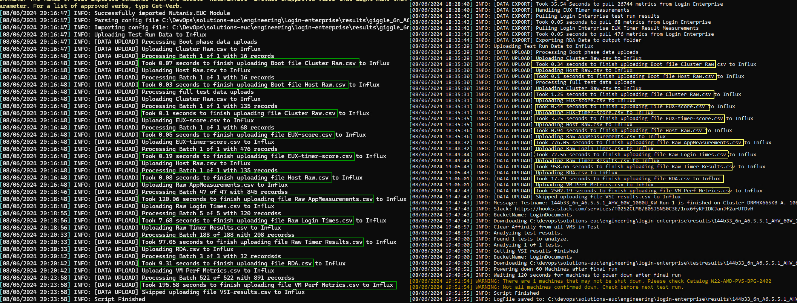

Here is a small part of our enhancements whilst you lot have been laying on beaches. There are some lessons and code snippets included for learning. Enjoy.

TL/DR

- We reduced data export and manipulation times from Login Enterprise from over 9 hours to around 27 minutes.
- We reduced the data ingestion time from CSV to Influx from 70 minutes to 7 minutes.
- We improved logging functionality so that we now have full logging to file for every test, and we have a load more verbose logging output across the data egress and ingress components.
- Remove-TestData-API.ps1 now deletes full test sets in a few minutes, Invoke-TestUpload.ps1 also benefits from all code changes below.
- We removed non-useful scripts and functions.
- We changed our approach of editing the `_time` value for influx from always start at 1-1-2023-01:00:00 to use the actual (UTC) `_time` value. This allows us to correlate other metrics that we capture using the actual time stamp, coming from Telegraf or Prometheus for example.
- Because of the change to store the actual `_time` values in Influx, we needed to modify all queries that are used to create graphs in Grafana to use `experimental.alignTime` function of Influx.
- We also needed to modify the Grafana-Report script to use the new queries and dashboards. This is available as `New-GrafanaReportV2.ps1`.
- On the `Testing Status` dashboard, where we monitor components like Citrix Delivery Controllers, PVS servers, and SQL server in real time, we added panels with `Host CPU`, `Cluster CPU`, `Total Login Time`, and `Connection Time`, which are coming from the `LoginDocuments` bucket. The `experimental.alignTime` is not used here, because we want to match it to the actual time to correlate it to the other information on the dashboard.
- This brought us to the idea to pull in more performance data from the target cluster. We created a new function called `Set-CVMObserver` that takes in an array of CVM ip addresses, creates a prometheus.yml file, uploads it to a prometheus server (1 per LE appliance), and reloads the prometheus server. The metrics definitions are coming from the Observer appliance from the Durham Performance Engineering team. More can be added later.
- New filters and panels are added to the `Testing Status` dashboard, where you can select the appropriate Observer appliance and the cluster, and it will dynamically create the panels. 

## Optimization of data egress from Login Enterprise

This is really a brutal lesson in understanding how arrays work in PowerShell and the dangers of looping.

When we create Arrays in PowerShell using a `$NewArray = @()` layout or simply pulling data into an array by getting a return such as `$DataArray = Get-Item -Path "c:\some_path\" -recurse` you are creating a fixed size basic array. This is an immutable object.

Why does this matter? When you then choose to "add" to that array, you aren't really adding anything. You are asking PowerShell, in memory, to delete and recreate the array with new values. Specifically, this sort of code `$Array += $Item`. The more items you have in the source array, the more tax it is to delete and recreate with a new item. A terrible model to scale with.

We should be using `ArrayLists`. These are defined as `$NewArray = [System.Collections.ArrayList] @()`. These are a non-fixed array meaning you can add or remove data. For example:

-  `$NewArray.Add($Item)` would add the item `$Item` to the `$NewArray`.
-  `$NewArray.Remove($Item)` would remove the `$item` from the `$NewArray`.
-  `$NewArray.AddRange($NewArrayBatch)` would add the entire existing `$NewArrayBatch` to the `NewArray`. This can be handy when you get a return of a fixed Array, and you want to cast it to an `ArrayList` instead.
 
Not using ArrayLists, but instead using basic Arrays, is a problem that shows its face at scale. For small datasets, it's fine, but for large datasets, the problems get worse the more data you add.

Rule of thumb. If you go to type `+=` in your code, think about if you should be using Arrays or ArrayLists? My suggestion is going to be ArrayLists for all the things.

Let's look at an example of what using bad basic arrays and bad loops can look like and the impacts on our environment.

### Example Problem: Export-LEMeasurements.ps1

This function is designed to go and pull data from Login Enterprise via its API. We then sort the data and export it to CSV files which we ingest into Influx (more on that later).

Here is a code block that hurts big time. There are multiple failures, we will break them down.

```
$SessionMetricMeasurements = Get-LESessionMetricMeasurements -testRunId $testRun.Id -orderBy timestamp

if (($SessionMetricMeasurements | Measure-Object).Count -gt 0) {
            
    $SessionMetricMeasurements = $SessionMetricMeasurements | Select-Object displayName,instance,fieldName,timestamp,userSessionKey,@{Name = "offSetInSeconds"; Expression = { ((New-TimeSpan -Start (Get-Date $TestRun.started) -End (Get-Date $_.timestamp)).TotalSeconds) } },measurement
    
    if (($SessionMetricMeasurements | Measure-Object).Count -eq 10000) {
        $FileEnded = $false
        while (-not $FileEnded){
            [int]$OffSet = $SessionMetricMeasurements.count + 1
            $SessionMetricMeasurementsAdditional = Get-LESessionMetricMeasurements -testRunId $testRun.Id -orderBy timestamp -OffSet $OffSet
            $SessionMetricMeasurementsAdditional = $SessionMetricMeasurementsAdditional | Select-Object displayName,instance,fieldName,timestamp,userSessionKey,@{Name = "offSetInSeconds"; Expression = { ((New-TimeSpan -Start (Get-Date $TestRun.started) -End (Get-Date $_.timestamp)).TotalSeconds) } },measurement
            $SessionMetricMeasurements = $SessionMetricMeasurements + $SessionMetricMeasurementsAdditional
            if (($SessionMetricMeasurementsAdditional | Measure-Object).count -lt 10000){
                $FileEnded = $true
            }
        }
    }

    # Open an Object to capture the update info prior to export
    $SessionMetricMeasurementsWithHost = @()

    # Loop through each unique session and go learn about the host host they lived on
    foreach ($userSessionKey in ($SessionMetricMeasurements.userSessionKey | Select-Object -Unique)) {
        $SessionHostName = ((Get-LESessionDetails -testRunId $testRun.Id -userSessionId $userSessionKey).Properties | Where-Object {$_.propertyId -eq "TargetHost"}).value
        # now we need to inject the SessionHostName value into the Data used for CSV Export - we need to only do this where the record in the existing data set contains the matching userSessionKey
        foreach ($Item in $SessionMetricMeasurements | Where-Object {$_.userSessionKey -eq $userSessionKey}) {
            $SessionMetricMeasurementsWithHostresult = New-Object PSObject
            $SessionMetricMeasurementsWithHostresult | Add-Member -MemberType NoteProperty -Name "timestamp" -Value $item.timestamp
            $SessionMetricMeasurementsWithHostresult | Add-Member -MemberType NoteProperty -Name "userSessionKey" -Value $item.userSessionKey
            $SessionMetricMeasurementsWithHostresult | Add-Member -MemberType NoteProperty -Name "displayName" -Value $item.displayName
            $SessionMetricMeasurementsWithHostresult | Add-Member -MemberType NoteProperty -Name "measurement" -Value $item.measurement
            $SessionMetricMeasurementsWithHostresult | Add-Member -MemberType NoteProperty -Name "fieldName" -Value $item.fieldName
            $SessionMetricMeasurementsWithHostresult | Add-Member -MemberType NoteProperty -Name "instance" -Value $item.instance
            $SessionMetricMeasurementsWithHostresult | Add-Member -MemberType NoteProperty -Name "hostName" -Value $SessionHostName

            $SessionMetricMeasurementsWithHost += $SessionMetricMeasurementsWithHostresult
        }
    }
    # Set the Data set ready for export
    $SessionMetricMeasurements = $SessionMetricMeasurementsWithHost

    $SessionMetricMeasurements | Export-Csv -Path "$($Folder)\VM Perf Metrics.csv" -NoTypeInformation
}
```

**Problem 1:** The use of Basic Arrays in a loop function

This code used the following logic

-  Go and get the first set of Session Metric Measurements. Put them into a basic Array called `$SessionMetrics`.
-  We know that the maximum number we can pull back in a single API call is 10,000, so we do a check to see if there is more to come down. We know there is more because the item count is 10,000, if there were none left, we wouldn't have 10,000 as the count. This is fine.
-  We loop through multiple times until we get all the data. Each time we loop, we update our basic array using `$SessionMetricMeasurements = $SessionMetricMeasurements + $SessionMetricMeasurementsAdditional` with 10000 records. This is not updating anything, it's creating a new array in memory each loop, and each loop is creating a bigger array that PowerShell needs to handle. Uh oh. Not good when you have let's say, 520,000 records (that is what we often collect - and this is just Session Metrics).
-  Now we have all the Session Metrics, we need to do something with them. Here comes the double-tap problem number 2.
 
**Problem 2:** Naughty loops and more naughty basic Arrays

Now that we have the data set, we need to add the hostName record to each record because we need to be able to wrap it up in influx. Login Enterprise doesn't return this record with the Session Metrics, so we have to go and learn some detail, and then create a custom object, and append. Here is what the bad code block is doing to handle this

-  It creates a new basic Array (uh oh) called `$SessionMetricMeasurementsWithHost = @()` The idea is this will house the final updated data.
-  It now looks to identify each unique user session which is what we use to go and learn some host details from Login Enterprise `foreach ($userSessionKey in ($SessionMetricMeasurements.userSessionKey | Select-Object -Unique))`
-  Now for each of those (hello loop number 1), it goes and learns the VM name `$SessionHostName = ((Get-LESessionDetails -testRunId $testRun.Id -userSessionId $userSessionKey).Properties | Where-Object {$_.propertyId -eq "TargetHost"}).value`
-  And here lies the second massive failure: from here, we loop through every single item that is in the initial `SessionMetricMeasurements` basic array (over half a million) and we match the appropriate values so we know the host name `foreach ($Item in $SessionMetricMeasurements | Where-Object {$_.userSessionKey -eq $userSessionKey})`.
-  From there, for each item that is matched, we create a new PS object and then start our 3rd failure `$SessionMetricMeasurementsWithHost += $SessionMetricMeasurementsWithHostresult`. Yes, another basic array recreation job.

What does this mean? Let's take a look at the math. We have a test that monitors 20 sessions via LE. On average, with the perfmon counters we are using (and this is a problem that gets worse with each counter we add), we would pull back over half a million records. So let's use a round number of 500,000 records for this example:

-  We iterate through the records, pulling back 10,000 items at a time. That is 50 batch calls to Login Enterprise, and 50 basic array recreates, each time compounding the memory usage and time spent by 10,000 records. So the last bit of work that PowerShell has to do on this logic is handle the recreation of a basic Array that already has 490,000 records and create a new one with 50,0000. Ouch.
-  We monitor 20 sessions, so we need to go and learn about those 20 sessions and get the VM that the session was associated with. In the bad code block above:
  -  We start our loop with session 1, and we ultimately repeat this top-level loop 20 times
  -  We then loop through 500,000 records to identify the matching records, and when they match, we add them to a basic Array, that means for 20 sessions (loops!) we loop through and compare 10,000,000 (10 million) records, ultimately matching 500,000 records. In. Memory.
  -  We are adding 500,000 custom objects to that basic Array, or more concisely, we are recreating that basic array 500,000 times, each time, having one more record to add. The memory and time this takes is a monster
-  Once we have performed this lovely piece of looping, we export to CSV, and then guess what, we move to the next block of LE metrics which does the exact same thing, albeit on a smaller scale.

The time it took to handle test monitoring 20 sessions, to get the data out to CSV is over 9 hrs and a staggering PowerShell memory footprint of over 10GiB. That is just to get the data into CSV. And the time is all in the looping of data and recreation of basic arrays.


How should we be handling this compounding problem?

- `Always` log the output of long-running components so we know what is taking the time. It offers us a chance to optimize code.
- Use `ArrayLists` - these are way better for handing bulk code.
- Watch out for negligent loops - these can kill your script.
- Get rid of useless data alterations when they are not needed. We had for example, an OffSet value where we had to do a Get-Date command 500,000 times. That field is never used.

Here is an updated code example based on the above bad example:

```
# start a timer for gathering session metrics
$SessionMetricGatheringStopWatch = [system.Diagnostics.Stopwatch]::StartNew()

# Use an Array List for better data handling
$SessionMetricMeasurements = [System.Collections.ArrayList] @()

$SessionMetricMeasurementsBatch = Get-LESessionMetricMeasurements -testRunId $testRun.Id -orderBy timestamp

if (($SessionMetricMeasurementsBatch | Measure-Object).Count -gt 0) {

    $SessionMetricMeasurementsBatch = $SessionMetricMeasurementsBatch | Select-Object displayName, instance, fieldName, timestamp, userSessionKey, measurement

    # Add the SessionMetricMeasurementsBatch to the SessionMetricMeasurements ArrayList
    $SessionMetricMeasurements.AddRange($SessionMetricMeasurementsBatch)

    if (($SessionMetricMeasurements | Measure-Object).Count -eq 10000) {
        $FileEnded = $false
        while (-not $FileEnded) {
            [int]$OffSet = $SessionMetricMeasurements.count + 1
            Write-Log -Message "[DATA EXPORT] Pulling additional metrics from Login Enterprise with an offset of $($OffSet)" -Update -Level Info
            $SessionMetricMeasurementsAdditional = Get-LESessionMetricMeasurements -testRunId $testRun.Id -orderBy timestamp -OffSet $OffSet
            $SessionMetricMeasurementsAdditional = $SessionMetricMeasurementsAdditional | Select-Object displayName, instance, fieldName, timestamp, userSessionKey, measurement
            # Add the SessionMetricMeasurementsAdditional to the SessionMetricMeasurements ArrayList
            $SessionMetricMeasurements.AddRange($SessionMetricMeasurementsAdditional)
            if (($SessionMetricMeasurementsAdditional | Measure-Object).count -lt 10000) {
                $FileEnded = $true
            }
        }
    }
    # stop the timer for gathering session metrics
    $SessionMetricGatheringStopWatch.Stop()
    $ElapsedTime = [math]::Round($SessionMetricGatheringStopWatch.Elapsed.TotalSeconds, 2)
    Write-Log -Message "[DATA EXPORT] Took $($ElapsedTime) seconds to pull $($SessionMetricMeasurements.Count) metrics from Login Enterprise" -Level Info

    Write-Log -Message "[DATA EXPORT] Identifying userSessions to hostName details from Login Enterprise" -Level Info
    #Create the Session HostName Map Array List
    $SessionHostNameMap = [System.Collections.ArrayList] @()

    # start a timer for gathering vmHost details
    $SessionHostNameMapStopWatch = [system.Diagnostics.Stopwatch]::StartNew()

    foreach ($userSessionKey in ($SessionMetricMeasurements.userSessionKey | Select-Object -Unique)) {
        $SessionHostRecord = New-Object PSObject
        $SessionHostRecord | Add-Member -MemberType NoteProperty -Name "userSessionKey" -Value $userSessionKey
        $SessionHostRecord | Add-Member -MemberType NoteProperty -Name "hostName" -Value ((Get-LESessionDetails -testRunId $testRun.Id -userSessionId $userSessionKey).Properties | Where-Object { $_.propertyId -eq "TargetHost" }).value
        $null = $SessionHostNameMap.Add($SessionHostRecord)
    }

    # stop the timer for gathering vmHost details
    $SessionHostNameMapStopWatch.Stop()
    $ElapsedTime = [math]::Round($SessionHostNameMapStopWatch.Elapsed.TotalSeconds, 2)

    Write-Log -Message "[DATA EXPORT] Took $($ElapsedTime) seconds to identify userSessions to HostName from Login Enterprise" -Level Info
    
    if ($null -eq $SessionHostNameMap) {
        Write-Log -Message "[DATA EXPORT] No records were found in the session HostName Map" -Level Warn
        Continue
    }

    # Open an Arraylist to capture the update info prior to export
    $SessionMetricMeasurementsWithHost = [System.Collections.ArrayList] @()

    Write-Log -Message "[DATA EXPORT] Altering session Metrics with HostName details from Login Enterprise" -Level Info
    # start a timer for procesing Session Metrics with HostName
    $ItemProcessingStopWatch = [System.Diagnostics.Stopwatch]::StartNew()

    $SessionMetricMeasurementsCount = $SessionMetricMeasurements.Count # for tracking output only

    $ProcessedData = 0
    foreach ($item in $SessionMetricMeasurements) {
        $SessionMetricMeasurementsWithHostresult = New-Object PSObject
        $SessionMetricMeasurementsWithHostresult | Add-Member -MemberType NoteProperty -Name "timestamp" -Value $item.timestamp
        $SessionMetricMeasurementsWithHostresult | Add-Member -MemberType NoteProperty -Name "userSessionKey" -Value $item.userSessionKey
        $SessionMetricMeasurementsWithHostresult | Add-Member -MemberType NoteProperty -Name "displayName" -Value $item.displayName
        $SessionMetricMeasurementsWithHostresult | Add-Member -MemberType NoteProperty -Name "measurement" -Value $item.measurement
        $SessionMetricMeasurementsWithHostresult | Add-Member -MemberType NoteProperty -Name "fieldName" -Value $item.fieldName
        $SessionMetricMeasurementsWithHostresult | Add-Member -MemberType NoteProperty -Name "instance" -Value $item.instance
        $SessionMetricMeasurementsWithHostresult | Add-Member -MemberType NoteProperty -Name "hostName" -Value ($SessionHostNameMap | Where-Object { $_.userSessionKey -eq $item.userSessionKey }).hostName

        # Add the SessionMetricMeasurementsWithHostresult to the SessionMetricMeasurementsWithHost ArrayList
        $null = $SessionMetricMeasurementsWithHost.Add($SessionMetricMeasurementsWithHostresult)
        $ProcessedData ++ # Append a processed count for tracking output

        # for tracking output only, write an output for every 50000 records processed
        if ($ProcessedData % 50000 -eq 0 -and $ProcessedData -ne $SessionMetricMeasurementsCount) { 
            Write-Log -Message "[DATA EXPORT] Processed $($ProcessedData) items out of $($SessionMetricMeasurementsCount)" -Update -Level Info
        }
        elseif ($ProcessedData -eq $SessionMetricMeasurementsCount) {
            Write-Log -Message "[DATA EXPORT] Processed $($ProcessedData) items out of $($SessionMetricMeasurementsCount)" -Update -Level Info
        }
    } 

    # stop the timer for procesing Session Metrics with HostName
    $ItemProcessingStopWatch.Stop()
    $ElapsedTime = [math]::Round($ItemProcessingStopWatch.Elapsed.TotalMinutes, 2)
    Write-Log -Message "[DATA EXPORT] Took $($ElapsedTime) Minutes to alter $($SessionMetricMeasurementsWithHost.Count) records with HostName" -Level Info

    # Set the Data set ready for export
    if ($SessionMetricMeasurements.Count -eq $SessionMetricMeasurementsWithHost.Count) {
        Write-Log -Message "[DATA EXPORT] No Records were lost in the process" -Level Info
    }
    else {
        Write-Log -Message "[DATA EXPORT] Lost $(($SessionMetricMeasurements.Count - $SessionMetricMeasurementsWithHost.Count)) records in the process" -Level Warn
    }

    # Rest the SessionMetricMeasurements to the SessionMetricMeasurementsWithHost ready for export
    $SessionMetricMeasurements = $SessionMetricMeasurementsWithHost

    $SessionMetricMeasurements | Export-Csv -Path "$($Folder)\VM Perf Metrics.csv" -NoTypeInformation
}

```

The code block looks longer, but it is doing a lot more efficient processing, it now does the following:

-  Starts and stops timers during each phase so that output can be reviewed properly for each component.
-  Uses ArrayLists to handle data `$SessionMetricMeasurements = [System.Collections.ArrayList] @()`. Each time we poll LE to learn about the records (the same logic applies, 10,000 item batches), we cast the result into the ArrayList. No recreations here, just additions `$SessionMetricMeasurements.AddRange($SessionMetricMeasurementsAdditional)`.
-  20 sessions are being monitored, so we do a nice quick loop outside of the data processing loop, to go and learn about unique sessions (20) and what their corresponding VM names are (also 20). We put those records into another ArrayList which we can reference `$SessionHostNameMap = [System.Collections.ArrayList] @()`. This logic alone means that we remove 20 loops of 500,000 record comparisons.
-  We open a new ArrayList to handle our final data set `$SessionMetricMeasurementsWithHost = [System.Collections.ArrayList] @()`
-  Now we process the original `$SessionMetricMeasurements` ArrayList which holds 500,000 records, and for each item, we go and compare against our nice new `$SessionHostNameMap` ArrayList - no more calls out to LE, no more crazy looping, just compare to that ArrayList which is already in memory.
   -  Where we match, we create a new PS object (no change in logic here) and then add that to the `$SessionMetricMeasurementsWithHost` ArrayList `$null = $SessionMetricMeasurementsWithHost.Add($SessionMetricMeasurementsWithHostresult)`
   -  Because we want to understand processing times and status, we are outputting batch statuses to the console in blocks of 50,000. This helps us understand where things are at. User-friendly more than functional.
-  We are done now, so we export to CSV.
-  We now use this same logic for the rest of the data pulled from Login Enterprise.

The difference here? We now go to 27 minutes on the same data set, and we have a full awareness of each piece of output.


## Optimization of data ingress to InfluxDB

### Example Problem: Start-InfluxUpload.ps1

This example is nowhere near as punishing as the above, however still nets some significant wins. It is also an example of scale thinking. What we do at low scale, doesn't mean it's great for large scale.

This function ingests our CSV files and manipulates the data ready for Influx ingestion. There are quite a few things that it does here, what it does is not the problem, in what sequence it does things is more the challenge.

The script code effectively ingests a CSV, which let's say has 500,000 records. It then manipulates each of these records and sends them to influx. One at a time. The redacted set of the relevant code is shown below.

```
foreach ($line in $csvData) {
    # Build the body
    $Body = "$measurementName,$tag $fields $FormattedDate"

    # Upload the data to Influx
    Invoke-RestMethod -Method Post -Uri $influxDbUrl -Headers $WebHeaders -Body $Body -ErrorAction Stop
}
```

There are some challenges with this approach, as whilst functional, it's slow. It's also throwing a staggering 500,000 API calls at Influx for one CSV file.

Influx allows for [batch writing of data points](https://docs.influxdata.com/influxdb/v1/guides/write_data/#writing-multiple-points), so it's easy enough to alter the logic in the upload functions to use batch. This requires a few slight changes, outlined below:

```
$batch_data_to_process = [System.Collections.ArrayList] @()

foreach ($line in $csvData) {
    # Do some stuff that's not relevant for doco

    # Build the body
    $Body = "$measurementName,$tag $fields $FormattedDate"

    $null = $batch_data_to_process.Add($Body)
}

#upload the data to Influx
# this is now sorting the data in the arraylist to ensure that the data is formatted properly

$batchSize = 1000
$numberOfBatches = [math]::Ceiling($batch_data_to_process.Count / $batchSize)
$CurrentBatch = 1

for ($i = 0; $i -lt $numberOfBatches; $i++) {
    $start = $i * $batchSize
    $end = $start + $batchSize - 1

    # If $end is greater than the last index of the array, set $end to the last index
    if ($end -gt $batch_data_to_process.Count - 1) {
        $end = $batch_data_to_process.Count - 1
    }

    $batch = $batch_data_to_process[$start..$end]
    Write-Log -Message "[DATA UPLOAD] Processing Batch $($CurrentBatch) of $($numberOfBatches) with $($Batch.Count) records (Total records: $($batch_data_to_process.Count))" -Level Info -Update

    #Process the batch

    $Body = $batch -join "`n"

    try {
        Invoke-RestMethod -Method Post -Uri $influxDbUrl -Headers $WebHeaders -Body $Body -ErrorAction Stop
    }
    catch {
        $ErrorMessage = $_
        $UpdatedErrorMessage = $ErrorMessage | ConvertFrom-Json
        Write-Log -Message "[DATA UPLOAD] Error Uploading Data: $UpdatedErrorMessage" -Level Warn
        # Try 5 times to re upload the data and then write an error message to the log
        $RetryIntervalSeconds = 15 # how long to sleep between attempts
        $RetryCountTotal = 5 # how many times to retry
        $RetryCount = 0 # the current iteration of retries
        
        while ($RetryCount -lt $RetryCountTotal) {
            $RetryCount ++
            Write-Log -Message "[DATA UPLOAD] Upload Failure Retry. Attempt $($RetryCount) of $($RetryCountTotal). Sleeping $($RetryIntervalSeconds) seconds before trying again" -Level Warn
            Start-Sleep -Seconds $RetryIntervalSeconds
            try {
                Invoke-RestMethod -Method Post -Uri $influxDbUrl -Headers $WebHeaders -Body $Body -ErrorAction Stop
                Write-Log -Message "[DATA UPLOAD] Upload Failure Retry Successful. Data Uploaded for batch $($CurrentBatch)" -Level Info
                $FailState = $false #we are no longer failing!
            }
            catch {
                $ErrorMessage = $_
                Write-Log -Message "[DATA UPLOAD] Error Uploading Data: $ErrorMessage" -Level Warn
                $FailState = $true # we are still failing
            }
            #Break out of the while loop if $failstate is $false
            if ($FailState -eq $false) {
                break # Exit this loop as we are ok to move on
            }
        }
        if ($FailState -eq $true) {
            Write-Log -Message "[DATA UPLOAD] Upload Failure Retry Limit Reached. Data Upload Failed for batch $($CurrentBatch) Consider uploading test again." -Level Error
        }
    }

    $CurrentBatch ++

}
```

The script now uses the following logic

-  Uses a nice Arraylist to house all body records ready for influx.
-  Breaks the the upload portion into batches of 1000 records (datapoints) at a time. We could send more in each request, but we wouldn't gain any efficiencies by doing so outside of less API calls (we are still making 500 calls here for one CSV dataset). The time is in the data sorting.
-  Sends the batches into influx, and error handles failure states to cater for timeouts and reuploads.
-  Tracks the progress the whole way through.

And the result? A reduction of upload time from 70 minutes down to just over 7 minutes.



## Using actual time when uploading
We changed our approach of editing the `_time` value for influx from always start at 1-1-2023-01:00:00 to use the actual (UTC) `_time` value. This allows us to correlate other metrics that we capture using the actual time stamp, like Telegraf and Prometheus.
Instead of calculating the delta time based on the actual start time of the test, and then add that delta to the fixed time, we now just have this in `Start-InfluxUpload.ps1`: 

```
$FormattedDate = [math]::Round((New-TimeSpan -Start (Get-Date "1970-01-01") -End ((Get-Date -Date $CSVDate).ToUniversalTime())).TotalSeconds)
```

We still need to reformat the `_time` value to unixtime.

## Using experimental.alignTime in the LoginDocuments dashboard
Next, we needed to modify all InfluxDB queries in the `LoginDocuments` Grafana dashboard. We still needed to be able to get the results that were uploaded with the modified `_time`, but we came up with the following solution for that.
We added an extra variable to select the `Start Year`. If you want to see the results before August 5th 2024, you need to set this value to `2023`:


This is an example of a query using the `experimental.alignTime` function (with comments using `//`):

```
  import "experimental" // Import the experimental influx function
  newNaming = if "${Naming}" == "_measurement" then "" else "${Naming}"
  from(bucket: "${Bucketname}")
  |> range(start: ${StartYear}-01-01, stop: ${EndYear}-12-31) // Set the range for the query to use the $StarYear and $Endyear value.
  |> filter(fn: (r) => r["Year"] =~ /^${Year:regex}$/ )
  |> filter(fn: (r) => r["Month"] =~ /^${Month:regex}$/ )
  |> filter(fn: (r) => r["DocumentName"] =~ /^${DocumentName:regex}$/ )
  |> filter(fn: (r) => r["Comment"] =~ /^${Comment:regex}$/ )
  |> filter(fn: (r) => r["_measurement"] =~ /^${Testname:regex}$/ )
  |> filter(fn: (r) => r["InfraTestName"] =~ /^${Run:regex}$/ )
  |> filter(fn: (r) => r["DataType"] == "Host_Raw")
  |> filter(fn: (r) => r["_field"] == "hypervisor_cpu_usage_ppm")
  |> group(columns: ["_measurement", newNaming])
  |> aggregateWindow(every: 30s, fn: mean, createEmpty: false) // Create evenly distributed values with averages of 30s interval.
  |> experimental.alignTime(alignTo: v.timeRangeStart) // Align to the v.timeRangeStart. This is the starttime selected in Grafana.
  |> map(fn: (r) => ({r with Name: string(v: r.${Naming})}))
  |> map(fn: (r) => ({_time: r._time, Name: r.Name, measurement: r._measurement, "Host CPU": r._value}))
  |> group(columns: ["Name", "measurement"])
   |> sort(columns: ["Name", "measurement"])
```

It seems simple, but it took some time to get it right, because it wasn't playing nice with some of the charts.
Because we align to the starttime of the Grafana dashboard, we decided to still have a fixed time of 1 hour and 8 min, and hide the time picker. Because all of our default tests have this duration.

The application performance panels were a bit more challenging. Because the first metric of each application start at different times during a test, we had to calculate the time from the start of the test to the time of the first metric, and then add this to the v.timeRangeStart, otherwise all applications graphs would be aligned to the start of the graph.
This is the query of one of the applications:

```
import "experimental"
import "date" // We need this function to create a new time value
newNaming = if "${Naming}" == "_measurement" then "" else "${Naming}"
starttime = from(bucket: "${Bucketname}")
  |> range(start: ${StartYear}-01-01, stop: ${EndYear}-12-31)
  |> filter(fn: (r) => r["Year"] =~ /^${Year:regex}$/ )
  |> filter(fn: (r) => r["Month"] =~ /^${Month:regex}$/ )
  |> filter(fn: (r) => r["DocumentName"] =~ /^${DocumentName:regex}$/ )
  |> filter(fn: (r) => r["Comment"] =~ /^${Comment:regex}$/ )
  |> filter(fn: (r) => r["_measurement"] =~ /^${Testname:regex}$/ )
  |> filter(fn: (r) => r["InfraTestName"] =~ /^${Run:regex}$/ )
  |> filter(fn: (r) => r["DataType"] == "Host_Raw")  // We use the Host_Raw metrics to find the `_time` of the first metric o the test.
  |> filter(fn: (r) => r["_field"] == "hypervisor_cpu_usage_ppm")
  |> group(columns: ["_measurement", newNaming])
  |> sort(columns: ["_time"], desc: false)
  |> limit(n: 1)
  |> findColumn(fn: (key) => true, column: "_time")
teststarttime = time(v:starttime[0]) // We put it in a variable `teststarttime`
firsttime = from(bucket: "${Bucketname}")
  |> range(start: ${StartYear}-01-01, stop: ${EndYear}-12-31)
  |> filter(fn: (r) => r["Year"] =~ /^${Year:regex}$/ )
  |> filter(fn: (r) => r["Month"] =~ /^${Month:regex}$/ )
  |> filter(fn: (r) => r["DocumentName"] =~ /^${DocumentName:regex}$/ )
  |> filter(fn: (r) => r["Comment"] =~ /^${Comment:regex}$/ )
  |> filter(fn: (r) => r["_measurement"] =~ /^${Testname:regex}$/ )
  |> filter(fn: (r) => r["InfraTestName"] =~ /^${Run:regex}$/ )
  |> filter(fn: (r) => r["DataType"] == "Raw_AppMeasurements")
  |> filter(fn: (r) => r["applicationName"] == "(KW)_Microsoft_Word")
  |> filter(fn: (r) => r["measurementId"] == "app_start_time")
  |> filter(fn: (r) => r["_field"] == "result")
  |> group(columns: ["_measurement", newNaming])
   |> sort(columns: ["_time"], desc: false)
  |> limit(n: 1)
  |> findColumn(fn: (key) => true, column: "_time") // We look for the first `_time` value found for this application.
firststarttime = time(v:firsttime[0])
delta = (int(v: firststarttime) - int(v: teststarttime)) // Calculate the difference in time between the first app `_time` value and the start time.
alignto = date.sub(d: duration(v: -delta), from: v.timeRangeStart) // create a variable to set the new Aligntime.
from(bucket: "${Bucketname}")
  |> range(start: ${StartYear}-01-01, stop: ${EndYear}-12-31)
  |> filter(fn: (r) => r["Year"] =~ /^${Year:regex}$/ )
  |> filter(fn: (r) => r["Month"] =~ /^${Month:regex}$/ )
  |> filter(fn: (r) => r["DocumentName"] =~ /^${DocumentName:regex}$/ )
  |> filter(fn: (r) => r["Comment"] =~ /^${Comment:regex}$/ )
  |> filter(fn: (r) => r["_measurement"] =~ /^${Testname:regex}$/ )
  |> filter(fn: (r) => r["InfraTestName"] =~ /^${Run:regex}$/ )
  |> filter(fn: (r) => r["DataType"] == "Raw_AppMeasurements")
  |> filter(fn: (r) => r["applicationName"] == "(KW)_Microsoft_Word")
  |> filter(fn: (r) => r["measurementId"] == "app_start_time")
  |> filter(fn: (r) => r["_field"] == "result")
  |> group(columns: ["_measurement", newNaming])
  |> aggregateWindow(every: 30s, fn: mean, createEmpty: false)
  |> experimental.alignTime(alignTo: time(v: alignto))  // Align to the calculated new aligned time value.
  |> map(fn: (r) => ({r with Name: string(v: r.${Naming})}))
  |> map(fn: (r) => ({_time: r._time, Name: r.Name, measurement: r._measurement,  "Word start": r._value}))
  |> group(columns: ["Name", "measurement"])
  |> sort(columns: ["Name", "measurement"])
  ```

## Updated New-GrafanaReport script
We also needed to modify the Grafana-Report script to use the new queries and dashboards. This is available as `New-GrafanaReportV2.ps1`.
There a couple of changes to this report. First, all the queries needed to be adjusted to use this filter:
`|> range(start: ${FormattedStartYear}-01-01, stop: ${FormattedEndYear}-12-31)`

Next, the URI for downloading the images is adjusted to get the graphs from `LoginDocuments-v4`, added the new `$StartYear` variable, and a new time (`2024-01-01T00:00:00Z`) and timezone (UTC).

We don't use the `alignTime` function to calculate the averages, because we don't create the graphs with these queries.

To calculate the average during steady state, we `aggregateWindow` every 30s, then limit to the first 40 measurements, sorted by time in descending order:

```
$SSClusterCPUBody = @"
newNaming = if "$($FormattedNaming)" == "_measurement" then "" else "$($FormattedNaming)"
from(bucket:"$($FormattedBucket)")
|> range(start: ${FormattedStartYear}-01-01, stop: ${FormattedEndYear}-12-31)
|> filter(fn: (r) => r["Year"] =~ /^$($FormattedYear)$/ )
|> filter(fn: (r) => r["Month"] =~ /^$($FormattedMonth)$/ )
|> filter(fn: (r) => r["DocumentName"] =~ /^$($FormattedDocumentName)$/ )
|> filter(fn: (r) => r["Comment"] =~ /^$($FormattedComment)$/ )
|> filter(fn: (r) => r["_measurement"] =~ /^$($FormattedTestname)$/ )
|> filter(fn: (r) => r["InfraTestName"] =~ /^$($FormattedTestRun)$/ )
|> filter(fn: (r) => r["DataType"] == "Cluster_Raw")
|> filter(fn: (r) => r["_field"] == "hypervisor_cpu_usage_ppm")
|> group(columns: ["_measurement", "InfraTestName", newNaming])
|> aggregateWindow(every: 30s, fn: mean, createEmpty: false)
|> sort(columns: ["_time"], desc: true)
|> limit(n: 40)
|> mean()
|> map(fn: (r) => ({r with Name: string(v: r.$($FormattedNaming))}))
|> map(fn: (r) => ({Name: r.Name, measurement: r._measurement, "Cluster CPU": r._value}))
"@
```

This also works for calculating the averages during steady state for the application response times, but not for the login phase, as each application start at a different time. For the applications, we limit to the first 80 measurements (40 minutes).
  
## LoginDocuments info on the Testing Status dashboard
On the `Testing Status` dashboard, where we monitor components like Citrix Delivery Controllers, PVS servers, and SQL server in real time, we added panels with `Host CPU`, `Cluster CPU`, `Total Login Time`, and `Connection Time`, which are coming from the `LoginDocuments` bucket. The `experimental.alignTime` is not used here, because we want to match it to the actual time to correlate it to the other information on the dashboard.


## Capturing CVM metrics
This brought us to the idea to pull in more performance data from the target cluster. We created a new function called `Set-CVMObserver` that takes in an array of CVM ip addresses, creates a prometheus.yml file, uploads it to a prometheus server (1 per LE appliance), and reloads the prometheus server. The metrics are coming from the Observer appliance from the Durham Performance Engineering team.
First of all, we created one observer VM (primarily for prometheus) for each Login Enterprise appliance. We want to be able to enable and disable CVM monitoring per test (because of the overhead) and the way we can achieve this is by changing the content of the `prometheus.yml` file on the prometheus server. If we were using one observer VM for all LE appliances, we could overwrite each others monitor jobs. 
The prometheus server info is read from `ConfigLoginEnterpriseGlobal.jsonc`:


Then we need to get the CVM ip addresses of the target cluster. These are used to generate the `prometheus.yml` file. This file contains multiple jobs per CVM to capture performance metrics. We get the CVM ip addresses using this code:
`$HostCVMIPs = Get-NTNXCVMIPs -Config $config`

`Get-NTNXCVMIPs` is also a new function.

The function `Set-CVMObserver` creates the file with content like this:
```
foreach ($ip in $CVMIPs) {
    $config += @"
  - job_name: Observer_$($clustername)_CVM_${ip}_links_dump_2009_stargate
    metrics_path: /nutanix-observer/Observer_INPUT_PARSER/Observer_INPUT_PARSER.sh
    scrape_interval: 20s
    static_configs:
      - targets: ['$($prometheusip):80']
    params:
            Observer_user_input_action: ['Nutanix_Observer_Collect_Metric']
            Observer_user_input_command_target_type: ['CVM']
            Observer_user_input_target_ip_address: ['$ip']
            Observer_user_input_target_user_id: ['$($CVMsshUser)']
            Observer_user_input_password: ['$($CVMsshpassword)']
            Observer_user_input_command_type: ['links_dump']
            Observer_user_input_command: ['http:0:2009']
            Observer_user_input_target_cluster_name: ['$($clustername)']
            Observer_user_input_remote_command_execution_type: ['sshpass']
```

There are currently 5 jobs per CVM configured, we can add more if we need to.
The file is then copied to the prometheus server and the prometheus service is reloaded:
```
$password = ConvertTo-SecureString "$prometheussshpassword" -AsPlainText -Force
$HostCredential = New-Object System.Management.Automation.PSCredential ($prometheussshuser, $password)
$session = New-SSHSession -ComputerName $prometheusip -Credential $HostCredential -AcceptKey -KeepAliveInterval 5 -ErrorAction Stop
Set-SCPItem -ComputerName $prometheusip -Credential $HostCredential -Path $OutputFile -Destination "/etc/prometheus/" -AcceptKey
Invoke-RestMethod -Uri "http://$($prometheusip):9090/-/reload" -Method POST
```

The function takes in a `Start` or `Stop` variable. When stopped, a `prometheus.yml` file without jobs is uploaded to the server.

## CVM metrics in the Testing Status dasboard
Now comes the fun part. New filters are added to the `Testing Status` dashboard, where you can select the appropriate Observer appliance and the cluster (it will show all clusters it can find that were monitored during the selected timeframe for that Observer appliance):


You can select multiple (or All) CVMs from that cluster, and then dynamically the panels will be created:


It's amazing, Mike!
