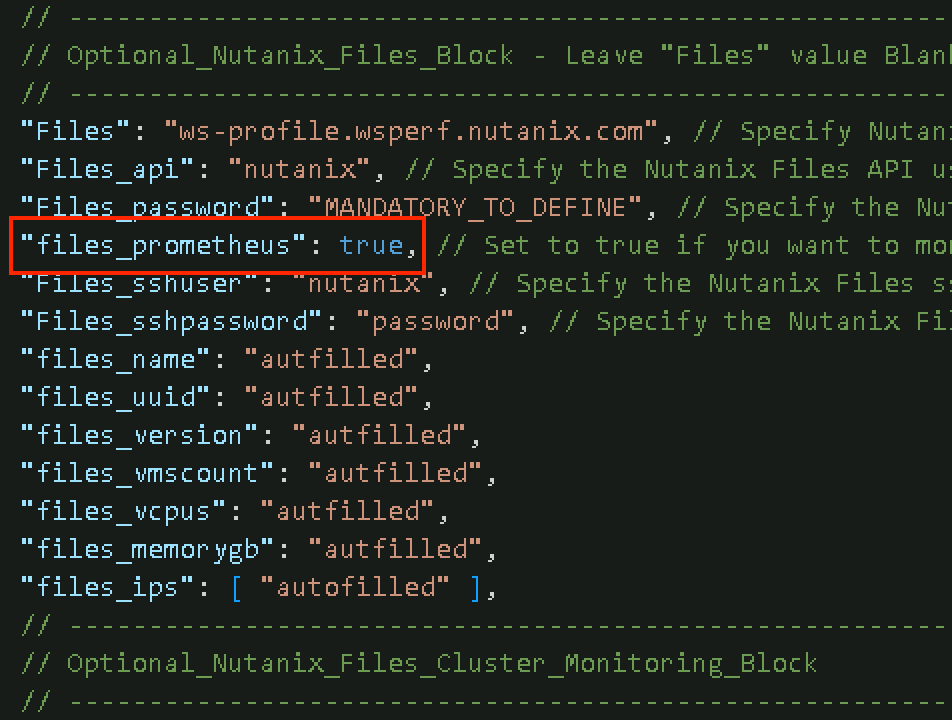
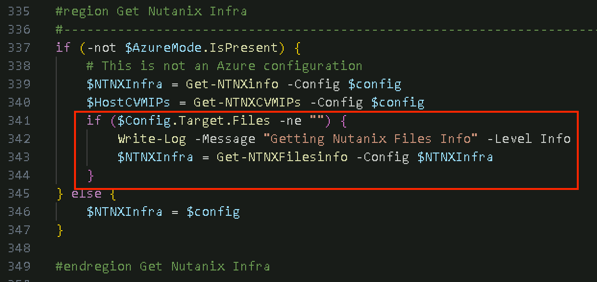
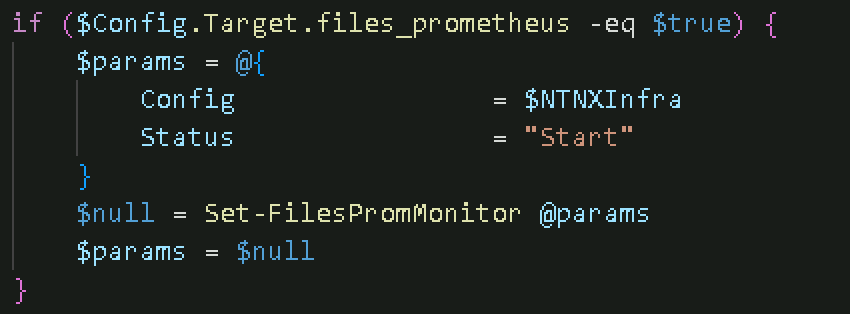
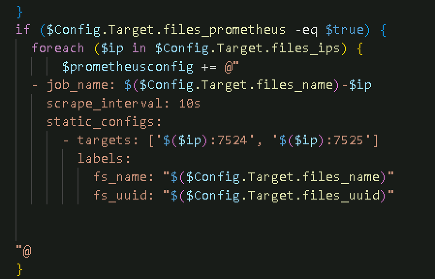
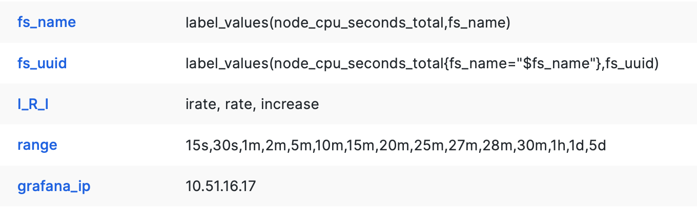
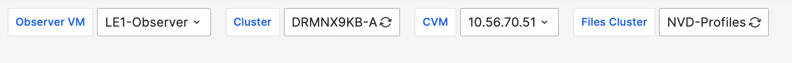
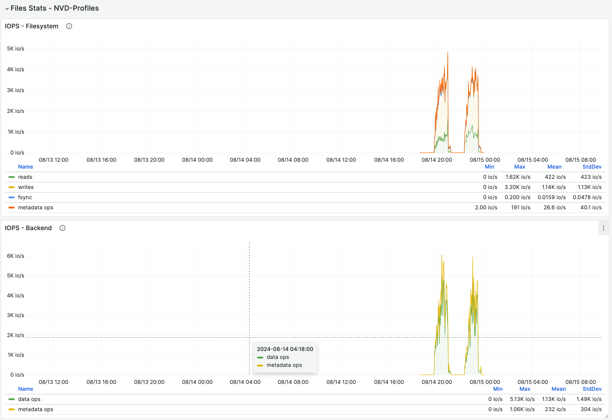
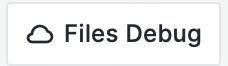
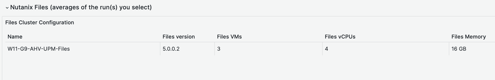

Here is an update from STR regarding some changes to the performance metrics capturing process and Login-Enterprise dashboards during James PTO

TL/DR

- We are now able to capture Nutanix Files performance stats using prometheus and our testing framework.
- For large scale testing, we have the option to zoom in to details using a separate Grafana instance, managed by the Durham Perf team.

This was achieved by taking the following steps:

## Step 1: starting and stopping the prometheus exporters on the Files VMs
Since Files version 5, there are 2 prometheus node exporters installed, but are disabled by default:
- node_exporter
- nutanix-files_exporter

When enabled, Prometheus can be used to capture detailed performance stats. We don't want to enable this for all our tests, so I made it an option to enable the exporters by setting the following value:
`"files_prometheus": true`

As you can see, I've added some more file parameters that will be autofilled using this function in the `Invoke-Test.ps1` script:

The function `GetNTNXFilesinfo` will get the details from the Files cluster and put that back into the `$NTNXInfra` variable. For the `prometheus.yml` file, we need `files_name`, `files_uuid` and `files_ips`. We'll get to that in the next step, first we want to be able to start and stop the monitoring services on the files cluster.
To be able to do this, we need to connect to the Files cluster using SSH. After installing a Files cluster, you'll need to run the following command on one of the files VMs (this is also in the test-config template file as a comment):

`allssh "afs misc.ssh_on_client_network enable"`

You can do this by connecting to one of the CVMs hosting the files cluster first, and then ssh into one of the FSVMs. While you are still logged on to a FSVM, also run the following command:

`edit-afs-gflags minerva_nvm minerva_enable_files_metrics_on_release True`

This will allow us to start and stop the monitoring services on the FSVMs.

Now that we are able to ssh into a FSVM, the following function is used to start or stop the monitoring services:

This function will send the following command to start:
`~/minerva/bin/edit-afs-gflags minerva_nvm minerva_files_metrics_enabled True`

And this command to stop:
`~/minerva/bin/edit-afs-gflags minerva_nvm minerva_files_metrics_enabled False`

If you want to check if the monitoring services are started, you can check by running these commands on the FSVMs:
sudo systemctl status node_exporter
sudo systemctl status nutanix-files_exporter

## Step 2: Add the Files VMs as targets to our Prometheus instances
The `Set-ObserverMonitor` function has been modified. It will now check for `$Config.Test.StartObserverMonitoring` value set to `$true`, and it will add the CVM parts to the `prometheus.yml` file. If the `$Target.files_prometeus` value is set to true, it will add the Files monitoring target to the `prometheus.yml` file:

Port `7524` and `7525` are the individual exporter services, running on the FSVMs.

## Step 3: Add variables to our Tests status grafana dashboard to be able to filter on Files Server instances
To be able to use the queries from the Durham Files Performance Team grafana dashboard, I needed to add these variables to our `Test Status` dashboard:

The `grafana_ip` mentioned is the ip address of the Files team dashboard. This is used to link to the `Debug` dashboard.

## Step 4: Add Nutanix Files panels to our Test status with some high level performance stats
The File server name value is added as a filter in the `Test Status` dasboard. If you select a time window and an Observer-VM that has captured a Files cluster for monitoring, this will be filled:

You'll see that the `Files Stats` Row is now filled with graphs:

## Step 5: Link to the Durham Perf Team Grafana instance for Debug stats
I've added 8 panels that will give us some insights. If you want to dive deeper, you can click on the `Files Debug` link on the top right corner. This will only work for the LE1-Observer, but we're doing the large Files tests on the LE1 anyway.

When you click it, it will take the current Files Cluster selection and time frame to the Debug page. There are some crazy panels over there, so knock yourself out!

## One more thing: Also add the Files cluster info to the Login Documents dashboard
As I was capturing the info anyway, I added the Files Cluster info to the `Login Documents` dashboard:

