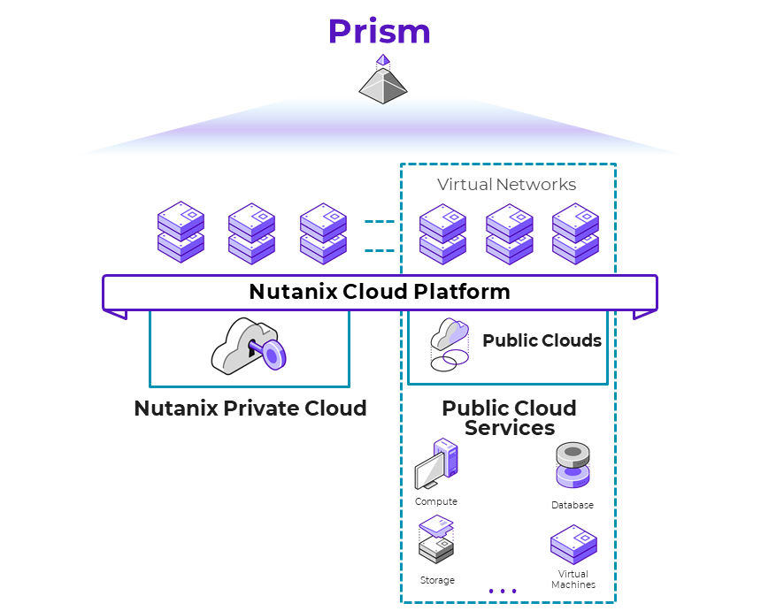

# Executive Summary

Nutanix designed its software to give customers running workloads in a hybrid cloud environment the same experience that they expect from on-premises Nutanix clusters. Because Nutanix in a hybrid multicloud runs [Nutanix AOS](https://www.nutanix.com/products/nutanix-cloud-infrastructure/distributed-storage) and `Template: Validate_this` [Nutanix AHV](https://www.nutanix.com/products/ahv) with the same CLI, UI, and APIs, existing IT processes and third-party integrations continue to work regardless of where they run.

Nutanix AOS can withstand hardware failures and software glitches and ensures that application availability and performance are never compromised. By combining features like native rack awareness with public cloud partition placement groups, Nutanix operates freely in a dynamic hybrid multicloud environment.

In this reference architecture, we make recommendations for designing, optimizing, and scaling Citrix Virtual Apps and Desktops and Citrix Desktop as a Service (DaaS) deployments on Windows Server on Nutanix AHV with Citrix Machine Creation Services (MCS) and Citrix Provisioning (sometimes referred to as PVS). We used Login Enterprise (Login VSI) and an automated scripting framework on Nutanix to simulate real-world workloads in a Citrix environment.

In addition to desktop and application performance reliability, deploying Citrix Virtual Apps and Desktops and DaaS solutions on Nutanix provides unlimited scalability, data locality, AHV clones, and a single datastore. Nutanix takes the Citrix commitment to simplicity to another level with streamlined management, reduced rollout time, and lower operating expenses.

<!--TEMPLATE CONTENT: AHV or ESXi? AHV or Shadow Clones?-->

This document covers the following topics:

-  Overview of the Nutanix solution
-  Overview of Citrix Virtual Apps and Desktops and DaaS and their use cases
-  The benefits of running Citrix solutions on `Nutanix AHV`
-  Design and configuration considerations for building a Citrix solution on `Nutanix AHV`
-  `Process for benchmarking Citrix performance on Nutanix AHV running on AMD processors using Lenovo hardware with Windows Server`
-  `Process for benchmarking Citrix MCS and Provisioning`
-  `The effects of Nutanix Files and Citrix Profile Management Containers hosted on the workload cluster`

<!--TEMPLATE CONTENT: Validate Above. Is this a Windows Desktop or Windows Server RA-->

_Table: Document Version History_

| Version Number | Published | Notes |
| :---: | --- | --- |
| 1.0 | June 2024 | Example Single Document. |