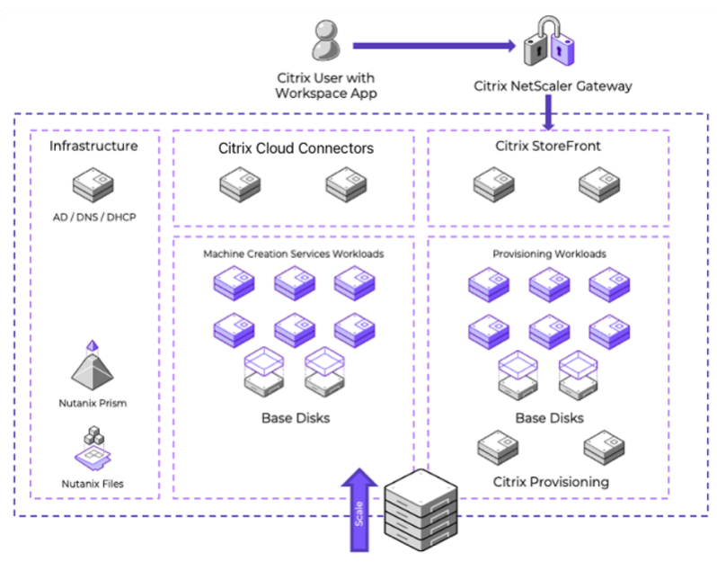

# Citrix Desktop Delivery Solutions on Nutanix

The Nutanix modular web-scale architecture lets you start small and expand to meet increasing demand—a node, a block, or multiple blocks at a time—with no impact on performance. This design removes the hurdle of a large initial infrastructure purchase, decreasing the time to value for your Citrix implementation. Running Citrix desktop delivery solutions on Nutanix enables you to run multiple workloads, all on the same scalable converged infrastructure, while achieving these benefits:

Modular incremental scale
: With the Nutanix solution, you can start small and scale up. A single Nutanix block provides dozens of terabytes of storage and hundreds to thousands of virtual desktops in a compact footprint. With this modular solution, you can granularly scale by node, by block, or with multiple blocks, accurately matching supply with demand and minimizing upfront capital expenditure.

High performance
: By using system memory caching for read I/O and flash storage for read and write I/O, you can deliver high-performance throughput in a compact form factor. 

Change management
: Maintain environmental control and separation between development, test, staging, and production environments. Snapshots and fast clones can help share production data with nonproduction jobs without requiring full copies and unnecessary data duplication.

Business continuity and data protection
: User data and desktop are mission-critical and need enterprise-grade data management features, including backup and disaster recovery. 

Data efficiency
: Nutanix storage offers compression and deduplication to reduce your storage footprint. The compression functionality is truly VM-centric: Unlike traditional solutions that perform compression mainly at the LUN level, the Nutanix solution provides all these capabilities at the VM and file levels, greatly increasing efficiency and simplicity. These capabilities ensure the highest possible compression and decompression performance, even below the block level.

Enterprise-grade cluster management
: Nutanix offers a simplified and intuitive approach to managing large clusters, including a converged user interface that serves as a central point for servers and storage, alert notifications, and the bonjour mechanism that automatically detects new nodes in the cluster. As a result, you can spend time enhancing your environment rather than maintaining it.

High-density architecture
: Nutanix uses an advanced server architecture coupled with data archiving and compression that can make your desktop hardware footprint five times smaller.

Time-sliced clusters
: Like public cloud environments, Nutanix can provide a truly converged cloud infrastructure, allowing you to run your server and desktop virtualization on a single cloud. Gain the efficiency and savings you require with a converged cloud on a unified architecture.

## Citrix Desktop Delivery Solutions on Nutanix AHV

<!--TEMPLATE CONTENT: Validate Above - AHV or vSphere?-->

The following figure shows the main architectural components of the Citrix Virtual Apps and Desktops on Nutanix solution and the communication path between services. The user accesses resources presented to them from the Delivery Controllers via Citrix StoreFront, which can either be load-balanced or gateway-proxied by a NetScaler. Workloads that the user accesses can be provisioned by Citrix MCS or Citrix Provisioning. This reference architecture hosts workloads on `VMware vSphere` running on Nutanix NX-3155-G9 nodes.

<!--TEMPLATE CONTENT: Validate Above - AHV or vSphere?-->

The following figure shows the main architectural components of the Citrix DaaS on Nutanix solution and the communication path between services. The user accesses resources presented to them by Citrix DaaS via Citrix StoreFront, which can either be load-balanced or gateway-proxied by a NetScaler. Workloads that the user accesses can be provisioned by Citrix MCS or Citrix Provisioning. In a Citrix DaaS deployment, the Cloud Connectors replace the Delivery Controller component for resource enumeration by StoreFront. Citrix offers a cloud-native solution called Workspace which incorporates some functions of StoreFront. This reference architecture uses Citrix StoreFront and hosts workloads on `VMware vSphere` running on Nutanix NX-3155-G9 nodes.

<!--TEMPLATE CONTENT: Validate Above - AHV or vSphere?-->

## Pod Design

The following tables contain highlights from a high-level snapshot of the Citrix solution on a Nutanix virtual desktop pod.

_Table: Control Pod Details_

| Solution Deployment Type | Component | Quantity |
| :--- | :--- | :---: |
| Citrix Virtual Apps and Desktops | Delivery Controllers | 2 |
| Citrix DaaS | Cloud Connectors | 2 |
| Citrix Common | StoreFront servers | 2 |
| Citrix Common | Provisioning servers | 2 |
| Citrix Common | NetScaler | 2 |

<!--TEMPLATE CONTENT: Validate Above-->

_Table: Services Pod Details_

| Item | Quantity |
| --- | :---: |
| AHV hosts | 16 | 
| Nutanix clusters | 1 |
| Containers | 1 |

<!--TEMPLATE CONTENT: Validate Above. AHV or ESX RA?-->

Limiting the cluster size to 16 nodes reduces the failure domain and the time to patch and update the clusters. This reference architecture uses 16-node building blocks to take advantage of `single-rack design`, smaller failure domains, and reduced time to patch and update. 

<!--TEMPLATE CONTENT: Validate Above-->

We validated the Citrix solution with pod design sizing based on the Login Enterprise knowledge worker workload. A more resource-intensive workload results in a lower density, and a less resource-intensive workload results in a higher density. If you change the vCPU count or memory, the number of VDAs per node and per cluster changes as well.

The following table shows the configuration details and results for the pod-based testing and the associated projected cluster densities.

_Table: Windows Server 2022 Configuration Details_

| Item | Value |
| --- | :---: |
| Windows Server 2022 configuration | `TBD` vCPU and 42 GB of memory |
| VMs per node | `TBD` |
| Users per VM | `TBD` |
| VMs in a 6-node cluster (baseline testing) | `TBD` |
| User sessions in a 6-node cluster (baseline testing) | `TBD` |
| VMs in a 16-node cluster with n + 1 resilience | `TBD` |
| User sessions in a 16-node cluster with n + 1 resilience | `TBD` |

<!--TEMPLATE CONTENT: Validate Above. Is this a Windows Desktop or Windows Server RA-->

_Table: Windows 11 Configuration Details_

| Item | Value |
| --- | :---: |
| Windows 11 configuration | 3 vCPU and 6 GB of memory |
| VMs per node | `TBD` |
| VMs in a 8-node cluster (baseline testing) | `TBD` |
| VMs in a 16-node cluster with n + 1 resilience | `TBD` |

<!--TEMPLATE CONTENT: Validate Above. Is this a Windows Desktop or Windows Server RA-->

_Table: Windows 10 Configuration Details_

| Item | Value |
| --- | :---: |
| Windows 10 configuration | 2 vCPU and 4 GB of memory |
| VMs per node | `TBD` |
| VMs in a 8-node cluster (baseline testing) | `TBD` |
| VMs in a 16-node cluster with n + 1 resilience | `TBD` |

<!--TEMPLATE CONTENT: Validate Above. Is this a Windows Desktop or Windows Server RA-->

## Nutanix Compute and Storage

Nutanix provides an ideal combination of high-performance compute resources and localized storage to meet any demand. True to this capability, this reference architecture contains no reconfiguration or customization of the Nutanix product to optimize for this use case. The following figure shows a high-level example of the relationship between the Nutanix storage pool and containers, where a single storage pool can host multiple containers with different configurations.

The following table details the Nutanix storage pool and container configuration.

_Table: Nutanix Storage Configuration_

| Name | Role | Details |
| --- | --- | --- |
| SP01 | Main storage pool for all data | `SSD` or `NVMe` |
| VDI | Container for all VMs | `AHV` datastore |
| Default-Container | Container for all data (not used here) | `AHV` datastore |

<!--TEMPLATE CONTENT: Validate Above. Is this an AHV or ESX RA?-->

## Nutanix Files

[Nutanix Files](https://www.nutanix.com/products/files) is a software-defined, scale-out file storage solution that provides a repository for unstructured data, such as home directories, user profiles, departmental shares, application logs, backups, and archives. You can deploy Nutanix Files on an existing or standalone cluster. Unlike standalone NAS appliances, Nutanix Files consolidates VM and file storage so that you don't need to create an infrastructure silo.

Administrators can use Nutanix Prism to manage Nutanix Files, just like VM services, which unifies and simplifies management. Integration with Active Directory enables support for quotas, access-based enumeration (ABE), and self-service restores with the Windows Previous Versions feature. Nutanix Files also supports native remote replication and file server cloning, so you can back up Files off-site and run antivirus scans and machine learning without affecting production.

Nutanix Files can run on a dedicated cluster or a cluster running user VMs. Nutanix supports Files with both ESXi and AHV. Files includes native high availability and uses Nutanix storage for intracluster data resilience and data efficiency techniques such as erasure coding.

Nutanix Files includes File Analytics, which gives you a variety of useful insights into your data, including full audit trails, anomaly detection, ransomware detection and intelligence, data age analytics, and custom reporting. You can also use Nutanix Data Lens for deeper insights and ransomware protection for your Nutanix Files environment. Data Lens provides analytics and ransomware defense at scale for Nutanix Unified Storage.

_Table: Nutanix Files Configuration Overview_

| Item | Value |
| --- | :---: |
| Nutanix Files version | `5.0.0.1` |
| Nutanix Files deployment location | `Workload cluster` |
| File server VM (FSVM) count | 3 |
| FSVM specifications | `4` vCPU and `16` GB of memory |
| Share count | 1 |
| Share type | Distributed |
| Continuous availability enabled | Yes |

<!--TEMPLATE CONTENT: Validate Above. Is Files used in this RA-->