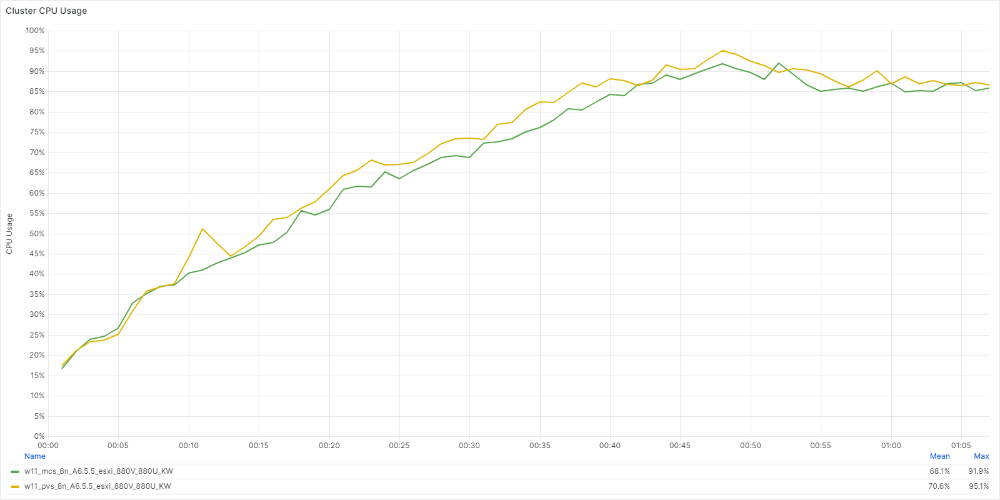

# Citrix Delivery Solutions on Nutanix Test Validation

This section provides the details and results of our Citrix Delivery Solutions performance tests on Nutanix NX-3155-G9 nodes with VMware vSphere. We ran each test scenario at least three times to ensure accuracy.

## Test Objectives

Our overall objective was to determine the session capacity that we could host on Nutanix using a Windows VDA image and running the Login Enterprise tests with Citrix Delivery Solutions. We tested with the Login Enterprise knowledge worker profile.

Objectives:

-  Determine the maximum number of sessions we can host on this system with the Login Enterprise knowledge worker workload while maintaining a good user experience.
-  Show the linear scalability of the Nutanix platform with VMware vSphere.
-  Show how much power (in watts) the Nutanix platform uses with VMware vSphere.
-  Show the differences between Citrix MCS and Citrix Provisioning on the Nutanix platform with VMware vSphere.
-  Show the differences between Windows 10 and Windows 11 on the Nutanix platform with VMware vSphere.
-  Identify the impacts of Nutanix Files deployed on the workload cluster hosting Citrix Profile Management Containers for user profiles with VMware vSphere.

Testing parameters:

-  We used Citrix MCS and Provisioning to deploy the Windows VMs to validate linear scalability.
-  We tested using a single, full HD screen with the default Citrix frames per second configuration. Using multiple screens or other screen resolution settings affects the results.
-  We used Citrix Profile Management Container-based profiles for our testing. We deployed a simple configuration with minimal baseline changes.

In the following section, we display information associated with testing we completed. The following table describes the test naming convention used and displayed in the graphs.

_Table: Test name matrix_

| Test Name | Operating System | Provisioning Method | Nodes | AOS Version | Hypervisor | VMs | Users | Testing Profile | Information |
| --- | --- | --- | --- | --- | --- | --- | --- | --- | --- |
| w11_mcs_1n_A6.5.5_esxi_110V_110U_KW | Windows 11 | Citrix MCS | 1 | 6.5.5.1 | ESXi | 110 | 110 | Knowledge Worker | - |
| w11_mcs_2n_A6.5.5_esxi_220V_220U_KW | Windows 11 | Citrix MCS | 2 | 6.5.5.1 | ESXi | 220 | 220 | Knowledge Worker | - |
| w11_mcs_4n_A6.5.5_esxi_440V_440U_KW | Windows 11 | Citrix MCS | 4 | 6.5.5.1 | ESXi | 440 | 440 | Knowledge Worker | - |
| w11_mcs_6n_A6.5.5_esxi_660V_660U_KW | Windows 11 | Citrix MCS | 6 | 6.5.5.1 | ESXi | 660 | 660 | Knowledge Worker | - |
| w11_mcs_8n_A6.5.5_esxi_880V_880U_KW | Windows 11 | Citrix MCS | 8 | 6.5.5.1 | ESXi | 880 | 880 | Knowledge Worker | - |
| w11_pvs_8n_A6.5.5_esxi_880V_880U_KW | Windows 11 | Citrix Provisioning | 8 | 6.5.5.1 | ESXi | 880 | 880 | Knowledge Worker | - |
| w11_mcs_8n_A6.5.5_esxi_880V_880U_KW_CPM | Windows 11 | Citrix MCS | 8 | 6.5.5.1 | ESXi | 880 | 880 | Knowledge Worker | Citrix Profile Management on Nutanix Files was used |
| w10_mcs_8n_A6.5.5_esxi_960V_960U_KW | Windows 10 | Citrix MCS | 8 | 6.5.5.1 | ESXi | 960 | 960 | Knowledge Worker | - |

## Boot Storm Simulation

We used the following hosting connection settings for our boot storm simulation test:

- Simultaneous actions (absolute): 100
- Simultaneous actions (percentage): 20 percent
- Max new actions per minute (absolute): 50

We started 880 Windows 11 desktops on eight Nutanix NX-3155-G9 nodes. The following table shows the performance results of this test.

_Table: Boot Storm Simulation: Eight-Node MCS Test_

| Measurement | Detail |
| --- | --- |
| Maximum CPU usage | 45.7% |
| Average CPU usage | 32.3% |
| Average controller IOPS | 36,480 |
| Boot time | 18.9 min. |

## Linear Scalability

The following section shows the linear scalability of the Nutanix platform. We performed the tests with one, two, four, six and eight nodes with 150 Windows 11 VMs per node. The results display average timings and show good user experience in all scenarios.

### Linear Scalability in the Logon Phase

The following table and graph detail the user experience during the logon phase of the test. A lower result represents better performance.

_Table: Linear Scalability in the Logon Phase: Logon Times_

| Metric | 1 Node | 2 Nodes | 4 Nodes | 6 Nodes | 8 Nodes |
| --- | :---: | :---: | :---: | :---: | :---: |
| Average logon time | 5.6 sec | 5.7 sec | 5.9 sec | 5.9 sec | 5.8 sec | 
| User profile load | 0.5 sec | 0.5 sec | 0.6 sec | 0.6 sec | 0.6 sec | 
| Group policies |1.3 sec | 1.3 sec | 1.3 sec | 1.3 sec | 1.3 sec | 
| Connection | 2.9 sec | 2.9 sec | 3.0 sec | 3.0 sec | 3.0 sec | 

The following tables show the linear scalability of application performance over the test runs. A lower result represents better performance.

_Table: Linear Scalability in the Logon Phase: App Start Times_

| Application | 1 Node | 2 Nodes | 4 Nodes | 6 Nodes | 8 Nodes |
| --- | :---: | :---: | :---: | :---: | :---: |
| Microsoft Outlook | 3.36 sec | 3.47 sec | 3.62 sec | 3.61 sec | 3.61 sec | 
| Microsoft Word | 0.74 sec | 0.74 sec | 0.74 sec | 0.75 sec | 0.74 sec | 
| Microsoft Excel | 0.92 sec | 0.95 sec | 0.96 sec | 0.95 sec | 0.96 sec | 
| Microsoft PowerPoint | 0.87 sec | 0.91 sec | 0.93 sec | 0.94 sec | 0.94 sec | 

_Table: Linear Scalability in the Logon Phase: Specific Action Times_

| Application (Action) | 1 Node | 2 Nodes | 4 Nodes | 6 Nodes | 8 Nodes |
| --- | :---: | :---: | :---: | :---: | :---: |
| Microsoft Edge (Page Load) | 1.11 sec | 1.15 sec | 1.12 sec | 1.14 sec | 1.12 sec | 
| Microsoft Word (Open Doc) | 0.83 sec | 0.87 sec | 0.88 sec | 0.88 sec | 0.85 sec | 
| Microsoft Excel (Save File) | 0.33 sec | 0.33 sec | 0.33 sec | 0.33 sec | 0.33 sec | 

### Linear Scalability in the Steady State

The following tables show the user experience during the steady state of the test. A lower result represents better performance.

_Table: Linear Scalability in the Steady-State Phase: App Start Times_

| Application | 1 Node | 2 Nodes | 4 Nodes | 6 Nodes | 8 Nodes |
| --- | :---: | :---: | :---: | :---: | :---: | 
| Microsoft Word | 0.75 sec | 0.76 sec | 0.76 sec | 0.76 sec | 0.76 sec | 
| Microsoft Excel | 0.73 sec | 0.75 sec | 0.74 sec | 0.74 sec | 0.74 sec | 
| Microsoft PowerPoint | 0.72 sec | 0.73 sec | 0.74 sec | 0.74 sec | 0.74 sec | 

_Table: Linear Scalability in the Steady State Phase: Specific Action Times_

| Application (Action) | 1 Node | 2 Nodes | 4 Nodes | 6 Nodes | 8 Nodes |
| --- | :---: | :---: | :---: | :---: | :---: | 
| Microsoft Edge (Page Load) | 1.04 sec | 1.15 sec | 1.11 sec | 1.11 sec | 1.11 sec | 
| Microsoft Word (Open Doc) | 0.85 sec | 0.86 sec | 0.89 sec | 0.87 sec | 0.85 sec | 
| Microsoft Excel (Save File) | 0.33 sec | 0.33 sec | 0.33 sec | 0.34 sec | 0.34 sec | 

## Single-Node Host Resources

The following table and graphs show a single node's host resource usage during the test (logon and steady-state phases). We tested with 150 VMs on the node.

*Table: Single Node Host Resource Usage Metrics*

| Metric | Max | Average |
| --- | :---: | :---: |
| Host CPU usage | 88.4% | 66.0% |
| Host memory usage | 46.3% | 39.0% |
| Host power usage | 862 W | 757 W |

## Citrix Machine Creation Services vs. Provisioning

This section compares the results of a Login Enterprise test on an eight-node cluster that used Citrix MCS and Citrix Provisioning as the deployment methods.

### MCS vs. Provisioning System Performance

The following table provides the averages for the overall system performance results. For an explanation of CPU ready time, see [Nutanix KB 5012: Interpreting CPU Ready Values](https://portal.nutanix.com/kb/5012).

_Table: MCS vs. Provisioning: System Performance Metric Averages_

| Metric | MCS | Provisioning |
| --- | :---: | :---: | 
| CPU usage | 68.1% | 70.6% |
| CPU ready time | 0.688% | 0.831% | 
| Controller read IOPS | 16,467 | 3,545 | 
| Controller write IOPS | 17,281 | 24,185 | 
| Controller latency | < 1 ms | < 1 ms | 

We saw the following maximum latencies during our testing.

_Table: MCS vs. Provisioning: Cluster Controller Latencies_

| Metric | MCS | Provisioning |
| --- | :---: | :---: |
| Overall controller I/O latency | < 1 ms | 1.08 ms |
| Controller write I/O latency | 1.15 ms | 1.17 ms |
| Controller read I/O latency | < 1 ms | < 1 ms |

### MCS vs. Provisioning Logon Phase

The following table and figure show the average logon times across the test runs. A lower result represents better performance.

_Table: MCS vs. Provisioning Logon Phase: Logon Time Averages_

| Metric | MCS | Provisioning |
| --- | :---: | :---: | 
| Logon time | 5.8 sec | 6.5 sec |
| User profile load | 0.6 sec | 0.5 sec | 
| Group policies | 1.3 sec | 1.3 sec | 
| Connection | 3.0 sec | 3.1 sec | 

The following tables show application performance details during the logon phase of the test. A lower result represents better performance.

_Table: MCS vs. Provisioning Logon Phase: App Start Times_

| Application | MCS | Provisioning | 
| --- | :---: | :---: | 
| Microsoft Outlook | 3.58 sec | 3.10 sec | 
| Microsoft Word | 0.74 sec | 0.76 sec | 
| Microsoft Excel | 0.93 sec | 0.95 sec | 
| Microsoft PowerPoint |  0.94 sec | 0.89 sec | 

_Table: MCS vs. Provisioning Logon Phase: Specific Action Times_

| Application (Action) | MCS | Provisioning | 
| --- | :---: | :---: | 
| Microsoft Edge (Page Load) | 1.14 sec | 1.26 sec | 
| Microsoft Word (Open Doc) | 0.85 sec | 0.76 sec | 
| Microsoft Excel (Save File) | 0.93 sec | 0.95 sec | 

### MCS vs. Provisioning Steady State

The following tables show application performance details during the steady state of the test. A lower result represents better performance.

_Table: MCS vs. Provisioning Steady State: App Start Times_

| Application | MCS | Provisioning |
| --- | :---: | :---: | 
| Microsoft Word | 0.76 sec | 0.77 sec | 
| Microsoft Excel | 0.73 sec | 0.75 sec | 
| Microsoft PowerPoint | 0.73 sec | 0.73 sec | 

_Table: MCS vs. Provisioning Steady State: Specific Action Times_

| Application (Action) | MCS | Provisioning |
| --- | :---: | :---: | 
| Microsoft Edge (Page Load) | 1.12 sec | 1.14 sec| 
| Microsoft Word (Open Doc) | 0.85 sec | 0.76 sec | 
| Microsoft Excel (Save File) | 0.32 sec | 0.32 sec | 

## Windows 10 vs. Windows 11

This section compares the Login Enterprise comparison test results for an eight-node cluster running Windows 10 and Windows 11. We kept Windows 10 to the same specification that we have previously used in Nutanix Reference Architectures. Windows 10 testing used 960 VMs with a 2 vCPU and 4 GB memory machine size.

### Windows 10 vs. Windows 11 System Performance

The following table shows the averages for the overall system performance results.

_Table: Windows 10 vs. Windows 11: System Performance Metric Averages_

| Metric | Windows 10 | Windows 11 |
| --- | :---: | :---: | 
| CPU usage | 67.7% | 68.1% |
| CPU ready time | 0.535% | 0.688% | 
| Controller read IOPS | 17,279 | 16,467 | 
| Controller write IOPS | 16,403 | 17,281 | 
| Controller latency | < 1 ms | < 1 ms | 

 

_Table: Windows 10 vs. Windows 11: Maximum Cluster Controller Latencies_

| Metric | Windows 10 | Windows 11 |
| --- | :---: | :---: |
| Overall controller I/O latency | < 1 ms | < 1 ms | 
| Controller write I/O latency | 1.12 ms | 1.15 ms |
| Controller read I/O latency | < 1 ms | < 1 ms | 

### Windows 10 vs. Windows 11 Logon Phase

The following table and figure show the average logon times during the logon phase of the test. A lower result represents better performance.

_Table: Windows 10 vs. Windows 11 Logon Phase: Logon Time Averages_

| Metric | Windows 10 | Windows 11 |
| --- | :---: | :---: |
| Logon time | 7.7 sec | 5.8 sec | 
| User profile load | 0.6 sec | 0.6 sec | 
| Group policies | 2.2 sec | 1.3 sec | 
| Connection | 3.3 sec | 3.0 sec | 

The following tables show application performance details during the logon phase of the test. A lower result represents better performance.

_Table: Windows 10 vs. Windows 11 Logon Phase: App Start Times_

| Application | Windows 10 | Windows 11 | 
| --- | :---: | :---: | 
| Microsoft Outlook | 3.27 sec | 3.58 sec| 
| Microsoft Word | 0.80 sec | 0.74 ssec | 
| Microsoft Excel | 1.04 sec | 0.93 sec | 
| Microsoft PowerPoint | 1.01 sec | 0.94 sec | 

_Table: Windows 10 vs. Windows 11 Logon Phase: Specific Action Times_

| Application (Action) | Windows 10 | Windows 11 | 
| --- | :---: | :---: | 
| Microsoft Edge (Page Load) | 1.40 sec | 1.14 sec | 
| Microsoft Word (Open Doc) | 0.95 sec | 0.85 sec | 
| Microsoft Excel (Save File) | 0.34 sec | 0.33 sec | 

### Windows 10 vs. Windows 11 Steady State

The following tables show application performance details during the steady state of the test. A lower result represents better performance.

_Table: Windows 10 vs. Windows 11 Steady State: App Start Times_

| Application | Windows 10 | Windows 11 | 
| --- | :---: | :---: | 
| Microsoft Word |  0.81 sec | 0.76 sec | 
| Microsoft Excel | 0.82 sec | 0.73 sec | 
| Microsoft PowerPoint | 0.80 sec | 0.73 sec| 

_Table: Windows 10 vs. Windows 11 Steady State: Specific Action Times_

| Application (Action) | Windows 10 | Windows 11 | 
| --- | :---: | :---: | 
| Microsoft Edge (Page Load) | 1.32 sec | 1.12 sec | 
| Microsoft Word (Open Doc) | 0.93 sec | 0.85 sec | 
| Microsoft Excel (Save File) | 0.34 sec | 0.32 sec| 

## Nutanix Files and Citrix Profile Containers

This section compares the Login Enterprise test results for a scenario using local profiles with a scenario using Citrix Profile Containers (CPM) hosted on Nutanix Files. Both scenarios used an eight-node cluster with MCS provisioned workloads. Nutanix Files was collocated on the same cluster as the Windows Server 2022 workloads. We compared the first run of each test to capture the profile creation impact.

When measuring the impact of Nutanix Files collocated on the same cluster as the workloads:

-  The overall cluster I/O, as measured by the Nutanix CVM (`controller_num_iops`), will show a reduction in overall Cluster IOPS. This is due to a change in the data path for Nutanix Files based I/O.
-  The Nutanix Files Server VMs will capture and display I/O data as it relates to File Serving (`iops`). These I/O operations are not a one-for-one replacement of the reduced Cluster I/O. Enabling Continuous Availability will increase the amount of I/0.
-  The Nutanix CVM measurements associated with the physical disks (`num_iops`) capture the raw impact of Nutanix Files.

To understand the impact of Nutanix Files on the workload cluster, we capture and analyze the following metrics:

-  Cluster Controller IOPS measured by the CVM `controller_num_iops`, `controller_num_write_iops` and `controller_num_read_iops` counters.
-  Nutanix Files IOPS measured by the Nutanix Files FSVM `iops`, `metadata_iops`, `read_iops` and `write_iops` counters.
-  Cluster Disk IOPS measured by the CVM `num_iops`, `num_read_iops`, and `num_write_iops` counters.

### Local Profiles vs. Nutanix Files with Citrix Profile Containers System Performance

The following table provides the averages for the overall system performance results. For an explanation of CPU ready time, see [Nutanix KB 5012: Interpreting CPU Ready Values](https://portal.nutanix.com/kb/5012).

_Table: System Performance Local Profiles vs. Nutanix Files with Citrix Profile Containers: System Performance Metric Averages_

| Metric | Local Profiles | Nutanix Files with CPM |
| --- | :---: | :---: | 
| CPU usage | 67.7% | 71.4% |
| CPU ready time | 0.686% | 0.789% |
| Controller read IOPS | 33,887 | 30,647 | 
| Controller write IOPS | 17,385 | 17,675 | 
| Controller latency | < 1 ms | < 1 ms | 

During the boot phase of a test, we expect resource utilization to show an upward trend and ultimately result in peak values. During the steady state phase of a test, resource usage should both reduce and stay more consistent.

We saw the following maximum latencies during our testing.

_Table: Local Profiles vs. Nutanix Files with Citrix Profile Containers: Cluster Controller Latencies_

| Metric | Local Profiles | Nutanix Files with CPM |
| --- | :---: | :---: |
| Overall controller latency | < 1 ms | 1.15 ms |
| Controller write I/O latency | 1.14 ms | 1.33 ms |
| Controller read I/O latency | < 1 ms | < 1 ms |

These tests included hosting Nutanix Files on the same workload cluster.

### Local Profiles vs. Nutanix Files with Citrix Profile Containers Logon Phase

We run each test three times with Login Enterprise. On the first test, profiles are created for the first time. When using Nutanix Files with Citrix Profile Management, additional test runs use an existing profile. When using local profile configurations, the user profile is removed after each test as the machine is reset back to the default state. We used the first run data set comparison to capture the user profile creation. Subsequent logons will show a reduced footprint as profiles already exist.

The following tables show the average logon times across the test runs. A lower result represents better performance.

_Table: Local Profiles vs. Nutanix Files with Citrix Profile Containers: Logon Time Averages_

| Metric | Local Profiles | Nutanix Files with CPM |
| --- | :---: | :---: | 
| Logon time | 5.8 sec | 10.9 sec | 
| User profile load | 0.6 sec | 0.3 sec | 
| Group policies | 1.3 sec | 1.3 sec | 
| Connection | 3.0 sec | 8.2 sec | 

The following tables show application performance details during the logon phase of the test. A lower result represents better performance.

_Table: Local Profiles vs. Nutanix Files with Citrix Profile Containers: App Start Times_

| Application | Local Profiles | Nutanix Files with CPM |
| --- | :---: | :---: |  
| Microsoft Outlook | 3.61 sec | 3.85 sec | 
| Microsoft Word | 0.74 sec | 0.77 sec | 
| Microsoft Excel | 0.96 sec | 1.00 sec | 
| Microsoft PowerPoint | 0.94 sec | 0.98 sec | 

_Table: Local Profiles vs. Nutanix Files with Citrix Profile Containers: Specific Action Times_

| Application (Action) | Local Profiles | Nutanix Files with CPM |
| --- | :---: | :---: |  
| Microsoft Edge (Page Load) | 1.12 sec | 1.37 sec | 
| Microsoft Word (Open Doc) | 0.85 sec | 0.88 sec | 
| Microsoft Excel (Save File) | 0.33 sec | 0.34 sec | 

### Local Profiles vs. Nutanix Files with Citrix Profile Containers Steady State

The following tables show the details of application performance during the steady state of the test. A lower result represents better performance.

_Table: Local Profiles vs. Nutanix Files with Citrix Profile Containers: App Start Times_

| Application (Action) | Local Profiles | Nutanix Files with CPM |
| --- | :---: | :---: |  
| Microsoft Word | 0.76 sec | 0.78 sec | 
| Microsoft Excel | 0.74 sec | 0.76 sec | 
| Microsoft PowerPoint | 0.74 sec | 0.76 sec | 

_Table: Local Profiles vs. Nutanix Files with Citrix Profile Containers: Specific Action Times_

| Application (Action) | Local Profiles | Nutanix Files with CPM |
| --- | :---: | :---: |  
| Microsoft Edge (Page Load) | 1.11 sec | 1.30 sec | 
| Microsoft Word (Open Doc) | 0.85 sec | 0.88 sec | 
| Microsoft Excel (Save File) | 0.32 sec | 0.33 sec | 

### Nutanix Files with Citrix Profile Containers

The following tables and graphs outline the performance impacts associated with Nutanix Files specific metrics.

_Table: Nutanix Files Metrics captured at the Nutanix File Server VM level_

| Metric | Maximum | Average |
| --- | :---: | :---: |
| Nutanix Files IOPS | 9,820 | 6,017 |
| Nutanix Files latency | 4.90 ms | 2.50 ms |
| Nutanix Files throughput | 373 MB/s | 244 MB/s |

The following tables and graphs outline the performance impacts on the Cluster Disks when Nutanix Files is deployed, and Citrix Profile Containers are enabled. 

_Table: Local Profiles vs. Nutanix Files with Citrix Profile Containers: Nutanix Cluster Disk metrics (Averages)_

| Metric | Local Profiles | Nutanix Files with CPM | 
| --- | :---: | :---: |  
| Cluster Disk Total IOPS | 14,156 | 13,931 |
| Cluster Disk Read IOPS | 12,925 | 12,172 |
| Cluster Disk Write IOPS | 1,231 | 1,759 |

### Nutanix Files Citrix Profile Containers Advanced Information

CPM containers have a range of advanced functionalities and features that can impact performance. You should consult further guidance on [Citrix Profile Management on Nutanix Files](https://portal.nutanix.com/page/documents/solutions/details?targetId=TN-2002-Citrix-User-Profile-Management-on-Nutanix:TN-2002-Citrix-User-Profile-Management-on-Nutanix) for additional performance impacts and considerations.

The appendix section of this document includes the CPM container settings that were used in testing.

## Results Summary

Our results show that if you use MCS-provisioned or Provisioning-streamed servers to linearly scale the Citrix Virtual Apps and Desktops on Nutanix solution, the system maintains the same average response times regardless of how many nodes you have. 

Test results summary:

-  The overall cluster CPU usage was similar between MCS and Citrix Provisioning.
-  The Cluster Read IOPS was higher with MCS, but Write IOPS was higher with Citrix Provisioning. We expect these effects due to the write-heavy nature of the Provisioning filter driver.
-  Logon Times were almost identical with both MCS and Citrix Provisioning.
-  Application response times were consistent across both MCS and Citrix Provisioning.
-  Compared with Windows 10, Windows 11 has a higher CPU footprint during the logon phase.
-  When you optimize Windows 10 and Windows 11, the logon experience is similar.
-  Application response times are generally similar between Windows 11 and Windows 10, however, Windows 11 with a 3 vCPU spec shows better application response times when compared to a Windows 10 VM with 2 vCPU.
-  Using 3 vCPU with Windows 11 or 2 vCPU with Windows 10 didn't affect the overall cluster metrics, although the 3 vCPU configuration had a higher CPU ready time.
-  With Nutanix Files housed on the workload cluster, there was around a 5 percent overall CPU increase on the cluster.
-  The cluster IO profile reported a reduced IO footprint for read IOPS at the cluster level when hosting Nutanix Files. This is due to Nutanix Files providing caching capability, and how Files ultimately writes IO to the cluster disks.
-  Overall first logon times were higher with Citrix Profile Containers on Nutanix files due to the first profile creation tax. Subsequent logon times are lower
-  Application response times were similar across local profiles and Citrix Profile Containers in the steady state phase of the test. 
-  The tested File Server VM instance size was sufficient to handle the workload.