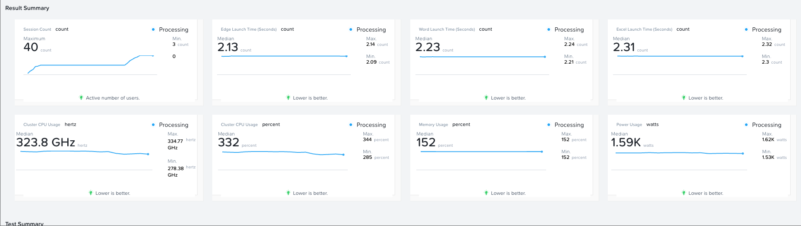
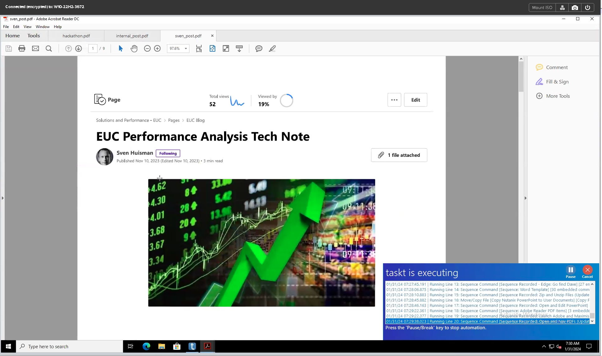
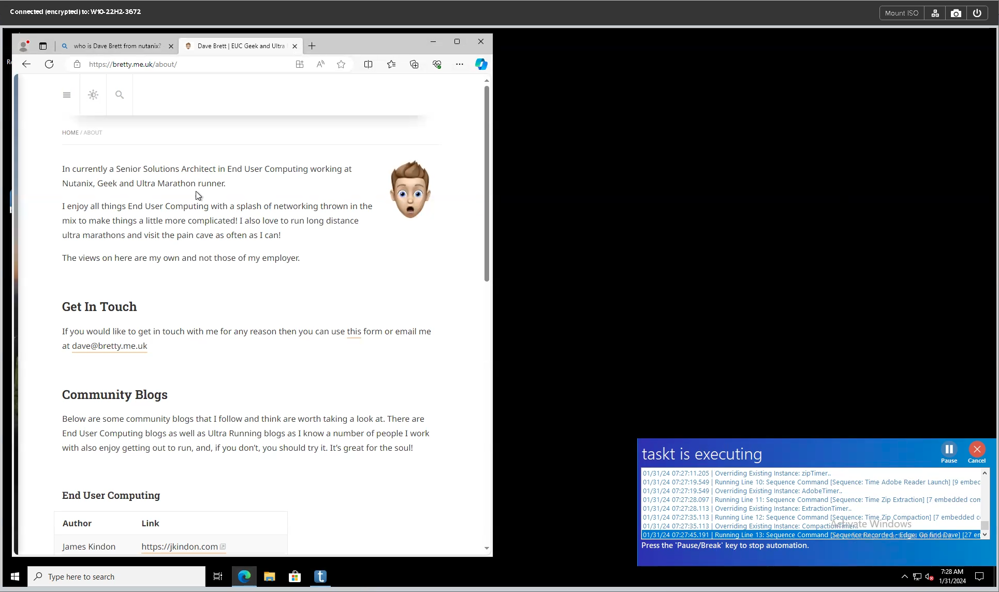
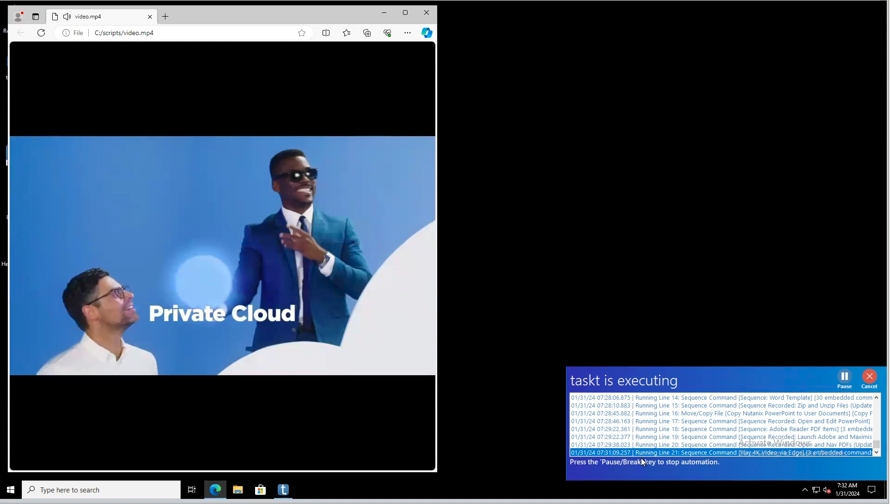
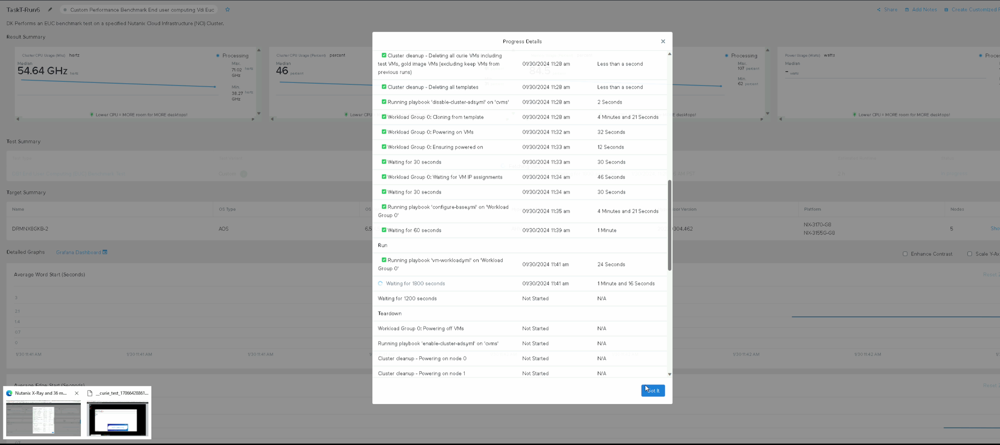
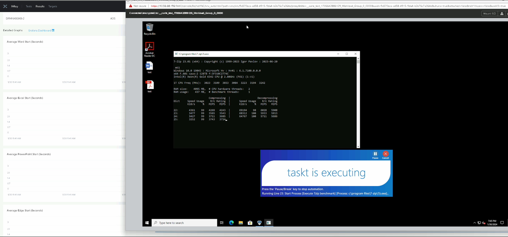

# Nutanix Hackathon 2024 Project Summary - EUC Benchmark with X-Ray

## A high-level overview of your project concept

Currently, there is no simple way without 3rd party tooling to benchmark or automatically test End User Compute (VDI, etc.) workloads on Nutanix Cloud Infrastructure. This gap means that customers have minimal idea of the impact of changes to their images until they release changes into production.

In addition, EUC workloads make up a significant portion of the Nutanix estate globally. EUC workloads are hyper-sensitive to performance changes which will directly impact user productivity. Any tooling that can be provided to assist customers and partners in sizing, benchmarking, or baselining would be a welcome solution. Luckily for us, we have Nutanix X-Ray.

Our project aims to utilize existing capability in X-Ray and extend it to automate the deployment and execution of specific EUC workload personas, whilst capturing metrics and allowing for comparison over time. This includes the use of Robotic Process Automation (RPA) to mirror the behaviors of an actual user.

## The purpose and goal of your project

Our goal is to provide a function that will benefit Nutanix internally, along with partners and customers deploying EUC workloads on our solution. We wanted to produce a repeatable process that allows for an accurate reflection of a user workload using existing capabilities within the ecosystem. We chose X-Ray as the primary solution delivery mechanism.

## What problems does your project solve

With Windows workloads in particular, Security Patches, Virus definitions, application and browser updates, and productivity suite updates can, and often do hurt performance.

Our solution helps the consumer to understand the impact of workloads on NCI, either for sizing purposes, stress testing, or baseline comparisons allowing changes to be tracked from a performance impact standpoint.

For instance, the customer might want to compare the performance of their current Windows template to a new template that has been updated with the latest security patches.

## Why did you select this idea

EUC makes up circa 20% of the Nutanix workload footprint globally. We service and provide a platform for all industry sectors, from Healthcare to Retail, Insurance, and Finance including Traders to legal, and everything in between.

These workload types are hypersensitive to changes in performance. Without tooling, it is impossible to understand the impact of change until those changes are at scale. 

With EUC workloads delivered by X-Ray, customers can proactively test change impacts before production releases.

## What were your considerations

We required a solution that mirrors, or attempts to mirror, a proper user persona (a profile of a user). This typically includes the following style of interaction:

-  Navigating around the Windows desktop.
-  Launching line of business applications.
-  Launching productivity applications such as Microsoft Word, Excel, Outlook, PowerPoint, etc.
-  Launching and navigating web browsers.
-  Playing videos within a session.
-  Transferring (copying/pasting) data around a session.
-  Having a coffee break here and there.
 
Many more actions occur within a user session, so we needed a solution that was customizable and reflected exactly what a user would do interactively. We chose an open source solution called TaskT which allows for RPA to mirror a user interacting with a desktop session.

Our solution ultimately required the below:

1. The consumer to provide their own Windows image due to licensing considerations.
2. The consumer to be able to leverage RPA at no cost (open source).
3. The consumer has a choice in what sort of workload, or workloads they can run and when.
4. The consumer to be able to compare results over time.
5. The consumer to drive the outcome via a Nutanix interface

Ultimately, our solution at a high level is designed as below:

1. The consumer provides a standard Windows image with a pre-defined set of applications installed and configured.
2. The consumer defines or consumes an existing TastT RPA workflow. This can either be a standard flow, or the consumer can create their own.
3. X-Ray is used to deploy and execute the solution components, including an initial configuration of the image to ensure that each environment is identical for the workload persona. This is critical for any form of RPA process.
4. Our process captures relevant metrics including application start times, process durations, and any other Windows performance metric defined as part of the Prometheus solution leveraged by X-Ray natively.
5. Reports all data in real time to X-Ray.

## How does this help Nutanix customers

Customers (both internal and external) will have the ability to execute a realistic user workload via native, and open-source technology at no additional cost. This allows them visibility into their environment and helps them understand change impacts, platform runway, user experience, and application experience changes.

The solution ultimately should allow customers to write their persona flows using their own unique scenarios. For example:

-  Provide a Windows 11 Image with Microsoft Office, Adobe Acrobat, and Microsoft Edge Browser. Provide a TaskT workflow that automates specific Microsoft Office and Adobe Acrobat PDF editing functions along with Microsoft Edge browsing.
-  Provide a Windows 11 Image with Microsoft Office, Adobe Acrobat, and Mozilla FireFox Browser. Provide a TaskT workflow that automates specific Microsoft Office and Adobe Acrobat PDF editing functions along with Firefox browsing. Both scenarios could be compared to see the impact of a different web browser.
-  Provide a Windows 10 Desktop with Libre Office and Foxit PDF Pro. Provide a TaskT workflow that automates specific Libre Office and Foxit PDF editing functions.
-  Provide a Windows Server Image with appropriate office and TaskT workflows.

As long as the scenario has been defined correctly, X-Ray can deploy and monitor the solution.

Note that TaskT is used to prove a concept, there are alternate solutions. The focus should be on an Open Source option.

## What is the impact of your solution

The solution impacts multiple areas, for example, the below quote shows added value on the front end:

"POCs for EUC are currently quite loosely organized and lack clear success standards. Customers typically evaluate the platform's compatibility with their preferred broker solution. Clients don't have enough time or test users to truly set up an exhaustive test scenario. That makes it more difficult in our opinion to distinguish Nutanix from other products. Our arguments about performance, robustness, and scalability can be improved by giving the user a tool to run more complex test scenarios Particularly if we incorporate functions into the tool such as monitoring the impact of a disc failure on application start times or simulating users using containerized profiles. It would also make sense to include this in HPOC as a deployment option. They can gain an understanding of the solution's functionality via boot camps or Proofs of Concept, which is now not feasible because of latency and protocol restrictions."

Additionally, Nutanix engineering teams will have additional tooling to test workloads.

Finally, we gain more stickiness within a customer via X-Ray utilization and value add.

## Demo your working prototype

 <!--TBD-->

The below image shows an example of real-time x-ray data from an RPA-based EUC workload:

The below shows TaskT RPA executing interactions with the desktop:

Below outlines real-time data capturing of the workload:

